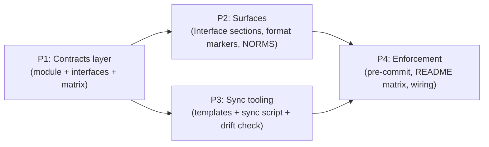

# CSM Suite Coherence — Executable Contracts Approach

- Idea slug: suite-coherence-contracts
- Date: 2026-08-16
- Status: agreed

## How To Execute

Paste each phase brief below into its own explicit csm-plan invocation. This document authorizes nothing by itself.

## Idea Statement

Give the 8-skill CSM suite one executable source of truth: a contracts module (`scripts/lib/contracts.mjs`) holding the skill registry, cross-skill contracts, per-skill interfaces, and the universal never-invoke matrix. Surface it into every SKILL.md via machine-checked `## Interface` sections; protect all artifacts with format-version markers (including NORMS.md); keep shared boilerplate drift-free with heading-bounded whole-section sync from canonical templates; and enforce everything locally with a fast pre-commit gate plus a contracts-generated README composition matrix — while keeping every skill fully usable standalone.

## Decisions Log

| Question | Answer | Rationale |
|---|---|---|
| Where does the contracts layer live? | Extract MANIFEST + CONTRACTS from check-suite.mjs into data-only `scripts/lib/contracts.mjs`; engine stays in check-suite and imports it; record D8 superseding remediation-plan D7 | Blocks are pure data with zero path coupling (scout-verified); extraction is one import; review F-016's remediation text endorsed "one contracts module consumed by docs+linter" |
| Where do skill interfaces live? | contracts.mjs data + human-readable `## Interface` section per SKILL.md (4 fixed-label bullets); frontmatter stays name+description only | R&D: OpenCode guarantees body injection on skill load but only documents 5 frontmatter fields ("unknown fields ignored"); check-suite's frontmatter parser rejects nested YAML; only this option satisfies machine-checkability + agent visibility + zero breakage |
| Never-invoke semantics? | Universal 8×8 matrix — all 56 off-diagonal cells = never-invoke; each skill's `Never invokes:` bullet must equal its matrix row | Every CSM skill is terminal at SAVED; handoff is only via artifacts + explicit user invocation; forces the currently uneven prose lists (5/2/1/1/0) into complete consistency |
| Format-version marker scheme? | YAML frontmatter `format: <kind>/<version>` at artifact top; retrofit all existing corpus files so the check is mandatory from day one; consumers fail loudly on unknown versions | Scout verified frontmatter before the H1 is invisible to every corpus check; H1-shaped markers would break the review-corpus check |
| Include NORMS.md in versioning now? | Yes — frontmatter `format: csm-norms/1` emitted by write.mjs before the H1 | Deep-dive: blast radius is exactly 4 files (write.mjs, renderer.md, fixture-behavior.json 10 digests, SKILL.md doc line); static literal needs NO canonicalizationVersion bump; all consumer authenticity checks unaffected; supersession/test-integrity/capabilities locks verified safe |
| Boilerplate sync model? | Heading-bounded whole-section sync: `scripts/sync-skill-boilerplate.mjs` + canonical templates; scope = Tmux Session Bootstrap (template + per-skill parameter map incl. scan's extra sentence) + Subagent Resilience (steps 1-3 verbatim + parameterized step 4 + heading-level parameter); --check and --write modes; no comment markers inside SKILL.md | Census: bootstraps are a parameterized template family, not clones; markers would be visible to LLMs reading the prompts (unknown behavioral effects); NORMS detection is contract-shaped (moves to contracts.mjs data), Core Rules/R&D gates/state machines never sync |
| Pre-commit design? | Committed `scripts/hooks/pre-commit` + one-time `git config core.hooksPath scripts/hooks` (documented + install script); gate = check-suite + sync --check + node --check on staged .mjs + conditional browse check-skill; ~2.5s worst case; --no-verify permitted; working-tree-vs-index wart accepted and documented | Measured budgets fit; CI (T013) remains the future authoritative gate; hooks aren't pushed so an install step is required per clone |
| Composition matrix home? | Generated from contracts.mjs into an HTML-comment-marked README region; check-suite asserts region == module output; tmux bullet + layout tree stay hand-written | README linter pins csm-* paths, the tmux bullet, and tree entries — generated region must coexist with those hand-maintained parts |

## Research Synthesis

**Scout findings (cycle 1)**: suite has 8 skills (not 9); MANIFEST/CONTRACTS blocks are pure data, trivially extractable, `--root` has no coupling; check-suite already exports unused parser helpers (import-safe via isMain guard); tmux bootstraps are parameterized variants across ~6 slots; Subagent Resilience steps 1-3 verbatim across 4 skills; never-invoke sets inconsistent (5/2/1/1/0); no git hooks, no format markers; frontmatter before H1 invisible to all corpus checks; flat-key frontmatter parses fine; pre-commit budget measured (<2.5s).

**Deep-dive 1 — interface mechanism**: OpenCode recognizes exactly 5 frontmatter fields (name, description, license, compatibility, metadata); unknown fields ignored; two-tier consumption (name+description listed in registry; full body injected only on skill load). Body is the only guaranteed-visible surface → Option A (module + `## Interface` prose) is the sole mechanism satisfying all requirements. Recommended bullet shape: `- Consumes:` / `- Produces:` / `- Hands off:` / `- Never invokes:`.

**Deep-dive 2 — NORMS.md marker**: write.mjs builds flat line arrays; frontmatter = 4 pushes before the H1; golden hashes cover the full canonicalized markdown so digests regenerate but canonicalizationVersion stays 2 (static literal is normalization-transparent); T227 canaries are negative-only (safe); determinism gates unaffected; capabilities.json pins only the writeFile import/call lines (keep verbatim); consumer authenticity substrings all survive. Risk: LOW.

## Phasing

```text
[P1 Contracts layer] --> [P2 Surfaces: Interface sections + format markers]
        \                        \
         \                        --> [P4 Enforcement: pre-commit + README matrix + full wiring]
          --> [P3 Sync tooling] -->/
```



P2 and P3 are independent of each other and may run as separate csm-plan/csm-build cycles in either order or parallel sessions.

## Phase Briefs

### Phase 1: Contracts layer

- Goal: Establish `scripts/lib/contracts.mjs` as the suite's single executable source of truth for registry, cross-skill contracts, per-skill interfaces, and the never-invoke matrix.
- Deliverables: `scripts/lib/contracts.mjs` (MANIFEST + CONTRACTS extracted verbatim from check-suite.mjs, plus new `INTERFACES` per-skill data — consumes/produces/handoff — and the full 8×8 `NEVER_INVOKE` matrix); check-suite.mjs importing the module with behavior byte-identical (328 checks green); D8 decision recorded in the plan superseding remediation-plan D7.
- Scope: scripts/lib/contracts.mjs (new), scripts/check-suite.mjs (extraction + import only).
- Out of scope: SKILL.md edits (P2), new checks beyond parity (P2/P4), sync tooling (P3), README (P4).
- Constraints: data-only module, zero path coupling, import-safe; check-suite output and exit semantics unchanged; the module must be consumable by future generators (P3/P4) without side effects.
- Acceptance hints: check-suite 328/328 unchanged; mutation sandbox proofs still pass; `node -e "import('./scripts/lib/contracts.mjs')"` clean; no behavior diff in a --root mutation run.
- Dependencies: none.
- Context: scripts/check-suite.mjs:26-98 (MANIFEST/CONTRACTS/UPLOAD_SCRIPT_REF); .agents/plans/2026-08-16-skills-remediation-csm.md D7; .agents/reviews/2026-08-15-skills-review.md F-016 remediation; scout report §1.

### Phase 2: Surfaces — Interface sections + format versioning

- Goal: Make interfaces visible where agents read them and version-protect every artifact class, including NORMS.md.
- Deliverables: `## Interface` section in all 8 SKILL.md files (4 fixed-label bullets; `Never invokes:` enumerates all 7 other skills per the universal matrix); check-suite cross-checks prose ↔ contracts.mjs (section presence via MANIFEST, label shape, never-invoke row equality); `format:` frontmatter markers on plans/reviews/approaches (`csm-plan/1`, `csm-review/1`, `csm-grill/1`) with all 9 existing corpus files retrofitted and a mandatory corpus check; NORMS.md frontmatter marker `format: csm-norms/1` emitted by write.mjs with baseline regeneration (renderer.md + fixture-behavior.json 10 markdown digests; canonicalizationVersion stays 2); csm-scan SKILL.md Output doc line; consumer-side version policy documented in csm-build RECOVER / csm-bdd-tdd intake prose (unknown version → fail loudly).
- Scope: all 8 SKILL.md files, .agents/plans/* + .agents/reviews/* (frontmatter only), csm-scan/lib/scan/write.mjs, csm-scan baselines (renderer.md, fixture-behavior.json), csm-scan/SKILL.md doc line, scripts/check-suite.mjs (new checks), scripts/lib/contracts.mjs (check consumption only).
- Out of scope: sync tooling (P3), pre-commit (P4), README matrix (P4), any NORMS output change beyond the marker.
- Constraints: SKILL.md frontmatter stays flat name+description; review-corpus H1 check must keep passing (marker is frontmatter, never H1); NORMS baseline regen via the canonical fixed-clock process with independent digest recomputation; capabilities.json pinned lines in write.mjs stay verbatim; 500-line SKILL.md cap respected.
- Acceptance hints: check-suite green with new interface/marker checks + mutation proofs (missing Interface section, wrong never-invoke row, missing/stale format marker each fail); csm-scan suite green post-regen; hostile canary scans still zero-leak.
- Dependencies: Phase 1.
- Context: deep-dive reports (interface mechanism; NORMS marker blast radius); scripts/check-suite.mjs corpus checks (~549-587) and parseFrontmatter (~191-233); csm-scan/test/baselines/expansion/.

### Phase 3: Sync tooling

- Goal: Eliminate boilerplate drift by regenerating marked shared sections from canonical templates.
- Deliverables: canonical templates + per-skill parameter maps (scripts/lib/boilerplate.mjs or templates dir) for Tmux Session Bootstrap (5 skills; ~6 slots; csm-scan extra sentence) and Subagent Resilience (4 skills; steps 1-3 verbatim + parameterized step 4 + heading-level parameter); `scripts/sync-skill-boilerplate.mjs` with `--check` (drift → exit 1) and `--write` (regenerate) modes, identifying regions by heading boundaries (no comment markers in SKILL.md); check-suite wired to fail on drift (calls or replicates --check); NORMS-detection key phrases added to contracts.mjs as checked data (prose stays per-skill); one initial `--write` pass landing the canonical text.
- Scope: scripts/lib/boilerplate.mjs (new), scripts/sync-skill-boilerplate.mjs (new), the synced sections within the 5 tmux + 4 resilience SKILL.md files, scripts/check-suite.mjs (drift check), scripts/lib/contracts.mjs (NORMS phrases).
- Out of scope: Core Rules, R&D safety gates, state machines, Anti-Patterns, Done Criteria (never sync); byte-syncing NORMS detection prose (contract-shaped, not syncable); any semantic change to synced text beyond parameterization.
- Constraints: synced output must keep MANIFEST-pinned headings exact ("Tmux Session Bootstrap" presence/absence partition); templates must reproduce current per-skill variants faithfully (diff-minimal first pass); --check must be fast enough for the pre-commit gate.
- Acceptance hints: --check green after --write; deliberate drift (edit a synced paragraph) → --check and check-suite both fail; re-running --write restores byte-exact; full suite + check-suite green.
- Dependencies: Phase 1.
- Context: scout census table §2 (slot inventory per skill); scripts/check-suite.mjs MANIFEST section checks (~458-474).

### Phase 4: Enforcement + composition docs

- Goal: Make the whole system self-enforcing locally and discoverable in the README.
- Deliverables: `scripts/hooks/pre-commit` (check-suite + sync --check + node --check on staged .mjs + conditional csm-browse check-skill; ~2.5s worst case; advisory working-tree semantics documented in a header comment); `scripts/install-hooks.mjs` (sets `core.hooksPath scripts/hooks`) + README Quickstart install line; README composition matrix generated from contracts.mjs into an HTML-comment-marked region (per skill: standalone entry conditions, consumes, produces, handoff, mid-pipeline prerequisites) with a generator (folded into sync tooling or sibling script) and a check-suite drift assertion; README layout tree updated for new scripts/ files; final gate: everything green together.
- Scope: scripts/hooks/pre-commit (new), scripts/install-hooks.mjs (new), README.md (matrix region + quickstart line + layout tree), generator script, scripts/check-suite.mjs (matrix drift check + any final wiring).
- Out of scope: CI workflows (T013 future stage), running unit/e2e suites in the hook, changing gate semantics beyond the agreed fast set.
- Constraints: hook must stay <5s worst case and POSIX-shell-safe; --no-verify remains the documented bypass; matrix region must coexist with the linter-pinned tmux bullet and layout-tree checks; generated matrix paths must exist on disk (README path check).
- Acceptance hints: hook installed via the script and demonstrably blocks a deliberately broken commit (then passes after fix, and passes with --no-verify); matrix region regenerates byte-identical from contracts.mjs; check-suite green; full repo gate battery green (scan suite, browse units, e2e --quick optional).
- Dependencies: Phases 2 and 3.
- Context: scout §5 (measured budgets, hook warts); scripts/check-suite.mjs README checks (~596-634); .agents/plans/2026-08-16-skills-remediation-csm.md T013 (future-stage CI — the hook is the interim gate).

## Open Questions And Rejected Options

**Open questions**: none blocking. (Watch-items: OpenCode skill-schema evolution could add frontmatter fields that make frontmatter-based metadata attractive later; if CI (T013) lands, the pre-commit gate's scope may shrink to pure fast-feedback.)

**Rejected options**:
- Frontmatter-based interfaces (flat keys or nested): agent visibility unguaranteed (frontmatter injection undocumented) and check-suite's parser rejects nested YAML — failed requirement (b).
- contracts.mjs only (no SKILL.md surface): executing agents would never see the interfaces — failed requirement (b).
- Comment-marker sync regions inside SKILL.md: markers visible to LLMs reading the prompts with unknown behavioral effects — heading-bounded sections achieve the same with zero prompt noise.
- Copy-into-.git/hooks install: per-clone copies drift from the committed hook — core.hooksPath keeps one tracked version.
- Heavier pre-commit gate (unit tests in hook): pushes past the 5s budget and couples the gate to suite health.
- HTML-comment artifact markers: frontmatter proven safe and more conventional.
- Deferring NORMS.md versioning: user chose inclusion; deep-dive proved blast radius small (4 files, no canonicalization bump).
