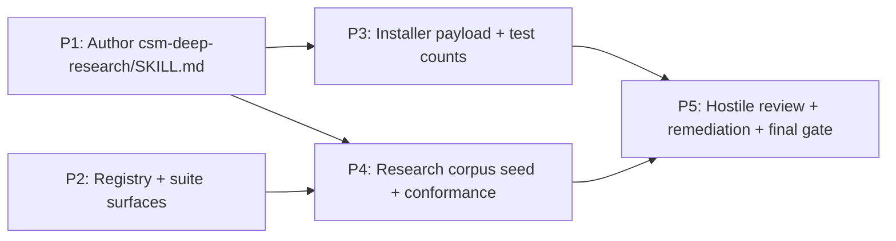

format: csm-grill/1
# csm-deep-research Skill Approach

- Idea slug: csm-deep-research-skill
- Date: 2026-08-20
- Status: agreed

## How To Execute

Paste each phase brief below into its own explicit csm-plan invocation. This document authorizes nothing by itself.

## Idea Statement

Build a new single-file orchestration skill, `csm-deep-research`, that answers research/R&D/validation queries (how to build X, which algorithm or technique, the original spec/standard, proof of a way forward) with one comprehensive, exhaustively cited research document. It triages each query (QUICK/STANDARD/DEEP × local/web/hybrid), runs a mixture-of-experts pipeline (parallel expert researchers → primary synthesis → anti-anchored adversarial challenger → dedicated rubric-driven LLM-as-judge → remediate or kill-the-draft → tier-scaled citation verification), and saves exactly one dated finding to `.agents/research/<yyyy-mm-dd>-<slug>-research.md`. It is standalone (no handoff to csm-plan), tmux-managed, never modifies any repository it researches (temp dir + single allowlisted output, optional single-file commit), clarifies with the user only when explicitly enabled, and writes its finding in a 9-part progressive-disclosure skeleton with liberal ASCII/Mermaid diagrams and a full reference list. It is built through the standard grill → plan → build pipeline using the heavy hostile-review run shape.

## Decisions Log

| Question | Answer | Rationale |
|---|---|---|
| Skill name | `csm-deep-research` | User choice; frontmatter name must equal dir name per check-suite; trigger words cover deep research/R&D/validation queries |
| Pipeline position | Standalone — revised from feeder | User reversed the feeder decision; no csm-plan handoff, no workflow edge, no handoff contract |
| Artifact location | New `.agents/research/` corpus, `format: csm-deep-research/1` | Mirrors plans/reviews/approaches precedent; gets its own check-suite corpus block + FORMAT_VERSIONS entry + seed file + .agents/README.md index section |
| tmux bootstrap | Yes (MANIFEST.tmux true) | Long-running unattended pipeline like csm-plan/csm-review; canonical synced Tmux Session Bootstrap section; README tmux bullet grows to six skills |
| Triage design | 3 tiers (QUICK/STANDARD/DEEP) × 3 source modes (local/web/hybrid) | csm-plan size-axis and csm-review QUICK/FULL precedent scaled to research; strategy presented before pipeline runs |
| Clarifications | OFF by default — revised from default-on; opt-in flag; when on: budget 3 one-at-a-time questions + triage-strategy confirmation; mid-run only genuinely user-owned decisions, else assumptions recorded | User reversed the default; CLAMBER research shows LLMs under-ask, so opt-in mode keeps the budget small and decisive |
| Expert pipeline | csm-review-style: parallel experts → primary synthesis → anti-anchored challenger → rubric judge → remediate/kill-the-draft → citation verification; one adversarial cycle cap | Hardened challenger mechanics exist verbatim in csm-review (CHALLENGE state, anti-anchoring, dissent recording, cycle cap, VERIFY budget) |
| Judge identity | Dedicated judge subagent (never the draft author), rubric, reasoning-before-verdict, verdicts recorded verbatim | MT-Bench self-preference bias mitigation; Anthropic single-judge-with-rubric finding; primary owns remediation decisions |
| Verification depth | Tier-scaled: QUICK source-quoted or marked unverified; STANDARD re-checks challenger/judge-flagged + conclusion claims (RARR/SAFE-style); DEEP per-claim verdicts with explicit unverified section | SAFE/RARR is the main hallucination check but the most token-expensive step; tiers keep cost proportional |
| Finding format | 9-part progressive-disclosure skeleton (header → TL;DR → exec summary + overview diagram → key findings → detail sections with per-section summaries + ASCII/Mermaid → recommendation → unverified claims → references → process appendix); in-chat response scale-gated | User spec: comprehensive/exhaustive, liberal diagrams, progressive disclosure, references at end |
| Skill shape | Single-file orchestration (~340–420 lines), no scripts/tests | csm-grill/csm-review precedent; pure agentic orchestration with no deterministic tooling; adds RESILIENCE_PARAMS entry |
| Build run shape | Heavy, hostile-review run (csm-review-skill precedent) | Widest blast radius yet: contracts.mjs, check-suite corpus, FORMAT_VERSIONS, tests with hardcoded skill counts, pack-bootstrap.mjs, README matrix + tmux bullet, .agents index + seed |
| Bootstrap payload | Ship in payload now | pack-bootstrap.mjs skillDirs + payload refresh + digest + three test-count updates (8→9) |
| NORMS.md | No dependency (MANIFEST.norms false) | Standalone; local mode reads the repo directly; existing NORMS.md remains readable as ordinary context if present |

## Research Synthesis

**SCOUT findings** — three scouts: (a) suite conformance surface (write discipline patterns per skill; `.agents/` output paths; the full registry of gates a new skill must touch); (b) external research patterns (Anthropic multi-agent research system: orchestrator-workers + effort-scaled tiers 1/2–4/10+ subagents, single-judge-with-rubric 0–1 + pass/fail most consistent, CitationAgent, source-quality heuristics; MT-Bench judge failure modes — position/verbosity/self-preference bias, reasoning-before-verdict mitigation; RARR/SAFE claim-level verification; CLAMBER showing LLMs under-ask; progressive disclosure per NN/g + Wikipedia lead section; GPT Researcher local/web/hybrid `report_source`); (c) skill-creation precedent (csm-grill run = 3 light tasks; csm-review-skill run = 4 tasks with 5-pass hostile review + numbered findings + remediation trace; single-file orchestration standard; frontmatter Never-X clause + retrieval-bias suffix convention).

**DEEP_DIVE findings** — (a) the exact change manifest: every corpus block shape in check-suite.mjs (suffix glob + `formatMarkerOf` + hard minimum — a seed file is REQUIRED), FORMAT_VERSIONS, MANIFEST/INTERFACES/NEVER_INVOKE entries, TMUX_PARAMS/RESILIENCE_PARAMS structures, README tmux-bullet + skills-table requirements, the three tests with hardcoded 8-skill lists/counts, pack-bootstrap.mjs skillDirs + payload-index.json digest, `.agents/README.md` index format, verifyMachine conventions (chain line, `### N. TOKEN` headings, consecutive 1..N, entryExit:false, STOP terminal exemption, Never-X regex, ≤500-line gate, ordinal sequencing); (b) the verbatim copy-list: csm-review CHALLENGE anti-anchoring mechanics, VERIFY gate + evidence-class spine + protected-state baseline, Control-journal resume + quota note, subagent resilience ladder, canonical tmux bootstrap, composite write-discipline wording, state-machine form, required-document template style, anti-patterns/done-criteria shape.

**Key design choices** — state chain `INTAKE -> TRIAGE -> RESEARCH -> SYNTHESIZE -> CHALLENGE -> JUDGE -> REMEDIATE -> VERIFY -> SAVED -> STOP` (10 states; CLARIFY folded into INTAKE as a flag-gated substep so the machine check stays linear); entryExit:false (no Entry:/Exit: lines required); evidence-class spine adapted from csm-review (E1 verified via tool/re-fetch, E2 independently challenged, E3 retrieved at pinned edition/date); journal-resume pattern from csm-review (Control journal inside the research document, restore at INTAKE) since tmux'd runs must survive quota exhaustion; verification budget ≤3 distinct failures then caveat-and-SAVED; adversarial cycle cap one round.

**Risks** — highest: boilerplate sync drift (synced sections must come from boilerplate.mjs + `sync-skill-boilerplate.mjs --write`, never hand-edited); registry divergence (unregistered skill silently bypasses all gates); README drift (tmux bullet pinned by check-suite); payload-digest churn on refresh; copy-then-adapt numbers (cycle cap/VERIFY budget tuned to review's 18 dimensions — retune for a 3-tier pipeline).

## Phasing

```text
[P1 Skill SKILL.md] --> [P3 Payload + test counts] ---> [P5 Hostile review + final gate]
[P2 Registry + surfaces] --> [P4 Seed + conformance] -->/
```



P1 ∥ P2 run in parallel (disjoint file ownership; all contract strings pinned so gates never cross files). P3 depends on P1 (payload byte-copies the final SKILL.md). P4 depends on P1 (template) + P2 (corpus block). P5 depends on P3 + P4.

## Phase Briefs

### Phase 1: Author csm-deep-research/SKILL.md

- Goal: Produce the single-file orchestration skill, gated to pass every check-suite check it is subject to on first run.
- Deliverables: `csm-deep-research/SKILL.md` (~340–420 lines; orchestration siblings run 225–323, the ≤500 gate is hard).
- Scope: The SKILL.md file only. Sections, in order: frontmatter (`name: csm-deep-research`; `description` ≤1024 chars, ends in a Never-X clause matching `NEVER_CLAUSE_RE` — e.g. "Never modifies the repository it researches, never invokes other skills." — plus the suffix "Biases towards retrieval from current documentation over pre-trained knowledge."); exactly one H1; `## Interface` (exactly 4 labeled bullets: Consumes / Produces / Hands off / Never invokes — the never-invokes list must name exactly the 8 siblings, matching the NEVER_INVOKE row); `## Tmux Session Bootstrap` and `## Subagent Resilience` (byte-identical to the boilerplate renders pinned in the plan — the synced params text from scripts/lib/boilerplate.mjs must be embedded verbatim so P2's `sync --write` produces zero drift); `## Activation Boundary`; `## Core Rules`; `## Write Discipline And File Allowlist` (composite grill+review wording: temp dir `mktemp -d /tmp/csm-deep-research-XXXXXX`, single allowlisted `.agents/research/<yyyy-mm-dd>-<slug>-research.md` output, protected-state baseline at INTAKE re-run at VERIFY, read-only git ops, optional single-file commit, default no commit); `## Research State Machine` (chain `` `INTAKE -> TRIAGE -> RESEARCH -> SYNTHESIZE -> CHALLENGE -> JUDGE -> REMEDIATE -> VERIFY -> SAVED -> STOP` ``, cycle rules, termination rules: one adversarial cycle cap + VERIFY budget ≤3 distinct failures, Control-journal transition recording `[<timestamp>] <From> -> <To> :: cycle <n> :: trigger: <reason>`, quota note: resume via the journal; `### <n>. <STATE>` numbered headings 1..10 in exact chain order, consecutive numbering, no numbered headings outside the chain, no Entry:/Exit: lines — entryExit:false); `## Required Research Document` (9-part template fence starting `format: csm-deep-research/1` — TL;DR, Executive Summary with ASCII overview diagram, Key Findings, Detail Sections each with 1-line summary + ASCII/Mermaid diagrams, Recommendation, Unverified Claims, References with URL + retrieval date, Process Appendix); `## Triage` (3 tiers × 3 source modes, tier-scaled depth rules, strategy presentation); `## Anti-Patterns`; `## Done Criteria`. Subagent Resilience guard text: RESEARCHER/CHALLENGER/JUDGE dispatches never silently degrade to primary-only for STANDARD/DEEP queries — step-4 independence caveat surfaced in the report's residual unknowns; quota-type failure rule copied verbatim.
- Out of scope: contracts.mjs, boilerplate.mjs, check-suite.mjs, README.md, tests, payload, seed file (P2–P4).
- Constraints: all contract strings pinned in the plan (MANIFEST sections list, machine section name, state chain, never-invokes names, boilerplate param text, description); no scripts/tests in the skill dir; no H2 duplicates; ordered lists inside state headings strictly 1..k.
- Acceptance hints: `node scripts/check-suite.mjs` reports only expected P2-era gaps (its own MANIFEST entry missing is not yet checked — verify manually by temporary-adding the entry in a scratch copy); `wc -l` in 340–420; balanced fences; the chain line matches `CHAIN_RE`; state headings parse; Never-X regex matches the description.
- Dependencies: none (parallel with P2).
- Context: csm-review/SKILL.md (verbatim CHALLENGE/VERIFY/journal/state-machine form — csm-review/SKILL.md:142-151, 164-182, 72-93); csm-grill/SKILL.md (Write Discipline 40-46, Subagent Resilience 28-38, Required Approach Document 142-212); check-suite verifyMachine conventions (check-suite.mjs:212-273, 389-467).

### Phase 2: Registry + suite surfaces

- Goal: Register csm-deep-research in every data-driven gate so the suite knows it exists, and add the research corpus validator.
- Deliverables: `scripts/lib/contracts.mjs` — MANIFEST entry (`sections` listing the real H2s, `tmux: true`, `norms: false`, `machine: { section: 'Research State Machine', entryExit: false }`), INTERFACES entry (entryConditions: research question + explicit deep-research request; consumes: research question + retrievable sources; produces: one dated research document at `.agents/research/<yyyy-mm-dd>-<slug>-research.md`; handoff: research document to the user; midPipeline: subagent dispatches, findings ledger, synthesis), NEVER_INVOKE 9×9 (append `'csm-deep-research': true` to all 8 rows + new all-true-except-diagonal row), FORMAT_VERSIONS `'csm-deep-research': 1`; `scripts/lib/boilerplate.mjs` — TMUX_PARAMS entry (prelude "Run first — before any research work or other sections. Not a research state.", step2/work/request/activity/workflow = research) + RESILIENCE_PARAMS entry (intro "Fallback ladder for `RESEARCHER`, `CHALLENGER`, and `JUDGE` dispatches — journal every incident, never silently:", step4 primary completion with recorded independence caveat, guard as pinned in the plan); `scripts/check-suite.mjs` — new research corpus block after the approach block (~line 637): readdir `*-research.md` under `.agents/research` (catch → []), hard minimum-count check, per-file `formatMarkerOf` check against `csm-deep-research/1`, H2-subsequence check against the Required Research Document template extracted from the SKILL.md; README.md — skills table row + tmux bullet (add `` `csm-deep-research` `` to the line-79 list) + prose count references 8→9 + layout-tree entry; `.agents/README.md` — `## research/` index section; regenerated artifacts via `node scripts/gen-readme-matrix.mjs --write` and `node scripts/sync-skill-boilerplate.mjs --write` (the latter must produce zero drift in the P1 file — that is a gate).
- Out of scope: SKILL.md content edits (P1 — sync --write may render into it only if byte-identical), tests/payload (P3), seed file (P4).
- Constraints: data-driven only; check-suite behavior otherwise unchanged (existing 328 checks stay green); boilerplate sections are synced — never hand-edited after this phase; README tmux bullet must list all six tmux skills on one line.
- Acceptance hints: `node scripts/gen-readme-matrix.mjs --check` clean; `node scripts/sync-skill-boilerplate.mjs --check` clean; check-suite passes with only the corpus-empty failure remaining until P4; `node -e "import('./scripts/lib/contracts.mjs')"` clean.
- Dependencies: none (parallel with P1).
- Context: scripts/lib/contracts.mjs:1-50,75-132,144-163; scripts/lib/boilerplate.mjs:19-87; scripts/check-suite.mjs:549-637 (corpus block patterns), 585-613 (review corpus as model).

### Phase 3: Installer payload + test counts

- Goal: Ship the skill in the universal bootstrap installer and make every hardcoded skill-list test pass at 9 skills.
- Deliverables: `scripts/pack-bootstrap.mjs` — add `'csm-deep-research'` to skillDirs (line ~18); run `node scripts/pack-bootstrap.mjs` → `bootstrap/package/payload/skills/csm-deep-research/SKILL.md` (byte copy), `bootstrap/payload-index.json` refreshed with the new sha256/bytes entry between csm-build and csm-grill; tests updated: `tests/package-audit.test.mjs` (line 11 list + line 90 `8` → `9` + line 108 `>= 118` → `>= 119`), `tests/integration/bootstrap-flow.test.mjs` (line 16 list + line 42 `8` → `9`), `tests/protocol/protocol.test.mjs` (line 27 skillsPlaced list, sorted position between csm-build and csm-grill).
- Out of scope: contracts/README (P2), seed (P4), review (P5).
- Constraints: payload mirror must stay byte-identical to the live skill dir (diff -q against csm-deep-research/SKILL.md); skillNames lists stay sorted as payload-index sorts by path; tests must be run: `node --test tests/package-audit.test.mjs`, `node --test tests/integration/bootstrap-flow.test.mjs`, `node --test tests/protocol/protocol.test.mjs`.
- Acceptance hints: all three test files green; payload digest printed by pack-bootstrap recorded in the plan; `diff -rq bootstrap/package/payload/skills csm-*` clean for the new skill.
- Dependencies: P1 (final SKILL.md bytes).
- Context: scripts/pack-bootstrap.mjs:18-29,73-112,153; tests/package-audit.test.mjs:11,90,108; tests/integration/bootstrap-flow.test.mjs:16,42; tests/protocol/protocol.test.mjs:27.

### Phase 4: Research corpus seed + conformance verification

- Goal: Give the new corpus its required seed (hard minimum is enforced) and prove the whole suite is green together.
- Deliverables: `.agents/research/2026-08-20-csm-deep-research-skill-research.md` — a real 9-part research document answering "how should the csm-deep-research skill be designed" (grounded in this approach's research synthesis), frontmatter `format: csm-deep-research/1`, H2 sequence exactly matching the SKILL.md's Required Research Document template, generous ASCII/Mermaid diagrams, full reference list with retrieval dates, process appendix; full verification: `node scripts/check-suite.mjs` all green, `node scripts/sync-skill-boilerplate.mjs --check` clean, `node scripts/gen-readme-matrix.mjs --check` clean, `node --test` for the three bootstrap suites + resume-semantics, `make lint` clean (if oxlint available).
- Out of scope: payload (P3), review (P5).
- Constraints: seed must be a genuine finding, not a lorem placeholder; the corpus block's H2-subsequence check must pass; no writes beyond the seed file (the `.agents/README.md` index line is owned by P2).
- Acceptance hints: check-suite fully green including the new corpus block; the seed renders per the 9-part skeleton; git status shows only intended files.
- Dependencies: P1 (template), P2 (corpus block + MANIFEST registration so checks apply).
- Context: check-suite.mjs corpus blocks (549-637); this approach document's Research Synthesis as seed content source.

### Phase 5: Hostile review + remediation + final gate

- Goal: Adversarial fresh-eyes validation of the new skill and its integration, with every finding traced to remediation.
- Deliverables: `.agents/docs/csm-deep-research-skill-review-2026-08-20.md` — five parallel fresh-eyes review passes (a) conformance, (b) coverage, (c) CSM integrity, (d) safety, (e) executability, numbered findings R-N; remediation of 100% of findings; final verification: every gate re-run (check-suite, sync --check, matrix --check, three bootstrap suites, payload diff, `git status --porcelain` showing only the intended file set), Completion Review filled in the plan.
- Out of scope: new functionality beyond findings; any other repo change.
- Constraints: reviewers are subagents that did not author the deliverables; findings numbered and traced in the plan's critique resolution; review evidence quoted per finding; final gate must pass with zero residual findings except recorded non-blocking notes.
- Acceptance hints: 5 passes with per-pass verdicts; every R-N id appears in the remediation trace; final `git status` clean of unintended files; all gates green.
- Dependencies: P3, P4.
- Context: csm-review-skill run precedent (.agents/plans/2026-08-15-csm-review-skill-csm.md T003/T004); .agents/docs/csm-suite-review-2026-08-15.md as report-format precedent.

## Open Questions And Rejected Options

**Parked (non-blocking, build may decide):** README prose count references ("eight skill folders") updated descriptively; ARTIFACT_PATTERNS entry for csm-deep-research omitted (vacuous pass — Interface prose carries the artifact path anyway); STOP heading omitted via the terminal-exempt rule (chain ends `STOP` with no `### 10. STOP` heading); the SKILL.md template fence carries `format: csm-deep-research/1` for self-consistency (recommended).

**Rejected:** feeder into csm-plan (user reversed — standalone); `.agents/docs/` reuse (no corpus validation); temp-dir-only output (contradicts .agents requirement); in-chat-only (no persistent artifact); no-tmux in-session (long runs die with the terminal); ad-hoc depth triage (unverifiable); 2×2 triage grid (too coarse); unbounded clarification / start-only clarification (budgeted opt-in chosen); self-critique loop (weak independence); debate-first (token-heavy, slow); primary-as-judge (self-preference bias); distinct stronger judge model (config surface, unavailable in-session); always-full verification (unaffordable for QUICK); flagged-only verification (leaves unchallenged claims ungrounded); 4-part lean / always-deep report (violates exhaustive-but-scaled spec); code-backed with scripts (no deterministic tooling exists); light docs-only build run (blast radius too wide); defer payload wiring (installer + tests go stale); NORMS.md consumption (orthogonality chosen).
