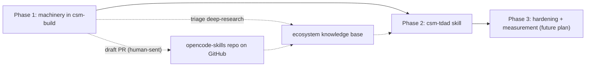

format: csm-grill/1
# TDAD Verification Layer Approach

- Idea slug: tdad-verification-layer
- Date: 2026-08-20
- Status: agreed

## How To Execute

Paste each phase brief below into its own explicit csm-plan invocation. This document authorizes nothing by itself. Phase 3 is a future, separate plan; do not include it in the Phase 1 plan.

## Idea Statement

Gate CSM progression on structured, executable verification evidence — `pass` / `fail` / `inconclusive` — instead of agent consensus. Planning produces a verification contract; building produces a bounded diff; the verification layer inspects the actual diff, selects the pre-existing tests most likely affected, runs deterministic checks, and emits a content-hashed evidence manifest. Novel ecosystems are a learning event: an early triage step dispatches csm-deep-research to learn them, enriching a durable ecosystem knowledge base and drafting a PR contribution back to the opencode-skills repo. Phase 1 delivers the machinery inside csm-build; Phase 2 delivers a standalone terminal `csm-tdad` skill; Phase 3 (future) adds test hardening and measurement.

## Decisions Log

| Question | Answer | Rationale |
|---|---|---|
| Vehicle: where does the layer live? | A — machinery inside csm-build first (Phase 1); standalone csm-tdad skill later (Phase 2) | three-state semantics and manifest proven on real builds before paying the ~9-file skill-registration cost; arXiv 2603.17973 precedent ships its impact map as a skill, so Phase 2 has strong justification once the manifest format is proven |
| Plan contract attachment | A — fenced-YAML `Verification Contract` block inside the plan's existing Design section | additive and subsequence-safe for the corpus gate; `format: csm-plan/1` unchanged; plan stays the single source of truth; machine-readable form emerges at the manifest, not the plan |
| `inconclusive` semantics | A — overall `inconclusive` derived from per-check states `failed` / `unavailable` / `not-applicable`; inconclusive ends in BLOCKED with exactly one structured user decision (accept with residual risk / broaden verification / repair) | extends existing Blocker Rules vocabulary; kills silent pass-with-caveat for required evidence; `not-applicable` is green-side (change class does not trigger the check), `unavailable` is red-side (evidence required but not producible); only unavailable/not-applicable *required* evidence derives inconclusive |
| Evidence manifest location and shape | A — `.agents/evidence/<plan-id>-<cycle>-manifest.json` per build iteration, VSA-shaped (diff hash, base SHA, contract id, per-check records, derived overall status, policy decision), content-hashed, disposable; final-cycle manifest referenced from the plan journal | consumable by Phase-2 skill, review escalation, and the learning loop; no DSSE/signing ceremony — content hash suffices (PatchProof precedent); no existing format has an inconclusive state — we define it |
| Phase 1 test-selection depth | A — file/package-level: test discovery + static imports + workspace dependency map; runner-native affected flags when the framework exists (Jest `--findRelatedTests`, Vitest `related`, pytest-picked, cargo-test-changed); git-diff file-path + package heuristics fallback; every selection records a confidence value and rationale; low confidence or missing edges contributes to inconclusive | real selection value at Phase-1 cost; heavy build-graph tools (Nx/Bazel/Turborepo) are detect-if-present only, never a prerequisite; symbol-level precision grows in Phase 2 |
| Unknown ecosystems | D — learning event, not degradation: the layer records a `learningRequest` in the manifest; csm-deep-research learns the ecosystem's verification tooling; findings enrich the available tooling knowledge | active-learning loop instead of a static degradation rule |
| Learning mechanics | B — csm-build gains a scoped csm-deep-research dispatch edge, deployed only at an early triage step of the build (before validation, not mid-cycle); the dispatch does two things: (a) obtain learnings/toolings/skills into an ecosystem knowledge base (`.agents/ecosystems/<ecosystem>.md`), and (b) propose a PR back to the opencode-skills repo on GitHub adding the learning — drafted by the build, sent on human approval (never-push rule holds) | matrix change is an asymmetric exception like the grill/plan rows; triage scoping preserves build discipline; the suite becomes self-extending via PRs |
| BDD scenario typing | A — include in Phase 1: every csm-bdd-tdd scenario carries a `type:` tag (acceptance / negative-abuse / regression / property-invariant / contract / integration) | cheapest enhancement in the proposal; feeds the manifest's evidence categories; flows plan → build → manifest with near-zero new machinery |
| Mutation and property testing | A — deferred to a later phase; Phase 1 manifests declare them as evidence categories only (`unavailable`/`not-applicable` semantics ready), no execution machinery | keeps Phase 1 bounded: contract, manifest, three-state semantics, selection, triage-learning, scenario typing, PR loop is already a full build; per-framework runner-plugin work belongs to a later phase (matches the proposal's own Phase 3) |
| Metrics | B — deferred entirely, including schema fields | most metrics (verification time via durationMs, selection confidence, inconclusive frequency, rework loops via repair counts, autonomy rate) remain derivable from recorded data when aggregation is built later |
| Description word budget | C — the 220-word cap is advisory for csm-tdad's Phase 2 registration; no re-budget copy surgery | token efficiency is OFF (`{"enabled": false}`); the budget gate is skipped; discipline loosens deliberately — volatile-description hygiene (no dates/versions/paths in descriptions) still applies in spirit |

## Research Synthesis

Two scouts ran in parallel (repo-grounded + external tooling).

Repo grounding: the suite has no `inconclusive` outcome today — the only carve-out is the unavailable-check/residual-risk clause (csm-build/SKILL.md:235). An additive `verification:` block in plan *documents* is subsequence-safe for the corpus gate, but a new required template section or `format:` kind would fail historical corpus plans unless gated. `.agents/evidence/` does not exist; csm-deep-research's `.agents/research/artifacts/` is the artifact-ledger precedent (contents not gate-validated). A new skill costs: MANIFEST entry, NEVER_INVOKE rows, payload mirror (`pack-bootstrap.mjs`), README F-052 references, boilerplate sync, and hardcoded skill lists in four test files (`tests/package-audit.test.mjs:11,100`, `tests/integration/bootstrap-flow.test.mjs:16`, `tests/protocol/protocol.test.mjs:53`, `tests/check-suite.test.mjs:210`). The 220-word description budget currently totals exactly 220 across 9 skills; the gate is skipped while token efficiency is OFF.

External grounding: "TDAD" already exists — arXiv 2603.17973 (2026-03): AST-based code↔test impact map delivered as an agent skill, regressions 6.08% → 1.82% on SWE-bench Verified; TDD instructions without test context made regressions *worse* (9.94%) — surfacing the right tests beats prescribing process. Native affected-test flags are the repo-agnostic baseline (Jest `--findRelatedTests`/`--changedSince`, Vitest `related`/`--changed`, pytest-picked (coarse), cargo-test-changed (crate-level)); Nx affected/Turborepo/Bazel are heavier, project/package-graph level, detect-if-present only. Stryker scoped mutation (`--mutate <file:line-range> --incremental --coverageAnalysis perTest --thresholds.break`) is minute-level at per-file scope and the only turnkey JS/TS option; per-test coverage analysis is default since v5. Property tests are practical for LLM authoring with a rubric (fast-check ships an official `javascript-testing-expert` agent skill); guidance-backed, not experimentally verified. For manifests: SLSA v1.2 Verification Summary Attestation is the closest formal precedent (`verificationResult: PASSED/FAILED` + verifier + time + policy); JUnit XML is the every-runner interchange but has no inconclusive state — the three-state semantics are the novel piece we define ourselves; in-toto/DSSE signing is disproportionate for a per-change gate (content hash suffices). PatchProof demonstrates fail-before/pass-after phases with content-addressed JSON receipts.

Options rejected: new csm-tdad skill as the immediate first step (registration cost before semantics proven; duplicates csm-build VERIFY machinery); machinery-only with no skill ever (loses the reusable standalone "verify this diff" surface); static degradation rules for unknown ecosystems (silent gaps); in-band mid-cycle deep-research dispatch (breaks build discipline); per-ecosystem mini-skills (budget and gate impact); mutation/property execution in Phase 1; metric aggregation and dashboards in Phase 1; re-budgeting the 220-word description cap for Phase 2.

## Phasing

```text
[Phase 1: verification machinery in csm-build]
  ├── plan Verification Contract (fenced YAML, Design section)
  ├── bdd-tdd scenario typing
  ├── three-state semantics in VERIFY/CHECKPOINT + BLOCKED decision
  ├── evidence manifests (.agents/evidence/)
  ├── file/package test selection
  └── ecosystem triage step: deep-research learning (a) KB + (b) PR draft
        │
        ▼
[Phase 2: standalone csm-tdad skill]
  └── full gate registration; diff → ranked selection → manifest;
      symbol-level precision grows here; consumes KB
        │
        ▼
[Phase 3 (future, separate plan): test hardening + measurement]
  └── scoped mutation (detect-if-present), property tests,
      policy-as-code, waivers, metrics aggregation, weight recalibration
```



## Phase Briefs

### Phase 1: Verification machinery in csm-build

- Goal: make every build iteration emit a versioned evidence manifest with honest `pass` / `fail` / `inconclusive` outcomes, driven by a plan-level verification contract and diff-grounded test selection; learn unknown ecosystems through a triage-dispatched csm-deep-research run that enriches a knowledge base and drafts a PR back to this repo.
- Deliverables:
  - `csm-plan/SKILL.md`: additive fenced-YAML `Verification Contract` block inside the Design section (change class, risk tier, non-goals, invariants, required evidence, escalation triggers, human-approval rules). No template section change, no `format:` bump — `format: csm-plan/1` stays.
  - `csm-bdd-tdd/SKILL.md`: every scenario carries a `type:` tag — acceptance / negative-abuse / regression / property-invariant / contract / integration.
  - `csm-build/SKILL.md`: a new early `TRIAGE` step (before VALIDATE) with a scoped csm-deep-research dispatch edge; three-state VERIFY/CHECKPOINT semantics; `inconclusive` → BLOCKED with exactly one structured user decision; evidence-manifest emission per cycle.
  - Evidence manifest schema + `.agents/evidence/<plan-id>-<cycle>-manifest.json` convention: diff hash, base SHA, contract id, per-check records (name, status `pass|fail|unavailable|not-applicable`, command, durationMs, selected-test rationale, JUnit-XML references where runners emit them), derived overall status, policy decision; content-hashed; disposable; final-cycle manifest referenced from the plan journal.
  - Selection module: test discovery + static imports + workspace dependency map; runner-native affected flags when present; git-diff path/package heuristics fallback; confidence + rationale always recorded; low confidence / missing edges contribute to inconclusive.
  - Ecosystem knowledge base convention: `.agents/ecosystems/<ecosystem>.md` (test frameworks, affected-test flags, mutation/property tooling, CLI recipes), populated by triage-dispatched csm-deep-research findings; learning requests recorded in manifests.
  - PR-draft protocol: the triage learning produces a draft PR contribution to the opencode-skills GitHub repo (knowledge base entry and any tooling registry updates); drafted by the build, sent by the human.
  - `NEVER_INVOKE` matrix change in `scripts/lib/contracts.mjs`: csm-build row gains the csm-deep-research dispatch edge (asymmetric exception, triage-scoped), mirroring the grill/plan pattern; expected-set filtering updated.
  - `check-suite.mjs`: updates for the matrix change; decision — ecosystem KB entries are advisory data, no new gate corpus.
- Scope: as above, plus repo-level tests for the new machinery following existing `tests/` conventions.
- Out of scope: mutation/property execution; metric aggregation; AST/symbol-level graphs; dashboards; waivers; new skill registration; README skills-index changes beyond what the matrix change requires.
- Constraints: no plan-format or template changes beyond the additive fenced-YAML block; no new required gate sections; csm-build stays terminal except the triage-scoped deep-research edge; never push — PRs are drafted, human-sent; manifest artifacts are disposable and never gate-validated.
- Acceptance hints:
  - A build on a known-stack repo emits a manifest whose selection rationale matches a hand-verified impact list.
  - A build on a novel ecosystem records `learningRequest`, the TRIAGE step dispatches csm-deep-research, a KB entry lands, and a PR draft is produced.
  - An unavailable required check ends in `inconclusive` → BLOCKED with exactly one user question; a `not-applicable` check does not.
  - No gate regressions: `make check` and `make test` pass before and after.
- Dependencies: none.
- Context: this approach document; `csm-build/SKILL.md` (VERIFY at lines 167–173, Completion Gate 229–242, Blocker Rules 244–254); `csm-plan/SKILL.md` (Design section, Required Plan Document); `csm-bdd-tdd/SKILL.md` (SCENARIOS, scenario template); `scripts/lib/contracts.mjs` (MANIFEST, NEVER_INVOKE lines 173–183); `scripts/check-suite.mjs` (corpus checks, F-052); scout findings: arXiv 2603.17973, SLSA v1.2 VSA, Stryker scoping flags, Jest/Vitest/pytest-picked/cargo-test-changed affected-test flags (retrieved 2026-08-20).

### Phase 2: Standalone csm-tdad skill

- Goal: a standalone terminal `csm-tdad` skill: consume a diff, the plan's Verification Contract, and the ecosystem knowledge base; produce ranked affected-test selection with rationale; run deterministic validation; emit the evidence manifest; return `pass` / `fail` / `inconclusive`; escalate to human review only for ambiguous evidence, high-risk changes, or low-confidence impact maps.
- Deliverables:
  - `csm-tdad/SKILL.md` following the suite's machine/sections conventions (Interface, Activation Boundary, Core Rules, state machine, Anti-Patterns, Done Criteria; tmux bootstrap per convention).
  - Full gate registration: MANIFEST entry (`scripts/lib/contracts.mjs`), NEVER_INVOKE rows for all skills, payload mirror (`bootstrap/package/payload/skills/`), README F-052 references + skills index, boilerplate sync if a synced section applies, updates to the four test files with hardcoded skill lists.
  - Selection precision grows incrementally: start file/package-level (reusing Phase 1 modules); symbol-level AST precision only after basic selection proves useful in real runs.
  - Consumes `.agents/ecosystems/` knowledge base for unfamiliar stacks.
- Scope: as above.
- Out of scope: in-flow invocation (the skill is terminal, invoked explicitly); pushing PRs; mutation/property execution; dashboards.
- Constraints: description budget advisory (decision C — no 220-word re-budget surgery; volatile-description hygiene applies); the skill never invokes other skills; manifests follow the Phase 1 schema.
- Acceptance hints: a fresh diff produces a ranked selection with rationale matching a hand-verified impact list; `inconclusive` outcomes carry explicit missing-evidence records; gate passes with the skill registered.
- Dependencies: Phase 1 (manifest schema, selection modules, KB convention, matrix pattern).
- Context: Phase 1 deliverables; arXiv 2603.17973 agent-skill impact-map precedent; the four test files listed in the research synthesis.

### Phase 3: Test hardening and measurement (future plan)

- Goal: strengthen changed-code verification and close the learning loop with measured outcomes.
- Deliverables (scope for the future plan, not Phase 1): scoped mutation testing via Stryker detect-if-present (`--mutate <changed> --incremental --coverageAnalysis perTest --thresholds.break`); property-test authoring guidance for declared invariants; architecture policy-as-code; security/sensitive-path policies; waiver workflow (owner, reason, risk, expiry); metric aggregation (verification latency, inconclusive rate, selection confidence, repair-loop counts, autonomy rate, review yield) + dashboards; selection-weight recalibration from regression-escape records; release/canary evidence where appropriate.
- Scope: only when Phase 1 proves the loop useful; each deliverable sized by repo tooling support.
- Out of scope: graph-database prerequisites; whole-repo mutation runs.
- Constraints: per-ecosystem degradation follows the Phase 1 `unavailable`/`not-applicable` semantics; never treat passing selected tests as mathematical proof of no regression.
- Acceptance hints: changed critical logic on supported stacks is mutation-hardened; recurrent code-quality rules are enforced before review; human review focuses on trade-offs and residual risks.
- Dependencies: Phase 1, Phase 2.
- Context: the proposal's Enhancements 6, 7, 9; Stryker scoping documentation (retrieved 2026-08-20).

## Open Questions And Rejected Options

Open questions (assumed during the grill, confirm in the Phase 1 plan):
- PR target confirmed as this repo's GitHub origin (opencode-skills); KB and tooling-registry changes are the PR content.
- Ecosystem KB files are committed to this repo by default (they are the PR content).
- Whether the TRIAGE step dispatches deep-research per novel ecosystem or batches learning requests; the Phase 1 plan should pick the cheaper default (single dispatch per novel ecosystem, batched only when several requests accrue).
- How the final-cycle manifest reference is journaled (a `Last manifest:` line in Control is the likely shape; plan decides).

Rejected options:
- New csm-tdad skill as the first step (vehicle question) — registration cost before semantics proven; duplicates csm-build VERIFY.
- Machinery-only, no skill ever — loses the standalone verify-a-diff surface.
- New required `## Verification Contract` plan section — breaks historical corpus plans without a carve-out.
- `inconclusive` → pass-with-caveat (current behavior) — silent gap; and `inconclusive` → auto-review — violates terminal-skill discipline.
- Manifests embedded in the plan journal only — not consumable by the skill/review/learning loop; DSSE-signed attestations — disproportionate.
- AST/symbol-level graph in Phase 1 — full static-analysis prerequisite, contradicts the non-objectives.
- No selection machinery in Phase 1 — the core proposal value evaporates.
- Hard gate on unsupported stacks; TDAD engaging only on detected supported stacks (silent gap).
- Per-ecosystem mini-skills — budget and gate impact.
- In-band mid-cycle deep-research dispatch — breaks build discipline (superseded by triage-scoped B).
- Mutation/property execution in Phase 1; metrics fields + aggregation + dashboards in Phase 1.
- Re-budgeting the 220-word description cap for Phase 2 registration (decision C: advisory).
