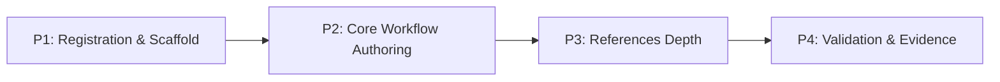

format: csm-grill/1

# csm-make-tests Approach

- Idea slug: csm-make-tests
- Date: 2026-08-22
- Status: agreed

## How To Execute

Paste each phase brief below into its own explicit csm-plan invocation. This document authorizes nothing by itself.

## Idea Statement

Build `csm-make-tests`: a comprehensive test-generation skill for the csm library that audits a repository's existing tests and coverage first, then generates the full test spectrum — characterization goldens, intent/property tests, contract/integration tests, and performance benchmarks/gates — mutation-validated, human-approved, with differential-oracle guidance for refactor windows and runtime guards for all known residual uncertainties. Implementation is grounded in the committed research finding `.agents/research/2026-08-22-characterization-skill-implementation-research.md` (5 cycles, 111 references, commit 1105076).

## Decisions Log

| Question | Answer | Rationale |
| -------- | ------ | --------- |
| Skill name? | `csm-make-tests` (rejecting `csm-characterize`) | User choice; passes name gate `^[a-z0-9]+(-[a-z0-9]+)*$` |
| V1 scope? | Comprehensive generator: full ladder + differential oracle, all 5 stacks documented | User: "it needs to be a comprehensive one" — core-net-only rejected |
| Residual unknowns handling? | Option B: runtime guards embedded in instructions + `known-uncertainties.md` reference | User picked B; none of the five residuals blocks design; guards make skill robust regardless |
| Entry gate? | AUDIT phase expanded beyond MAINTAIN: comprehensive audit of all existing tests + coverage + suite health before any generation | User addition: generation must target the audited delta |
| Operating model? | `tmux: true` in MANIFEST | User choice; mutation sweeps and bench runs are long-running |

## Research Synthesis

Source of record: `.agents/research/2026-08-22-characterization-skill-implementation-research.md`. Load-bearing findings:

- **Pipeline**: PHASE 0 prerequisites → AUDIT → SCAN → CAPTURE → TRIAGE → APPROVE → VERIFY (mutation) → AMPLIFY → DIFFERENTIAL → LAYER → PERF → OUTPUT (finding D11).
- **Capture per stack**: syrupy (`--snapshot-update-new-only`, fail-if-missing, `path_type` scrubbers), Jest/Vitest snapshots (CI no-write), cargo-insta (`test --accept-unseen`, `pending-snapshots --as-json`), Go golden `-update` flag, ApprovalTests Python/JVM, Verify `.received.`→`.verified.`.
- **Never-auto-accept**: every golden diff human-gated; update flags never run unbidden; opencode `permission.edit: "ask"` recommended to users.
- **Mutation validation**: exit-code gates — mutmut, StrykerJS (`thresholds.break`→exit 1, JSON survivor schema `status==="Survived"`), pitest (`mutationThreshold`), cargo-mutants (exit codes 0–70, `mutants.out/outcomes.json`).
- **Intent-generation ladder**: Hypothesis Ghostwriter (`hypothesis write --roundtrip/--idempotent/...`) → deterministic generators (Pynguin DynaMOSA w/ mutation-analysis assertions, containerized behind `PYNGUIN_DANGER_AWARE`; EvoSuite; Randoop `--specifications`) → LLM execution-in-the-loop (Cover-Agent pattern: generate→run→coverage-parse→repair→`--max-iterations`; 5× flakiness check) → amplification (AmPyfier/DSpot) — mutation-check every stage.
- **Differential oracle**: Scientist control/candidate (`use`/`try`, serve old result, mismatch logging, read-path-only caveat, dual-control calibration); ports Scientist.net/laboratory/Scientist4J; Fowler parallel-run/event-interception/dark-launching; Istio mirroring discards responses; GoReplay A/B; Google: human-adjudicated diffs.
- **Performance continuity**: profile-first (cProfile/py-spy); k6 smoke thresholds as first CI gate; saved baselines + `--benchmark-compare-fail`; allocation tracking (Go `-benchmem`, JEP 331/JFR ~3%, dotnet-counters, tracemalloc); multi-size complexity recipes (no turnkey tool); k6 soak 3–72h; Spring startup endpoint; `perf diff` wdiff; Bencher threshold-window trend gates on shared runners.
- **Discipline rules (lift verbatim)**: never fix discovered bugs during capture; never modify production code under capture; never claim green for an unrun suite; retained characterization tests are permanent; scrub unstable fields via library matchers.
- **Registration intel**: contracts.mjs MANIFEST (sections/tmux/norms/machine), INTERFACES map, O(n²) NEVER_INVOKE matrix, ARTIFACT_PATTERNS, hardcoded `skillDirs` in pack-bootstrap.mjs, three test suites with hardcoded 9-name lists, ~8 README areas, `gen-readme-matrix --write`, gate-baseline re-record (~703 checks today). Routing wording must avoid csm-bdd-tdd ("designs"), csm-build ("implements"), csm-review ("audits a repo").

### Optional Residuals Handling (mandated inclusion)

The five residual uncertainties from the research are carried **in the skill itself**, not just here:

| Residual | Runtime guard in skill instructions |
| -------- | ----------------------------------- |
| pitest XML filename unverified | Locate reports via glob `target/pit-reports/**/*.{xml,csv}`; parse whatever exists; never hardcode `mutations.xml` |
| Pact `can-i-deploy` unverified | Instruct: verify broker CLI capability with `pact-broker help` before scripting gates |
| Ghostwriter CC0 licensing | No action needed in-skill; noted as licensing context only |
| Randoop `--specifications` | Guard: check `randoop --help` output for flag presence before use; fall back to plain regression capture |
| Diffblue / self-healing benchmarks absent | Excluded from recommendations entirely; skill never cites vendor performance claims |

All five also listed in `references/known-uncertainties.md` (Phase 3) with re-verification steps.

## Phasing

```text
[P1 Registration & Scaffold] --> [P2 Core Workflow Authoring] --> [P3 References Depth] --> [P4 Validation & Evidence]
```



## Phase Briefs

### Phase 1: Registration & Scaffold

- Goal: wire `csm-make-tests` into every repo surface so `node scripts/check-suite.mjs` passes on a minimal skeleton SKILL.md.
- Deliverables: updated `scripts/lib/contracts.mjs` (MANIFEST entry: sections `[Interface, Tmux Session Bootstrap, Activation Boundary, Core Rules, Write Discipline And File Allowlist, Repository Norms (NORMS.md), Test Generation State Machine, Required Test Package, Anti-Patterns, Done Criteria]`, tmux true, norms true, machine `{section:"Test Generation State Machine", entryExit:false}`; INTERFACES entry; NEVER_INVOKE new row + `"csm-make-tests": true` added to all nine existing rows); `ARTIFACT_PATTERNS` entries for `.agents/tests/<yyyy-mm-dd>-<repo-slug>-tests-ledger.md` and verification report; `pack-bootstrap.mjs` `skillDirs` + regenerated payload index; three hardcoded test lists updated (`tests/package-audit.test.mjs`, `tests/integration/bootstrap-flow.test.mjs`, `tests/protocol/protocol.test.mjs`); README updates (roles table, both mermaid diagrams, both artifact-ledger tables, Skills table row, layout tree, orchestration/tmux bullet, "nine skills" counts) + `gen-readme-matrix --write`; skeleton `csm-make-tests/SKILL.md` passing all gates; `.agents/docs/gate-baselines.json` re-recorded.
- Scope: registration plumbing + skeleton only; body content lands Phase 2.
- Out of scope: reference files, workflow rule content.
- Constraints: description ≤1024 chars containing a Never-clause, volatile-free wording; Interface exactly 4 bullets; machine chain ≥2 unique states, numbered headings consecutive from 1; do not hand-edit generated README matrix region.
- Acceptance hints: `check-suite` exits 0; payload drift zero both directions; `make analyze && make test-bootstrap` pass; baseline check passes post-record.
- Dependencies: none (first phase).
- Context: scout report in this doc's Research Synthesis; `scripts/check-suite.mjs` L719–874; `scripts/pack-bootstrap.mjs` L30–40.

### Phase 2: Core Workflow Authoring

- Goal: author the full SKILL.md body implementing the 11-state pipeline with cited discipline rules.
- Deliverables: complete body sections per MANIFEST — Activation Boundary (generates tests; never plans, implements, reviews, or invokes sibling skills), Core Rules (never fix discovered bugs during capture; never modify production code under capture; never claim green for an unrun suite; retained tests permanent; never auto-accept goldens — update flags only after explicit human approval; scrub volatiles via library-native matchers), Write Discipline (artifacts under `.agents/tests/`; temp scratch outside repo), Repository Norms section, Test Generation State Machine with `AUDIT -> SCAN -> CAPTURE -> TRIAGE -> APPROVE -> VERIFY -> AMPLIFY -> DIFFERENTIAL -> LAYER -> PERF -> OUTPUT` chain and per-state rules traced to finding sections D11/D7/D8/D9, Required Test Package (ledger format: golden/intent/contract/perf entries with approver+commit; verification report format: passing/pre-existing-failure/new-failure/not-run + survivor triage), Anti-Patterns, Done Criteria.
- Scope: body content only; deep per-stack detail lives in Phase 3 references.
- Out of scope: bundled executable scripts.
- Constraints: <500 lines total; every load-bearing claim cites the research finding; routing-safe wording (executable/generated tests, not "designs"; no "audits a repo" phrasing — AUDIT is an internal token only).
- Acceptance hints: check-suite green; a reader can execute AUDIT→OUTPUT from the body alone using defaults; each state names its inputs/outputs.
- Dependencies: Phase 1.
- Context: research finding D11 (pipeline), D2/D6 (capture), D3 (mutation), D7 (intent ladder), K25 (differential), D9 (perf), K26 (phase-0/triage evidence).

### Phase 3: References Depth

- Goal: author six reference files carrying per-domain depth, linked from the states that need them.
- Deliverables: `references/capture-patterns.md` (per-stack approve loops incl. CI semantics table), `references/mutation-gates.md` (per-stack commands, exit codes, survivor parsing), `references/intent-generation.md` (ghostwriter→deterministic generators→LLM loop→amplification ladder with benchmark expectations), `references/differential-oracle.md` (Scientist pattern, ports, read-path caveat, calibration, traffic-level options, goldens-vs-differential division of labor), `references/perf-playbook.md` (profile-first, smoke thresholds, baselines, allocation tracking per language, multi-size complexity recipes, soak, cold-start, perf diff, trend gating), `references/known-uncertainties.md` (the five residuals with runtime guards and re-verification steps).
- Scope: markdown depth files only.
- Out of scope: any new top-level sections; scripts.
- Constraints: each file individually below line gates; volatile-free; cite the research finding rather than restating raw URLs where possible.
- Acceptance hints: check-suite green; each file loads standalone; guards appear verbatim in the states that consume them.
- Dependencies: Phase 2.
- Context: research finding D2/D6/D3/D7/D8/D9/D10/D11; K21–K27.

### Phase 4: Validation & Evidence

- Goal: prove the skill works end-to-end and leave the repo fully consistent.
- Deliverables: full `check-suite` + `make analyze && make test-bootstrap` green; payload-index and README-matrix diffs clean; a dry-run evidence note exercising AUDIT→CAPTURE→APPROVE→VERIFY against a small fixture scenario (may be a scratch repo outside this one); final commit including re-recorded baseline.
- Scope: validation only; fixes route back to the owning phase.
- Out of scope: new features.
- Constraints: fixture dry-run must not mutate this repository beyond its allowlisted artifacts.
- Acceptance hints: all gates green; ledger + verification artifacts produced by dry-run conform to Required Test Package.
- Dependencies: Phases 1–3.
- Context: gate-baseline procedure; AGENTS.md cache/token-efficiency policy.

## Open Questions And Rejected Options

- Rejected: core-net-only v1 scope (user chose comprehensiveness); residual options A (document-only) and C (resolve-first); excluding the differential oracle.
- Deferred (documented as options inside references, not deep-supported): Pact broker workflows, Keploy traffic recording (enterprise tiers confirmed), Testcontainers authoring patterns.
- Watch-items: 220-word frontmatter budget is dormant while token-efficiency is disabled but must be re-budgeted before re-enabling (AGENTS.md policy); description wording must not collide with csm-bdd-tdd/csm-build/csm-review triggers; gate-baseline count moves with every phase and must be re-recorded at each landing.
