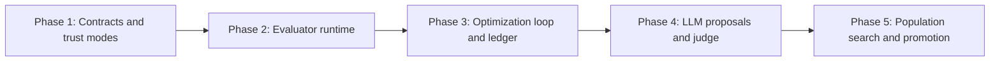

format: csm-grill/1

# Autoresearch Evaluator CSM Approach

- Idea slug: autoresearch-evaluator-csm
- Date: 2026-08-23
- Status: agreed

## How To Execute

Paste each phase brief below into its own explicit csm-plan invocation. This document authorizes nothing by itself. No implementation or csm-plan session has started.

## Idea Statement

Create a first-class CSM skill that orchestrates LLM-guided hill climbing over declared functions or evolution regions. It will support registered callables, trusted local source, and arbitrary generated source through explicit privilege tiers; use a separate evaluator runtime; evaluate deterministic metrics and optional LLM qualitative judgments; persist complete trial provenance; support target and hill-climb modes; and require approval before protected promotion.

The skill will begin with one incumbent and bounded diffs. It may generate up to a configurable maximum of 50 mutation hypotheses per round, subject to diversity, deduplication, deterministic screening, judge safeguards, hidden validation, and human review rules. Population search is a later capability activated only after measured stagnation or a demonstrated diversity need.

## Decisions Log

| Question | Answer | Rationale |
| -------- | ------ | --------- |
| Candidate trust modes | Support all three modes | The skill must cover registered functions, trusted local source, and generated source, but with different privileges. |
| Privilege model | Explicit privilege tiers | Generated source must not be treated like a registered callable. |
| Mutation boundary | Declared callable or evolution region | Evaluators, tests, dependencies, policy, credentials, and unrelated files stay read-only. |
| Evaluator class | Deterministic numeric unattended metrics with hard gates | Scalar metrics need validity, regression, and safety gates. |
| LLM proposals | Enabled | The LLM supplies hypotheses and diffs, while programmatic checks remain authoritative for hard failures. |
| Proposal budget | Up to configurable 50 hypotheses per round | The ceiling supports exploration without requiring a large batch every round. |
| LLM judge | Enabled as advisory qualitative/behavioral evaluator | Judge scores cannot override deterministic failures; disagreement routes to review. |
| Persistence | Append-only ledger and optional archive | Complete provenance is required for reproducibility, audit, rollback, and learning from failures. |
| Runtime architecture | CSM orchestrator plus separate evaluator helper | Candidate execution, scoring, and sandbox policy must remain outside the LLM orchestration boundary. |
| Optimization modes | Target and hill-climb | Users need both threshold stopping and incumbent improvement. |
| Promotion | Human approval for protected changes | Isolated trials may be unattended; repository-visible or production promotion may not be. |
| Population search | Staged after stagnation | Avoid premature complexity and preserve the simple ratchet as the default. |

## Research Synthesis

The existing autoresearch finding establishes the generate-evaluate-select pattern, immutable evaluator boundary, fixed budgets, diffs, validation partitions, archives, and reward-hacking risks: `.agents/research/2026-08-23-llm-hill-climbing-autoresearch-skill-research.md`.

The evaluator-harness additions support explicit execution outcomes, calibration and repeated measurement, raw observations, uncertainty-aware comparisons, dev/hidden test separation, property-based checks, and defense-in-depth execution. They also distinguish documented facts from derived policies and leave exact statistical policies workload-dependent.

The focused LLM-judge research adds these constraints:

- Treat 50 as a ceiling, not a mandatory batch size.
- Generate across proposal families and deduplicate before evaluation.
- Run deterministic screening before invoking judges.
- Blind candidate identity, proposer rationale, and generation order.
- Prefer ordinal or pairwise judging over precise-looking scores.
- Use multiple judge passes for finalists and calibrate against labeled cases.
- Treat judge disagreement and low confidence as review triggers.
- Never allow an LLM judge to override deterministic hard failures.

The repository scout found that the skill must follow existing CSM conventions: explicit interface and never-invoke boundaries, a cyclic journaled state machine, dated artifacts, registration in suite contracts, bootstrap payload registration, generated README updates, and independent review. The existing deferred `DEF-EVAL` record means live-LLM behavioral evaluation must remain a deliberate, separately approved capability rather than being silently assumed complete.

## Phasing

```text
[1. Contracts and trust modes]
              |
              v
[2. Evaluator runtime]
              |
              v
[3. Optimization loop and ledger]
              |
              v
[4. LLM proposals and judge]
              |
              v
[5. Population search and promotion]
```



## Phase Briefs

### Phase 1: Contracts And Trust Modes

- Goal: Define the CSM skill interface and explicit privilege boundaries.
- Deliverables: Registered-function, trusted-source, and generated-source contracts; metric and target schemas; mutation allowlists; approval rules; artifact and journal shape.
- Scope: Function identity, source hashes, metric direction and units, target modes, budgets, hard gates, trust profiles, and fail-closed behavior.
- Out of scope: Unrestricted repository mutation, evaluator evolution, and deployment automation.
- Constraints: Generated source is hostile by default; evaluator code, fixtures, tests, policy, and credentials are immutable from candidates.
- Acceptance hints: Invalid contracts fail closed; each mode has distinct permissions, provenance, approval, and runtime requirements; the interface is agent-agnostic and installable.
- Dependencies: None.
- Context: Existing research finding, especially Detail Sections 4, 5, 8, and Recommendation; repository contracts in `scripts/lib/contracts.mjs`.

### Phase 2: Evaluator Runtime

- Goal: Execute candidates independently from the CSM and evaluator authority.
- Deliverables: Structured evaluator protocol; validity and execution statuses; calibration, warmup, measurement, raw-sample, and uncertainty pipeline; sandbox policy; external audit record.
- Scope: All three trust modes, timeouts, process cleanup, resource limits, input/output protocol, metric collection, hidden-test access policy, and environment provenance.
- Out of scope: LLM judging, population search, and automatic protected promotion.
- Constraints: Candidates cannot access private tests, reference answers, scorer code, clocks, credentials, or audit storage; containers or VMs are threat-model-dependent rather than universal guarantees.
- Acceptance hints: Deterministic hard failures reject; timeouts and policy violations are explicit; raw observations and provenance persist; evaluator tampering is detected or structurally prevented in the selected threat model.
- Dependencies: Phase 1.
- Context: Evaluator-harness research sections 8-12; HumanEval, pytest-benchmark, pyperf, Docker, and METR references R9-R17.

### Phase 3: Optimization Loop And Ledger

- Goal: Implement baseline, mutation, evaluation, keep/reject, quarantine, resume, and stopping lifecycle.
- Deliverables: Target mode; hill-climb mode; baseline comparison; bounded-diff application; trial ledger; retry/quarantine rules; held-out validation; cost/time budgets; resumable state.
- Scope: One incumbent, one bounded mutation per candidate, deterministic screening, candidate lineage, raw observations, uncertainty, failure recording, and human promotion handoff.
- Out of scope: LLM judge, large proposal populations, islands, and evaluator self-modification.
- Constraints: Evaluator-owned acceptance; no silent retries, exclusions, or score manipulation; no changes outside declared mutation paths.
- Acceptance hints: Every trial records hypothesis, parent, patch/hash, evaluator/environment hashes, metrics, uncertainty, failures, retries, and decision; target and hill-climb stopping rules are explicit.
- Dependencies: Phases 1 and 2.
- Context: Autoresearch loop and evaluator statistical decision research; reuse repository ledger and determinism conventions from `csm-make-tests`.

### Phase 4: LLM Proposals And Judge

- Goal: Add configurable multi-proposal generation and qualitative behavioral evaluation without weakening deterministic gates.
- Deliverables: Proposal families; configurable maximum of 50 candidates; semantic deduplication; deterministic pre-filtering; structured LLM judge; judge ensemble; calibration set; disagreement and human-review routing.
- Scope: LLM-generated hypotheses, bounded diffs, expected benefit and failure-mode statements, ordinal/pairwise rubrics, confidence, evidence requirements, judge identity, and model/prompt versioning.
- Out of scope: LLM judge authority over hard failures, unrestricted judge tools, and uncalibrated human-quality claims presented as objective metrics.
- Constraints: Blind candidate identity, proposer rationale, and generation order; judge cannot edit or inspect protected evaluator assets; judge results are advisory unless a separately calibrated subjective metric is explicitly approved.
- Acceptance hints: Hard failures always reject; judge disagreement triggers review; judge quality is measured against labeled calibration cases; false accepts are tracked separately from false rejects; suspicious gains are investigated under a predeclared anomaly policy.
- Dependencies: Phases 1-3.
- Context: GEPA material in R5, evaluator-gaming research, and focused LLM-judge deep-dive evidence; existing `DEF-EVAL` remains an explicit boundary.

### Phase 5: Population Search And Promotion

- Goal: Add archives and broader search only after measured stagnation, then safely promote approved candidates.
- Deliverables: Bounded candidate archive; lineage; Pareto or behavior-category retention; optional islands and migration; stagnation detection; final validation; approval and promotion workflow.
- Scope: Diversity policy, archive limits, parent selection, promotion records, final hidden tests, diff review, rollback identity, and protected repository handoff.
- Out of scope: Automatic evaluator co-evolution, unrestricted self-modification, and autonomous production deployment.
- Constraints: Population features activate only under configured conditions; hidden validation, hard gates, anomaly review, and human approval remain mandatory.
- Acceptance hints: Archives preserve meaningful behavior diversity; population features do not bypass deterministic gates; every promoted candidate has complete provenance and passes final validation; rollback is unambiguous.
- Dependencies: Phases 1-4.
- Context: FunSearch, AlphaEvolve, GEPA, and the original autoresearch research; repository worktree and bootstrap conventions.

## Open Questions And Rejected Options

Open questions intentionally deferred to future csm-plan work:

- Exact sandbox implementation for generated source: container, VM, or microVM based on threat model and deployment environment.
- Workload-specific statistical estimator, sample count, sequential stopping rule, and multiple-comparison policy.
- Exact LLM judge ensemble size, model diversity, calibration cadence, and human-review threshold.
- Whether trusted local source can share the registered-function runtime or needs a separate helper boundary.
- Which repository-visible artifacts should be promoted automatically after human approval.

Rejected options:

- Treating all trust modes identically: rejected because generated source has materially different security and approval requirements.
- Allowing unrestricted repository self-modification: rejected because it expands evaluator, test, dependency, policy, and provenance attack surfaces.
- Using an LLM judge as the sole acceptance authority: rejected because judge bias, objective-correctness failures, and evaluator gaming remain possible.
- Requiring 50 proposals every round: rejected because it wastes evaluation budget and increases correlated or duplicate proposals.
- Enabling population search from the first trial: rejected because the simple incumbent ratchet is easier to validate and archive complexity is not universally justified.
- Starting implementation directly from this approach: rejected by the CSM boundary; each phase requires its own explicit csm-plan invocation.
