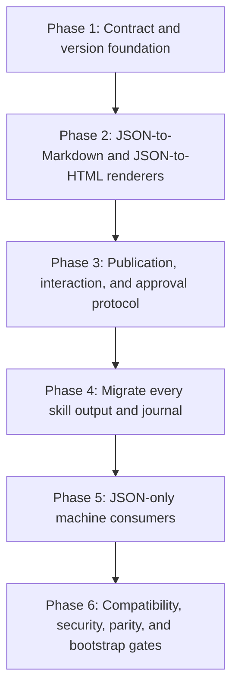

format: csm-grill/1

# JSON-Only Rendered Skill Outputs Approach

- Idea slug: json-only-rendered-skill-outputs
- Date: 2026-08-25
- Status: agreed

## How To Execute

Paste each phase brief below into its own explicit csm-plan invocation. This document authorizes nothing by itself. The phases are one coordinated approach; implementation must preserve their dependency order unless a later plan proves an equivalent ordering.

## Idea Statement

Make every durable skill output, journal, manifest, and inter-stage handoff a validated JSON artifact with JSON Schema Draft 2020-12 as the default contract language. JSON is the sole stored source and the only machine-consumable format. Build deterministic JSON-to-Markdown and JSON-to-HTML renderers first, then migrate every skill and consumer to JSON. In interactive human sessions, explicit or inferred human sharing defaults to transient Markdown; non-interactive or unknown sessions remain JSON-only unless rendering is explicitly requested. Rendered projections are separate, disposable, provenance-linked, and never authoritative or machine-consumable.

## Decisions Log

| Question | Answer | Rationale |
| -------- | ------ | --------- |
| What does JSON-only cover? | Durable outputs, handoffs, journals, manifests, and machine inputs; instruction files may remain Markdown. | Preserve skill instruction usability while enforcing typed data at every data boundary. |
| What happens before renderers exist? | Build renderers first; renderer work and the JSON migration remain one coordinated implementation approach. | Users need a supported human presentation path before the migration removes Markdown authority. |
| How are existing Markdown artifacts handled? | Preserve as read-only history; do not auto-convert ambiguous documents. | Avoid inventing data or changing historical ownership. |
| Where do schemas live? | One canonical schema source with generated or verified bootstrap copies. | Prevent independently edited schema drift. |
| What contract shape is used? | Shared protocol envelope plus skill-specific payload schemas. | Reuse stable protocol fields without creating an unbounded universal document schema. |
| How is compatibility handled? | Immutable schema versions, compatibility registry, producer/consumer matrix, replay fixtures, and mandatory adapters for incompatibilities. | Old artifacts and consumers must remain readable; breaking changes must fail gates rather than happen silently. |
| Where are projections stored? | Nowhere by default; if required, use a separate disposable digest-keyed export namespace. | Prevent projections from becoming alternate sources of truth or discovered inputs. |
| How are renderers built? | Repository-owned schema/profile-aware JSON-to-Markdown and JSON-to-HTML renderers; libraries only for low-level safety primitives. | Preserve skill-specific semantics and control deterministic output and security boundaries. |
| When does rendering occur? | Explicit sharing requests; interactive human sessions default to Markdown, non-interactive and unknown sessions default to JSON-only. | Human convenience must not weaken machine protocol safety. |
| What does approval apply to? | The source JSON artifact and its schema, renderer, and profile digests. | A projection is invalid when its source or rendering contract changes. |
| Are all skills in scope? | Yes, including csm-grill, scan, plan, review, research, DDD, BDD/TDD, tests, build, browse, upload, and autoresearch. | Partial migration would leave incompatible Markdown handoff paths. |

## Research Synthesis

The cited research recommends JSON Schema Draft 2020-12, immutable `$id` identities, `$defs`/`$ref` reuse, explicit discriminators, boundary validation, and structured diagnostics. It distinguishes schema documentation from payload rendering: `jsonschema2md` and `json-schema-for-humans` may document schemas but are not sufficient as the suite's report renderers. Markdown should use a pinned CommonMark subset and never be parsed as a machine contract. HTML requires escaping, URL restrictions, sanitization, CSP, and WCAG checks.

The existing repository is Markdown-first across scan, plan, review, research, tests, BDD/TDD, and build. DDD and autoresearch already contain the strongest JSON contracts. Journals, ownership rules, and resume cursors are still primarily expressed in Markdown. Bootstrap contains duplicated skill and schema families, creating a synchronization risk.

The selected architecture is:

```text
validated JSON artifact
        |
        +--> machine consumer: JSON only
        |
        +--> optional JSON -> Markdown renderer -> transient human share
        |
        +--> optional JSON -> HTML renderer -> transient/published human share
```

Rejected alternatives:

- Dual-writing JSON plus Markdown as durable sources: rejected because it creates divergence and ambiguous authority.
- Markdown-to-HTML as the main HTML path: rejected because it adds parser/security coupling and makes Markdown semantics part of HTML correctness.
- Generic JSON Schema documentation generators as report renderers: rejected because they document schemas rather than render skill result instances.
- Automatic conversion of all legacy Markdown: rejected because existing prose and embedded state may be ambiguous or lossy.
- A single universal payload schema: rejected because skill domains differ materially; use a shared envelope and typed payloads.
- Direct compatibility guarantees for every possible future semantic change: rejected as unenforceable; use immutable versions, compatibility gates, replay, and explicit adapters.

Primary evidence: `.agents/research/2026-08-25-typed-json-interstage-payloads-research.md`, especially its Recommendation, renderer, migration, security, and compatibility sections. Local handoff evidence includes `csm-scan/SKILL.md`, `csm-plan/SKILL.md`, `csm-review/SKILL.md`, `csm-deep-research/SKILL.md`, `csm-ddd/SKILL.md`, and `csm-autoresearch/SKILL.md`.

## Phasing

```text
[1 Contract and version foundation]
              |
              v
[2 JSON-to-Markdown and JSON-to-HTML renderers]
              |
              v
[3 Publication, interaction, and approval protocol]
              |
              v
[4 Migrate all skill outputs, journals, and manifests]
              |
              v
[5 Switch all machine consumers to JSON-only]
              |
              v
[6 Compatibility, security, parity, and bootstrap gates]
```



## Phase Briefs

### Phase 1: Contract And Version Foundation

- Goal: Establish the shared JSON protocol and mature compatibility model that all later skill migrations and renderers use.
- Deliverables: Shared envelope schemas; run, status, journal-event, artifact, evidence, reference, provenance, error, cross-reference, render-profile, projection-descriptor, and approval schemas; immutable schema IDs and revisions; registry; compatibility matrix; adapter policy; canonical schema source and bootstrap synchronization mechanism.
- Scope: JSON Schema Draft 2020-12 contracts, schema identity, versioning, lifecycle, ownership, provenance, digests, unknown-field policy, compatibility rules, and validation diagnostics.
- Out of scope: Skill-specific migration, renderer implementation, legacy Markdown conversion, and user-facing publication.
- Constraints: Old schema versions remain readable; breaking changes require adapters or explicit migration contracts; no mutable schema identity; no independently maintained bootstrap schemas.
- Acceptance hints: Schema registry resolves immutable versions; compatibility gates classify changes; old fixtures validate; incompatible pairs fail without an adapter; bootstrap copies are reproducibly synchronized.
- Dependencies: None.
- Context: `.agents/research/2026-08-25-typed-json-interstage-payloads-research.md`; `schemas/csm-trace.schema.json`; `schemas/verification-status.schema.json`; `schemas/csm-skill-manifest.schema.json`.

### Phase 2: JSON-To-Markdown And JSON-To-HTML Renderers

- Goal: Provide deterministic, safe, schema/profile-aware human projections before Markdown authority is removed from the skills.
- Deliverables: JSON-to-Markdown renderer; JSON-to-HTML renderer; typed intermediate render model or AST; versioned render profiles; renderer manifests; projection metadata; golden fixtures; deterministic output tests; security and accessibility test fixtures.
- Scope: Validated JSON input, profile resolution, field selection, labels, ordering, headings, lists, tables, code blocks, links, HTML AST construction, escaping, URL policy, sanitization, CSP requirements, WCAG checks, and source/projection digests.
- Out of scope: Changing skill payload schemas, consuming Markdown, Markdown-to-HTML conversion, automatic legacy migration, or storing projections beside canonical JSON.
- Constraints: HTML renders directly from JSON; raw HTML and executable content are disallowed; unknown profiles fail closed; renderers never mutate source JSON; output is marked `untrusted-presentation`.
- Acceptance hints: Same JSON plus same schema/profile/renderer versions produces byte-identical output; changed JSON changes the projection; unsafe text and URLs are escaped or rejected; HTML contains no executable inline content; projections identify source and renderer digests.
- Dependencies: Phase 1.
- Context: Research finding renderer sections and references R10-R17; `csm-ddd/lib/ddd/render.mjs`; `csm-scan/lib/scan/cross-repo/render.mjs`.

### Phase 3: Publication, Interaction, And Approval Protocol

- Goal: Define when projections are generated, shown, shared, retained, invalidated, and approved without making them machine artifacts.
- Deliverables: Explicit share request schema; `interactionMode` context; publication API; transient export/cache policy; projection registry; retention and cleanup behavior; approval records bound to source JSON and all relevant digests.
- Scope: `share: none|markdown|html|both`; interactive terminal defaults; non-interactive and unknown-mode behavior; destination handling; export namespace; source/projection provenance; approval invalidation.
- Out of scope: Migrating individual skills or converting legacy reports.
- Constraints: Interactive human sessions may default to Markdown; non-interactive and unknown sessions default to JSON-only; HTML requires explicit request or destination need; machine readers never discover projections.
- Acceptance hints: Interactive “show output” returns transient Markdown; non-interactive runs return JSON unless explicitly rendered; approval fails after source/schema/renderer/profile change; export cache cannot satisfy a machine artifact lookup.
- Dependencies: Phases 1 and 2.
- Context: Existing csm-grill interaction and output rules; research finding Recommendation and renderer sections.

### Phase 4: Migrate Every Skill Output, Journal, And Manifest

- Goal: Convert every in-scope skill's authoritative durable output and state to typed JSON while preserving legacy Markdown as read-only history.
- Deliverables: Skill payload schemas and JSON writers/readers for csm-grill, csm-scan, csm-plan, csm-review, csm-review-python, csm-deep-research, csm-ddd, csm-bdd-tdd, csm-make-tests, csm-build, csm-browse, csm-upload, and csm-autoresearch; JSON journals; JSON manifests; typed evidence and cross-references; legacy-history handling.
- Scope: Output artifacts, state transitions, resume cursors, ownership/collision records, evidence, findings, plans, research, reports, test packages, DDD pairs, browser sessions, upload publication records, and delegated-run lineage.
- Out of scope: Deleting or rewriting legacy Markdown; making projections authoritative; changing the skill instruction source format during this phase.
- Constraints: No ambiguous Markdown auto-conversion; every new artifact has immutable identity and schema revision; parent skills cannot take ownership of delegated artifacts; all payloads validate before persistence.
- Acceptance hints: New runs persist JSON only; resume works from JSON state; legacy Markdown is not a discovery candidate; all artifact relations resolve; each skill has a declared payload schema and migration status.
- Dependencies: Phases 1-3.
- Context: Existing skill handoff inventory in `.agents/research/2026-08-25-typed-json-interstage-payloads-research.md`; current skill files under `csm-*/SKILL.md` and `bootstrap/package/payload/skills/csm-*/SKILL.md`.

### Phase 5: JSON-Only Machine Consumers

- Goal: Cut downstream skills over to validated JSON and make Markdown/HTML machine consumption impossible.
- Deliverables: JSON-only input resolution; schema/version negotiation; adapter dispatch; Markdown/HTML rejection guard; JSON artifact discovery; csm-plan, csm-build, csm-bdd-tdd, csm-review, csm-grill, csm-make-tests, and other consumer cutovers.
- Scope: All inter-skill and intra-pipeline reads, delegated handoffs, artifact discovery, resume, validation, and error behavior.
- Out of scope: Removing read-only legacy history or forcing users to view JSON in interactive sessions.
- Constraints: Machine consumers accept only typed JSON or approved JSONL; unknown schema versions fail closed; adapters are explicit and provenance-linked; projections are never fallback inputs.
- Acceptance hints: A Markdown file with valid-looking content is rejected as a machine input; old supported JSON versions replay successfully; unsupported versions produce structured errors; every consumer records the exact source artifact and schema revision.
- Dependencies: Phase 4.
- Context: `csm-plan/SKILL.md`; `csm-build/SKILL.md`; `csm-bdd-tdd/SKILL.md`; `csm-review/SKILL.md`; `csm-deep-research/SKILL.md`.

### Phase 6: Compatibility, Security, Parity, And Bootstrap Gates

- Goal: Prove the suite remains compatible, secure, deterministic, and synchronized across canonical and bootstrap distributions.
- Deliverables: Compatibility CI; schema-diff policy; replay matrix; adapter tests; renderer golden tests; projection parity tests; redaction and injection tests; URL/CSP/WCAG checks; stale projection tests; bootstrap drift gate; legacy-history regression tests.
- Scope: All schema versions, supported producers and consumers, renderer/profile revisions, projection storage, security boundaries, accessibility, and duplicate distribution trees.
- Out of scope: New feature work unrelated to the JSON/projection architecture.
- Constraints: Incompatible changes fail the gate without an adapter; source JSON remains the only approval target; no projection may become discoverable as a stage artifact; no secret or personal data may enter durable JSON or projections.
- Acceptance hints: CI proves old/new compatibility where promised, rejects unsupported changes, verifies deterministic output, catches unsafe HTML, confirms projection invalidation, and reports canonical/bootstrap drift.
- Dependencies: Phases 1-5.
- Context: Existing repository gates; `schemas/verification-status.schema.json`; `csm-autoresearch/schemas/`; `csm-ddd/schemas/`; research finding security and compatibility sections.

## Open Questions And Rejected Options

Open questions for future csm-plan work:

- Which JSON Schema validator and canonical JSON serialization implementation should be standardized after a repository benchmark?
- Which transient export root and retention duration satisfy local operational and privacy constraints?
- Which exact CommonMark subset and HTML element/attribute allowlist should the render profiles permit?
- Which approved URL destinations and image/media policies are required by the upload and browser-facing paths?
- Which existing Markdown artifacts can be losslessly reconstructed, if any, after the JSON schemas are finalized?

Rejected options:

- Markdown and JSON as co-equal durable sources: creates drift and ambiguous authority.
- Markdown-to-HTML as the HTML renderer: adds parser and security coupling.
- Generic schema documentation tools as report renderers: they describe schemas rather than skill result instances.
- Automatic conversion of all legacy Markdown: risks lossy or invented data.
- One universal payload schema: obscures domain-specific invariants.
- Direct promise of compatibility with every future semantic change: use immutable versions, adapters, compatibility tests, and explicit migration instead.
