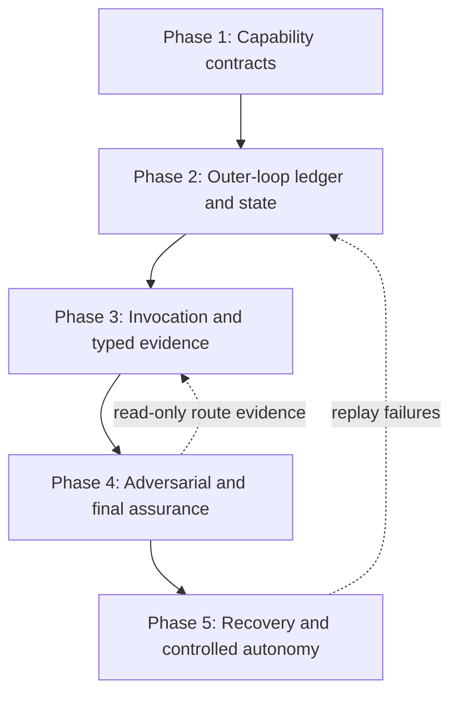

format: csm-grill/1

# csm-orchestrate Approach

- Idea slug: csm-orchestrate
- Date: 2026-08-26
- Status: agreed

## How To Execute

Paste each phase brief below into its own explicit `csm-plan` invocation. This document authorizes nothing by itself. Phases must remain separately approved and independently verified.

## Idea Statement

Build `csm-orchestrate` as an active CSM outer-loop controller that can invoke and coordinate all repository skills to deliver a user outcome. It owns outcome requirements, conditional routing, child-run correlation, evidence reconciliation, adversarial review coordination, technical and functional acceptance, bounded remediation, checkpointed recovery, and the final receipt. Existing skills retain their domain logic, artifacts, internal lifecycles, and side-effect authority.

The controller must support automatic invocation of skills only behind declared capability contracts, scoped approvals, typed artifacts, host-enforced permissions, idempotency, replay tests, and bounded recovery. Consequential actions require explicit approval. Final review is mandatory for every completed orchestration.

When the controller receives an approach from `csm-grill` or an equivalent source, it treats the approach phases as runtime delivery phases. It does not execute the approach as one monolithic plan. It compiles each phase into a thin slice with an outcome, scoped route, acceptance signals, required evidence, allowed side effects, and checkpoint. The next phase is locked until the current slice passes technical validation, functional validation, adversarial acceptance review, and the mandatory final review.

## Decisions Log

| Question | Answer | Rationale |
| -------- | ------ | --------- |
| Should the outer loop invoke and control all skills? | Yes, conditionally. | The orchestrator is a cross-skill controller, not a single fixed pipeline. |
| Should side effects be automatic? | No. Read-only work may be automated; mutation, commits, credentials, browser actions, publication, destructive actions, and promotion require approval. | Prevents an outer loop from turning delegated skills into an unbounded mutation chain. |
| Should all skills be registered? | Yes, with conditional route selection. | Every skill is available to the controller, but irrelevant or unsafe nodes are not invoked. |
| Who owns child artifacts? | The producing skill. | The orchestrator stores references, digests, and validation results, never replacements. |
| What is the run identity model? | One parent `run-...` ID and distinct correlated child IDs. | Enables lineage, retry, checkpoint, and stale-result detection. |
| Is an acceptance ledger required? | Yes, before delegation. | A returned child result is not proof that the user outcome was fulfilled. |
| Is adversarial review required? | Yes for every material delegated output, with risk-based depth. | Fresh review must attack omissions, unsupported claims, evidence, tool actions, and false completion. |
| Is final review mandatory? | Yes, for every completed orchestration. | It confirms the built result is functionally faithful and technically sound. |
| What happens when final review fails? | Identify gaps, route back to the responsible skill, remediate within budget, re-run gates, and repeat final review. | Prevents false completion and indefinite loops. |
| What is the acceptance status model? | `VERIFIED`, `INCOMPLETE`, `BLOCKED`, `FAILED`, `REFUSED`, and `REQUIRES_REVIEW`. | Separates success, missing evidence, policy stops, and defects. |
| What does one-shot accuracy mean? | One user request receives a durable, auditable disposition; it need not be one model turn. | Existing skills include interactive and multi-stage lifecycles. |
| What evidence is required for critical requirements? | Deterministic technical evidence, functional scenario evidence, or documented human acceptance; otherwise failed, blocked, incomplete, or explicitly waived. | Narrative claims alone cannot satisfy acceptance. |
| How should long-horizon work run? | Checkpoint every meaningful transition, bound retries, preserve next safe transition, and resume only from validated state. | Prevents lost context and duplicate side effects. |
| When is parallelism allowed? | Independent read-only nodes only at first; dependent handoffs and shared mutation remain ordered. | Avoids races and invalid artifact lineage. |
| How should an incoming approach be executed? | Compile its phases into a runtime phase graph and execute one thin, independently accepted slice at a time. | Makes long-horizon delivery incremental and prevents the outer loop from treating an entire approach as one oversized task. |
| Can final review create additional work? | Yes. Final review may create a new bounded phase for an uncovered requirement or remediation gap, subject to the retry/remediation budget. | The outer loop must close newly discovered gaps without falsely forcing them into an existing phase. |
| What is the authoritative incoming approach format? | Prefer the registered canonical JSON approach artifact; accept Markdown only through an explicit, validated projection adapter. | Prevents the phase compiler from scraping mutable or presentation-only text. |
| How are inserted phases identified and ordered? | Use immutable `phaseId`, `parentPhaseId`, `insertedAfter`, `requirementDelta`, and route-graph revision fields; reject cycles and duplicate phase identities. | Final review must be able to add work without corrupting long-horizon ordering or replay. |
| What must a child invocation prove? | A host invocation receipt bound to parent/child IDs, phase/edge, input/output digests, permissions, approval, timeout, status, and failure class. | Child completion narratives cannot establish execution or outcome correctness. |
| How are approvals enforced? | Bind approvals to route edge, child run, phase, exact scope, artifact digest, approver, expiry, consumption, and revocation; host enforcement is authoritative. | Prevents approval reuse after scope or artifact changes. |

## Research Synthesis

The consolidated research found that the repository already separates `csm-grill`, `csm-deep-research`, `csm-scan`, `csm-ddd`, `csm-plan`, `csm-make-tests`, `csm-bdd-tdd`, `csm-build`, `csm-review`, `csm-review-python`, `csm-browse`, `csm-upload`, and `csm-autoresearch`. Their contracts are not uniform: run IDs, artifact paths, terminal states, approval semantics, and recovery behavior differ. The orchestrator must normalize these differences through adapters and route-specific policy rather than flattening every skill into one lifecycle.

The repository’s JSON registry, artifact resolver, compatibility runtime, edge inventory, verification statuses, producer descriptors, and durable artifact rules are the correct substrate for typed coordination. Existing research also establishes that Markdown projections must never become machine-authoritative handoffs, and that final outcome quality cannot be inferred from child completion or unit-test success alone.

The assurance model is:

```text
exact ask -> atomic requirement ledger -> conditional route
    -> approval/prerequisite check -> child invocation
    -> typed artifact + receipt validation
    -> requirement/evidence reconciliation
    -> technical gates -> functional scenarios
    -> independent adversarial review
    -> final outcome review
    -> accept | remediate | block | incomplete | fail
```

The primary rejected design is an unrestricted autonomous agent loop. It would duplicate sibling lifecycles, obscure ownership, create unsafe retries, and make “all subagents returned” look like “the outcome is correct.” The accepted design is an outer control plane whose authority is explicit, narrow, receipt-based, and bounded.

The approach phases below describe how the `csm-orchestrate` capability is built. Once available, its runtime consumes an external approach as a phase graph:

```text
approach phase -> thin-slice contract -> selected skill route
      ^                  |                     |
      |                  v                     v
next phase <- final review <- technical + functional + adversarial gates
     ^             |
     +-- new remediation phase
```

Each runtime phase may re-plan only its own unresolved gap. A phase may produce a partial but useful increment, but it may not advance as complete without its acceptance evidence. Phase-level progress is durable and separate from child-skill progress. Final review may append or insert a new phase when it discovers an uncovered requirement, failed acceptance signal, technical defect, functional gap, or required remediation. The new phase receives its own thin-slice contract and must pass the same gates before final review runs again.

The phase compiler must consume a canonical, registered approach artifact. Markdown is a human projection and may only be accepted through an explicit adapter that validates its source identity and digest. Every runtime phase receives an immutable `phaseId`, parentage, graph revision, insertion position, requirement delta, and bounded remediation budget. The compiler rejects cycles, duplicate phase IDs, missing route contracts, and phase dependencies that would repeat an already executed non-idempotent effect.

## Phasing

```text
[1 Capability Contracts]
          |
          v
[2 Outer-Loop Ledger + State]
          |
          v
[3 Invocation + Typed Evidence]
          |
          v
[4 Adversarial + Final Assurance]
          |
          v
[5 Long-Horizon Recovery + Controlled Autonomy]
```



## Phase Briefs

### Phase 1: Capability Contracts

- Goal: Define the machine-readable capability and route metadata needed to select and govern every repository skill.
- Deliverables: Versioned capability manifest; route-edge policy; adapters or references to producer descriptors, schema registry, compatibility matrix, and edge inventory; normalized `run-...` identity rules.
- Scope: Inputs, outputs, schemas, activation predicates, permissions, side effects, approvals, retryability, idempotency, recovery, parallelism, review level, and terminal statuses for all skills.
- Out of scope: Invoking skills, changing sibling skill behavior, implementing domain logic, or enabling production side effects.
- Constraints: Producer skills retain artifact ownership; metadata is not authorization; missing or contradictory capability data fails closed.
- Acceptance hints: Every skill has a resolved descriptor; every route edge identifies source/consumer schemas, owner, digest, side effects, approval class, retry policy, and recovery semantics; run-ID and path conflicts are explicit adapters or resolved policy.
- Acceptance hints: Every skill has a resolved descriptor; every route edge identifies source/consumer schemas, owner, digest, side effects, approval class, retry policy, recovery semantics, and invocation mode; the capability manifest is registered, versioned, and validated against the authoritative skill descriptors.
- Dependencies: Existing `schemas/registry.json`, `csm-edge-inventory`, producer descriptors, `.agents/README.md`, and all skill `SKILL.md` contracts.
- Context: `.agents/research/2026-08-26-csm-orchestrate-adversarial-assurance-20260826t200041z-a1b2c3d4e5f6-research.json`; `.agents/research/2026-08-26-csm-orchestrate-skill-architecture-20260826t180032z-a1b2c3d4e5f6-research.json`.
- Runtime role: Enables the outer loop to compile each incoming approach phase into a bounded route node without assuming every phase maps to one skill.

### Phase 2: Outer-Loop Ledger And State

- Goal: Define the parent CSM lifecycle and requirement-ledger model for controlling an end-to-end outcome.
- Deliverables: Orchestration state machine; acceptance-ledger schema; parent/child lineage model; checkpoint and status model; orchestration receipt schema.
- Deliverables: `csm-orchestrate-phase/1`, `csm-orchestrate-requirement/1`, `csm-orchestrate-cursor/1`, and `csm-orchestrate-receipt/1` contracts, all registered with compatibility rules.
- Scope: `INTAKE`, requirements, triage, route, approval, handoff, receipt collection, validation, review, remediation, checkpoint, recovery, and terminal outcomes.
- Out of scope: Child skill internal states, domain-specific test/review logic, automatic side-effect execution, or unlimited planning loops.
- Constraints: Critical requirements require concrete evidence or explicit user waiver; `INCOMPLETE` and `BLOCKED` cannot advance as success; final review is mandatory.
- Acceptance hints: Omitted requirements are detected; each requirement maps to an observable signal; child run and artifact lineage are preserved; final receipt cannot be verified with unresolved critical rows.
- Acceptance hints: Omitted requirements are detected; every critical requirement maps to one or more evidence references and a typed status; phase insertion preserves graph ordering and parentage; final receipt cannot be verified with unresolved critical rows.
- Dependencies: Phase 1 capability contracts; existing verification-status and final-receipt schemas; lifecycle rules in `csm-deep-research`, `csm-build`, `csm-review`, and `csm-autoresearch`.
- Context: `.agents/research/2026-08-26-csm-orchestrate-adversarial-assurance-20260826t200041z-a1b2c3d4e5f6-research.json`, sections `keyFindings`, `detailSections`, and `recommendation`.
- Runtime role: Creates one acceptance-ledger slice per incoming approach phase and prevents later phases from executing until the current ledger slice is accepted.

### Phase 3: Invocation And Typed Evidence

- Goal: Enable the outer loop to invoke or hand off to skills through validated, observable, bounded interfaces.
- Deliverables: Host invocation contract; child-run correlation; typed input/output adapters; artifact resolver integration; approval consumption; invocation and receipt event model.
- Deliverables: `csm-orchestrate-invocation/1` contract covering parent/child IDs, phase/edge, skill digest, input/output artifacts, permissions, approval, timeout, cancellation, retry key, failure taxonomy, and receipt schema.
- Scope: Read-only and approved side-effect invocation, timeout/transport handling, canonical JSON references, schema/ownership/digest/compatibility validation, and child receipt capture.
- Out of scope: Rewriting child artifacts, replacing child lifecycles, implicit invocation of every skill, or bypassing human approvals.
- Constraints: Use `run-...` IDs; preserve producer ownership; reject projections, stale artifacts, unknown revisions, missing evidence, and unauthorized effects; default external effects to denied.
- Acceptance hints: Valid child artifacts advance; wrong owner, stale digest, incompatible revision, malformed payload, and missing approval block; transport failure is distinct from child failure; duplicate terminal replay is rejected or safely recognized.
- Acceptance hints: Valid child artifacts advance only after receipt and evidence checks; approval is edge- and digest-bound; transport, child, policy, timeout, evaluator, and incomplete-evidence failures remain distinct; duplicate terminal replay is rejected or safely recognized.
- Dependencies: Phases 1-2; shared schema runtime, compatibility runtime, artifact resolver, publication protocol, and existing skill entry contracts.
- Context: `lib/artifact-resolver/index.mjs`, `lib/compatibility-runtime/index.mjs`, `schemas/csm-envelope.schema.json`, `schemas/csm-edge-inventory.schema.json`.
- Runtime role: Executes the selected route for the current approach phase, captures child receipts, and returns a bounded increment rather than attempting the whole approach.

### Phase 4: Adversarial And Final Assurance

- Goal: Ensure delegated skills delivered the user’s ask and that the final result is both functionally correct and technically sound.
- Deliverables: Fresh-context adversarial reviewer; requirement/evidence entailment checks; technical gate aggregator; functional scenario runner; final-review policy; bounded remediation loop.
- Scope: Review each material child output for missing requirements, unsupported claims, citation mismatch, hidden assumptions, scope creep, stale/duplicate artifacts, unsafe tool actions, and false completion; run technical and functional validation separately; route gaps back to the responsible skill.
- Out of scope: Duplicating all `csm-review` dimensions, allowing a producer to judge its own output, accepting narrative completion, or infinite repair.
- Constraints: Reviewer does not receive producer rationale; high-risk work uses full `csm-review` or equivalent independent review; every completed orchestration receives final review; retries create new child identity when material state changes.
- Acceptance hints: Hidden requirements and counterexamples fail plausible outputs; technical pass cannot mask functional failure; functional plausibility cannot mask contract failure; final review failure identifies a responsible route and reopens the ledger; budget exhaustion yields `INCOMPLETE` or `FAILED`.
- Acceptance hints: Final review can create a new phase with a unique phase ID, scoped requirement delta, responsible skill route, acceptance signals, and bounded remediation budget; the phase cannot bypass technical, functional, adversarial, or final review gates.
- Acceptance hints: Final review records whether the gap belongs to an existing phase or creates a new phase; inserted phases pass cycle, dependency, approval, idempotency, technical, functional, adversarial, and final-review checks before completion is reconsidered.
- Dependencies: Phases 1-3; `csm-review`, `csm-review-python`, `csm-make-tests`, `csm-bdd-tdd`, existing evaluation traces, and final-receipt contracts.
- Context: `.agents/research/2026-08-26-csm-orchestrate-adversarial-assurance-20260826t200041z-a1b2c3d4e5f6-research.json`, sections `detailSections` and `recommendation`.
- Runtime role: Runs the acceptance loop for every thin slice and routes failed requirements back to the specific phase/skill rather than reopening the whole approach.
- Final-review role: May create a new bounded remediation phase when the gap does not belong to an existing phase; the new phase must enter the normal route, gate, checkpoint, and review cycle.

### Phase 5: Long-Horizon Recovery And Controlled Autonomy

- Goal: Make the outer loop reliable across long-running, interrupted, retried, partially completed, and selectively parallel work.
- Deliverables: Durable orchestration cursor; route replay and fault-injection suite; idempotency/compensation rules; bounded retry policy; concurrency policy; autonomy-enablement gate; redacted correlated telemetry.
- Scope: Checkpointing after each meaningful edge, resume from validated state, stale-result detection, duplicate-side-effect prevention, read-only parallel groups, human escalation, and evaluation dashboards.
- Out of scope: Unbounded autonomous operation, automatic production promotion, or claiming improved productivity without measurement.
- Constraints: Route-specific recovery overrides generic assumptions; autoresearch policy blockers remain terminal; publication, commits, credentials, browser actions, and destructive effects remain approval-gated; infrastructure failures are classified separately from agent failures.
- Acceptance hints: Interruption/retry/resume preserves lineage; non-idempotent actions are not repeated without reconciliation; independent read-only nodes can run concurrently without race; route replay catches wrong ordering, approval bypass, duplicate execution, and lost evidence; autonomy widens only after repeated evaluation improves outcomes without safety regressions.
- Acceptance hints: Interruption/retry/resume preserves phase IDs and lineage; terminal child blockers remain terminal; non-idempotent actions are not repeated without reconciliation; route replay catches cycles, wrong insertion ordering, approval bypass, duplicate execution, stale artifacts, and lost evidence; autonomy widens only after repeated evaluation improves outcomes without safety regressions.
- Dependencies: Phases 1-4; skill-specific recovery semantics; artifact digests; evaluation and trace schemas; host sandbox and approval enforcement.
- Context: `csm-autoresearch/SKILL.md`, `csm-build/SKILL.md`, `csm-deep-research/SKILL.md`, `.agents/README.md`, and the consolidated adversarial-assurance research finding.
- Runtime role: Persists the current approach phase, completed slices, open gaps, and next transition; supports bounded resume and selective parallelism across independent phases.

## Open Questions And Rejected Options

Open questions:

- What host runtime will invoke sibling skills, pass typed inputs, stream progress, and capture child receipts?
- Should the canonical parent receipt wrap existing final-receipt artifacts or introduce a dedicated orchestration schema?
- Which approval identity, expiry, scope, consumption, and revocation fields are enforceable by the host?
- Which skills can expose stable machine entrypoints without adapters, and which remain human-handoff-only?
- What minimum representative task set calibrates requirement coverage, technical correctness, functional correctness, adversarial review, recovery, latency, cost, and human correction?
- Which route edges are genuinely idempotent, compensatable, or permanently non-retryable?
- What level of adversarial review is mandatory for each risk class, and how will reviewer independence be measured?
- What exact JSON artifact is authoritative for incoming `csm-grill` approaches, and how will Markdown projection provenance be verified?
- Which host owns approval authenticity, expiry, revocation, and time-of-check/time-of-use enforcement?
- Which statuses are route-level versus artifact-level versus verification-level, and which child statuses are terminal or recoverable?
- How will the final review prevent inserted remediation phases from forming cycles or repeating completed side effects?

Rejected options:

- **Universal fixed pipeline:** rejected because route needs vary by task, risk, language, evidence, and side effect.
- **Large autonomous model loop:** rejected because it duplicates skill lifecycles, weakens ownership, and makes completion claims difficult to audit.
- **Make the orchestrator own all artifacts:** rejected because producer ownership and terminal immutability are existing repository norms.
- **Use Markdown as the handoff protocol:** rejected because rendered projections are not stable machine contracts.
- **Always run full review and all skills:** rejected because it adds cost, creates irrelevant evidence, and obscures the actual acceptance path.
- **Trust child success narratives:** rejected because a returned result does not prove requirement coverage, evidence entailment, technical correctness, or functional fulfillment.
- **Unlimited remediation until a score passes:** rejected because it can loop indefinitely and encourages evaluator gaming; retries must be bounded and hard gates must outrank target scores.
- **Execute the whole incoming approach in one child run:** rejected because it destroys phase-level feedback, increases blast radius, and makes it impossible to identify which phase failed.
- **Treat approach phases as implementation tasks without thin-slice contracts:** rejected because an approach phase can span several skills and needs its own outcome, evidence, approval, and review boundary.
- **Force every final-review gap into an existing phase:** rejected because a newly discovered requirement may need a distinct route, owner, approval, or evidence contract.
- **Enable automatic side effects in v1:** rejected until host invocation, permissions, approvals, idempotency, replay, and recovery are proven.
