format: csm-grill/1

# All-Skills Configuration And Production Assurance Approach

- Idea slug: all-skills-config-production-assurance
- Date: 2026-08-27
- Status: agreed

## How To Execute

Paste each phase brief below into its own explicit `csm-plan` invocation. This document authorizes nothing by itself. Each phase remains separately planned, approved, implemented, and verified.

## Idea Statement

Introduce one suite-wide, versioned JSON configuration boundary for all 14 skills, with incremental skill-owned adapters and unchanged no-config behavior. Configuration precedence is built-in defaults, then project settings, then user settings, then one explicit per-run override file. Objects merge recursively, arrays replace wholesale, and `null` is explicit. Local per-run paths and `${VAR_NAME}` string references are supported under strict parsing, schema/version validation, ownership checks, bounded size/depth, and effective-config digest binding.

In parallel, make `csm-orchestrate` production-ready without weakening its fail-closed design. Use SQLite WAL as the initial local authoritative coordination store, with CAS, fencing, idempotency, dispatch intent, append-only history, retry/cancellation reconciliation, and monotonic terminal state. Production autonomy remains disabled until host assurance, independent validation, telemetry, held-out evaluation, rollout, and rollback gates are implemented and evidenced.

## Decisions Log

| Question | Answer | Rationale |
| -------- | ------ | --------- |
| What is the readiness target? | Production readiness | The work must address host assurance, durable coordination, independent validation, telemetry, rollout, and rollback before autonomy. |
| What may ordinary config control? | Bounded settings across all skills; not authority | Skill lifecycles, credentials, evaluator gates, publication, execution authority, trust roots, and hard safety invariants remain outside ordinary config. |
| How many config files? | One suite-wide namespaced file | One discoverable contract with independent per-skill schemas and adapters. |
| What is precedence? | Built-in defaults -> project -> user -> per-run override | Later settings override earlier settings for ordinary configurable values. |
| Where is project config? | `<repo root>/.csm-skills.json` | Explicit repository-local convention. |
| Where is user config? | `$XDG_CONFIG_HOME/csm/skills.json`, fallback `~/.config/csm/skills.json` | User-level default using the XDG-compatible location. |
| How is a per-run config selected? | One explicit local `configPath`/`--config` path | Simple deterministic override selection; no implicit multi-file run stack. |
| Are arbitrary local paths allowed? | Yes, subject to strict file and ownership validation | User explicitly chose any local filesystem path while retaining validation controls. |
| How do values merge? | Recursive object merge; arrays replace; `null` is explicit | Simple semantics without implicit array concatenation or deletion-by-null. |
| Are unknown keys allowed? | No | Strict schemas prevent silent typos and unsupported behavior. |
| Are environment references allowed? | Yes, `${VAR_NAME}` in string values, any variable name | User explicitly selected unrestricted variable names. Missing variables fail; expansion is one-pass and non-shell. |
| May resolved environment values be persisted? | Yes | Explicit user decision; this is a high-risk privacy/security boundary and must be visibly documented and tested. |
| How are all 14 skills migrated? | One suite schema, incremental adapters | Stable common contract without forcing one risky release or semantic model onto all skills. |
| What local durability substrate is used? | SQLite WAL | Best local-host fit; avoids requiring PostgreSQL while supporting transactions, CAS, idempotency, history, and single-host coordination. |
| What is the external-effect guarantee? | At-least-once with reconciliation and sink idempotency where available | Exactly-once arbitrary effects cannot be guaranteed by the controller or SQLite alone. |
| When is autonomy enabled? | Only after cumulative production gates pass repeatedly | Green structural tests and synthetic hosts are not production evidence. |

## Research Synthesis

The consolidated research found that `csm-orchestrate` at `d2fd905` is structurally aligned with the original approach: canonical JSON phases, capability metadata, typed handoffs, bounded local scheduling, requirement/signal binding, schema migration, retry intent, receipt lineage, and fail-closed review boundaries. Remaining gaps are semantic and operational: activation predicates are not executed, remediation budgets are not consumed, insertion metadata is not executable ordering, structural IDs are not semantic entailment, process-local queues/maps are not distributed coordination, and abort signals do not prove external effects stopped.

The new configuration research found no safe universal semantic configuration object. The repository has 14 distinct skill authority models: read-only analyzers, planning/review artifact producers, browser/container execution, generated-code evaluation, build execution, orchestration, and external publication. The common layer therefore owns only loading, strict parsing, source precedence, overlay, provenance, digesting, and compatibility transport. Each skill owns its namespace schema, native defaults, semantic validation, lifecycle, artifact ownership, and adapter.

The agreed configuration shape is:

```json
{
  "schema": "csm-skills-config/1",
  "version": 1,
  "skills": {
    "csm-autoresearch": {},
    "csm-bdd-tdd": {},
    "csm-browse": {},
    "csm-build": {},
    "csm-ddd": {},
    "csm-deep-research": {},
    "csm-grill": {},
    "csm-make-tests": {},
    "csm-orchestrate": {},
    "csm-plan": {},
    "csm-review": {},
    "csm-review-python": {},
    "csm-scan": {},
    "csm-upload": {}
  }
}
```

Each source is parsed and validated independently, then merged as a cloned JSON object. Arrays replace wholesale; omitted values inherit; explicit `null` survives only where the skill schema permits it. `${VAR_NAME}` expansion is one-pass in string values before final type/semantic validation. Missing variables fail. Raw values are intentionally persisted by this decision, so provenance and diagnostics need explicit exposure controls and the production approach must treat this as a user-accepted risk.

Configuration must not be confused with authority. The effective snapshot, source digests, schema digest, precedence, environment-resolution record, and canonical effective digest are recorded and bound to the run. They do not grant permissions. Existing host/skill controls still decide filesystem, network, browser, credential, execution, publication, evaluator, and hard-limit authority.

For `csm-orchestrate`, SQLite WAL is the first local host substrate. It should back a single authoritative coordination model with versioned CAS, fencing tokens, durable approval consumption, unique idempotency keys, dispatch intents, append-only history, monotonic terminal records, explicit `UNKNOWN` outcomes, and late-result reconciliation. SQLite does not make external effects exactly once; effect sinks must cooperate with stable idempotency keys or compensation/reconciliation.

Production assurance remains a separate cumulative condition:

```text
config snapshot -> request digest -> approval/delegation
    -> fenced dispatch -> isolated child
    -> immutable artifact snapshot -> independent validator/reviewer
    -> durable history/receipt -> telemetry
    -> held-out evaluation -> shadow -> canary -> controlled autonomy
```

Relevant evidence includes the consolidated research report `.agents/research/2026-08-28-all-skills-config-production-assurance-20260827t020000z-d4e5f6a1b2c3-research.json`, the csm-orchestrate approach `.agents/approaches/2026-08-26-csm-orchestrate-approach.md`, and current authority sources including JSON Schema 2020-12, RFC 6902/7396/8785, XDG, OWASP, CWE-22/73/367/441, RATS, SLSA, Temporal, SQLite WAL, OpenTelemetry, Google SRE, and NIST AI RMF.

## Phasing

```text
[1 Contract Freeze + Inventory]
              |
              v
[2 Config Envelope + Resolver]
              |
              v
[3 Read-Only Skill Adapters]
              |
              v
[4 Artifact-Producing Skill Adapters]
              |
              v
[5 Browser/Evaluator/Build/Orchestrator Assurance]
              |
              v
[6 SQLite Durable Host + Independent Acceptance]
              |
              v
[7 Telemetry + Held-Out Evaluation]
              |
              v
[8 Shadow -> Canary -> Controlled Autonomy]
```



```mermaid
flowchart LR
    p1["1: Contract freeze and 14-skill inventory"] --> p2["2: Config envelope, merge, env, provenance"]
    p2 --> p3["3: Read-only adapters"]
    p3 --> p4["4: Artifact-producing adapters"]
    p4 --> p5["5: Browser, evaluator, build, orchestrator boundaries"]
    p5 --> p6["6: SQLite WAL durable host and independent acceptance"]
    p6 --> p7["7: Telemetry and held-out evaluation"]
    p7 --> p8["8: Shadow, canary, rollback, autonomy gate"]
    p2 -. "all adapters consume effective snapshot" .-> p5
    p6 -. "durable evidence" .-> p7
    p8 -. "failed gate" .-> p6
```

## Phase Briefs

### Phase 1: Contract Freeze And Fourteen-Skill Inventory

- Goal: Freeze current no-config behavior and classify every default, magic value, CLI option, environment variable, path, output, and side effect before introducing the shared configuration boundary.
- Deliverables: Complete inventory; no-config behavioral/golden baseline; classification of immutable invariants, host ceilings, skill-owned behavior, user settings, and fixtures; ownership and migration matrix for all 14 skills and shared libraries.
- Scope: Every skill, shared runtime, schema/registry, compatibility matrix, bootstrap mapping, legacy config, and existing tests.
- Out of scope: Changing runtime behavior, exposing config fields, adding a loader, changing safety policy, or enabling autonomy.
- Constraints: Preserve direct APIs and no-config behavior; treat repository/project values as settings, not authority; preserve sibling ownership and current artifact paths.
- Acceptance hints: Inventory is complete; every proposed field has an owner and classification; no-config executions remain unchanged; bootstrap and registry surfaces are identified.
- Dependencies: None.
- Context: `README.md`, all `SKILL.md` files, `csm-orchestrate/capabilities.json`, `schemas/registry.json`, `schemas/compatibility-matrix.json`, `bootstrap/payload-index.json`, and the consolidated research report.

### Phase 2: Suite Config Envelope And Resolver

- Goal: Implement the common versioned suite configuration transport and effective-snapshot resolver without changing any skill semantics.
- Deliverables: Closed `csm-skills-config/1` envelope schema; registered per-skill namespace references; secure local file loader; strict duplicate-key JSON parsing; bounded size/depth; one-pass `${VAR_NAME}` resolution; recursive object/array-replacement overlay; source/effective provenance and digest records; explicit config-path error behavior.
- Scope: Built-in defaults, `<repo root>/.csm-skills.json`, `$XDG_CONFIG_HOME/csm/skills.json` fallback, one per-run override path, shared schema/runtime, compatibility registration, and tests.
- Out of scope: Raw secret broker, dynamic imports, URL configuration, shell expressions, authority grants, lifecycle changes, skill adapters, or project/user automatic rewriting.
- Constraints: Any local path is accepted only after secure read/ownership/file checks; unknown keys/revisions fail; explicit override errors do not silently fall back; resolved environment values follow the agreed persistence policy.
- Acceptance hints: Same inputs produce the same effective digest; precedence and merge tests pass; malformed, duplicate, oversized, missing-variable, symlink, traversal, and unknown-key cases fail correctly; no-config behavior is unchanged.
- Dependencies: Phase 1.
- Context: `lib/schema-runtime`, `lib/artifact-resolver`, `lib/durable-json`, XDG specification, RFC 8259/8785, and repository registry/compatibility patterns.

### Phase 3: Read-Only Skill Adapters

- Goal: Migrate bounded non-authoritative settings for low-risk independent skills while preserving their native defaults and direct interfaces.
- Deliverables: Independent config schemas/adapters for `csm-grill`, `csm-plan`, `csm-deep-research`, `csm-ddd`, `csm-review`, `csm-review-python`, and `csm-scan`; no-config/config differential tests; effective-config provenance in output where appropriate.
- Scope: Presentation, bounded scope selectors, verbosity, research tier/source preferences, scan dimensions/depth, and other existing non-authority options.
- Out of scope: Lifecycle/state transitions, write allowlists, target ownership, trust posture, severity semantics, citation rules, credentials, sandboxing, or execution authority.
- Constraints: Each skill owns its namespace and adapter; direct APIs remain valid; project/user settings cannot rewrite artifact ownership or safety controls; csm-scan’s effective `NORMS.json` write behavior is explicitly preserved and documented.
- Acceptance hints: Each adapter passes no-config parity, strict schema, provenance, invalid-input, and bootstrap parity tests; unrelated namespaces are ignored or rejected according to the suite schema.
- Dependencies: Phase 2.
- Context: The 14-skill inventory, existing skill contracts, `lib/consumer-adapters`, `lib/schema-runtime`, and current report/research artifact rules.

### Phase 4: Artifact-Producing Skill Adapters

- Goal: Migrate settings for skills that generate plans, test packages, review findings, or other durable artifacts without allowing config to change artifact authority.
- Deliverables: Adapters/schemas for `csm-bdd-tdd`, `csm-make-tests`, and compatible portions of `csm-build`; source/target schema negotiation; effective-config digest in artifact provenance; legacy Markdown/JSONL compatibility tests.
- Scope: Bounded generation preferences, presentation, selected test dimensions, and approved planning context.
- Out of scope: Production source mutation, commits/pushes, credentials, write-scope changes, artifact ownership, acceptance authority, or silent legacy migration.
- Constraints: Native lifecycle and explicit approval boundaries remain authoritative; adapters cannot widen limits or write scope; terminal artifacts remain immutable.
- Acceptance hints: Direct/no-config behavior remains equivalent; malformed or partially loaded config fails closed; produced artifacts retain correct owner/run/schema/digest lineage; package/bootstrap gates pass.
- Dependencies: Phase 3.
- Context: `csm-bdd-tdd`, `csm-make-tests`, `csm-build`, artifact resolver, publication contracts, compatibility matrix, and bootstrap package.

### Phase 5: Execution And Orchestration Assurance Boundaries

- Goal: Prepare the high-risk execution skills for configuration consumption without exposing authority through ordinary settings.
- Deliverables: Host-enforced adapter boundaries for `csm-browse`, `csm-autoresearch`, `csm-build`, and `csm-orchestrate`; exact request/config/input digest binding; independent validator/reviewer protocol; activation-predicate execution; remediation budget consumption; physical graph insertion ordering; explicit unknown/cancellation semantics.
- Scope: Bounded preferences only: viewport/presentation, evaluator display, non-authority orchestration preferences, and other fields approved by Phase 1 classification.
- Out of scope: Config-controlled credentials, browser origins/cookies/profiles, network/execute/write/publish grants, trust roots, hard ceilings, evaluator ownership, or automatic production autonomy.
- Constraints: Host final-sink authorization is authoritative; generated autoresearch remains blocked without sandbox evidence; browser hardening and csm-build explicit authorization remain immutable; no local marker counts as host authentication.
- Acceptance hints: Forged approvals/reviews/validators are rejected; activation predicates and remediation budgets are executable; timeout/cancellation becomes UNKNOWN until reconciled; all high-risk behavior is covered by fault injection and provenance tests.
- Dependencies: Phases 2-4.
- Context: `csm-orchestrate`, `csm-browse`, `csm-autoresearch`, `csm-build`, RATS, SLSA, OWASP, Temporal activity semantics, and the prior three-pass reports.

### Phase 6: SQLite WAL Durable Host And Independent Acceptance

- Goal: Replace process-local orchestration coordination with a local SQLite WAL authority while preserving replaceable interfaces.
- Deliverables: SQLite schema/adapter for CAS cursors, fencing/leases, durable approval consumption, idempotency, dispatch intents, append-only history, terminal receipts, cancellation/reconciliation, and review/validator attestations; independent signal validators and reviewer process boundary.
- Scope: Single-host coordination, one authoritative database, crash/restart recovery, concurrent local workers, outbox/intent protocol, late-result handling, and receipt reconstruction.
- Out of scope: Cross-machine high availability, arbitrary exactly-once external effects, automatic rollback of irreversible effects, or DBOS/PostgreSQL adoption in this phase.
- Constraints: SQLite WAL is not used on network filesystems; one serialized writer is expected; sink-side idempotency or compensation is required for external effects; unknown outcomes never become automatic retries without reconciliation.
- Acceptance hints: Two coordinators yield one claim; stale fences cannot write; approval consumption and dispatch intent are atomic; crash matrix, timeout-after-effect, cancellation, retry, and receipt reconstruction tests pass; all durable events are replayable and monotonic.
- Dependencies: Phase 5.
- Context: `lib/durable-json`, csm-orchestrate cursor/receipt contracts, SQLite WAL documentation, etcd CAS patterns, Temporal/Cloudflare durable execution research.

### Phase 7: Telemetry And Held-Out Evaluation

- Goal: Produce evidence for production readiness rather than infer it from contract tests.
- Deliverables: Correlated traces, metrics, audit events, effective-config provenance, export-loss detection, frozen visible/validation/held-out corpora, blinded independent adjudication rubric, SLI/SLO definitions, cost/correction measurements, and fault-injection evaluation harness.
- Scope: Parent/phase/edge/child/attempt/retry/review/approval/resolver/cursor/terminal telemetry; false VERIFIED, false rejection, duplicate effects, recovery, latency tails, cost, reviewer agreement, human correction, and configuration-change attribution.
- Out of scope: Claiming improvement from synthetic tests, selecting thresholds after observing held-out results, or enabling production traffic before rollback evidence.
- Constraints: Raw environment values are user-approved persistence but must be explicitly classified and redaction policy documented; high-cardinality IDs remain trace/log fields rather than metric labels; held-out data remains disjoint and access-controlled.
- Acceptance hints: Every terminal receipt correlates to an audit/trace record; evaluation reports confidence intervals and limitations; critical safety measures have absolute stop criteria; control and candidate results are attributable.
- Dependencies: Phase 6.
- Context: OpenTelemetry traces/metrics, Google SRE SLO/canary guidance, NIST AI RMF Measure, existing `docs/evaluation-trace.md`, and csm-orchestrate receipts.

### Phase 8: Shadow, Canary, Rollback, And Controlled Autonomy

- Goal: Demonstrate safe deployment progression and make autonomy a gated outcome rather than a configuration flag.
- Deliverables: Read-only replay/shadow mode; isolated synthetic-effect environment; contemporaneous-control canary; config-change attribution; automatic stop/rollback controller; rollback and late-effect reconciliation evidence; final autonomy gate.
- Scope: Progressive enablement by skill/capability class, starting with low-risk read-only settings and expanding only after gates pass.
- Out of scope: Unbounded autonomous operation, irreversible publication without explicit authorization, exactly-once claims for non-transactional sinks, or silent rollback/history deletion.
- Constraints: Stop on false critical VERIFIED, unauthorized effect, duplicate non-idempotent effect, stale fence, provenance mismatch, telemetry blindness, control contamination, or failed rollback; preserve all evidence and history.
- Acceptance hints: Shadow has zero unintended effects; canary has representative workload/duration and isolated control; rollback stops new dispatch, fences bad versions, reconciles in-flight work, preserves receipts, and meets a measured objective; G0-G8 pass repeatedly before autonomy.
- Dependencies: Phase 7.
- Context: Google SRE canarying, NIST measurement guidance, host assurance protocol, SQLite history, effective-config digests, and all prior phase evidence.

## Open Questions And Rejected Options

Remaining decisions to be resolved during future planning or deployment design:

- Exact SQLite driver and migration mechanism for Node 22.
- Exact durable schema for fencing, leases, event history, and external-effect reconciliation.
- Trust-anchor/key-management service for host, reviewer, validator, artifact, and approval attestations.
- Exact retention and redaction treatment for persisted raw environment-variable values, which the user explicitly accepted as a high-risk behavior.
- Concrete workload sample sizes, confidence bounds, SLO thresholds, and rollback time objectives.
- Whether a later scale-out deployment should adopt DBOS/PostgreSQL or Temporal behind the same coordination boundary.

Rejected options:

- **Transparent universal semantic config merge:** rejected because the 14 skills have incompatible authority and side-effect models.
- **Generic JSON Patch as the normal override format:** rejected for simplicity; ordinary overrides use recursive object overlay with arrays replaced wholesale.
- **Project config as trusted policy:** rejected; project settings are a lower-precedence settings layer and cannot grant authority.
- **Raw secrets or secret-file paths in config:** rejected; only environment references were accepted, although raw resolved environment persistence is an explicit user decision.
- **Implicit config discovery or multiple per-run files:** rejected; one explicit per-run path keeps resolution deterministic.
- **DBOS plus SQLite as dual authorities:** rejected; DBOS requires PostgreSQL and two coordination authorities create consistency burden.
- **SQLite as proof of exactly-once effects:** rejected; external effects remain at-least-once/reconciled unless the sink cooperates.
- **Production autonomy after green CI:** rejected; CI proves structural behavior, not host trust, semantic correctness, operational reliability, or user outcomes.
