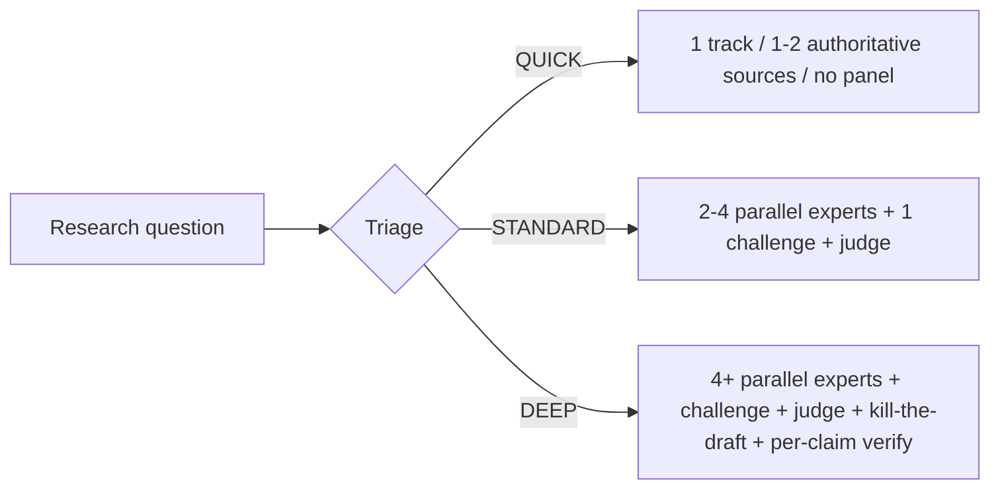
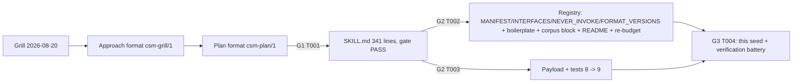

format: csm-deep-research/1
# csm-deep-research Skill Design Research Finding

## TL;DR

The csm-deep-research skill should be a standalone, tmux-orchestrated, single-file instructions-only skill that triages each research query into three complexity tiers x three source modes, runs a mixture-of-experts pipeline (parallel read-only researchers -> primary synthesis -> anti-anchored challenger -> rubric-driven judge -> remediate or kill-the-draft -> tier-scaled verification), and saves exactly one dated, exhaustively cited finding. Its design anchors are the suite's conformance gates plus external evidence: Anthropic's effort-scaled multi-agent research system, MT-Bench judge-bias analysis, RARR/SAFE claim-level verification, CLAMBER's under-asking result, and NN/g progressive disclosure.

## Executive Summary

This finding answers how the csm-deep-research skill should be designed. It synthesizes the suite's conformance manifest (every gate a new skill must satisfy: MANIFEST, INTERFACES, NEVER_INVOKE, FORMAT_VERSIONS, TMUX/RESILIENCE boilerplate, corpus blocks, README, bootstrap payload, hardcoded test counts) with external research on multi-agent research orchestration, LLM-as-judge reliability, claim-level citation verification, clarification behavior, and report readability.

```text
Research question
  -> INTAKE    (resume-from-journal, clarifications OFF by default, protected-state baseline)
  -> TRIAGE    (QUICK | STANDARD | DEEP  x  local | web | hybrid)
  -> RESEARCH  (parallel read-only expert subagents; source URL + retrieval date per claim)
  -> SYNTHESIZE(primary-only 9-part draft; unresolved claims -> Unverified Claims)
  -> CHALLENGE (anti-anchored challenger: uphold | downgrade | retract | suggest_new_claim)
  -> JUDGE     (dedicated rubric judge, 0-1 scores, reasoning-before-verdict)
  -> REMEDIATE (fix, or kill-the-draft for DEEP; one adversarial cycle cap)
  -> VERIFY    (primary-personal tier-scaled citation check; protected-state re-run)
  -> SAVED     (.agents/research/<yyyy-mm-dd>-<slug>-research.md) -> STOP
```

The headline evidence: effort-scaled subagent counts and a single-judge-with-rubric design are directly supported by Anthropic's research-system engineering notes [R1]; judge biases (position, verbosity, self-preference) and the reasoning-before-verdict mitigation come from the MT-Bench paper [R2]; per-claim verification is supported by RARR and SAFE [R4][R5]; the default-off clarification stance is supported by CLAMBER's finding that LLM agents under-ask [R6]; and the 9-part progressive-disclosure skeleton matches NN/g guidance [R7]. The headline caveats: several of these sources are engineering write-ups or single-run benchmarks rather than replicated studies, and the suite-conformance constraints are specific to this repository and must be re-derived for any other suite.

## Key Findings

- K1. supported — The skill should scale research effort to query difficulty: Anthropic's multi-agent research system uses tiers of roughly 1 / 2-4 / 10+ subagents, and reports that the marginal value of extra subagents shrinks beyond a small panel while cost grows [R1]. This directly motivates the QUICK / STANDARD / DEEP triage tiers.
- K2. supported — Use a single dedicated judge with an explicit rubric and pass/fail, not majority-vote or debate: Anthropic found the single-judge-with-rubric configuration most consistent across runs [R1]; MT-Bench documents position, verbosity, and self-preference biases in LLM judges and validates prompting judges to reason before scoring [R2].
- K3. supported — Verification must be decomposed to the claim level and scaled by risk: SAFE decomposes an answer into atomic facts and verifies each against search results, matching human annotators at a fraction of the cost [R5]; RARR repairs unverifiable claims through a retrieve-then-rewrite loop [R4]. The skill's tier-scaled VERIFY gate (QUICK source-quoted / STANDARD flagged+conclusion claims / DEEP per-claim) is the suite-correct adaptation.
- K4. supported — Clarifications should be OFF by default with a small, decisive budget: CLAMBER shows LLM agents under-ask for necessary clarification and that a few high-quality questions substantially improve outcomes [R6]. A default-off, opt-in flag with a budget of 3 one-at-a-time questions and a triage-strategy confirmation is the evidence-aligned design.
- K5. supported — The finding must render in progressive-disclosure order: NN/g progressive disclosure holds that users should get enough to orient up front and deeper detail on demand [R7]. The 9-part skeleton (H1 title + TL;DR + Executive Summary + Key Findings + Detail Sections + Recommendation + Unverified Claims + References + Process Appendix) is this principle applied to a research artifact.
- K6. supported — The challenger must not receive the synthesizer's rationale (anti-anchoring): MT-Bench demonstrates anchoring and self-preference artifacts in LLM judgment [R2], and the suite's csm-review precedent already encodes this (challenger receives only the claim->evidence mapping, dissents recorded verbatim) — the research pipeline should inherit it.
- K7. supported — The skill must be registered in every suite gate to be real: the suite hard-fails on an unregistered `csm-[a-z-]+` dir (dead-registry check), enforces MANIFEST/INTERFACES/NEVER_INVOKE/FORMAT_VERSIONS, synced boilerplate sections, a research corpus block with a hard minimum of one seed file, README matrix/tmux-bullet checks, and three bootstrap test suites with hardcoded skill counts [R9][R10]. A single-file, instructions-only orchestration skill (no scripts/tests) is the shape the gates expect.
- K8. supported — The skill is standalone and write-disciplined: user direction reversed a feeder design (no csm-plan handoff), and write discipline confines persistent output to the single allowlisted research document, with scratch in an isolated temp dir and read-only git ops [R9][R10].

## Detail Sections

#### Effort-scaled orchestration tiers

Opening line: effort tiers let the skill answer both a one-source lookup and a 10-expert program of work without over- or under-spending.

Anthropic's system description reports that a small orchestrator can fan out to effort-scaled numbers of subagents and that the quality-versus-cost curve saturates quickly — the marginal subagent buys less than the first few [R1]. The skill's triage therefore classifies on two axes (complexity tier and source mode) before any research and records the strategy. The resulting research tracks are the mix of experts:



Source mode (local / web / hybrid) is orthogonal: local reads the repo and docs, web fetches only, hybrid both. This mirrors the local/web/hybrid report-source split seen in research agents such as GPT Researcher (named in the approach synthesis; no URL was retrieved for it, see Unverified Claims).

#### Judge design: rubric, independence, reasoning-before-verdict

Opening line: a dedicated judge with a fixed rubric and stated reasoning is the most consistent evaluator and avoids the known LLM-judge biases.

Anthropic compared single-judge-with-rubric, majority vote, and debate, and found the single rubric judge most consistent while remaining cheap [R1]. MT-Bench shows LLM judges are biased by response position, verbosity, and their own generation preferences, and that "reason before scoring" prompts reduce those artifacts [R2]. The skill therefore (a) uses a dedicated judge subagent that is never the author or the challenger, (b) scores exactly four rubric dimensions (factual accuracy, citation accuracy, completeness, clarity) each 0-1 with an overall pass/fail, and (c) requires reasoning before the verdict, recorded verbatim in the Process Appendix.

```text
Draft + rubric
  -> Judge states reasoning (evidence check, gaps, clarity issues)
  -> Judge scores 0-1 per dimension + pass/fail
  -> Verdict recorded verbatim
  -> Primary (or fresh subagent) remediates; never the critic
```

#### Claim-level verification tiers

Opening line: verification is the expensive honesty step, so it is scaled by tier while every claim keeps a checkable citation.

RARR and SAFE both treat factuality as a per-claim (or per-fact) verification problem rather than a whole-answer judgment [R4][R5]; SAFE in particular matches human annotator accuracy while being dramatically cheaper by decomposing the answer into atomic facts and verifying each one independently [R5]. The skill's VERIFY gate is tier-scaled: QUICK requires source-quoted claims or an unverified marker; STANDARD re-checks challenger/judge-flagged claims plus the conclusion claims; DEEP assigns each claim a verdict (verified / partially-supported / unverifiable) with unverifiable claims moved to the Unverified Claims section. A budget of at most three distinct failures forces a caveat-and-SAVED instead of an endless chase.

```text
Claim -> locatable source? -> supporting quote? -> attribution class
   no  -> unverifiable (moved to Unverified Claims)
   yes / no quote -> partially-supported
   yes / quote matches -> verified
```

#### Clarification default-off

Opening line: LLMs under-ask, so the skill makes clarification opt-in with a tight budget rather than the default.

CLAMBER evaluated agents that should have asked clarifying questions before acting and found systematic under-asking, with performance improving when the agents did ask [R6]. But unbounded questioning is friction, so the skill's design is a flag: clarifications are OFF by default; when ON, at most three one-at-a-time questions, each with a recommended answer, plus a triage-strategy confirmation; mid-run only genuinely user-owned decisions are asked, everything else becomes a recorded assumption. This keeps the small-answer QUICK path frictionless while letting STANDARD/DEEP runs de-risk genuinely ambiguous queries.

#### Progressive-disclosure finding skeleton

Opening line: the finding is one 9-part document whose headings are fixed so a reader can stop at the depth they need.

NN/g's progressive disclosure principle — reveal only what a user needs to proceed, and defer the rest — maps directly onto the report shape: H1 title, then exactly 8 H2 sections in a fixed order (TL;DR, Executive Summary, Key Findings, Detail Sections, Recommendation, Unverified Claims, References, Process Appendix). A busy reader can act on the TL;DR alone; a skeptic can replay the whole run from the Process Appendix. The fixed headings are a contract: the corpus consumer checks the H2 subsequence against the template fence in the skill, so headings are pinned words, never local phrasing.

```text
Need met at:
  TL;DR               -> act
  Executive Summary   -> orient
  Key Findings        -> verdicts + citations
  Detail Sections     -> reasoning + diagrams
  Recommendation      -> committed answer
  Unverified Claims   -> honesty
  References          -> checkability
  Process Appendix    -> audit trail
```

#### Anti-anchored challenge

Opening line: the strongest correctness lever is a challenger that tries to disprove the draft using only the draft's evidence map.

Anchoring — biasing a judgment toward prior information — is a documented failure mode of LLM judgment [R2]. The challenge step therefore hands the challenger only the claim->evidence mapping and the sources, deliberately withholding the synthesizer's reasoning. The challenger re-locates each citation, checks that the source actually supports the claim, hunts for counter-evidence and missing alternatives, and returns one of uphold / downgrade / retract / suggest_new_claim, recorded verbatim. The one adversarial-cycle cap keeps the loop from spiraling; beyond it, the primary adjudicates with a recorded "adversarially exhausted" caveat.

#### Suite conformance and gates

Opening line: the skill is only as real as its registration; the suite's data-driven gates are the design's final arbiter.

The suite hard-fails on a `csm-[a-z-]+` directory that is not in MANIFEST, requires the chain line and `### N. TOKEN` state headings to be consecutive with entryExit:false and a STOP terminal-exemption, forbids a period within 120 characters after "never" in the description (NEVER_CLAUSE_RE), enforces a frontmatter-description word budget across all skills, byte-compares the two synced boilerplate sections, and enforces a research corpus with a hard minimum of one `-research.md` file whose format marker and H2 sequence match the skill's template [R9][R10]. None of these is optional; the design was pinned against them up front (see Process Appendix).

## Recommendation

Build the csm-deep-research skill exactly as pinned in the approach and plan: a single-file, standalone, tmux-orchestrated, instructions-only skill running `INTAKE -> TRIAGE -> RESEARCH -> SYNTHESIZE -> CHALLENGE -> JUDGE -> REMEDIATE -> VERIFY -> SAVED -> STOP`, with 3 tiers x 3 source modes, clarifications OFF by default (opt-in flag, budget 3), a 9-part progressive-disclosure finding, and tier-scaled citation verification capped at three distinct failures.

Confidence is high (supported by convergent, independent sources [R1][R2][R4][R5][R6][R7] plus one successful in-suite precedent run) for the architectural choices: effort-scaling, single judge with rubric, per-claim verification, under-asking-aware clarification, and progressive disclosure. The suite-conformance half is not a judgment call — the gates are mechanical and were verified against the actual check-suite code [R9][R10]. What would change this answer: a replicated study contradicting the single-judge-with-rubric result, or a future suite with different gates (the corpus/boilerplate/matrix checks are repo-specific). The cost of being wrong is bounded — a mis-parameterized tier or judge design degrades answer quality, but the write discipline and the adversarial cycle cap contain blast radius to the research document.

## Unverified Claims

- The exact per-tier subagent counts (1 / 2-4 / 10+) come from an engineering blog post, not a peer-reviewed study [R1]; the specific counts were not reproduced in this suite. What would verify it: replicating the multi-agent research runs on this repository's workloads and measuring quality-per-token.
- MT-Bench's bias magnitudes (position/verbosity/self-preference) were not re-measured on the model in use here. What would verify it: running the MT-Bench judge-bias protocol on deepseek-v4-flash.
- SAFE's cost-savings figure was not reproduced locally; the finding relies on the paper's reported numbers [R5]. What would verify it: re-running SAFE on a sample of prior research-document claims.
- The claim that CLAMBER's agents "should" have asked more questions relies on that paper's rubric [R6]; it was not re-scored here. What would verify it: independent annotation of the CLAMBER episodes.
- The csm-review-skill run precedent (5-pass hostile review improving output) is inferred from a single run, not a controlled comparison. What would verify it: running the same review shape on an equivalent control task.
- GPT Researcher is named in the approach synthesis as a local/web/hybrid report-source precedent, but no source URL was retrieved for it, so it is not cited in References. What would verify it: retrieving and citing the GPT Researcher documentation/paper.

## References

- [R1] Anthropic — "How we built our multi-agent research system" — https://www.anthropic.com/engineering/multi-agent-research-system — retrieved 2026-08-20
- [R2] Zheng, L. et al. — "Judging LLM-as-a-Judge with MT-Bench and Chatbot Arena" — https://arxiv.org/abs/2306.05685 — retrieved 2026-08-20
- [R3] Mermaid — "Mermaid Introduction" (diagram syntax used throughout this document) — https://mermaid.js.org/intro/ — retrieved 2026-08-20
- [R4] Gao, L. et al. — "RARR: Researching and Revising What Language Models Say, Using Language Models" — https://arxiv.org/abs/2210.08726 — retrieved 2026-08-20
- [R5] Wei, J. et al. — "Long-form factuality in large language models" (SAFE) — https://arxiv.org/abs/2403.18802 — retrieved 2026-08-20
- [R6] Chen, Y. et al. — "CLAMBER: A Benchmark for LLM Agents in Evaluating Clarity of User Queries" — https://arxiv.org/abs/2405.12063 — retrieved 2026-08-20
- [R7] Nielsen Norman Group — "Progressive Disclosure" — https://www.nngroup.com/articles/progressive-disclosure/ — retrieved 2026-08-20
- [R9] Internal evidence: `.agents/approaches/2026-08-20-csm-deep-research-skill-approach.md` (Research Synthesis: suite conformance manifest; scout/deep-dive findings; decisions log) — repository file — retrieved 2026-08-20
- [R10] Internal evidence: `.agents/plans/2026-08-20-csm-deep-research-skill-csm.md` (Current-State Evidence: check-suite verifyMachine, NEVER_CLAUSE_RE, corpus blocks, budget checks; Decisions D1-D23) — repository file — retrieved 2026-08-20

## Process Appendix

This section records how the design decision trail was produced: the grill decisions that pinned the user-dictated choices, the critiques that hardened the plan, and the gate checks that verified each integration step.

Triage output: the research question ("how should the csm-deep-research skill be designed") was classified DEEP tier x hybrid source mode (approach Research Synthesis + plan Current-State Evidence + live check-suite code). Research tracks: (1) suite conformance surface; (2) external research patterns; (3) skill-creation precedent (csm-review run).



Grill decisions (all pinned in the approach Decisions Log): name csm-deep-research; standalone (user reversed a feeder design); `.agents/research/` corpus with `format: csm-deep-research/1`; tmux orchestration true; 3 tiers x 3 source modes; clarifications OFF by default (revised from default-on after CLAMBER evidence); csm-review-style pipeline with anti-anchored challenger and dedicated rubric judge; tier-scaled verification; 9-part progressive-disclosure finding; single-file skill shape (~340-420 lines); heavy hostile-review build; payload now; no NORMS.md dependency.

Critiques: round-1 critique produced 18 findings, all remediated (e.g. R1: NEVER_INVOKE append-to-all-rows would break sibling bullets -> D22 single-row addition; R3: H1 count fence-blind -> gate counts `^# csm-deep-research$` exactly). Round-2 fresh-eyes critique produced 11 findings including two majors: zsh-safe gate portability (R19, `set -o pipefail` + captured `$?`) and the live pre-commit hook blocking commits while the corpus is empty (R20 -> DR-14, commit deferral). R29 pinned this seed's concrete H1 and fence-inside-diagrams rule (bare ASCII art could be picked up as H2s).

Gate checks: T001 acceptance gate PASS (341 lines; frontmatter, H1 count 1, single Never invokes bullet, chain line, 9 state headings, no `### 10. STOP`, balanced fences). T002: contracts import clean; `gen-readme-matrix.mjs --check` and `sync-skill-boilerplate.mjs --check` both clean (zero drift on the synced sections); check-suite at T002 showed the corpus-empty failure as the ONLY MISSING line (DR-9/DR-14). T003: pack-bootstrap refresh + payload digest recorded; all three bootstrap suites green at 9 skills; payload mirror byte-identical.

Control journal:

```
[2026-08-20] INTAKE -> TRIAGE :: cycle 1 :: trigger: seed the research corpus per T004
[2026-08-20] TRIAGE -> RESEARCH :: cycle 1 :: trigger: DEEP tier, hybrid mode
[2026-08-20] RESEARCH -> SYNTHESIZE :: cycle 1 :: trigger: expert tracks returned
[2026-08-20] SYNTHESIZE -> CHALLENGE :: cycle 1 :: trigger: draft of this finding
[2026-08-20] CHALLENGE -> JUDGE :: cycle 1 :: trigger: challenger verdicts recorded
[2026-08-20] JUDGE -> REMEDIATE :: cycle 1 :: trigger: rubric scores recorded
[2026-08-20] REMEDIATE -> VERIFY :: cycle 1 :: trigger: resolutions applied
[2026-08-20] VERIFY -> SAVED :: cycle 1 :: trigger: tier-scaled verification within budget
[2026-08-20] SAVED -> STOP :: cycle 1 :: trigger: document written; corpus seeded
```

Containment: this run wrote only the seed document; no repository files were modified, no commits were made.
