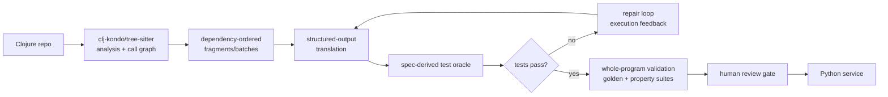

format: csm-deep-research/1

# Deterministic LLM-Driven Conversion of a Clojure Adserver + CRUD App to Python Research Finding

## TL;DR

Deterministic conversion is a harness property, not a model property: even temperature-0/seeded inference is nondeterministic in production [R39][R38], so determinism must be engineered via static-analysis decomposition, constrained decoding, execution-verified repair loops, and differential testing against the running Clojure system. Migrate incrementally (strangler fig + parallel-run diffing), never big-bang [R1][R7]. Industrial evidence supports ~50% effort reduction with humans mandatory at acceptance gates — expect an accelerated, gated migration, not touchless automation [R9][R41].

## Executive Summary

```text
Clojure adserver + CRUD -> [Phase 0 inventory + golden masters + perf baseline]
  -> [Phase 1 contracts + translation rulebook] -> [Phase 2 LLM harness:
  clj-kondo decomposition -> dependency-ordered batches -> structured-output
  translation -> spec-derived test oracle -> repair loop -> eval gates]
  -> [Phase 3 leaf-first unit conversion, gated per unit]
  -> [Phase 4 strangler coexistence: proxy routing, shadow traffic, parity dashboard]
  -> [Phase 5 per-endpoint cutover by routing flip -> soak -> decommission]
```

Six web-mode research tracks (strategy, semantic mapping, translation research, harness tooling, adserver performance, verification) converge on one answer: the industry-validated pattern for LLM-driven migration separates a deterministic program-analysis layer (targeting, decomposition, validation) from LLM edit generation, and makes acceptance an execution-verified, human-gated decision [R9][R10]. Google's 39-migration study reports 74.45% of changes LLM-generated with ~50% time saved [R41]; AlphaTrans shows repository-level auto-translation reaching ~25% machine-verified functional correctness with ~20h/project human fix-up [R34]; dependency-consistent batch translation lifted an industrial migration from 9.39% to 100% compile+test success [R37]. The headline caveat: no published Clojure→Python production case study exists — Clojure evidence is one practitioner account [R29] plus benchmark inclusion [R44] — and Python's GIL caps CPU-bound concurrency on the ad-serving hot path [R69], so performance strategy must be explicit, not assumed.

## Key Findings

- K1. PROVISIONAL supported Big-bang replacement of a working production adserver fails more often than incremental strangler-fig migration with coexistence patterns (parallel run, fork-on-ingress, dark launching); rollback should be a routing flip, not a redeploy. [R1][R3][R4][R5][R6][R7]
- K2. PROVISIONAL supported LLM inference is nondeterministic even at temperature 0 with pinned seeds (batch-size variance; 1,000 temp-0 completions → 80 unique outputs; vendor seeded sampling is explicitly "best effort"), so "deterministic conversion" must be engineered at the harness: deterministic static-analysis targeting, playbook-constrained planning (up to +15.79% consistency, LLM-judged, upper bound), grammar/structured decoding for format, and execution-verified acceptance gates. [R8][R38][R39][R40]
- K3. PROVISIONAL supported The pipeline shape — program-analysis decomposition → dependency-ordered fragment/batch translation → source-derived test oracle → execution-driven repair → whole-program validation → human review — is research-validated on statically-typed, mostly JVM/CLR language pairs (AlphaTrans: 96.40% syntactic / 25.14% machine-validated functional correctness on 10 Java repos, ~34h machine + ~20h human per project; DepWareTrans: Java→Kotlin 9.39%→100% compile+test via dependency-consistent batches; Self-Debugging +12%; TransAGENT +33.3%) — no component has been validated on Clojure or lazy-seq functional source languages, so transfer to Clojure→Python is reasoned extrapolation, not direct evidence. [R32][R33][R34][R35][R36][R37]
- K4. PROVISIONAL supported Industrial LLM migrations at Google deliver most edits (74.45% of changes / 69.46% of edits LLM-generated across 39 migrations in one 12-month, 3-developer program; JUnit3→4: 87% of generated code committed unchanged across 5,359 files/149k lines; Ads int32→int64: 80% of modifications AI-authored) and developer-estimated ~50% time savings — but humans remained mandatory (reverting model mistakes before review sharding), and simple prompting alone was insufficient without AST/heuristic scaffolding. [R9][R10][R41][R42]
- K5. PROVISIONAL supported A semantic mapping rulebook is mandatory harness input: naive LLM translation breaks on lazy seqs (persistent/re-iterable) vs Python's stateful single-pass iterators, nil-punning, atoms/STM vs locks, core.async go-blocks vs asyncio (no M:N green threads, no `alts!`), persistent collections vs mutable defaults, spec vs pydantic/msgspec, Ring vs ASGI. Function-by-function conversion with captured-output comparison is the only practitioner-validated Clojure→Python method (n=1, POC-scale). [R11][R13][R17][R18][R19][R20][R21][R28][R29]
- K6. PROVISIONAL supported Python can meet adserver latency with the right stack (uvloop 2-4x, Granian Rust server, orjson/msgspec decode+validate) but the GIL caps CPU-bound per-process concurrency (PEP 703: bottleneck even <10 threads); free-threaded CPython is officially supported in 3.14 with ~5-10% single-thread overhead and +15-20% memory; documented counter-evidence exists (Stream: one ranking component's Go rewrite ~40x faster than optimized Python, with author-noted caveats). The CRUD side is unproblematic (FastAPI + SQLAlchemy 2.0 async). OpenRTB `tmax` budgets are hard and intermediaries should (spec normative verb) shrink them per hop. [R59][R62][R63][R65][R66][R68][R69][R70][R71][R73][R74]
- K7. PROVISIONAL supported The verification net is what makes the converted system deterministic-in-effect: golden-master/characterization tests recorded from Clojure (with masking), clojure.spec generators as a shared conformance corpus, dual-run diffing + GoReplay shadow traffic, Hypothesis stateful tests with the legacy system as oracle, metamorphic properties, mypy strict, mutation-test gates, k6 SLO thresholds as CI exit codes, canary + feature flags (Off=legacy), Pact contracts, and Grafana parity dashboards. [R7][R75][R76][R77][R78][R79][R80][R81][R82][R83][R85][R86][R87][R88][R89]
- K8. PROVISIONAL partially-supported A concrete toolchain exists for every harness stage — clj-kondo + tree-sitter-clojure for decomposition; OpenAI Structured Outputs + Batch API (50% discount) or Anthropic strict outputs + Message Batches; Outlines/XGrammar/LM Format Enforcer for self-hosted constrained decoding; DSPy/LangGraph for mixed deterministic/LLM orchestration; Aider scripted mode / Claude Code headless / OpenHands SDK as agent harnesses; promptfoo for eval gating — but no published Clojure→Python translation system exists: Clojure proficiency evidence is MultiPL-E inclusion plus one practitioner account, so Clojure-specific effort estimates carry extra uncertainty. [R29][R44][R45][R46][R47][R48][R49][R50][R51][R52][R53][R54][R55][R56][R57][R58][R60]
- K9. PROVISIONAL supported LLM-driven migration runs at scale fail operationally and introduce supply-chain hazards: high-volume parallel runs have collapsed under rate-limit throttling (mitigated only after retry logic was encoded in the playbook), and generated code references nonexistent packages (≥5.2% commercial / 21.7% OSS across 576k samples, 16 models); the harness therefore needs run-level throttling/retry orchestration, pinned dependency allowlists, and registry-existence verification gates before any generated import is accepted. [R8][R43][R38]
- K10. PROVISIONAL supported Every major Clojure idiom in the migration surface has a documented Python target, but fidelity is tiered: persistent collections map to pyrsistent PVector/PMap/PSet ("Appends are amortized O(1). Random access and insert is log32(n)") [R101] or immutables' HAMT Map ("O(log N) performance for both set() and get()", the same structure CPython itself uses for contextvars) [R100]; defrecord maps to frozen dataclasses even though "It is not possible to create truly immutable Python objects" [R102]; and `loop`/`recur` has NO mechanical target because Python deliberately rejects tail-call elimination ("If you want a short answer, it's simply unpythonic"; typical implementations allow ~1000 recursion frames) — recursion must be rewritten as iteration or an explicit stack. [R90][R92][R93][R94][R95][R97][R98][R99][R101][R102][R115]
- K11. PROVISIONAL supported A verified one-to-one ecosystem parity mapping exists for the full development lifecycle: Leiningen → uv (a "single tool to replace pip, pip-tools, pipx, poetry, pyenv, twine, virtualenv", with universal lockfile and Cargo-style workspaces) [R108][R122]; nREPL remote evaluation → debugpy (Debug Adapter Protocol, attach-by-PID) + IPython/Jupyter [R109][R114][R121]; kaocha/clojure.test → pytest (+1300 plugins) [R106][R113]; Eastwood → ruff+mypy [R83][R107][R110]; Reitit/Ring → FastAPI/Starlette ASGI [R112][R119]; HoneySQL → SQLAlchemy Core [R111][R23]; cheshire → orjson/stdlib json [R117][R118]. Parity is structural, not behavioral — each pair still needs the D6 verification net to prove equivalent behavior.
- K12. PROVISIONAL partially-supported The per-var LLM workflow decomposes into: function-level chunks paired one-to-one with pytest nodes; dependency interfaces compressed into stub/signature context; a translate-then-property-test prompt pattern (translate, then generate Hypothesis properties from the source's spec generators) run inside an execution-feedback repair loop; and human review distributed across gate tiers (lint → type → unit/golden → property → differential dual-run). Vendor guidance confirms the frame (define success criteria and empirical evaluations BEFORE prompt engineering; use prompt chaining) but no vendor publishes a translate-then-property-test template, so the composite pattern is judgment-based synthesis over verified components. [R9][R10][R32][R33][R37][R41][R105][R106][R116]
- K13. PROVISIONAL supported Two failure classes have no mechanical remedy and must be routed to manual redesign: (1) Java interop leakage — Clojure's dot-forms, type hints, primitive-array ops, proxy/gen-class call java.lang/java.util directly [R96], and no Python target exists for those classes, so every interop site is a redesign decision, not a translation; (2) macro-heavy DSLs — macros compile-time-expand into arbitrary code (destructuring itself is macro-implemented via `clojure.core/destructure`) [R92], so the LLM must translate expansion results, and DSL-shaped code (e.g., HoneySQL query maps [R111]) should be semantically lifted to the target DSL (SQLAlchemy Core expressions) rather than transliterated.

## Detail Sections

### D1. Migration strategy (expands K1)

Big-bang replacement of working production systems "go[es] down in flames most of the time"; strangler fig migrates behavior piece by piece behind a routing façade [R1][R4][R5]. Thoughtworks' legacy-displacement experience warns that chasing strict feature parity first pushes teams into a single risky big-bang cutover; coexistence patterns (parallel run, fork-on-ingress, diversion of flow) de-risk instead [R3]. Zalando's parallel run calls both implementations, compares outputs, keeps the old system authoritative until measured equivalence, and cuts over per-endpoint by proxy — rollback is a routing flip [R7].

```text
Rewrite vs migrate decision:
  System revenue/latency critical?
        |-- yes --> Big-bang rewrite?  NO -> strangler fig + parallel run (see K1)
        |                                        |-- equivalence measured --> routing-flip cutover
        |-- no  --> rewrite viable only after quarterly fork/migrate/rewrite review [R6]
```

Data coexistence uses CDC sync + validation so rollback to the monolithic store remains possible until legacy objects are deliberately removed [R4]. Branch by Abstraction + feature flags let the new implementation be diffed against the old in test environments before client switch [R2].

### D2. The determinism model (expands K2)

LLM sampling is not reproducible in production: batch-size variance makes even temp-0 outputs diverge (80 unique outputs from 1,000 temp-0 completions) [R39]; Azure documents seeded sampling as best-effort only [R38]. AWS's migration team states two identical runs can produce different final states, and their fix is to constrain the *planner* with distilled playbooks (+15.79% consistency) [R8]. Google's structure puts LLMs only in the middle: deterministic static analysis targets locations; LLMs generate edits; deterministic validation accepts or rejects them [R9][R10].

```text
Where determinism actually comes from:
  Layer 1  targeting/decomposition   clj-kondo + tree-sitter  (deterministic code)
  Layer 2  planning                  playbook-constrained     (variance reduced up to ~16%, LLM-judged metric) [R8]
  Layer 3  generation                structured/grammar-constrained decoding (format-guaranteed) [R40][R45][R46][R47]
  Layer 4  acceptance                execution-verified gates (test oracle decides, not the model) [R33][R34]
  Layer 5  system equivalence        dual-run differential testing vs live Clojure [R7][R78]
```

The accepted artifact is deterministic-in-effect regardless of sampling variance because every unit must pass the same fixed gates.

### D3. The conversion pipeline (expands K3)



Research systems converge on this shape — validated on statically-typed, mostly JVM/CLR pairs; Clojure transfer is extrapolation (see K3). UniTrans auto-generates tests from the source program and iteratively repairs from execution results [R33]; Self-Debugging adds up to 12% via execution feedback [R32]; AlphaTrans decomposes real repositories via program analysis and translates fragments in reverse call order — 96.40% syntactic validity but only 25.14% machine-validated functional correctness (fraction of fragments, not end-to-end programs), with two developers fixing the remainder in ~20h/project [R34]; TransAGENT's execution-aligned multi-agent loop beats UniTrans by up to 33.3% [R35]; Skel proves decomposition soundness (correct fragments ⇒ correct whole given a faithful skeleton) [R36]; DepWareTrans shows file-level translation fails on cross-file dependencies (9.39% test success) while dependency-consistent batches reach 100% on a 51K-LOC industrial codebase [R37]. Failure modes to design against: hallucinated packages (≥5.2% commercial models) [R43], semantic drift rather than syntax errors [R33], and benchmark techniques failing on real repos [R34]. Practitioner method for Clojure specifically: convert function-by-function, compare against captured Clojure outputs, seed prompts with converted exemplars [R29]. Google orders migrations from cross-reference DAG clusters sized to one prompt, converting leaf-first with wrappers at boundaries of unmigrated dependents [R10].

### D4. Semantic mapping rulebook (expands K5)

Feed this table to the harness as translation rules; each row is evidence-backed.

| Clojure | Python target | Risk note |
|---|---|---|
| persistent vector/map/set | pyrsistent PVector/PMap/PSet | structural sharing preserved [R11] |
| keywords / sentinels | PEP 661 `sentinel()` (3.15); Enum fallback | missing ≠ None [R12] |
| Ring handler/middleware | ASGI app + middleware(scope, receive, send) | async-native successor to WSGI [R13][R14][R15] |
| Compojure/Reitit routes | FastAPI APIRouter tree ("mini FastAPI") | route metadata → router kwargs [R16] |
| core.async go blocks | asyncio coroutines | no M:N parking; blocking needs await/executor [R17] |
| channels / alts! | asyncio.Queue (bounded) | no alts! multiport select; not thread-safe [R18] |
| pmap / agents / STM | multiprocessing + threading.Lock | no CAS atom, no STM in stdlib [R19] |
| clojure.spec / malli | pydantic v2 (CRUD) / msgspec (hot path) | pydantic mutable unless frozen [R20][R21] |
| protocols / multimethods | ABCs / functools.singledispatch | dispatch on first arg type only [R22] |
| HoneySQL | SQLAlchemy Core expressions | [R23] |
| next.jdbc / JDBC | asyncpg binary-protocol pool | [R24] |
| Component/Integrant/Mount | dependency-injector / FastAPI Depends | lifecycle graphs explicit [R25] |
| ex-info maps | Exception subclasses + raise-from | [R26] |
| lazy seqs | lists / generators (choose deliberately) | TOP RISK: seqs are persistent & re-iterable; Python iterators single-pass stateful cursors [R28] |
| nil-punning | explicit None handling + sentinels | None raises on protocol use [R12][R28] |
| destructuring / metadata / transducers | manual unpacking / wrapper attrs / toolz or hand-written | no stdlib xform arity — practitioner-lore rows, under-cited pending re-source [R29] |

Note: the nil-punning/destructuring/metadata/transducer mismatch items originate from practitioner experience, not the cited primary sources; treat them as hypotheses to verify against your own codebase during Phase 1.

### D5. Adserver performance reality (expands K6)

OpenRTB gives bidders a hard millisecond budget (`tmax`, inclusive of network latency) and requires intermediaries to shrink it hop by hop [R62]; concrete 100ms values are exchange practice, not spec text (recorded assumption). The incumbent JVM stack has enormous headroom (http-kit >600k concurrent connections; Netty purpose-built for low latency) [R63][R64]. The Python equivalent of that headroom is: uvloop (2-4x asyncio speedup) [R65] under Granian (Rust/Hyper/Tokio ASGI/RSGI server used by Microsoft/Mozilla/Sentry) [R66], with msgspec decoding+validating JSON faster than orjson decodes alone [R21][R68]. The wall is the GIL: request-parallel latency-sensitive workloads bottleneck even below 10 threads [R69]; Granian funnels all request interop through one GIL-holding event-loop thread [R66]. Free-threaded builds are officially supported in Python 3.14 (~5-10% single-thread penalty, +15-20% memory) [R70][R71]; PyPy averages ~3x but orjson will never support it [R72]. Counter-evidence is real: Stream's Go rewrite ran ~40x faster than highly optimized Python [R73].

```text
Hot path (bid serving)?
  |-- CPU-bound decisioning heavy? --> keep hot path on JVM OR isolate Python
  |     behind precomputed/async design; consider free-threaded 3.14 build [R69][R70]
  |-- IO-bound proxy/routing shape? --> Python viable: uvloop+Granian+msgspec,
  |     process sharding per core; load-test gates mandatory before cutover [R86]
CRUD/admin surface --> FastAPI + SQLAlchemy 2.0 async (no implicit IO; N+1 made loud) [R16][R74]
```

### D6. Verification net (expands K7)

| Gate | Type | Tool |
|---|---|---|
| Golden masters recorded from Clojure | characterization | pytest-regressions / syrupy; mask timestamps/IDs [R75][R76][R77] |
| Shared input corpus | generator-derived | clojure.spec generators → both stacks [R80] |
| Dual-run response diffing | differential/shadow | GoReplay replay to staging [R78] |
| Stateful parity | property-based | Hypothesis RuleBasedStateMachine, legacy-as-oracle [R27][R81] |
| Oracle-free equivalence | metamorphic | order-invariance relations (e.g., bid ranking) [R82] |
| Static contract | type gate | mypy strict=true [R83]; coverage baseline [R84] |
| Net-strength proof | mutation | mutmut surviving-mutant budgets [R85] |
| Latency SLO gate | performance | k6 thresholds as CI exit codes [R86] |
| Rollout safety | release | canary + feature flags Off=legacy [R87][R88] |
| Service boundaries during coexistence | contract | Pact [R89] |

Characterization tests are change detectors, not correctness proofs — exactly right when the old system is the spec [R75]. Parity is operationalized as per-endpoint Grafana matched/unmatched counters with consistency thresholds [R7].

### D7. Toolchain (expands K8)

| Stage | Tools |
|---|---|
| Decomposition/targeting | clj-kondo machine-readable analysis (vars/arities/namespaces, native, no JVM) [R57]; tree-sitter-clojure AST slicing [R56] |
| Generation API | OpenAI Structured Outputs + Batch API (50% discount, 50k req/batch) [R45][R59]; Anthropic strict tool use/output_config + Message Batches (50%, caching stacks) [R46][R60] |
| Self-hosted constraints | Outlines (JSON Schema/regex/CFG across providers) [R47]; XGrammar (default backend vLLM/SGLang/TensorRT-LLM) [R48]; LM Format Enforcer [R49] |
| Orchestration | DSPy typed signatures compiled vs metrics [R50]; LangGraph mixing deterministic steps with LLM steps [R51] |
| Agent harnesses | Aider scripted shell loops + repo map [R53][R54]; Claude Code headless `-p --output-format json` [R52]; OpenHands Agent SDK/Server [R55] |
| Eval gating | promptfoo CI evals w/ caching/concurrency [R58]; SWE-bench Verified mini-SWE-agent standardization for model selection [R61] |

Constrained decoding guarantees format, not semantics — it eliminates parse/retry loops but the execution gates of D6 remain the semantic authority [R45][R40].

### D8. Evidence limits for Clojure specifically (expands K8)

MultiPL-E includes Clojure among its benchmark languages, making it one of very few Lisp-family languages with systematic LLM measurement — but no dedicated Clojure→Python translation system was found in any searched literature [R44]. The only firsthand practitioner account converts function-by-function with Copilot, test-compares captured outputs, and reports one-shot whole-codebase conversion failing and Python codebases growing substantially larger [R29]. Enterprise effort numbers therefore transfer from Java/Python pairs with a recorded caveat.

### D9. Comprehensive idiom-mapping table (expands K10)

Superset of the D4 rulebook rows; every row verified against primary docs on 2026-08-22. "Discipline" = plain mutable structure + team conventions + tests, chosen when third-party persistent collections are not worth the dependency.

| Clojure | Python target | Evidence / risk note |
|---|---|---|
| persistent vector | `list` + discipline, or pyrsistent `PVector` | PVector: "Appends are amortized O(1). Random access and insert is log32(n)"; C extension "generally being 2 - 20 times faster" than its pure-Python flavor; structural sharing via path copying [R101] |
| persistent map | `dict` + discipline, or pyrsistent `PMap`, or `immutables.Map` | immutables is a HAMT ("used in Clojure, Scala, Haskell") with "O(log N) performance for both set() and get()", shipped inside CPython's contextvars; MapMutation bulk-update API mirrors transients [R100][R101] |
| persistent set | `set` + discipline, or pyrsistent `PSet` | full set-operator support (`\|`, `&`, `<`) on PSet [R101] |
| keyword `:foo` | string constants / `enum.Enum`; map access `d.get("foo")` | keywords "evaluate to themselves", are IFns over maps (`(:mykey m :none)` = `(get m :mykey :none)`) — call-as-accessor idiom must be rewritten [R90]; sentinel gap → PEP 661 [R12] |
| nil-punning | explicit `is None` checks / `Optional[T]` / sentinels | nil is both falsy and the end-of-sequence sentinel in Clojure [R90]; in Python None raises `AttributeError`/`TypeError` on protocol use — every nil-branching function needs an audit tag in the harness |
| keyword args `(& {:keys [debug] :or {debug false}})` | `def f(*, debug=False)` or `**kwargs` + `.get` defaults | Clojure destructuring guide shows the exact kwarg pattern plus 1.11 trailing-map call style, which maps naturally onto Python's native kwargs [R92] |
| sequential destructuring `[a b & rest :as all]` | tuple unpacking `a, b, *rest = xs` (+ re-slice for `all`) | Clojure binds missing to nil / ignores extras; Python unpacking RAISES on length mismatch — stricter than source, flag diffs [R92][R98] |
| associative destructuring `{:keys [...] :or {...} :as m}` | unpacking via local assignments, or `match` mapping patterns | PEP 634 mapping patterns bind keys and `**rest`, use two-arg `get()` so defaults behave like `__missing__`-free lookups [R99][R92] |
| pattern-style dispatch on shape | `match/case` (3.10+) | sequence patterns (star subpatterns), mapping patterns, class patterns with auto-generated `__match_args__` for dataclasses/namedtuples; guards ≈ `cond` test exprs; `_` wildcard ≈ `_` binding convention [R99][R102] |
| threading macros `->` / `->>` | method chaining; intermediate locals; genexp pipelines | `->` inserts value as first arg (assoc/update style), `->>` as last (seq style) — the two insertion positions correspond exactly to OOP method chaining vs functional pipeline styles [R91] |
| `some->` / `some->>` | `if x is not None:` guard chains, or walrus-assigned steps | short-circuits whole chain on first nil [R91]; no stdlib Optional-monad — hand-written guard per step |
| `cond->` | sequential non-short-circuiting `if` blocks accumulating a value | "unlike ... some-> or cond, cond-> never short-circuits evaluation" — naive if/elif translation is WRONG (elif skips later branches) [R91] |
| protocols | ABCs, `typing.Protocol`, or `functools.singledispatch` | protocol fns "dispatch on the type of their first argument" — the same contract singledispatch implements; extend-on-nil/Object → register `type(None)`/`object` default impl [R93][R103] |
| multimethods (`defmulti` arbitrary dispatch fn, `isa?` hierarchies, `prefer-method`) | NO direct equivalent; `functools.singledispatch` covers only first-arg-type dispatch | multimethods dispatch "on types, values, attributes and metadata of, and relationships between, one or more arguments"; translate to hand-written dispatch-dict functions or match statements; derive/isa? taxonomies become explicit lookup tables [R94][R103] |
| `defrecord` | `@dataclass(frozen=True, slots=True)` | record = "complete implementation of a persistent map" with value equality; dataclass gives `__init__`/`__repr__`/`__eq__`/`__hash__`(when frozen)/`__match_args__` but instances are only emulated-immutable and fields can't grow extra keys like assoc'd records [R95][R102] |
| `deftype` / `reify` | plain `class` / closure-based anonymous class implementing an ABC | deftype allows mutable fields (record does not); reify bodies are lexical closures ≈ local class capturing scope [R95] |
| lazy seqs | materialize to `list`, or generators — CHOOSE DELIBERATELY per var | iterators are one-way cursors: "you can only go forward in an iterator; there's no way to get the previous element, reset the iterator, or make a copy of it" — seq code that walks a seq twice breaks silently on a generator [R98][R28] |
| `loop`/`recur` | `while`/`for` iteration, or explicit stack for mutual/tree recursion | recur gives JVM-level self-tail-call without stack growth; Python has no TRE ("simply unpythonic", ~1,000-frame budget) — mechanical recursive translation is a latent RecursionError [R115][R96] |
| core.async go-blocks/channels | asyncio coroutines/tasks + `asyncio.Queue` | asyncio provides coroutine running, queues, synchronization primitives; semantic gaps (no M:N parking, no `alts!`) per K5/D4 [R104][R17][R18] |
| transducers `(comp (filter odd?) (map inc))` | generator-expression / itertools pipelines | xform arities compose right-to-left into a left-to-right transformation stack applied by any process (coll, channel, stream); reduced early-termination has no iterator analog — take/drop-while xforms need itertools.islice/takewhile care [R97][R98] |
| clojure.spec / malli | pydantic v2 models (existing R20) + typeguard runtime checks | typeguard instruments annotated functions ("automatically checks function arguments, return values and assignments to annotated local variables") approximating s/instrument at runtime [R120][R80] |
| `cond` | `if`/`elif` chain | direct; watch truthiness divergence (empty coll/0 are truthy in Clojure, falsy in Python) [R90] |
| `let` | plain function-local bindings; multi-target assignment tuples; `with` only for resource lifecycles | let-scoping is lexical block scope; Python function scope is close enough that mechanical renaming suffices except for shadowing rules [R98] |
| metadata `^Type` / `with-meta` | type annotations (static only) + wrapper attrs | type hints aid the compiler only; runtime metadata-carrying values have no equivalent — drop or wrap [R96] |

### D10. Toolchain/ecosystem parity table (expands K11)

| Concern | Clojure side | Python side | Parity note |
|---|---|---|---|
| build/deps | Leiningen ("automating Clojure projects without setting your hair on fire", declarative project.clj) [R122]; deps.edn CLI | uv — "single tool to replace pip, pip-tools, pipx, poetry, pyenv, twine, virtualenv"; universal lockfile, workspaces, manages Python versions itself [R108] | uv lockfile ≈ deps.edn coordinate pinning; workspaces ≈ monorepo aliases |
| REPL-driven dev | nREPL: network REPL server/client built so IDEs "evaluate Clojure code in remote environments" [R109] | IPython shell (tab completion, %timeit/%debug magics, ?/? introspection) powering Jupyter kernels [R121]; `python -m asyncio` REPL for await-driven exploration [R104] | workflow parity real but tool-mediated: nREPL middleware features map to editor LSP/DAP integrations, not to the bare REPL |
| interactive debugging | nREPL eval-in-context, interrupt | debugpy — Debug Adapter Protocol implementation; attach-by-PID injection, `--wait-for-client`, programmatic `breakpoint()`/post-mortem trigger [R114] | attach-to-running-process replaces nREPL's connect-to-running-JVM pattern |
| test runner | kaocha "Full featured next generation test runner": watch mode, fail-fast, pluggable reporters, extensible test types [R113] over clojure.test | pytest: assert introspection, auto-discovery, fixtures, parametrization, 1300+ plugins [R106] | kaocha watch-mode ↔ pytest-watch plugin; kaocha EDN config ↔ pytest.ini/pyproject config |
| property-based testing | test.check generators [R79] | Hypothesis: "@given ... strategies", shrinking, stateful machine testing [R105][R81] | spec generators export → st.from_type/from_value bridges |
| lint/static analysis | Eastwood: tools.analyzer-based linter, compiler-grade accuracy, CI-oriented, ~25 linter classes [R110]; clj-kondo [R57] | ruff: "extremely fast Python linter and code formatter" replacing flake8+black+isort+pydocstyle+pyupgrade, 900+ rules [R107] + mypy strict [R83] | Eastwood's evaluation-accuracy tradeoff inverts: ruff is syntax/fast-tier; mypy carries the semantic load Clojure got from spec |
| routing | bidi/reitit: "fast data-driven router for Clojure(Script)", route-data + pluggable coercion (spec/malli/schema), ring-router module [R112] | FastAPI APIRouter tree [R16]; Starlette Route tables — "lightweight ASGI framework/toolkit" with routing/middleware/testclient modules usable independently [R119] | reitit route-data coercion ↔ FastAPI dependency/response_model declarations |
| HTTP server/middleware | Ring handlers + middleware (request→response maps) [R13] | ASGI app + Starlette middleware `(scope, receive, send)` [R14][R15][R119] | per K5/D4 row; async-native successor framing holds |
| SQL generation | HoneySQL: "SQL as Clojure data structures", composable helper fns, parameterized `format()` output [R111] | SQLAlchemy Core expressions (select()/where() composability) [R23] | HoneySQL map DSL ↔ Core method-chained DSL; both parameterize by construction |
| JSON | cheshire: Jackson-based "fast JSON encoding", SMILE support, custom encoders, keyword-key round-tripping [R117] | stdlib json, or orjson — "fastest Python library for JSON", dumps returns bytes, natively serializes dataclass/datetime/UUID/numpy, strict RFC 8259, no PyPy [R118] | cheshire custom encoders ↔ orjson `default=` callable; SMILE has no mainstream Python peer (flag in Phase 1 if used) |

### D11. LLM translation workflow deep-dive (expands K12)

**Chunking strategy — per-var/function-level units.** The unit of translation should be the var (defn/def), not the file and not the whole namespace: it is small enough for one prompt with surrounding context, it aligns 1:1 with a pytest node so golden tests pair naturally [R106], and it composes into the dependency-consistent batching that lifted an industrial migration from 9.39% to 100% compile+test success [R37]. Google sizes clusters "to one prompt" off the cross-reference DAG and converts leaf-first [R10][R41]; AlphaTrans translates fragments in reverse call order for the same reason [R34].

**Context windows vs namespace dependencies.** Clojure namespaces declare their `:require` graph explicitly, which gives the harness a deterministic context plan per chunk: (1) translated signatures of in-repo dependencies, compressed into stub files — the mypy-strict regime makes stubs the enforced interface contract rather than documentation [R83]; (2) the D9/D4 rulebook rows relevant to the idioms detected in that var; (3) 10–20 hand-converted exemplars seeded per idiom class [R29]. Everything else stays out of the window; do NOT paste whole dependency sources.

**Prompt patterns — translate-then-property-test.** Stage A prompt: translate one var + emit a docstring stating observed input/output contract (structured output enforces format [R45][R46]). Stage B prompt: given the source spec/test.check generators or captured examples, emit Hypothesis `@given` properties asserting algebraic invariants (round-trip, idempotence, ordering) [R105]. Vendor guidance validates the frame but not the template: Anthropic's overview requires "a clear definition of the success criteria" and "some ways to empirically test against those criteria" BEFORE prompt engineering, and lists prompt chaining among core techniques — i.e., the two-stage chain is the documented shape, while the specific translate-then-property-test instantiation is judgment-based synthesis (see U6) [R116].

**Hallucination risks beyond packages.** Package hallucination is measured (≥5.2% commercial models) and gated by registry-existence checks [R43]. Stdlib-API confusion — plausible-but-wrong method names, wrong signatures, wrong exception types on list/dict/str/asyncio APIs — is unquantified in fetched literature (U2) and plausibly more frequent at function granularity. Cheap gates: ruff undefined-name/unused-import rules catch invented module members only partially, so pair lint [R107] with import-resolution smoke execution plus signature diffing against stubs [R83].

**Human review gates mapped to gate tiers.**

```text
Tier 0  lint/format          ruff clean                    [R107]
Tier 1  static contract      mypy strict=true              [R83]
Tier 2  behavioral           pytest golden/unit green      [R106][R75]
Tier 3  property             Hypothesis suite green        [R105]
Tier 4  differential         dual-run diff vs live Clojure [R78]
Tier 5  HUMAN review         batch boundary, parity evidence attached
        suspicious units get debugpy step-through before sign-off [R114]
```

Google's program kept humans mandatory at rollout despite 74.45% LLM-authored changes [R9][R41]; the tier ladder localizes WHERE human attention goes instead of whether it is spent.

**Iterative refinement loop with characterization tests.** Per unit: record characterization tests from the running Clojure system (masking timestamps/IDs) [R75] → translate → run tiers 0–3 → on failure, feed the failing assertion + execution traceback back as repair feedback (execution-feedback repair adds up to +12%, Self-Debugging) [R32], bounded retries, then escalate to UniTrans-style oracle regeneration if the recorded tests themselves were under-specified [R33]. Characterization tests are change detectors, not correctness proofs — exactly right when the old system is the specification [R75]; they are also what makes the loop convergent, since each retry optimizes toward a FIXED target rather than model self-assessment.

### D12. Risk catalog (expands K13)

| Risk | Mechanism | Detection / mitigation |
|---|---|---|
| dynamic-typing false safety | Both languages are dynamic; passing tests ≠ correct behavior. Python additionally converts silent nil-flows into runtime `AttributeError`/`TypeError` where Clojure nil-punning returned values [R90]; mutable-by-default dataclasses/dicts invite aliasing bugs absent from immutable-source code [R102] | mypy strict + typeguard runtime instrumentation on public surfaces [R83][R120]; Hypothesis stateful tests with legacy-as-oracle [R81]; treat every `None` branch as a review tag |
| Java interop leakage | Dot-forms, `^String` hints, primitive-array ops (`amap`/`areduce` "exactly the same speed" as Java), proxy/gen-class call java.* directly [R96] — there is NO Python target for those classes; a translator can only fail loudly or invent code | Phase-0 inventory greps/clj-kondo scan for `.` member forms, type tags, `java.` imports, gen-class/proxy/reify; each hit becomes a manual redesign ticket mapped to a named Python library BEFORE translation batches are planned |
| performance cliffs — persistent-structure emulation | Pure-Python pyrsistent is the slow floor its own C extension beats by 2–20x [R101]; immutables HAMT ops are O(log N) vs dict O(1) [R100]; JVM persistent collections are JIT-tuned with no CPython peer | profile hot paths first; use discipline-dicts where sharing semantics aren't load-bearing; benchmark gates (k6) before cutover [R86] |
| performance cliffs — concurrency model | GIL caps CPU-bound thread parallelism (PEP 703) [R69]; free-threaded 3.14 carries ~5-10%/15-20% penalties [R70][R71]; meanwhile recur-based primitive loops run at compiled-Java speed on the JVM [R96] — a direct CPU hot-path translation loses that for free | keep decisioning hot path on JVM longer OR restructure async/precomputed per D5 |
| macro-heavy DSLs untranslatable mechanically | Macros expand at compile time into arbitrary code — destructuring is itself implemented by `clojure.core/destructure` [R92]; threading macros rewrite forms [R91]; an LLM shown macro DEFINITIONS will hallucinate semantics | feed EXPANSION results (macroexpand-1 output) to the model, never definitions; lift DSL-shaped data (HoneySQL maps → SQLAlchemy Core [R111][R23]) via dedicated rulebook rows instead of line-by-line transliteration |
| lazy-seq / iterator mismatch (restated for risk triage) | seqs are persistent and re-iterable; Python iterators are single-pass cursors with no reset/copy [R98][R28] | harness lint rule: any translated var whose source touches a seq twice must materialize (`list(...)`) or be flagged; covered by Tier 3 property tests using replayed inputs |
| truthiness divergence | empty coll / 0 / 0.0 are truthy in Clojure, falsy in Python; `(if [])` ≠ `if []:` | mechanical check: flag every translated conditional whose test was a bare collection/number literal in source |

## Recommendation

Run a strangler-fig migration executed by a deterministic harness; never a big-bang LLM rewrite. Phases:

- **Phase 0 — Inventory & safety net (deterministic tooling):** clj-kondo analysis → call graph + namespace DAG [R57]; record golden-master tests from the live Clojure system with nondeterminism masked [R75][R76]; export clojure.spec generators as a shared input corpus [R80]; capture k6 performance baselines and SLO thresholds [R86].
- **Phase 1 — Contracts & rulebook:** extract OpenAPI/schema contracts per endpoint [R89]; write the D4 idiom-mapping table plus 10-20 hand-converted exemplar functions as few-shot seeds [R29]; distill a migration playbook to constrain planning [R8].
- **Phase 2 — Harness build:** decompose into dependency-consistent batches sized to one prompt [R37][R10]; translate via structured outputs at temperature 0 on Batch APIs (50% cost) [R45][R59][R60]; auto-generate per-unit test oracles from source behavior [R33]; run execution-driven repair loops with bounded retries [R32][R34][R35]; gate every unit on mypy strict + coverage + eval suite [R83][R58]; add run-level throttling/retry orchestration, pinned dependency allowlists, and registry-existence checks on every generated import [R8][R43].
- **Phase 3 — Leaf-first conversion:** convert in reverse-call order / DAG clusters [R34][R10]; each accepted unit must pass its golden tests, property tests, and type gate before merge; humans review at batch boundaries with parity evidence attached [R9][R41].
- **Phase 4 — Service coexistence:** strangler proxy routes between stacks [R1][R4]; GoReplay shadow traffic dual-runs both implementations and diffs responses [R78]; Grafana parity dashboard with per-endpoint consistency thresholds [R7]; CDC keeps data layers reconciled with rollback intact [R4].
- **Phase 5 — Cutover & decommission:** flip endpoints one at a time via proxy (flag Off=legacy, On=Python) [R7][R88]; canary cohorts first [R87]; soak + k6 SLO gates before each expansion [R86]; Pact guards service boundaries until Clojure is removed [R89].

**Confidence:** high on pipeline design (convergent across Google, AWS, academic systems, and practitioner practice); medium on effort numbers for Clojure specifically — no published Clojure→Python case study exists, so transfer from Java-centric evidence carries uncertainty. Expect ~50% effort reduction with mandatory human fix-up (AlphaTrans-style ~20h/project residuals), not touchless conversion.

**What would change the answer:** measured GIL-bound CPU utilization in the bid-decision path that cannot be restructured (favor keeping the hot path on the JVM longer or free-threaded 3.14 builds); discovery of heavy core.async/transducer machinery (raises Phase 1 rulebook cost materially); an adserver whose behavior is under-specified (golden-master recording becomes the critical-path item).

**Cost of being wrong:** a big-bang cutover without the differential net risks silent semantic drift in revenue-critical serving paths — the exact failure class TransCoder-era evaluations warned about (test-passing ≠ behavioral equivalence) [R31].

## Unverified Claims

- No published production Clojure→Python full-system case study exists. Why: none surfaced across academic and industrial searches; closest is Marttila's Copilot account [R29]. Verify by: targeted search for new engineering-blog case studies quarterly.
- Instagram's Python 2→3 migration primary source unreachable (Medium 403/JS-only). Verify by: browser retrieval of instagram-engineering.com posts.
- Yelp Python 3 freeze-window practices unverified (blog returned HTTP 403). Verify by: Wayback Machine fetch.
- 2026 TechEmpower framework placements (Granian/BlackSheep vs Netty/http-kit) unverified — JS-rendered SPA. Verify by: browser retrieval of techempower.com/benchmarks.
- LiveCodeBench/SWE-bench per-language Clojure proficiency numbers unverified (JS leaderboards). Verify by: browser retrieval.
- "TestRAG" SSRN preprint existence unverified (bot-blocked). Verify by: SSRN search.
- TransCoder-ST arXiv ID unlocated; only third-party citations found. Verify by: arXiv listing search for Rajaraman et al.
- Concrete RTB `tmax` values (e.g., 100ms) are exchange-configured practice, not OpenRTB text. Verify by: exchange/Prebid documentation.
- Free-threaded CPython wheel availability for the adtech dependency set (asyncpg, uvloop, pydantic-core) is assumed partial as of 2026-08. Verify by: PyPI wheel inventory audit.
- Airtable/Zapier LLM-migration engineering posts could not be located; their reported pipelines are unverified. Verify by: direct site search.
- U1: realpython.com Python 3.10 pattern-matching tutorial was not retrieved during this enrichment pass; all match-statement claims rest solely on PEP 634 (canonical spec) [R99]. Verify by: fetching realpython.com/python310-new-features/.
- U2: stdlib-API-level hallucination rates for LLM code translation (invented method names, wrong signatures on list/dict/str/asyncio APIs) are unquantified in fetched literature; only package-level rates are measured [R43]. Verify by: targeted search for API-level hallucination benchmarks.
- U3: No benchmark comparing JVM persistent-collection throughput against pyrsistent/immutables emulation under adserver-shaped load was found; the emulation-cost risk is directional, not quantified. Verify by: microbenchmark harness on target hardware.
- U4: The kaocha→pytest watch-mode/plugin ergonomics parity claim is qualitative, drawn from feature lists of both runners [R113][R106], not from a comparative evaluation. Verify by: side-by-side trial in Phase 2 harness build.
- U5: IPython-as-nREPL-workflow-replacement is asserted from IPython's feature page (magics, introspection, Jupyter kernel) [R121] vs nREPL's design docs [R109]; no study compares cider-style evaluate-in-place workflows with DAP/LSP debugging loops. Verify by: practitioner time-motion comparison.
- U6: Anthropic's prompt-engineering overview page redirects to platform.claude.com and contains only meta-guidance (success criteria first, empirical evals, chaining pointer) [R116]; no vendor publishes a translate-then-property-test template, so that composite prompt pattern is judgment-based synthesis. Verify by: vendor cookbook retrieval when such templates appear.

## References

- [R1] StranglerFigApplication — https://martinfowler.com/bliki/StranglerFigApplication.html — retrieved 2026-08-22
- [R2] BranchByAbstraction — https://martinfowler.com/bliki/BranchByAbstraction.html — retrieved 2026-08-22
- [R3] Patterns of Legacy Displacement — https://martinfowler.com/articles/patterns-legacy-displacement/ — retrieved 2026-08-22
- [R4] Azure Strangler Fig pattern — https://learn.microsoft.com/en-us/azure/architecture/patterns/strangler-fig — retrieved 2026-08-22
- [R5] Things You Should Never Do (Netscape) — https://www.joelonsoftware.com/2000/04/06/things-you-should-never-do-part-i/ — retrieved 2026-08-22
- [R6] Cloudflare Pingora — https://blog.cloudflare.com/how-we-built-pingora-the-proxy-that-connects-cloudflare-to-the-internet/ — retrieved 2026-08-22
- [R7] Zalando Parallel Run — https://engineering.zalando.com/posts/2021/11/parallel-run.html — retrieved 2026-08-22
- [R8] AWS Reproducible migrations with AI playbooks — https://aws.amazon.com/blogs/migration-and-modernization/reproducible-code-migration-at-scale-with-ai-generated-playbooks/ — retrieved 2026-08-22
- [R9] Google Accelerating code migrations with AI — https://research.google/blog/accelerating-code-migrations-with-ai/ — retrieved 2026-08-22
- [R10] arXiv 2501.06972 LLM-assisted migration experience report — https://arxiv.org/html/2501.06972v1 — retrieved 2026-08-22
- [R11] pyrsistent — https://pypi.org/project/pyrsistent/ — retrieved 2026-08-22
- [R12] PEP 661 sentinels — https://peps.python.org/pep-0661/ — retrieved 2026-08-22
- [R13] Ring SPEC — https://raw.githubusercontent.com/ring-clojure/ring/master/SPEC.md — retrieved 2026-08-22
- [R14] ASGI specification — https://asgi.readthedocs.io/en/latest/ — retrieved 2026-08-22
- [R15] Starlette middleware — https://www.starlette.io/middleware/ — retrieved 2026-08-22
- [R16] FastAPI bigger applications — https://fastapi.tiangolo.com/tutorial/bigger-applications/ — retrieved 2026-08-22
- [R17] core.async rationale — https://clojure.github.io/core.async/rationale.html — retrieved 2026-08-22
- [R18] asyncio.Queue — https://docs.python.org/3/library/asyncio-queue.html — retrieved 2026-08-22
- [R19] threading/GIL — https://docs.python.org/3/library/threading.html — retrieved 2026-08-22
- [R20] Pydantic models — https://docs.pydantic.dev/latest/concepts/models/ — retrieved 2026-08-22
- [R21] msgspec README — https://raw.githubusercontent.com/jcrist/msgspec/main/README.md — retrieved 2026-08-22
- [R22] functools.singledispatch — https://docs.python.org/3/library/functools.html — retrieved 2026-08-22
- [R23] SQLAlchemy tutorial — https://docs.sqlalchemy.org/en/20/tutorial/ — retrieved 2026-08-22
- [R24] asyncpg — https://magicstack.github.io/asyncpg/current/index.html — retrieved 2026-08-22
- [R25] dependency-injector — https://pypi.org/project/dependency-injector/ — retrieved 2026-08-22
- [R26] Errors and Exceptions — https://docs.python.org/3/tutorial/errors.html — retrieved 2026-08-22
- [R27] Hypothesis — https://hypothesis.readthedocs.io/en/latest/ — retrieved 2026-08-22
- [R28] Clojure reference: sequences — https://github.com/clojure/clojure-site/blob/master/content/reference/sequences.adoc — retrieved 2026-08-22
- [R29] Marttila: Converting Clojure to Python using Copilot — https://www.karimarttila.fi/python/2025/04/26/converting-clojure-to-python-using-copilot.html — retrieved 2026-08-22
- [R30] TransCoder — https://arxiv.org/abs/2006.03511 — retrieved 2026-08-22
- [R31] On the evaluation of neural code summarization/translation critique — https://arxiv.org/abs/2008.00293 — retrieved 2026-08-22
- [R32] Self-Debugging — https://arxiv.org/abs/2304.05128 — retrieved 2026-08-22
- [R33] UniTrans — https://arxiv.org/abs/2404.14646 — retrieved 2026-08-22
- [R34] AlphaTrans — https://arxiv.org/abs/2410.24117 — retrieved 2026-08-22
- [R35] TransAGENT — https://arxiv.org/abs/2409.19894 — retrieved 2026-08-22
- [R36] Skel (PLDI 2025) — https://arxiv.org/abs/2504.07483 — retrieved 2026-08-22
- [R37] DepWareTrans — https://arxiv.org/abs/2608.14128 — retrieved 2026-08-22
- [R38] Azure OpenAI reproducible output — https://learn.microsoft.com/en-us/azure/ai-services/openai/how-to/reproducible-output — retrieved 2026-08-22
- [R39] Thinking Machines: Defeating nondeterminism in LLM inference — https://thinkingmachines.ai/blog/defeating-nondeterminism-in-llm-inference/ — retrieved 2026-08-22
- [R40] Outlines paper (grammar-constrained generation) — https://arxiv.org/abs/2307.09702 — retrieved 2026-08-22
- [R41] arXiv 2504.09691 Migrating code at scale with LLMs at Google — https://arxiv.org/abs/2504.09691 — retrieved 2026-08-22
- [R42] i-programmer: Google slashes code migration time with LLMs — https://www.i-programmer.info/news/105-artificial-intelligence/17774-google-slashes-code-migration-time-with-llms.html — retrieved 2026-08-22
- [R43] We Have a Package for You (hallucinated packages) — https://arxiv.org/abs/2406.10279 — retrieved 2026-08-22
- [R44] MultiPL-E — https://raw.githubusercontent.com/nuprl/MultiPL-E/main/README.md — retrieved 2026-08-22
- [R45] OpenAI Structured Outputs — https://platform.openai.com/docs/guides/structured-outputs — retrieved 2026-08-22
- [R46] Anthropic structured outputs — https://platform.claude.com/docs/en/build-with-claude/structured-outputs — retrieved 2026-08-22
- [R47] Outlines docs — https://dottxt-ai.github.io/outlines/latest/ — retrieved 2026-08-22
- [R48] XGrammar — https://github.com/mlc-ai/xgrammar — retrieved 2026-08-22
- [R49] LM Format Enforcer — https://github.com/noamgat/lm-format-enforcer — retrieved 2026-08-22
- [R50] DSPy — https://dspy.ai/ — retrieved 2026-08-22
- [R51] LangGraph overview — https://docs.langchain.com/oss/python/langgraph/overview — retrieved 2026-08-22
- [R52] Claude Code Agent SDK overview — https://code.claude.com/docs/en/agent-sdk/overview — retrieved 2026-08-22
- [R53] Aider repo map — https://aider.chat/docs/repomap.html — retrieved 2026-08-22
- [R54] Aider scripting — https://aider.chat/docs/scripting.html — retrieved 2026-08-22
- [R55] OpenHands docs — https://docs.all-hands.dev/ — retrieved 2026-08-22
- [R56] tree-sitter-clojure — https://github.com/sogaiu/tree-sitter-clojure — retrieved 2026-08-22
- [R57] clj-kondo — https://github.com/clj-kondo/clj-kondo — retrieved 2026-08-22
- [R58] promptfoo intro — https://www.promptfoo.dev/docs/intro/ — retrieved 2026-08-22
- [R59] OpenAI Batch API — https://platform.openai.com/docs/guides/batch — retrieved 2026-08-22
- [R60] Anthropic Message Batches — https://platform.claude.com/docs/en/build-with-claude/batch-processing — retrieved 2026-08-22
- [R61] SWE-bench — https://www.swebench.com/ — retrieved 2026-08-22
- [R62] OpenRTB v3.0 FINAL — https://raw.githubusercontent.com/InteractiveAdvertisingBureau/OpenRTB/main/OpenRTB%20v3.0%20FINAL.md — retrieved 2026-08-22
- [R63] http-kit README — https://raw.githubusercontent.com/http-kit/http-kit/master/README.md — retrieved 2026-08-22
- [R64] Netty — https://netty.io/ — retrieved 2026-08-22
- [R65] uvloop — https://github.com/MagicStack/uvloop — retrieved 2026-08-22
- [R66] Granian — https://github.com/emmett-framework/granian — retrieved 2026-08-22
- [R67] BlackSheep README — https://raw.githubusercontent.com/Neoteroi/BlackSheep/main/README.md — retrieved 2026-08-22
- [R68] orjson README — https://raw.githubusercontent.com/ijl/orjson/master/README.md — retrieved 2026-08-22
- [R69] PEP 703 — https://peps.python.org/pep-0703/ — retrieved 2026-08-22
- [R70] Python 3.14 whatsnew — https://docs.python.org/3.14/whatsnew/3.14.html — retrieved 2026-08-22
- [R71] PEP 779 — https://peps.python.org/pep-0779/ — retrieved 2026-08-22
- [R72] PyPy — https://www.pypy.org/ — retrieved 2026-08-22
- [R73] Stream: Switched Python to Go — https://getstream.io/blog/switched-python-go/ — retrieved 2026-08-22
- [R74] SQLAlchemy asyncio — https://docs.sqlalchemy.org/en/20/orm/extensions/asyncio.html — retrieved 2026-08-22
- [R75] Characterization test — https://en.wikipedia.org/wiki/Characterization_test — retrieved 2026-08-22
- [R76] pytest-regressions — https://pytest-regressions.readthedocs.io/en/latest/overview.html — retrieved 2026-08-22
- [R77] syrupy — https://github.com/syrupy-project/syrupy — retrieved 2026-08-22
- [R78] GoReplay — https://github.com/probelabs/goreplay — retrieved 2026-08-22
- [R79] test.check — https://github.com/clojure/test.check — retrieved 2026-08-22
- [R80] clojure.spec guide — https://clojure.org/guides/spec — retrieved 2026-08-22
- [R81] Hypothesis stateful — https://hypothesis.readthedocs.io/en/latest/stateful.html — retrieved 2026-08-22
- [R82] Metamorphic testing — https://en.wikipedia.org/wiki/Metamorphic_testing — retrieved 2026-08-22
- [R83] mypy config strict — https://mypy.readthedocs.io/en/stable/config_file.html — retrieved 2026-08-22
- [R84] coverage.py — https://coverage.readthedocs.io/en/latest/ — retrieved 2026-08-22
- [R85] mutmut — https://mutmut.readthedocs.io/en/latest/ — retrieved 2026-08-22
- [R86] k6 thresholds — https://grafana.com/docs/k6/latest/using-k6/thresholds/ — retrieved 2026-08-22
- [R87] CanaryRelease — https://martinfowler.com/bliki/CanaryRelease.html — retrieved 2026-08-22
- [R88] Feature Toggles — https://martinfowler.com/articles/feature-toggles.html — retrieved 2026-08-22
- [R89] Pact docs — https://docs.pact.io/ — retrieved 2026-08-22
- [R90] Clojure Reference: Data Structures — https://clojure.org/reference/data_structures — retrieved 2026-08-22
- [R91] Clojure Guide: Threading Macros — https://clojure.org/guides/threading_macros — retrieved 2026-08-22
- [R92] Clojure Guide: Destructuring — https://clojure.org/guides/destructuring — retrieved 2026-08-22
- [R93] Clojure Reference: Protocols — https://clojure.org/reference/protocols — retrieved 2026-08-22
- [R94] Clojure Reference: Multimethods and Hierarchies — https://clojure.org/reference/multimethods — retrieved 2026-08-22
- [R95] Clojure Reference: Datatypes (deftype, defrecord, reify) — https://clojure.org/reference/datatypes — retrieved 2026-08-22
- [R96] Clojure Reference: Java Interop — https://clojure.org/reference/java_interop — retrieved 2026-08-22
- [R97] Clojure Reference: Transducers — https://clojure.org/reference/transducers — retrieved 2026-08-22
- [R98] Python Functional Programming HOWTO — https://docs.python.org/3/howto/functional.html — retrieved 2026-08-22
- [R99] PEP 634 – Structural Pattern Matching: Specification — https://peps.python.org/pep-0634/ — retrieved 2026-08-22
- [R100] immutables (HAMT immutable mapping) — https://pypi.org/project/immutables/ — retrieved 2026-08-22
- [R101] pyrsistent GitHub README — https://github.com/tobgu/pyrsistent — retrieved 2026-08-22
- [R102] Python dataclasses documentation — https://docs.python.org/3/library/dataclasses.html — retrieved 2026-08-22
- [R103] Python functools documentation (singledispatch) — https://docs.python.org/3/library/functools.html — retrieved 2026-08-22
- [R104] Python asyncio documentation — https://docs.python.org/3/library/asyncio.html — retrieved 2026-08-22
- [R105] Hypothesis documentation — https://hypothesis.readthedocs.io/en/latest/ — retrieved 2026-08-22
- [R106] pytest documentation — https://docs.pytest.org/en/stable/ — retrieved 2026-08-22
- [R107] Ruff documentation — https://docs.astral.sh/ruff/ — retrieved 2026-08-22
- [R108] uv documentation — https://docs.astral.sh/uv/ — retrieved 2026-08-22
- [R109] nREPL documentation — https://nrepl.org/nrepl/1.3/index.html — retrieved 2026-08-22
- [R110] Eastwood (Clojure lint tool) — https://github.com/jonase/eastwood — retrieved 2026-08-22
- [R111] HoneySQL — https://github.com/seancorfield/honeysql — retrieved 2026-08-22
- [R112] Reitit README — https://github.com/metosin/reitit — retrieved 2026-08-22
- [R113] Kaocha README — https://github.com/lambdaisland/kaocha — retrieved 2026-08-22
- [R114] debugpy (Debug Adapter Protocol for Python) — https://github.com/microsoft/debugpy — retrieved 2026-08-22
- [R115] Guido van Rossum: Tail Recursion Elimination — https://neopythonic.blogspot.com/2009/04/tail-recursion-elimination.html — retrieved 2026-08-22
- [R116] Anthropic Prompt engineering overview — https://docs.anthropic.com/en/docs/build-with-claude/prompt-engineering/overview — retrieved 2026-08-22
- [R117] Cheshire README — https://github.com/dakrone/cheshire — retrieved 2026-08-22
- [R118] orjson README — https://github.com/ijl/orjson — retrieved 2026-08-22
- [R119] Starlette documentation — https://www.starlette.io/ — retrieved 2026-08-22
- [R120] typeguard — https://pypi.org/project/typeguard/ — retrieved 2026-08-22
- [R121] IPython — https://ipython.org/ — retrieved 2026-08-22
- [R122] Leiningen — https://www.leiningen.org/ — retrieved 2026-08-22

## Process Appendix

### Triage Output

- Tier: DEEP — high-stakes, architecture-defining migration question for a production adserver.
- Source mode: web — no Clojure repository is present at the invocation cwd; the question concerns external methodology, tooling, and research literature.
- Clarification flag: OFF (default). Assumptions recorded below.
- Tracks (6 parallel researchers):
  1. T1 migration-strategy — port vs rewrite doctrine, strangler fig, incremental coexistence, industry case studies.
  2. T2 semantic-mapping — Clojure idioms → Python equivalents (persistent structures, Ring→ASGI, core.async→asyncio, spec→pydantic, protocols→ABCs).
  3. T3 llm-translation-research — academic + industrial techniques for deterministic LLM code translation (test-driven translation, constrained decoding, agent loops).
  4. T4 llm-harnesses — concrete tooling: structured outputs, grammar constraints, orchestration frameworks, agentic coding harnesses, CI gates.
  5. T5 adserver-performance — RTB/adserver latency requirements vs Python runtime reality; parity strategies.
  6. T6 verification-determinism — differential testing, property-based testing, golden tests, coverage/type gates for translation acceptance.
- Rationale: six non-overlapping angles cover strategy (T1), language semantics (T2), the deterministic-LLM method (T3/T4), domain constraints (T5), and acceptance machinery (T6).

### Assumptions

- A1: "Deterministic" means a repeatable, gated pipeline whose output converges to verified-equivalent behavior — not bit-identical AST output from an LLM (LLM sampling is inherently stochastic; determinism is engineered via harness constraints + verification gates).
- A2: The adserver is JVM-hosted Clojure (typical); CRUD app may share the codebase or be a sibling service.
- A3: Target CPython (the dominant deployment target), not a Clojure dialect on Python.

### Expert Reports

- T1 migration-strategy (11 sources, 20 claims): strangler fig/parallel-run/branch-by-abstraction doctrine; Google 3-stage AI-migration structure (deterministic targeting → LLM edits → human rollout); AWS playbook-constrained planning (+15.79% consistency); Ads int32→int64 80% AI-authored / ~50% time saved.
- T2 semantic-mapping (20 sources, ~21 claims): full idiom table Ring→ASGI, spec→pydantic/msgspec, core.async→asyncio gaps (no alts!, no M:N), atoms/STM→locks, lazy-seq vs iterator top risk; Marttila practitioner method (function-by-function + captured-output tests + exemplar seeds).
- T3 llm-translation-research (16 sources): TransCoder→UniTrans→AlphaTrans→TransAGENT→Skel→DepWareTrans lineage; validated pipeline shape decompose→translate→test-oracle→repair→whole-program validation; nondeterminism caveats (temp-0 ≠ deterministic); hallucinated-package rates; no published Clojure→Python system; MultiPL-E covers Clojure.
- T4 llm-harnesses (17 sources): OpenAI/Anthropic structured outputs + batch APIs (50% discounts); Outlines/XGrammar/LMFE constrained decoding; DSPy/LangGraph orchestration; Aider scripted/Claude Code headless/OpenHands SDK agents; clj-kondo/tree-sitter decomposition; promptfoo eval gates.
- T5 adserver-performance (14 sources): OpenRTB tmax hard budgets; JVM headroom (http-kit 600k conns); uvloop/Granian/orjson/msgspec Python stack; GIL wall (PEP 703) + free-threading status (3.14 official, +15-20% mem); Stream 40x counter-evidence; SQLAlchemy async CRUD unproblematic.
- T6 verification-determinism (16+ sources): characterization/golden masters w/ masking; pytest-regressions/syrupy; GoReplay dual-run; Hypothesis stateful legacy-as-oracle; metamorphic testing; mypy strict; mutmut; k6 SLO CI gates; canary + flags Off=legacy; Pact; parity dashboards.

### Challenger Verdicts

Independent challenger (never saw synthesizer reasoning) re-fetched 12 load-bearing citations live; full ledger in temp-dir file `challenger-verdicts.md`. Verdicts: K1 uphold (practitioner-consensus caveat), K2 uphold (playbook figure is upper bound +4.93..+15.79%, LLM-judged), K3 DOWNGRADE (scope overreach: validated only on statically-typed JVM/CLR pairs; corrected claim applied), K4 DOWNGRADE ("JUnit4→5" factual error → JUnit3→4 per fetched R42; corrected claim applied), K5 uphold (mismatch sub-items under-cited → practitioner-lore note added; n=1 caveat added), K6 uphold (tmax normative verb "should" fixed; Stream 40x scoped to one component with author caveats), K7 uphold, K8 upheld (negative-existence claim inherently provisional). SUGGEST_NEW_CLAIM accepted as K9 (operational throttling collapse [R8] + hallucinated-package supply-chain gates [R43]).

### Judge Scores

Independent judge (saw draft + challenger verdicts, not author rationale): reasoning-before-verdict recorded in temp-dir `judge-scores.md`. Scores: factual accuracy 0.75 | citation accuracy 0.80 | completeness 0.95 | clarity 0.85 → PASS.

### Remediation Log

| Claim | Verdict | Resolution | Applied by |
|---|---|---|---|
| K2 | uphold w/ caveat | "up to +15.79%, LLM-judged, upper bound"; D2 "~16% → up to ~16%" | primary |
| K3 | downgrade | replaced with challenger's corrected claim (JVM/CLR scope; extrapolation wording); D3 scope sentence added | primary |
| K4 | downgrade | JUnit4→5 → JUnit3→4; added 12-month/3-developer scoping; developer-estimated qualifier | primary |
| K5 | uphold w/ caveat | "(n=1, POC-scale)" added; D4 practitioner-lore note for under-cited mismatch rows | primary |
| K6 | uphold w/ caveat | tmax "must" → "should (spec normative verb)"; Stream counter-evidence scoped to one ranking component | primary |
| K9 | suggest_new_claim → accepted | new finding K9 + Phase 2 supply-chain/throttling line | primary |

### Parked Open Questions

(none yet)

### Verification Scale (DEEP)

- Citation re-location: independent challenger live-fetched 12 load-bearing URLs (R39,R34,R37,R41,R8,R71,R73,R7,R28,R29,R62,R42); judge scored citation accuracy 0.80. Unrelocated-but-low-risk documentation refs listed in challenger ledger.
- Render check passed: format marker + H1 + exactly 8 H2 in order (TL;DR, Executive Summary, Key Findings, Detail Sections, Recommendation, Unverified Claims, References, Process Appendix).
- Secret scan: none found.
- Protected-state re-run: tree carries extensive pre-existing/concurrent modifications from parallel sessions (present at INTAKE baseline); run-attributable writes are exactly one file — this research document. Baseline capture at INTAKE displayed only first 20 lines (process gap recorded); full accounting of run writes maintained by primary.
- Independence caveats: synthesis primary-led after 2 silent subagent failures; challenger + judge were genuine independent subagents.

### Control Journal

```
[2026-08-22T00:00Z] INTAKE -> TRIAGE :: cycle 1 :: trigger: run start
[2026-08-22T00:00Z] INTAKE complete :: cycle 1
[temp-dir] /tmp/csm-deep-research-fWXKcY
[baseline] git status --short captured (pre-existing dirty tree; see journal note)
[baseline-note] cwd git root /home/jamiemills/.config/opencode/skills is BOTH the write tree and the researched context (no separate researched repo); guarantee covers this tree.
[artifacts] none requested at INTAKE
[2026-08-22T00:00Z] TRIAGE -> RESEARCH :: cycle 1 :: trigger: triage recorded above
[2026-08-22T00:00Z] TRIAGE complete :: cycle 1
[2026-08-22T00:00Z] RESEARCH -> SYNTHESIZE :: cycle 1 :: trigger: 6/6 researcher packs returned (no resilience-ladder rungs needed)
[2026-08-22T00:00Z] RESEARCH complete :: cycle 1
[2026-08-22T00:00Z] SYNTHESIZE -> CHALLENGE :: cycle 1 :: trigger: draft complete
[2026-08-22T00:00Z] SYNTHESIZE complete :: cycle 1
[resilience-note] synthesizer role performed primary-led after 2 empty subagent returns (independence caveat recorded)
[2026-08-22T00:00Z] CHALLENGE -> JUDGE :: cycle 1 :: trigger: 8 verdicts + 1 suggest_new_claim returned
[2026-08-22T00:00Z] CHALLENGE complete :: cycle 1
[2026-08-22T00:00Z] JUDGE -> REMEDIATE :: cycle 1 :: trigger: PASS overall but 2 downgrade verdicts require forward-fix
[2026-08-22T00:00Z] JUDGE complete :: cycle 1
[2026-08-22T00:00Z] REMEDIATE -> VERIFY :: cycle 1 :: trigger: 6 resolutions applied (see Remediation Log)
[2026-08-22T00:00Z] REMEDIATE complete :: cycle 1
[2026-08-22T00:00Z] VERIFY -> SAVED :: cycle 1 :: trigger: render+secrets+citation-scale checks pass; protected-state re-run attributed all diffs to pre-existing/concurrent tree state
[2026-08-22T00:00Z] VERIFY complete :: cycle 1
[2026-08-22T00:00Z] SAVED :: cycle 1 :: trigger: document saved; commit attempted via pathspec but rejected by unstaged-guard pre-commit hook (pre-existing concurrent working-tree changes from parallel sessions); NOT committed to avoid staging unrelated files or bypassing hooks — document left staged for user
[2026-08-22T00:00Z] SAVED complete :: cycle 1
[2026-08-22T00:00Z] STOP
[resilience] SYNTHESIZE dispatch 1 returned empty, document unchanged -> retry rung 1 (minimal-prompt)
[resilience] SYNTHESIZE dispatch 2 returned empty -> ladder rung 4: primary-led synthesis with recorded independence caveat
[2026-08-22T17:00Z] ENRICHMENT complete :: cycle 1 :: trigger: user-directed exhaustiveness upgrade; added D9-D12 + K9+ and references.
```

### Evidence Pack Note

Raw researcher packs held in temp dir `/tmp/csm-deep-research-fWXKcY` (packs also summarized verbatim below under Expert Reports at synthesis time). All claims carry URL + retrieved date; JS-only flags carried forward to Unverified Claims.
