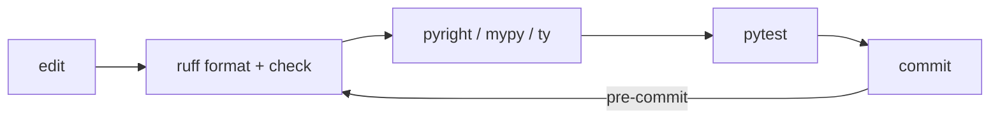
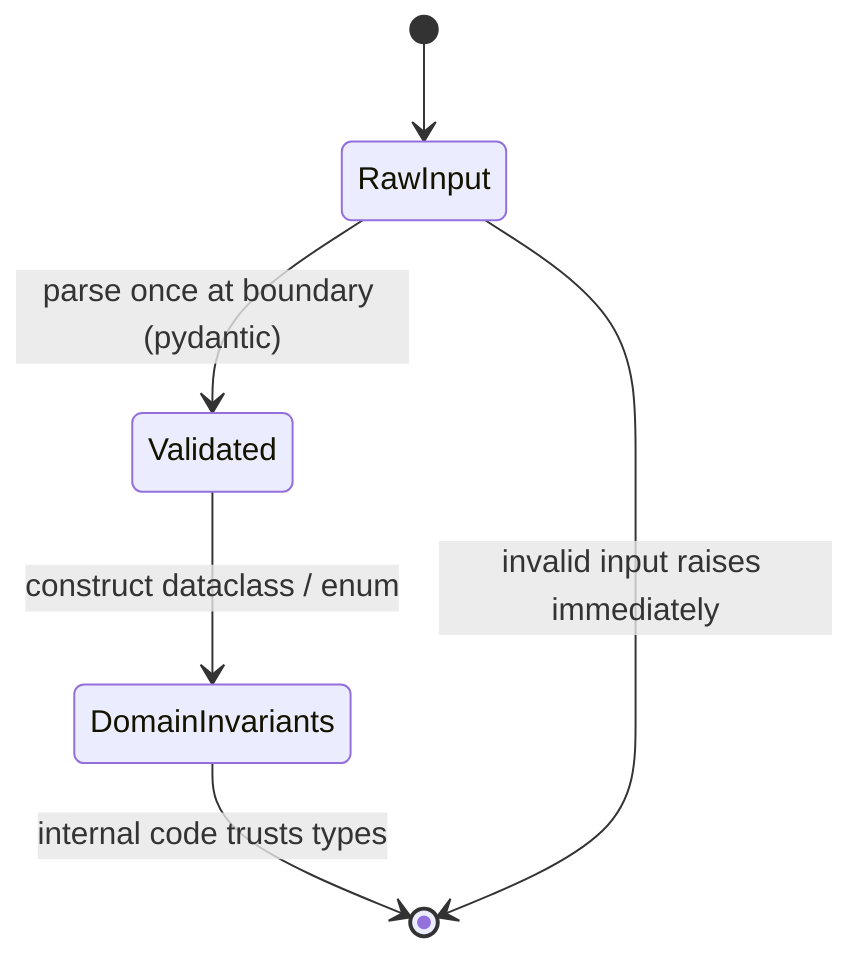

format: csm-deep-research/1

# PEP 20 and Idiomatic Python Practice — Consolidated Research Finding

## TL;DR

Doctrine: PEP 20 ("The Zen of Python") remains Python's active design doctrine in 2026 [R1,R5]; reading doctrine into practice is interpretation, labeled as such — explicitness, simplicity, and "one obvious way" serve as editorial tie-breakers when designs compete [R1,R3].
Practice: contemporary 2026 architecture looks like pyproject.toml-only metadata with uv + ruff as fastest-growing consensus (vendor positioning, not PyPA endorsement; Poetry/PDM/Hatch remain mainstream) [R13,R16,R18,R22], src layout as default project shape [R21,R38], gradual typing tightened toward strict with Protocols at seams and validation only at boundaries [R25,R26,R32], composition over inheritance via dataclasses/enums/plain functions [R50,R33,R52], EAFP error handling [R5,R57], sync-first code that goes async only when I/O-bound [R55,R56], and pytest suites (fixtures + selective property tests + doctests) in a fast CI loop [R37,R40,R47] — treating the aphorisms as trade-off axes, not rules [R3].
Reviewer basis: the idiomatic-rules corpus already exists as codified linter catalogs — mechanical tier = ruff's 900+ rules across ~55 plugin-derived families consumed verbatim [R86,R87,R66] → type tier = mypy/pyright (a policy boundary ruff's own FAQ draws) [R18] → judgment tier = design/functionality/complexity/comments/concurrency/test-validity, Google territory and not a linter's primary mandate [R99,R98]; severity borrows pylint's C/R/W/E/F classes plus Google's `Nit:` token rather than inventing a scale [R101,R97].
Human review physics (70–90% defect yield only within 200–400 LOC over 60–90 minutes) justify machine pre-screening of every diff and dictate ≤400-LOC finding chunks [R100,R99]; finding B's declared artifact `rules.json` remains the machine-readable deliverable.

## Executive Summary

Method: this file consolidates two committed research findings, both researched on 2026-08-22 via 5-track DEEP-tier runs in web mode with complete Challenge → Judge → Remediate pipelines. Finding A, "PEP 20 as the Basis for Modern Python Architecture (2026)" (commit c162f0d; tracks T1 zen-and-language, T2 tooling-and-layout, T3 typing-practice, T4 testing-quality, T5 design-and-architecture), supplies the doctrine/tooling/typing/concurrency/testing spine: K1-K14, D1-D8, and references R1-R60 (numbering unchanged here). Finding B, "Idiomatic Python Rules for a Specialized Code Reviewer" (commit b08b22b; tracks T1 linter-rule-catalogs, T2 antipatterns-gotchas, T3 modernization-rules, T4 authority-style-guides, T5 review-process-split), supplies the reviewer rule catalogs: its K1-K12 are renumbered K15-K26 and its D1-D9 renumbered D9-D17 here. Neither run's claims are re-adjudicated by this consolidation: verdicts are preserved verbatim, references are deduplicated into one contiguous R1-R135 list (four cross-source duplicate URLs merged), unconfirmed items are quarantined in a single merged Unverified Claims list (U1-U22), and both source journals are replaced by the provenance block in the Process Appendix.

```text
Finding A (c162f0d): 5-track DEEP x web -> Synthesis -> Challenge -> Judge FAIL
                     -> Remediate (11 fixes) -> Verified finding ------+
                                                                        +--> CONSOLIDATION (this file)
Finding B (b08b22b): 5-track DEEP x web -> Synthesis -> Challenge       |    K1-K26 | D1-D17 |
                     -> Judge FAIL (0.60 factual) -> Remediate -> V ----+    U1-U22 | refs R1-R135
```

Deliverables: the reviewer artifact `../artifacts/2026-08-22-python-idiomatic-reviewer-rules.json` (`rules.json`, 140 entries) remains the machine-readable deliverable of finding B — every cataloged rule maps to a lint code or is explicitly marked JUDGMENT — and this document is its human-readable companion. Strongest evidence assembled across both runs: PEP 20 is Active and glossary-documented with PEP 8 anchoring its own authority to it ("As PEP 20 says, 'Readability counts'") [R1,R4,R5]; PEP 751 (`pylock.toml`) is Final since 31-Mar-2025 [R22]; free-threading is officially supported (non-experimental) since Python 3.14 while remaining off the default build [R9,R10]; ruff's formatter renders >99.9% of lines identically to Black on the Django/Zulip corpora, de-risking migration [R19]; ruff's rule index confirms 900+ rules across ~55 plugin-derived families, so a reviewer consumes that layer rather than redefining it [R86,R87]; ruff's FAQ officially cedes type checking to mypy/pyright ("The tools are complementary") and notes pylint infers deeper [R18]; Google's presubmit/human division of labor defines what belongs to machines vs judgment [R99,R98]; SmartBear's Cisco-derived numbers quantify why machine pre-screening pays [R100].

## Key Findings

K1. CONFIRMED supported — PEP 20 is still the living design doctrine: Active informational PEP authored by Tim Peters (19-Aug-2004); glossary defines it; PEP 8 anchors itself in it ("As PEP 20 says, 'Readability counts'"); current Design FAQ still justifies syntax in Zen terms [R1,R4,R5,R6]

K2. CONFIRMED supported — The Zen functions as a trade-off rubric, not a rulebook: aphorisms deliberately tension each other ("Although practicality beats purity." vs "Special cases aren't special enough to break the rules."); Real Python (updated Feb 2026): "The aphorisms are guidelines, not strict rules" [R1,R3,R60]

K3. CONFIRMED partially-supported — Packaging metadata has consolidated onto pyproject.toml ("[build-system] table is strongly recommended"), but the wider tooling story is adoption + vendor positioning, not official PyPA endorsement: uv's "single tool to replace pip, pip-tools, pipx, poetry, pyenv, twine, virtualenv" pitch and ruff's flake8/black/isort/pyupgrade replacement claims come from Astral's own docs; formatter parity "> 99.9% of lines are formatted identically" vs Black on Django/Zulip likewise. Deprecation is narrowly scoped: only `python setup.py` CLI invocations are deprecated — setup.py/Setuptools as configuration files are NOT deprecated [R13,R14,R16,R18,R19]. Downgraded from supported: consolidation real, deprecation rescoped. Tooling pluralism is by design, not accident (finding-A K15, folded here): PEP 751's own motivation names "at least five well-known solutions" (PDM, pip freeze, pip-tools, Poetry, uv) [R22], so Poetry/PDM/Hatch remain mainstream alternatives making uv the fastest-growing consensus rather than the only path

K4. CONFIRMED supported — src layout is the mainstream project shape: PyPA's discussion page enumerates benefits and trade-offs ("The src layout helps prevent accidental usage of the in-development copy") without issuing a normative recommendation; the normative language is pytest's: "it is strongly suggested to use a src layout" (prepend import mode) [R21,R38]

K5. CONFIRMED supported — Dependency discipline splits libraries vs apps: libraries publish ranged abstract deps, never pinned ("It is not considered best practice to use install_requires to pin dependencies to specific versions"); apps pin exhaustive locks committed to VCS; PEP 751 pylock.toml Final (31-Mar-2025); uv.lock universal + committed but proprietary internally [R22,R23,R17]

K6. CONFIRMED supported — Typing is gradual, machine-checked, runtime-unenforced: "The Python runtime does not enforce function and variable type annotations"; Any is the sanctioned escape hatch; mypy lenient-by-default ("This is a feature!"), --strict too aggressive for large legacy codebases; pyright defaults to typeCheckingMode "standard", per-file `# pyright: strict` progression [R25,R28,R29,R30,R31]

K7. CONFIRMED supported — Validation lives at boundaries only: untrusted data parsed once through pydantic models guaranteeing OUTPUT types ("Pydantic guarantees the types and constraints of the output, not the input data"); stdlib dataclasses do no runtime type checking ("nothing in @dataclass examines the type specified") — "Use a data structure that makes illegal states unrepresentable" [R32,R33,R34,R53]

K8. CONFIRMED supported — Protocols (static duck typing) are the dependency-inversion seam: PEP 544 structural subtyping matches runtime duck typing; explicit ABC marking called "unpythonic"; typing team: "For arguments, prefer protocols and abstract types (Mapping, Sequence, Iterable, etc.)"; even plain modules can satisfy protocols — wiring stays framework-free [R26,R27,R36]

K9. CONFIRMED supported — Data modeling makes illegal states unrepresentable: official tutorial: idiomatic record-like bundling "is to use dataclasses"; NamedTuple assigns meaning to positions; Enum models closed state sets [R50,R33,R51,R52]

K10. CONFIRMED supported — Errors follow EAFP with flat hierarchies: glossary canonizes EAFP ("assumes the existence of valid keys or attributes and catches exceptions if the assumption proves false"); tutorial: derive user exceptions from Exception, "usually kept simple"; Zen: "Errors should never pass silently. Unless explicitly silenced." [R5,R57,R1]

K11. CONFIRMED partially-supported — Concurrency is pragmatic/sync-first: asyncio scoped to "IO-bound and high-level structured network code"; dedicated traps page warns async differs from sequential programming and CPU-bound code must never block the loop; free-threading officially supported non-experimental since 3.14, not yet default build. Marked partially-supported because no official source states "don't make everything async by default" in those words — the norm is inferred from official scoping [R55,R56,R8,R9,R10]

K12. CONFIRMED supported — Verification practice: plain asserts with introspection replace xUnit assert methods; fixtures are explicit/modular arrange-phase dependency injection; Hypothesis property tests complement unit tests ("a powerful addition... not always a replacement", round-trip properties first, 100 inputs default, shrinking, >4M weekly downloads); doctests = "literate testing"/"executable documentation" (pytest --doctest-modules); coverage gauges effectiveness not quality (maintainer: "100% test coverage doesn't really mean much", coverage should "enhance thought, not replace it"); Google ~70/20/10 unit/integration/E2E pyramid; SWE-at-Google documents over-mocking danger, pendulum swinging to realistic tests; GitHub's canonical Python CI = setup-python + ruff check + pytest --cov [R37,R38,R39,R40,R41,R42,R43,R44,R45,R46,R47]

K13. CONFIRMED supported — Language evolution itself models Zen balance: PEP 695 infers variance eliminating boilerplate ("eliminates the need for the redundant name and cumbersome variable names"); PEP 703 accepted with rollout "gradual and break as little as possible... roll back any changes that turn out to be too disruptive"; PEP 779 moved free-threading to phase II in 3.14; 3.12 added "Did you mean..." error hints; match/case introduced as soft keywords [R7,R8,R9,R11,R12]

K14. CONFIRMED supported — Governance caveat: Astral agreed March 2026 to join OpenAI's Codex team; keep the pylock.toml export path open to hedge monoculture risk — the same hedge governs adopting Astral's newer tools (e.g., the `ty` type checker): keep checker and metadata portability open [R20,R17]

K15. CONFIRMED supported — The idiomatic-rules corpus already exists as codified linter catalogs: ruff alone ships 900+ rules at retrieval time (pin the ruff version when building — see U16) across ~55 plugin-derived families (prefix = source plugin, code = PREFIX+3–4 digits), with a verified default set of ~400 rules; a reviewer should consume, not redefine, that layer [R86,R87,R66]

K16. CONFIRMED supported — Rules split cleanly into three enforcement tiers — mechanical (lint codes), semantic-static (type checkers), judgment (human/expert) — and the boundary is official policy, not tooling immaturity: ruff's FAQ states "Ruff is a linter, not a type checker... a type checker will catch certain errors that Ruff would miss", while Google's SWE-book assigns formatting/lint/type-check to presubmits so humans review design and comprehension [R18,R99,R98]

K17. CONFIRMED supported — A correctness-tier flag set every reviewer must surface exists and is lint-coded: F401/F811/F821/F841 (unused/redefined/undefined/unused-var), F632 is-literal, E711/E712/E722/W605, plus the bugbear class B006/B008/B023/B904/B905/B012/B019/B011 etc., which is the highest-value family because each code encodes a documented failure mode [R61,R62,R63,R64,R65,R68,R69,R70,R71,R75,R76,R77,R78,R79,R80,R88]

K18. CONFIRMED supported — Non-lintable gotcha classes require judgment review because default linters miss them: mutable class attributes shared across instances (the tutorial's own Dog example calls it "mistaken use of a class variable"), `*` replication aliasing, tuple-element augmented assignment that mutates then raises, assignment-localization UnboundLocalError beyond F821's reach, bool-subclasses-int, mutators-return-None conventions [R50,R89]

K19. CONFIRMED supported — Modernization is a safe-suggestion tier gated by target-version: UP-family + pyupgrade rewrites (PEP 585 generics, PEP 604 unions, PEP 695 type aliases, f-strings, yield from, removeprefix, functools.cache, subprocess text=True, datetime.UTC); fixes are unsafe when runtime annotation consumers exist (Pydantic pre-3.9/3.10), which is why UP006/UP007 ship escape hatches (`keep-runtime-typing`) [R73,R72,R74,R91,R94]

K20. CONFIRMED supported — Complexity gates approximate reader-relative comprehension but do not replace it: mccabe C901 ("anything that goes beyond 10 is too complex"), pylint PLR0912/0913/0915 branch/arg/statement thresholds, radon CC weights — while Google defines "too complex" as "can't be understood quickly by code readers"; gates are proxies the reviewer's judgment completes [R92,R83,R81,R82,R93,R98]

K21. CONFIRMED partially-supported — Authority hierarchy has real conflicts reviewers must parameterize via project config rather than dogma: line length (PEP 8 says 79 with ≤99 opt-in / pyguide+black ecosystem 88 / ruff default 88), import style (PEP 8 three-group ordering vs pyguide packages-and-modules-only + no-relative-imports), dunder privacy (PEP 8 documents name mangling as a feature vs pyguide discouraging it for readability/testability). Marked partially-supported because shipped pylint threshold defaults were unconfirmed against docs examples [R4,R58,R67]

K22. CONFIRMED supported — Docstring discipline is fully codified and mechanically checkable: PEP 257 principles + D-rules (D100–D107 presence incl. `__init__`, D200/D205/D209 shape, D300/D400/D401/D415 form); caveat: www.pydocstyle.org now serves hijacked gambling content, so implementations should target ruff's pydocstyle reimplementation or the PyCQA source directly [R95,R96]

K23. CONFIRMED supported — Test-quality rules are a distinct reviewer deliverable spanning both tiers: PT011/PT012 and bugbear B017 ("assertRaises(Exception)... should be considered evil") are lint-coded, but assertion usefulness and false-positive risk are human judgment — Google: "Tests do not test themselves... a human must ensure that tests are valid" [R84,R85,R88,R98]

K24. CONFIRMED supported — Severity vocabulary should be borrowed, not invented: pylint's five message classes encode ready-made semantics ((C) convention < (R) refactor < (W) warning < (E) error/probable-bug < (F) fatal) and Google reviews already route urgency via Nit:/suggestion/must-fix tokens; mapping reviewer findings onto these lets teams reuse existing triage [R101,R97]

K25. CONFIRMED partially-supported — Human review physics justify the tool: 70–90% defect yield achieved only within 200–400 LOC over 60–90 minutes, defect density drops above ~500 LOC/hour, sessions degrade after ~60 minutes (Cisco study via SmartBear, vendor-reported = medium confidence); Google independently converges on ~200-line CLs reviewed within about a day [R100,R99]

K26. CONFIRMED supported — Reviewer positioning: consume linter+typechecker output as context, then judge exactly the categories Google says need humans — Design, Functionality, Complexity, Comments-semantics, test-validity, concurrency — framed as code-health deltas under approval-on-improvement ("favor approving a CL once it definitely improves overall code health"), never as pass/fail gates [R98,R99,R97]

## Detail Sections

### D1 Doctrine & standing (expands K1,K2,K13)

PEP 20 is a living, cited, informational doctrine whose aphorisms trade off against each other by design [R1,R3]. Full text as published:

```text
Beautiful is better than ugly.
Explicit is better than implicit.
Simple is better than complex.
Complex is better than complicated.
Flat is better than nested.
Sparse is better than dense.
Readability counts.
Special cases aren't special enough to break the rules.
Although practicality beats purity.
Errors should never pass silently.
Unless explicitly silenced.
In the face of ambiguity, refuse the temptation to guess.
There should be one-- and preferably only one --obvious way to do it.
Although that way may not be obvious at first unless you're Dutch.
Now is better than never.
Although never is often better than *right* now.
If the implementation is hard to explain, it's a bad idea.
If the implementation is easy to explain, it may be a good idea.
Namespaces are one honking great idea -- let's do more of those!
```

Standing today: Active informational PEP by Tim Peters (19-Aug-2004); the official glossary defines "The Zen of Python"; PEP 8 derives style authority from it ("As PEP 20 says, 'Readability counts'"); the Design FAQ still justifies syntax choices in Zen terms [R1,R4,R5,R6]. History: first posted 4 June 1999 to python-list as "The Way of Python" [R60,R2]; the rot13 `import this` easter egg was smuggled into Python 2.1/2.2 after Tim Peters' entry won the IPC10 T-shirt contest [R2]; the odd spacing around the double dashes in the one-obvious-way line is a deliberate joke per Peters [R3]. Language evolution keeps modeling the balance (K13): PEP 695 removes generic boilerplate [R7]; PEP 703 mandates gradual, reversible rollout of free-threading [R8]; PEP 779 promoted free-threading to officially supported in 3.14 without changing defaults [R9]; 3.12 shipped friendlier "Did you mean ..." error hints [R11]; match/case landed as soft keywords to avoid breaking existing code [R12].

### D2 Zen as decision rubric (expands K2)

Run competing designs down the tree; aphorisms act as tie-breaker axes, not absolute rules — Real Python (updated Feb 2026): guidelines, not strict rules [R1,R3].

```text
Design decision?
 |-- one caller needs a special case? --> resist config-flag creep
 |     unless genuinely practical -----> practicality beats purity (add it)
 |-- two plausible designs? -----------> pick the one easier to explain (easy-to-explain rule)
 |-- nesting deeper than 2 levels? ----> flatten: flat is better than nested
 |-- silent except: pass? -------------> forbidden unless explicitly silenced
 |-- guessing at input shape? ---------> refuse: parse and validate at edge
```

### D3 Project shape & tooling (expands K3,K4,K5,K14)

Adopt pyproject.toml-only metadata; uv + ruff reflect the fastest-growing consensus as positioned by Astral's own documentation — adoption/vendor positioning, not PyPA endorsement [R13,R15,R16,R17,R18,R22]. Pluralism stands: PEP 751's motivation names "at least five well-known solutions" (PDM, pip freeze, pip-tools, Poetry, uv) [R22], so Poetry/PDM/Hatch remain legitimate choices (folded into K3). Shape projects as src layout, pin apps / range libraries, keep the pylock.toml export path open.

Dev/CI loop:



Canonical project tree:

```text
project/
├── pyproject.toml
├── README.md
├── uv.lock
├── src/
│   └── pkg/
│       ├── __init__.py
│       └── py.typed
└── tests/
    └── test_pkg.py
```

Notes: local hooks mirror CI via `pre-commit run --all-files` before push [R24]; GitHub's canonical Actions recipe is setup-python → ruff → pytest --cov [R47]; apps commit uv.lock while libraries publish ranged deps [R17,R23]; governance caveat — Astral joined OpenAI's Codex team (March 2026), so interop exports hedge monoculture risk; the same hedge covers newer Astral tools like `ty` — keep mypy/pyright portability open [R20].

### D4 Typing posture (expands K6,K8)

Annotate everything new, machine-check gradually toward strict, enforce nothing at runtime, invert dependencies through Protocols [R25,R26,R28,R29,R30,R31]. Checker landscape: mypy, pyright, and Astral's fast-rising `ty` (newcomer; not independently fetched this run) — weigh `ty` adoption under the K14 governance hedge.

Spectrum:

```text
lenient (mypy default) ---> standard (pyright default) ---> strict (per-file opt-in)
  untyped code allowed        typeCheckingMode="standard"     # pyright: strict
  "This is a feature!"        catches real bugs early         tighten module-by-module
```

[R29,R30] Runtime stance: "The Python runtime does not enforce function and variable type annotations"; `Any` remains the sanctioned escape hatch when precision is impossible [R25,R28]. Modern generics (PEP 695):

```python
class Repo[T]:
    def all(self) -> Sequence[T]: ...

def first(items: Sequence[T]) -> T:
    return items[0]
```

[R7] Protocol seam (static duck typing — even plain modules satisfy protocols):

```python
class Clock(Protocol):
    def now(self) -> datetime: ...

def is_stale(ts: datetime, *, clock: Clock, ttl: timedelta) -> bool:
    return clock.now() - ts > ttl
```

[R26,R27,R36] Anti-pitch reminder: annotations serve humans first — "Readability counts." [R35,R1]. Overlap note: target-version-gated annotation rewrites (UP006/UP007, PEP 695 aliases) are cataloged on the reviewer side — see also D12.

### D5 Data & boundaries (expands K7,K9)

Parse untrusted input once into validated models at the edge; inside the core, trust types carried by dataclasses/enums/plain functions — composition over inheritance [R32,R33,R34,R49,R50,R51,R52,R53,R54,R59].



Why the split: "Pydantic guarantees the types and constraints of the output, not the input data" [R32]; stdlib dataclasses perform no runtime checking — "nothing in @dataclass examines the type specified" (pydantic dataclasses add validation while keeping dataclass ergonomics) [R33,R34]; design records so illegal states are unrepresentable [R53]. Idiomatic bundling: dataclasses; positional meaning: NamedTuple; closed sets: Enum [R50,R51,R52]. Plain functions remain legitimate architecture (historical caution: "Stop Writing Classes") [R59,R49].

### D6 Error handling (expands K10)

EAFP with flat exception hierarchies; never silence errors without intent [R5,R57,R1,R58]. Overlap note: the lint-coded error-handling flags (bare `except:`, blind `except Exception:`, `raise`-without-`from`) are cataloged on the reviewer side — see also D9.

```python
# EAFP (glossary-canonized): assume validity, catch failure
try:
    timeout = cfg["timeout"]
except KeyError:
    timeout = DEFAULT_TIMEOUT

# LBYL contrast (ask permission first): extra race surface, noisier
timeout = cfg["timeout"] if "timeout" in cfg else DEFAULT_TIMEOUT
```

[R5,R57]

```python
class ConfigError(Exception): ...          # base, derived from Exception per tutorial
class ConfigNotFoundError(ConfigError): ...
class ConfigParseError(ConfigError): ...
```

[R57,R58] Zen guardrail: "Errors should never pass silently. Unless explicitly silenced." [R1].

### D7 Concurrency pragmatism (expands K11)

Default to synchronous code; reach for asyncio only for I/O-bound, structured network workloads; CPU-bound goes to processes or free-threaded builds [R55,R56,R8,R9,R10].

```text
workload?
 |-- IO-bound, high-level structured network --> asyncio justified [R55,R56]
 |-- CPU-bound -------------------------------> processes or free-threaded build [R8,R9,R10]
 |-- mixed -----------------------------------> sync core + async adapters at edges [R55,R56]
```

Guardrails: asyncio self-describes as for "IO-bound and high-level structured network code"; its dev guide warns async differs from sequential programming and CPU-bound work must never block the loop [R55,R56]. Free-threading is officially supported since 3.14 but is not yet the default build [R9,R10].

### D8 Verification practice (expands K12)

Fast pytest loop — plain asserts, fixture-injected collaborators, property tests on parsers/round-trips, doctests for API examples, coverage as gauge not goal [R37,R38,R39,R40,R41,R42,R43,R44,R47]. Overlap note: lint-coded test-quality rules (PT009/PT011/PT012/B017) plus the judgment half of test validity are cataloged on the reviewer side — see also D14.

Test pyramid (~70/20/10):

```text
          /  \            E2E            ~10%
         /----\
        /      \          integration     ~20%
       /--------\
      /          \        unit            ~70%
     --------------
```

[R45,R46] Fixtures = arrange-phase dependency injection:

```python
@pytest.fixture
def repo(tmp_path):
    r = Repo(tmp_path)
    yield r
    r.close()

def test_roundtrip(repo):
    repo.put("k", "v")
    assert repo.get("k") == "v"
```

[R38,R39] Property tests complement unit tests ("a powerful addition... not always a replacement"); start with round-trips; Hypothesis shrinks failures, 100 examples default:

```python
@given(st.text())
def test_slug_roundtrip(s):
    assert parse_slug(render_slug(s)) == normalize(s)
```

[R40] Doctests = literate testing / executable documentation (`pytest --doctest-modules`):

```python
def slugify(text: str) -> str:
    """Return a URL-safe slug.

    >>> slugify("Hello, World!")
    'hello-world'
    """
```

[R41,R42] Coverage philosophy: gauges effectiveness, not quality — Ned Batchelder: "100% test coverage doesn't really mean much"; coverage should "enhance thought, not replace it" [R43,R44]. Google's pyramid [R45]; Software Engineering at Google documents over-mocking danger and the pendulum swinging back to realistic tests [R46]. Canonical CI: setup-python → ruff check → pytest --cov [R47]. Optional mutation gate before risky refactors: mutmut [R48].

### D9 Correctness & likely-bug tier (expands K17)

Mechanical correctness/likely-bug flags — every code encodes a documented failure mode; the highest-value lint-coded layer a reviewer surfaces verbatim (K17). Overlap note: complements the EAFP/flat-hierarchy doctrine posture in finding A — see also D6.

| Rule | Detects | Fix | Cite |
|---|---|---|---|
| F401 | Imported name never referenced (`{name}` imported but unused) | remove import (auto-fix) | [R61] |
| F811 | Name redefined before any use of prior definition (duplicate import/function) | drop or rename first def | [R62] |
| F821 | Reference to name not defined in scope (typos, missing imports) | fix name / add import | [R63] |
| F841 | Local variable assigned but never read | `_ = compute()`, del, or use value | [R64] |
| F632 | `is`/`is not` compared against string/number literals | `==` — "Use `==` to compare constant literals" | [R65] |
| F541 | f-string without any `{}` placeholders | drop the `f` prefix | [R102] |
| E711 | `==`/`!=` against `None` | `is None` / `is not None` | [R68] |
| E712 | `== True`/`== False` — "Avoid equality comparisons to `True`; use `{cond}:`" | use condition directly | [R69] |
| E722 | `except:` with no exception type | `except Exception:` at widest | [R70] |
| W605 | Invalid `\x` escape in non-raw string | raw string / correct escape | [R71] |
| B001 | Bare `except:` ≡ `except BaseException:` — swallows SystemExit/KeyboardInterrupt and typo NameErrors | `except Exception:` (re-raise if needed) | [R88] |
| B004 | `hasattr(x,'__call__')` as callable test — unreliable (custom `__getattr__`, non-callable `__call__`) | `callable(x)` | [R88] |
| B005 | `.strip()` with multi-character arg strips a char SET, not substring (`"text.txt".strip("tx.")` → `"e"`) | `.removeprefix()`/`.removesuffix()`/`.replace()` | [R88] |
| B006 | Mutable literal default (`[]`, `{}`, `set()`) created once at def time and shared across calls | `None` sentinel, create inside | [R75],[R88] |
| B008 | Call in default (`def log(msg, ts=time.time())`) frozen at def time; FastAPI `Depends()` exempt via `extend-immutable-calls` | sentinel + evaluate inside | [R76],[R88] |
| B009/B010 | getattr/setattr/delattr with constant attribute names — no added safety, defeats static analysis/rename tooling | `obj.name` direct access | [R88] |
| B011 | `assert False` — stripped under `python -O` | `raise AssertionError()` | [R79],[R88] |
| B012 | return/break/continue inside `finally` implicitly cancels active exception, overrides try/except returns | move flow control out of `finally` | [R88] |
| B013/B014/B025/B029 | Except-handler defects: length-one tuple `(ValueError,)`; redundant types `(Exception, TypeError)`; duplicate handlers across clauses; `except ()` catches nothing | fix tuple/ordering/remove duplicates | [R88] |
| B015/B016/B018 | Pointless statements: comparison as statement (`value == expected`); `raise 'oops'` raises literal (TypeError); useless expressions incl. trailing-comma tuples (`print(x),`) and side-effect-free calls | delete or make side-effecting | [R88] |
| B022 | `contextlib.suppress()` with no arguments suppresses nothing | pass exception type or drop | [R88] |
| B023 | Closure defined in loop references loop variable without binding — reads at call time (`[lambda x: x+i for i in range(3)]` all see final i) | default-arg bind `lambda x, i=i:` | [R77],[R88] |
| B024/B027 | ABC with no abstract methods / empty concrete-looking stub methods missing @abstractmethod — instantiation contract silently unenforced | add @abstractmethod or drop ABC | [R88] |
| B031 | itertools.groupby result / sub-iterator reused or consumed twice | materialize groups fresh (dict/sorted) | [R88] |
| B904 | `raise` inside `except` lacking `from err`/`from None` — chained context lost | `raise RuntimeError(...) from exc` / `from None` | [R78],[R88] |
| B905 | `zip()` without explicit `strict=` — silent truncation risk | `zip(..., strict=True/False)` | [R80],[R88] |
| B909 | Mutation of loop iterable while iterating (`for x in items: items.remove(x)`) — skipped elements | iterate a copy / build new list (opinionated) | [R88] |
| B019 | functools.lru_cache/cache/alru_cache on instance methods — cache keys retain `self`, instances never GC'd (memory leak) | move cache off instance methods | [R88] |
| BLE001 | Blind `except Exception:` swallowing any error with no re-raise/logging intent | narrow the type, log, or re-raise (opinionated) | [R131] |
| F405 | Name possibly undefined because it may come from `from x import *` star-imports | import names explicitly | [R132] |
| F822 | Name listed in `__all__` but not defined/imported in the module | define or import the exported name | [R133] |
| B036 | `except BaseException:` without re-raising — catches SystemExit/KeyboardInterrupt | `except Exception:` or re-raise | [R134] |

### D10 Judgment-only gotchas (expands K18)

Gotchas default linters structurally miss — the reviewer's judgment-tier core (K18); rows 9–10 are partially lint-covered (B004, B031).

| Gotcha | Failure mode | Example | Why linters miss it | Cite |
|---|---|---|---|---|
| Mutable class attribute shared across instances | Class attr lookup walks instance→class chain; `self.tricks.append(t)` mutates the one class-level object for all instances | tutorial Dog `tricks=[]` → both dogs share `['roll over','play dead']` | tutorial itself calls it "mistaken use of a class variable"; valid syntax, no AST signature | [R50] |
| `*` replication aliasing | `*` replicates references, not copies — "rows" are one object; writing one writes all | `A=[[None]*2]*3; A[0][0]=5` → 5 in every row | FAQ: "replicating a list with * doesn't create copies, it only creates references"; no standard lint | [R89] |
| Tuple `+=` mutation-then-raise | `a_tuple[0] += x` desugars get→`__iadd__`(mutates list in place)→setitem(TypeError) — state changed despite exception | `(['foo'],'bar')[0] += ['item']` → TypeError yet element == `['foo','item']` | two-step bytecode semantics behind ordinary-looking augmented assignment | [R89] |
| Assignment-localization UnboundLocalError | any assignment anywhere makes the name local for the whole scope; earlier reads hit the uninitialized local | `x=10`; `def foo(): print(x); x+=1` → UnboundLocalError | F821-family catches many cases; complex flows stay judgment | [R89] |
| isinstance(True, int) | bool subclasses int — numeric isinstance checks accept booleans | `isinstance(True,int)` → True; `sum([True,True])` → 2 | valid-code type-hierarchy fact; intent unknowable statically (checkers flag only narrowed unions) | [R50] |
| Mutators return None (`sort()`) | in-place methods return None by convention to distinguish mutation; chaining yields None downstream | `result = y.sort()` → result is None | FAQ: mutating methods "return None to help avoid getting the two types of operations confused"; mypy catches some, flake8 none | [R89] |
| `str +=` quadratic build | immutable str reallocates each concatenation — quadratic total cost; CPython in-place optimization non-portable | `s=''`; `for part in parts: s+=part` | performance-not-correctness; perf linters rarely flag | [R89,R4] |
| Long elif chains → dict dispatch | O(n) branching, hard to extend, easy to fall through; dict-of-functions flat and data-driven ("primary technique used to emulate a case construct") | `if cmd=='go': a() elif cmd=='stop': b()` … | complexity linters count branches, never propose the rewrite | [R89] |
| hasattr(x,'__call__') partial | custom `__getattr__` or non-callable `__call__` gives false positives; `callable()` is authoritative | `if hasattr(x,'__call__'): x()` | PARTIAL coverage: bugbear B004 flags exactly this form; variants stay judgment | [R88] |
| groupby reuse | groupby's sub-iterator is exhausted after one pass; consuming the grouped result twice silently yields empties | iterating `groupby` output twice | iterator-protocol behavior, not syntax; bugbear B031 covers the reuse pattern | [R88] |

### D11 Idiom & simplification tier (expands K15)

Safe-suggestion rewrites — split by default status: the C4xx family and E731 are default-enabled; SIM105/SIM108, RET504/RET505, PERF401 are opt-in selects; consumed verbatim, not redefined (K15).

| Rule | Detects → rewrite | Cite |
|---|---|---|
| C400 | `list(x for x in y)` generator-inside-list → list comprehension | [R103] |
| C408 | `dict()`/`tuple()`/`list()` with no/literal args → `{}`/`()`/`[]` literals | [R104] |
| C414 | nested redundant casts/processes `list(set(x))` → `set(x)`; `sorted(list(x))` | [R105] |
| C417 | `map(lambda …)` → comprehension/listcomp | [R106] |
| SIM102 | nested `if` with single inner `if` → combined `if a and b:` | [R107] |
| SIM105 | `try/except X: pass` → `contextlib.suppress(X)` | [R108] |
| SIM108 | assign-in-both-branches if/else → ternary (suppressed if line would exceed max length; opinionated, coverage-tooling caveat) | [R109] |
| SIM117 | nested `with` blocks → single `with open(a) as f, lock:` | [R110] |
| SIM118 | `k in d.keys()` → `k in d` | [R111] |
| RET501 | explicit `return None` when only return path → bare `return` (only default-enabled RET rule) | [R112] |
| RET504 | assign local then immediately `return name` → return expression directly | [R113] |
| RET505 | `else:` after branch that returns → dedent | [R114] |
| PERF401 | for-loop appending transformed items → list comp `out=[f(x) for x in xs]` | [R115] |
| PERF402 | for-loop copying items → `list(src)` / `src.copy()` | [R116] |
| PERF203 | try/except wrapping loop body → hoist outside loop (speed) | [R117] |
| PIE790 | redundant `pass`/`...` placeholder alongside other statements → delete | [R118] |
| PIE794 | class field defined twice (second silently wins) → remove duplicate | [R119] |
| E731 | `f = lambda …` assignment → `def` statement | [R120] |
| PLR2004 | comparison against unnamed magic constant → named constant | [R121] |

### D12 Modernization tier (expands K19)

UP-family + pyupgrade rewrites gated on `target-version`; unsafe where runtime annotation consumers exist — the reason UP006/UP007 ship `keep-runtime-typing` escape hatches (K19). Overlap note: these are the same annotation rewrites the doctrine posture adopts — see also D4.

| Rewrite | Before → After | Gate/caveat | Cite |
|---|---|---|---|
| UP006 non-pep585-annotation | `typing.List[int]` → `list[int]` | target ≥3.9 or `__future__ import annotations`; fix unsafe pre-3.9 (Pydantic-style runtime annotation consumers); `lint.pyupgrade.keep-runtime-typing` opt-out | [R72] |
| UP007+UP045 union/optional | `Union[int, str]` → `int \| str`; `Optional[X]` handled by sibling UP045 | target ≥3.10 or future-annotations; unsafe fix pre-3.10; same escape hatch | [R73] |
| UP008 super-call-with-parameters | `super(B, self).foo()` → `super().foo()` | rewrite valid iff arg1 is `__class__` and arg2 is enclosing method's first arg; fix unsafe (comment loss) | [R122] |
| UP015 redundant-open-modes | `open(f, "r")` → `open(f)` | safe autofix | [R123] |
| UP024 os-error-alias | `IOError`/`EnvironmentError` → `OSError` | canonical builtin names post-aliasing | [R124] |
| UP031 printf-string-formatting | `"%s, %s" % (a, b)` → `"{}, {}".format(a, b)` / f-string | ambiguous `"%s" % val` gets no safe fix (tuple-vs-scalar semantics differ) | [R125] |
| UP032 f-string | `"{}".format(x)` → `f"{x}"` | skips cases with unpacking/format-specifier edge cases | [R126] |
| UP040 non-pep695-type-alias | assignment / `TypeAlias` alias → PEP 695 `type X = …` | target-version gated (PEP 695 = 3.12+) | [R127] |
| UP042 replace-str-enum | `class Foo(str, enum.Enum)` → `class Foo(enum.StrEnum)` | target ≥3.11; deliberate behavior choice — restores 3.10-style `str(Foo.BAR)` formatting broken by 3.11 change | [R74] |
| yield → yield from | `for x in y:\n    yield x` → `yield from y` | delegation clarity/perf | [R91] |
| py39 stdlib niceties | startswith-slice → `x.removeprefix(y)`; `@functools.lru_cache(maxsize=None)` → `@functools.cache`; `' '.join(shlex.quote(a) for a in cmd)` → `shlex.join(cmd)` | --py39-plus / target ≥3.9 | [R91] |
| subprocess.run kwargs | `universal_newlines=True` → `text=True`; `stdout=PIPE, stderr=PIPE` → `capture_output=True` | --py37-plus / target ≥3.7 | [R91] |
| datetime.UTC | `datetime.timezone.utc` → `datetime.UTC` | --py311-plus / target ≥3.11 | [R91] |
| DTZ003 call-datetime-utcnow | `datetime.datetime.utcnow()` → `datetime.datetime.now(tz=datetime.timezone.utc)` (or `tz=datetime.UTC` on 3.11+) | utcnow returns naive datetime — cannot be compared/located unambiguously; always prefer tz-aware | [R94] |
| six/mock/__future__ removals | `six.text_type` → `str`; `six.iteritems(dct)` → `dct.items()`; `six.with_metaclass(M, B)` → `class C(B, metaclass=M)`; `from mock import patch` → `from unittest.mock import patch`; obsolete `__future__` imports dropped | dead py2 shims once target ≥3.x; `--keep-mock` opt-out exists | [R91] |
| version-gated dead blocks | `if sys.version_info < (3, 6): … else: …` → keep else-body only; satisfied pytest skipif markers dropped | unreachable compat code; if-without-else left alone (syntax-error risk) | [R91] |

### D13 Naming, style & docstrings (expands K21,K22)

**Table A — Authority style rules** (mechanically checkable; consume via formatter/linter, surface only violations the configured tools miss).

| Rule | Check | Authority | Cite |
|---|---|---|---|
| naming-case-conventions | CapWords classes, lowercase snake_case functions/modules, ALL_CAPS constants; first arg `self` (instance) / `cls` (class) methods; never `l`/`O`/`I` as single-char names | PEP 8 §Naming Conventions | [R4] |
| underscore-semantics | `_leading` = weak internal; `__double_leading` invokes mangling; never invent `__dunder__` names | PEP 8 §Descriptive Naming | [R4] |
| imports-one-per-line | `import os, sys` banned (`from x import a, b` exempt) | PEP 8 §Imports | [R4] |
| import-group-order | stdlib → third-party → local, blank line between groups, after docstring/globals | PEP 8 §Imports | [R4] |
| absolute-imports | absolute preferred; explicit relative acceptable | PEP 8 §Imports | [R4] |
| wildcard-import-ban | any `from x import *` (sole exception: republishing internal API) | PEP 8 §Imports | [R4] |
| module-dunder-placement | `__all__`/`__version__` after docstring, before imports except `from __future__` | PEP 8 §Module Level Dunders | [R4] |
| top-level-blank-lines | two blank lines around top-level defs/classes; one between methods | PEP 8 §Blank Lines | [R4] |
| keyword-default-spacing | no spaces around `=` in kwargs/unannotated defaults; spaces when annotated default | PEP 8 §Other Recommendations | [R4] |
| none-singleton-comparison | `is`/`is not` for None; `x is not None` over `not x is None`; beware truthiness where None-check intended | PEP 8 §Programming Recommendations | [R4,R58] |
| return-consistency | all returns return an expression or none do; otherwise explicit `return None` | PEP 8 §Programming Recommendations | [R4] |
| exceptions-from-Exception + Error suffix | derive from `Exception` not `BaseException`; error exceptions named `*Error` | PEP 8 §Programming Recommendations | [R4,R58] |
| bare-except-ban/minimal-try | specific exceptions; widest legal catch is `except Exception:`; try clause minimal | PEP 8 §Programming Recommendations | [R4,R58] |
| startswith-endswith | prefix/suffix checks via methods, not slicing `foo[:n]=='bar'` | PEP 8 §Programming Recommendations | [R4] |
| isinstance-not-type-compare | `isinstance(obj, int)` not `type(obj) is type(1)` | PEP 8 §Programming Recommendations | [R4] |
| bool/empty-seq truthiness | no `== True/False`, no `if len(seq):` — use `if seq:` / `if not seq:` | PEP 8 §Programming Recommendations | [R4,R58] |
| trailing-commas | mandatory in singleton tuples; banned same-line-as-closer elsewhere; encouraged one-per-line for VCS-diffed collections | PEP 8 §When to Use Trailing Commas | [R4] |
| max-line-length | PEP 8: 79 default, ≤99 team opt-in, comments/docstrings 72; ruff default 88 | PEP 8 §Maximum Line Length; ruff E501 | [R67] |
| indentation | 4 spaces per level; no tabs; never mix tabs and spaces | PEP 8 §Indentation | [R67] |
| lint-run-required | linter run enforced in CI; suppressions searchable symbolic form | pyguide §2.1 | [R58] |
| imports-modules-only-no-relative | import packages/modules only (typing/abc exempt); no relative imports | pyguide §2.2–2.3 | [R58] |
| assert-not-for-preconditions | no `assert` for validation/control flow (removable without breakage); pytest asserts exempt | pyguide §2.4 | [R58] |
| custom-exception-rules | must inherit existing exception; `Error` suffix; no repetition (`foo.FooError`) | pyguide §2.4 | [R58] |
| catch-all-ban | `except:`/`except Exception:` only when re-raising or deliberate isolation point | pyguide §2.4 | [R58] |
| avoid-mutable-global-state | mutable globals internal (`_`-prefixed) with accessors; constants ALL_CAPS module-level | pyguide §2.5 | [R58] |
| mutable-default-args | no mutable/call defaults (`[]`, `{}`, `time.time()`); None-sentinel + rebind | pyguide §2.12 | [R58] |
| properties-trivial-only | properties cheap/straightforward/surprising-free; hand-rolled descriptors = power feature | pyguide §2.13 | [R58] |
| true-false-evaluation | `is None` always; never `== False`; empty-seq truthiness; watch `x or []` falsy conflation | pyguide §2.14 | [R58] |
| thread-atomicity | don't rely on builtin-type atomicity or bare assignment sync; prefer Queue | pyguide §2.18 | [R58] |
| power-features-banned | metaclasses, bytecode access, exec, monkey-patching, dynamic inheritance, import hacks, `__del__` cleanup in app code (stdlib-internal *use* OK) | pyguide §2.19 | [R58] |
| type-annotate-public-api | annotate public APIs added/modified; enable static checking in build | pyguide §2.21/§3.19.1 | [R58] |
| todo-comment-format | `TODO: link - explanation`; owner-only parenthesized style discouraged | pyguide §3.12 | [R58] |
| main-guard-required | executables: logic in `main()` behind `if __name__ == '__main__':` | pyguide §3.17 | [R58] |
| dunder-discouraged | `__mangled` attrs hurt readability/testability, aren't private — prefer `_single`; filenames `.py`, no dashes | pyguide §3.16.2–3.16.3 | [R58] |
| logging-lazy-percent-format | logger calls take literal `%`-format template + args, never f-strings/pre-interpolated | pyguide §3.10.1 | [R58] |

**Table B — Docstring discipline** (fully codified; caveat noted once here: www.pydocstyle.org now serves hijacked gambling content — D-rule semantics were mined from PyCQA/pydocstyle `checker.py` source; implementations should target ruff's pydocstyle reimplementation or the PyCQA repo directly [R96]; quarantined as U11).

| Rule | Check | Authority | Cite |
|---|---|---|---|
| coverage | public modules, exported functions/classes, public methods incl. `__init__` have docstrings | PEP 257 | [R95] |
| triple-double-quotes-always | `"""` everywhere; `r"""` when backslashes present | PEP 257 | [R95] |
| one-liner-imperative-no-signature | phrase ending in period, command mood ("Do this", not "Returns the…"); never restate signature | PEP 257 | [R95] |
| multiline-summary-blank-close | summary line + blank line + body; closing quotes on own line unless one-liner | PEP 257 | [R95] |
| D100–D107 presence | missing docstring on module/package/class/public function/method/magic method/`__init__` (public = in `__all__` or no `_` prefix) | pydocstyle D-codes | [R96] |
| D200 | one-liner fits on one physical line with quotes | pydocstyle D-codes | [R96] |
| D205 | exactly one blank line between summary and description | pydocstyle D-codes | [R96] |
| D209 | multi-line closing quotes on separate line | pydocstyle D-codes | [R96] |
| D300 | triple-double-quotes used (`'''` only when body contains `"""`) | pydocstyle D-codes | [R96] |
| D400/D415 | first line ends with period (D400) / `.!?` punctuation (D415) | pydocstyle D-codes | [R96] |
| D401 | first line imperative mood ("Do", not "Does"); skipped for tests and `@property` | pydocstyle D-codes | [R96] |

### D14 Test-quality rules (expands K23)

Overlap note: the practice-layer counterpart (fixtures as DI, property tests, doctests, coverage philosophy) is finding A's verification section — see also D8.

| Rule | Detects | Tier | Cite |
|---|---|---|---|
| PT009 | unittest-style `self.assert*` calls inside pytest tests → plain `assert` statements | lint | [R130] |
| PT011 | `pytest.raises(Exception)` overly broad — test green even if tested code never ran | lint | [R84] |
| PT012 | multiple statements in `pytest.raises()` block — may mask which statement raised | lint | [R85] |
| B017 | `assertRaises(Exception)`/"evil" broad-except test contexts incl. BaseException/pytest.raises; exempt with `match=`/`as ex`; B908 flags multiple statements inside raises-context | lint | [R88] |
| Assertion usefulness / false-positive risk | Does the test fail when the code breaks? Will it false-positive when code changes beneath it? Vacuous-green detection beyond broad-except codes | judgment | [R98] |
| Fixture hygiene | scope/isolation mistakes, shared-state leakage across tests, fixtures hiding coupling | judgment | [R98] (cross-ref: fixture-hygiene finding in prior corpus review) |

Judgment grounding: "Tests do not test themselves, and we rarely write tests for our tests—a human must ensure that tests are valid" [R98] — test-validity is the reviewer deliverable no linter claims.

### D15 Complexity & design gates (expands K20)

| Gate | Threshold semantics | Cite |
|---|---|---|
| C901 / mccabe | plugin disabled by default; enable via `--max-complexity N`; emits `'fn' is too complex (N)`; "According to McCabe, anything that goes beyond 10 is too complex"; threshold **inclusive since 0.3** (complexity == limit passes); suppress per-def with `# noqa: C901` | [R92] |
| PLR0913 too-many-arguments | fires when function args exceed `max-args` (shipped default widely cited as **5**, unconfirmed — see U12) | [R83] |
| PLR0912 too-many-branches | `Too many branches (N/M)` above `max-branches`; canonical fix shown is elif-chain → dict dispatch; docs example config sets 10 while shipped default is cited as **12** (unconfirmed — see U12) | [R81,R82] |
| PLR0915 too-many-statements | `Too many statements (N/M)` above `max-statements`; guidance: split into smaller functions; docs example sets 7 while shipped default is cited as **50** (unconfirmed — see U12) | [R81,R82] |
| radon CC + MI | CC = decisions + 1; if/elif/for/while/except/with/assert/comprehension +1 each, boolean operator +1, else/finally +0; MI formula combines Halstead V, CC, SLOC, comment-% — radon's own docs call MI **experimental**, weigh less than other metrics | [R93] |
| vulture confidence tiers | AST defined-vs-used walk, scope-insensitive: arguments/unreachable code **100%**, imports **90%**, attribute/class/function/method/property/variable **60%**; gate CI with `--min-confidence` (100 = guaranteed-dead only); whitelist files preferred over noqa | [R128] |
| ERA001 commented-out-code | eradicate-derived: comments containing Python code ("Commented-out code is dead code"); known false-positive class where prose resembles code (#4845); `lint.task-tags` option available | [R129] |

Gates approximate reader-relative comprehension ("can't be understood quickly by code readers") but do not replace it — the reviewer supplies the judgment the metric proxies [R99,R98].

### D16 Process architecture (expands K24,K25,K26)

**(a) Severity map** — borrow, don't invent (K24):

| Pylint class | Reviewer token | Example rules |
|---|---|---|
| C — convention | Nit | E501 line-length, W291 whitespace, keyword-default-spacing, D20x docstring shape |
| R — refactor (smell) | suggestion | PLR0912/0913/0915 gates, SIM/RET/C4 simplification rewrites, long elif → dict dispatch |
| W — warning | suggestion → must-fix with context | DTZ003 naive utcnow, mutable-global-state |
| E — error (probable bug) | must-fix | F821 undefined name, B006 mutable default, B012 finally flow-control, F632 is-literal, B023 loop-closure capture |
| F — fatal | blocker | parse/analysis failure preventing further processing of the file |

**(b) Automation-boundary diagram:**

```text
diff --> ruff (mechanical lint codes)
    --> mypy/pyright (semantic-static; ruff officially cedes this)
    --> SPECIALIZED REVIEWER (judgment tier: design, functionality,
        complexity-semantics, comment quality, test validity, concurrency)
    --> human final approval (approval-on-improvement standard)
```

**(c) LOC-cap statistics.** Human review physics justify machine pre-screening of every diff and dictate chunking: vendor-reported figures (Cisco study via SmartBear — single source, medium confidence) put defect discovery at 70–90% only when reviewing 200–400 LOC over 60–90 minutes, with defect density dropping significantly at rates faster than ~500 LOC/hour and session performance degrading after ~60 minutes [R100]. Google independently converges on ~200 lines as the practical review unit, with most CLs expected to close within about a day [R98,R99]. Automated review carries no such size ceiling, which is precisely its role: the consistent baseline beneath size-limited humans. The reviewer should therefore emit findings chunked ≤400 LOC, correctness-tier items first.

### D17 Security & architecture tier (added at remediation in finding B)

Added at remediation in finding B to close a challenger-noted gap; these pages were **not** part of that run's original T1/T2 fetch budget — semantics below are from rule-page titles/conventions and are labeled accordingly (extends the honesty pattern of Unverified Claim U22). S-family rows stay prose-only until individually fetched.

- **S-rule security tier (bandit-derived)**: S101 `assert` used for production logic (pairs with PYGUIDE-ASSERT-NOT-PRECONDITIONS), S110 try-except-pass — silent failure swallowing [R135], and the S3xx injection family (e.g., SQL built via string concatenation). Highest-severity reviewer surface: security-relevant silent failure.
- **Dependency-contract checks** (import-linter-style layering rules: app layers must not import lower layers, stdlib-only boundaries): an automation-adjacent layer sitting between mechanical lint codes and judgment-tier design review — mechanically checkable contracts that still encode architectural intent.
- **Type-tier yield axis**: pyright-strict vs mypy-strict differ in strictness defaults and therefore signal/noise yield; the reviewer consumes whichever checker the project pins rather than re-running its own.
- **select=ALL procedure**: enabling ALL auto-disables known-conflicting rule pairs; document the effective enabled set from `ruff check --show-settings` instead of assuming ALL is literal — same version-pin discipline as the mechanical tier.

## Recommendation

**Doctrine posture (finding A).** Playbook (apply in order):

1. Start every project with `uv init --lib` or `uv init --app`; default to src layout [R16,R17,R21].
2. One pyproject.toml declares metadata, deps, and tool config: prefer pyproject.toml-only metadata and keep setup.py only when programmatic build configuration is genuinely needed (`python setup.py` CLI use is deprecated; setup.py/Setuptools as config files are not) [R13,R14,R15].
3. ruff format + ruff check everywhere, wired through pre-commit; CI mirrors hook commands exactly [R18,R24].
4. Apps commit uv.lock; expose a pylock.toml export for interoperability [R16,R17,R22].
5. Libraries publish ranged abstract deps and test across a support matrix; never pin [R23,R22].
6. Annotate all new code; pyright "standard" org-wide; escalate new/hot modules to per-file strict [R30,R31,R29].
7. Validate only at I/O edges with pydantic; interior code trusts types via dataclasses/enums [R32,R33,R52,R53].
8. Accept protocols/abstract types (Mapping, Sequence, Iterable), return concrete types; wire modules/functions explicitly — no DI framework [R26,R27,R36].
9. Handle errors EAFP; raise flat custom exceptions derived from Exception; never bare except-pass [R5,R57,R1,R58].
10. Stay sync-first; introduce asyncio only for I/O-bound network-shaped workloads [R55,R56].
11. pytest with strict flags on; fixtures over setUp; Hypothesis on round-trips/parsers; doctests for API examples; set a coverage floor but never worship it [R37,R38,R39,R40,R42,R43,R44].
12. When designs compete, re-read the Zen in order and use it as tie-breaker rubric [R1,R3].

Confidence: MEDIUM-HIGH for doctrine/tooling/testing claims (multiple independent authoritative sources agree); MEDIUM-HIGH overall. Marketing-style figures carried through from vendor pages (ruff formatter parity %, Hypothesis weekly download counts) were not independently re-fetched during verification.

What would change this: Astral/OpenAI governance fallout fragmenting tooling trust [R20]; packaging-standard reversals undermining PEP 621/751 assumptions [R15,R22]; free-threading becoming the default build and shifting concurrency norms [R9,R10].

**Reviewer blueprint (finding B).**

1. **Pre-filter every diff** through ruff + mypy/pyright before the reviewer runs; ingest their output as CONTEXT only — never re-report what a code already covers (ruff officially cedes types to mypy/pyright, and sits alongside pylint's deeper inference) [R18].
2. **Enforce mechanically where coded**: D9 correctness codes, D11 idiom rewrites, D12 target-version-gated modernization, D13 Tables A/B, D14 lint rows, D15 gates are consumed verbatim from tool catalogs, not redefined.
3. **Route judgment-marked rows** (D10 gotchas, comment semantics, test validity, concurrency, complexity interpretation) to reviewer prompts.
4. **Adopt pylint's C/R/W/E/F classes plus Google's `Nit:` token** as the severity vocabulary, mapped per D16(a), so teams reuse existing triage instead of learning a new scale [R101,R97].
5. **Chunk reviews ≤400 LOC**, prioritizing the correctness tier (D9) first, matching human discovery physics and Google's small-CL norm [R100,R99].
6. **Parameterize authority conflicts via project config**, never hardcoded dogma: line-length (79 PEP 8 default / 99 opt-in / 88 black-ruff ecosystem), import style (PEP 8 three-group vs pyguide modules-only-no-relative), dunder privacy (PEP 8 mangling-as-feature vs pyguide discouragement) [R4,R58].
7. **Frame findings as code-health deltas** under approval-on-improvement — better/worse than the incoming state, never pass/fail gates; facts-and-data overrule preferences only where approaches are demonstrably unequal [R97].

Confidence: MEDIUM-HIGH — it would drop if ruff's default set drifts materially across releases (pin the ruff version when building the mechanical tier — see U16) or if pylint's shipped threshold defaults prove different from the cited values (docs embed example configs, not guaranteed defaults — see U12).

## Unverified Claims

- **U1** Claim: Jane Street original "make illegal states unrepresentable" post unreachable (both slugs 404, Wayback timed out); phrase cited via Alexis King [R53]. Why unverifiable: primary source offline during retrieval window. Verification step: retry Wayback Machine snapshot of the original slugs.
- **U2** Claim: native pip support for installing directly from `pylock.toml`. Why unverifiable: absent from fetched pip docs/changelog pages. Verification step: check pip changelog and docs for pylock support notes.
- **U3** Claim: QuickCheck heritage of Hypothesis. Why unverifiable: lineage not stated on currently-fetched Hypothesis pages [R40]. Verification step: consult the JOSS paper (2019).
- **U4** Claim: Pyright typeCheckingMode default history (basic → standard). Why unverifiable: release notes not fetched. Verification step: read pyright release notes/changelog.
- **U5** Claim: 2026 quantitative pytest adoption statistic. Why unverifiable: no survey data in corpus. Verification step: JetBrains Dev Ecosystem or PSF survey latest edition.
- **U6** Claim: Google 70/20/10 figure — dates to 2015 blog post; no newer restatement located [R45]. Why unverifiable: only the 2015 source in corpus. Verification step: search recent Google testing blog / testing-engineering docs.
- **U7** Claim: post-acquisition licensing/roadmap of uv/ruff under OpenAI unknown beyond announcement [R20]. Why unverifiable: only the announcement exists so far. Verification step: monitor astral.sh blog and repo license changes.
- **U8** Claim: Ruff rule-count conflicts across Astral pages ("over 500" marketing vs "over 900" FAQ) [R18]. Why unverifiable: inconsistent figures between official pages. Verification step: count implemented rules in the ruff repo.
- **U9** Claim: "sync-by-default" norm inferred from scoping docs; no explicit official wording found [R55,R56]. Why unverifiable: norm is inferred, not stated. Verification step: watch asyncio docs/free-threading guides for explicit guidance.
- **U10** Claim: exact textual diff between the 1999 mailing-list Zen and the PEP 20 rendering not diffed line-by-line [R60,R1]. Why unverifiable: diff not performed during retrieval. Verification step: programmatic diff of the two texts.
- **U11** Claim: www.pydocstyle.org hijacked/archival status — domain serves gambling content; GitHub repo believed archived/maintenance-mode, with ruff reimplementing D-codes [R96]. Why unverifiable: domain compromise and archival status change outside fetched snapshots; no status page was retrieved. Verification step: fetch www.pydocstyle.org, check PyPI release dates, and confirm PyCQA/pydocstyle repo archived flag + ruff pydocstyle rule index today.
- **U12** Claim: pylint shipped threshold defaults (max-args=5, max-branches=12, max-statements=50) unconfirmed — fetched docs pages embed example configs (max-branches=10, max-statements=7), which are not defaults [R81,R82]. Why unverifiable: too-many-arguments/too-many-locals pages and the options reference were not fetched. Verification step: fetch pylint readthedocs technical_reference/options or run `pylint --help-msg`/a live `pylint` invocation and read effective config output.
- **U13** Claim: SmartBear/Cisco review-physics figures are vendor-reported and single-source (70–90%, 200–400 LOC, ~500 LOC/hr, 60-min sessions) [R100]. Why unverifiable: original Cisco study raw data and defect-density curves not publicly retrievable; only SmartBear summaries exist. Verification step: locate the primary Cisco Collaborator publication or independent replications in peer-reviewed SE literature.
- **U14** Claim: OrderedDict → dict rewrite absent from pyupgrade README — the claim that such a rewrite exists could not be grounded [R91]. Why unverifiable: README fetch contains defaultdict/comprehension rewrites but no OrderedDict category. Verification step: grep current pyupgrade README + ruff UP-family index for OrderedDict handling.
- **U15** Claim: UP045 Optional-split recency — that UP007 covers Union while sibling UP045 covers Optional is confirmed, but when the split happened is not [R73]. Why unverifiable: changelog/release notes not fetched. Verification step: search ruff changelog for UP045 introduction commit/version.
- **U16** Claim: Ruff default set drifts per release — the ~400-rule default set is a point-in-time verification [R66]. Why unverifiable: defaults are release-scoped and evolve continuously. Verification step: pin a ruff version and diff `ruff check --show-settings` / the rules index default column against the pinned docs build.
- **U17** Claim: flake8-builtins A001–A004 code names unverified — shadowing-builtins detection attributed to the plugin by convention. Why unverifiable: plugin README/docs not fetched. Verification step: fetch flake8-builtins README and confirm code-to-check mapping.
- **U18** Claim: Effective Python items are title-only, low confidence — two heuristics derived from TOC titles; item bodies/numbers not publicly excerpted. Why unverifiable: full text is behind purchase. Verification step: obtain the book or author-published sample chapter and confirm item numbers and prescriptions.
- **U19** Claim: Real Python anti-patterns page 404 — QuantifiedCode archive substituted (realpython.com/python-anti-patterns/ is dead; QuantifiedCode book used, last updated Jan 2018). Why unverifiable: whether Real Python relocated the content unknown; archive staleness limits currency. Verification step: site-search realpython.com for relocation, and date-check any QuantifiedCode successor mirror.
- **U20** Claim: mypy about-pages 404 — boundary quote stands in via ruff FAQ (mypy /en/stable/about.html and introduction.html returned 404, so the "linter vs type checker" boundary rests on ruff's own FAQ phrasing) [R18]. Why unverifiable: no fetched mypy-authored equivalent statement. Verification step: fetch current mypy docs landing/index and locate official scope language.
- **U21** Claim: DTZ family enumeration partial — DTZ001–DTZ005 variants inferred from family navigation, not individually fetched (two guessed slugs 404'd before DTZ003 resolved) [R94]. Why unverifiable: rules-index anchor page not directly retrieved. Verification step: fetch the ruff flake8-datetimez family index and enumerate members.
- **U22** Claim: E721/F405/W3101 code attributions are ecosystem-convention, not fetched — type-compare (E721), star-import names (F405), and file-open (W3101/R1732) mappings came from general knowledge, not retrieved pages [R132]. Why unverifiable: pycodestyle/pylint/ruff pages for these codes absent from finding B's fetch budget. Verification step: fetch each code's canonical rule page (pycodestyle source, ruff rules index, pylint message list) and confirm semantics.

## References

Single consolidated list, contiguous R1-R135. Finding A's R1-R60 keep their numbers unchanged; finding B's references are remapped onto R61-R135 in source order. Four URLs appeared in both sources and were merged into one entry each — PEP 8 [R4], Ruff FAQ [R18], Classes tutorial [R50], Google pyguide [R58] — so every inline [Rn] above maps 1:1 to exactly one entry. Entries [R131]-[R135] correspond to finding B's remediation-added fetches (BLE001/F405/F822/B036/S110).

- [R1] PEP 20 The Zen of Python — https://peps.python.org/pep-0020/ — retrieved 2026-08-22
- [R2] Barry Warsaw, import this history — https://www.wefearchange.org/2010/06/import-this-and-zen-of-python.html — retrieved 2026-08-22
- [R3] Real Python, The Zen of Python — https://realpython.com/zen-of-python/ — retrieved 2026-08-22
- [R4] PEP 8 — https://peps.python.org/pep-0008/ — retrieved 2026-08-22
- [R5] Python Glossary — https://docs.python.org/3/glossary.html — retrieved 2026-08-22
- [R6] Design and History FAQ — https://docs.python.org/3/faq/design.html — retrieved 2026-08-22
- [R7] PEP 695 — https://peps.python.org/pep-0695/ — retrieved 2026-08-22
- [R8] PEP 703 — https://peps.python.org/pep-0703/ — retrieved 2026-08-22
- [R9] PEP 779 — https://peps.python.org/pep-0779/ — retrieved 2026-08-22
- [R10] Free-threading guide — https://py-free-threading.github.io/ — retrieved 2026-08-22
- [R11] What's New in Python 3.12 — https://docs.python.org/3/whatsnew/3.12.html — retrieved 2026-08-22
- [R12] PEP 634 — https://peps.python.org/pep-0634/ — retrieved 2026-08-22
- [R13] PyPA Writing pyproject.toml — https://packaging.python.org/en/latest/guides/writing-pyproject-toml/ — retrieved 2026-08-22
- [R14] PyPA setup.py deprecated — https://packaging.python.org/en/latest/discussions/setup-py-deprecated/ — retrieved 2026-08-22
- [R15] PEP 621 — https://peps.python.org/pep-0621/ — retrieved 2026-08-22
- [R16] uv documentation — https://docs.astral.sh/uv/ — retrieved 2026-08-22
- [R17] uv projects/layout — https://docs.astral.sh/uv/concepts/projects/layout/ — retrieved 2026-08-22
- [R18] Ruff FAQ (vs mypy/pyright/pyre; vs pylint) — https://docs.astral.sh/ruff/faq/ — retrieved 2026-08-22
- [R19] Ruff formatter — https://docs.astral.sh/ruff/formatter/ — retrieved 2026-08-22
- [R20] Astral joins OpenAI Codex team — https://astral.sh/blog/openai — retrieved 2026-08-22
- [R21] PyPA src layout vs flat layout — https://packaging.python.org/en/latest/discussions/src-layout-vs-flat-layout/ — retrieved 2026-08-22
- [R22] PEP 751 — https://peps.python.org/pep-0751/ — retrieved 2026-08-22
- [R23] install-requires vs requirements — https://packaging.python.org/en/latest/discussions/install-requires-vs-requirements/ — retrieved 2026-08-22
- [R24] pre-commit — https://pre-commit.com/ — retrieved 2026-08-22
- [R25] typing module docs — https://docs.python.org/3/library/typing.html — retrieved 2026-08-22
- [R26] PEP 544 — https://peps.python.org/pep-0544/ — retrieved 2026-08-22
- [R27] Typing spec: protocols — https://typing.readthedocs.io/en/latest/spec/protocol.html — retrieved 2026-08-22
- [R28] PEP 484 — https://peps.python.org/pep-0484/ — retrieved 2026-08-22
- [R29] mypy getting started — https://mypy.readthedocs.io/en/stable/getting_started.html — retrieved 2026-08-22
- [R30] pyright configuration — https://microsoft.github.io/pyright/configuration/ — retrieved 2026-08-22
- [R31] pyright getting started — https://microsoft.github.io/pyright/getting-started/ — retrieved 2026-08-22
- [R32] pydantic models — https://docs.pydantic.dev/latest/concepts/models/ — retrieved 2026-08-22
- [R33] dataclasses docs — https://docs.python.org/3/library/dataclasses.html — retrieved 2026-08-22
- [R34] pydantic dataclasses — https://docs.pydantic.dev/latest/concepts/dataclasses/ — retrieved 2026-08-22
- [R35] Typing anti-pitch — https://typing.python.org/en/latest/guides/typing_anti_pitch.html — retrieved 2026-08-22
- [R36] Typing best practices — https://typing.python.org/en/latest/reference/best_practices.html — retrieved 2026-08-22
- [R37] pytest getting started — https://docs.pytest.org/en/stable/getting-started.html — retrieved 2026-08-22
- [R38] pytest good practices — https://docs.pytest.org/en/stable/explanation/goodpractices.html — retrieved 2026-08-22
- [R39] pytest fixtures — https://docs.pytest.org/en/stable/explanation/fixtures.html — retrieved 2026-08-22
- [R40] Hypothesis docs — https://hypothesis.readthedocs.io/en/latest/ — retrieved 2026-08-22
- [R41] doctest docs — https://docs.python.org/3/library/doctest.html — retrieved 2026-08-22
- [R42] pytest doctest — https://docs.pytest.org/en/stable/how-to/doctest.html — retrieved 2026-08-22
- [R43] coverage.py docs — https://coverage.readthedocs.io/en/latest/ — retrieved 2026-08-22
- [R44] Ned Batchelder, flaws in coverage measurement — https://nedbatchelder.com/blog/200710/flaws_in_coverage_measurement.html — retrieved 2026-08-22
- [R45] Google testing blog, test pyramid — https://testing.googleblog.com/2015/04/just-say-no-to-more-end-to-end-tests.html — retrieved 2026-08-22
- [R46] Software Engineering at Google ch13 — https://abseil.io/resources/swe-book/html/ch13.html — retrieved 2026-08-22
- [R47] GitHub Actions: building/testing Python — https://docs.github.com/en/actions/automating-builds-and-tests/building-and-testing-python — retrieved 2026-08-22
- [R48] mutmut docs — https://mutmut.readthedocs.io/en/latest/ — retrieved 2026-08-22
- [R49] Real Python, inheritance vs composition — https://realpython.com/inheritance-composition-python/ — retrieved 2026-08-22
- [R50] Python Tutorial ch9 classes — https://docs.python.org/3/tutorial/classes.html — retrieved 2026-08-22
- [R51] collections docs — https://docs.python.org/3/library/collections.html — retrieved 2026-08-22
- [R52] enum docs — https://docs.python.org/3/library/enum.html — retrieved 2026-08-22
- [R53] Alexis King, Parse don't validate — https://lexi-lambda.github.io/blog/2019/11/05/parse-don-t-validate/ — retrieved 2026-08-22
- [R54] pydantic landing — https://docs.pydantic.dev/latest/ — retrieved 2026-08-22
- [R55] asyncio docs — https://docs.python.org/3/library/asyncio.html — retrieved 2026-08-22
- [R56] Developing with asyncio — https://docs.python.org/3/library/asyncio-dev.html — retrieved 2026-08-22
- [R57] Errors tutorial — https://docs.python.org/3/tutorial/errors.html — retrieved 2026-08-22
- [R58] Google Python Style Guide (pyguide) — https://google.github.io/styleguide/pyguide.html — retrieved 2026-08-22
- [R59] Stop Writing Classes (PyCon 2012, historical) — https://pyvideo.org/pycon-us-2012/stop-writing-classes.html — retrieved 2026-08-22
- [R60] Tim Peters 1999 post ("The Way of Python") — https://mail.python.org/pipermail/python-list/1999-June/001951.html — retrieved 2026-08-22
- [R61] Ruff F401 unused-import — https://docs.astral.sh/ruff/rules/unused-import/ — retrieved 2026-08-22
- [R62] Ruff F811 redefined-while-unused — https://docs.astral.sh/ruff/rules/redefined-while-unused/ — retrieved 2026-08-22
- [R63] Ruff F821 undefined-name — https://docs.astral.sh/ruff/rules/undefined-name/ — retrieved 2026-08-22
- [R64] Ruff F841 unused-variable — https://docs.astral.sh/ruff/rules/unused-variable/ — retrieved 2026-08-22
- [R65] Ruff F632 is-literal — https://docs.astral.sh/ruff/rules/is-literal/ — retrieved 2026-08-22
- [R66] Ruff default rules (~400-rule verified default set) — https://docs.astral.sh/ruff/default-rules/ — retrieved 2026-08-22
- [R67] Ruff E501 line-too-long — https://docs.astral.sh/ruff/rules/line-too-long/ — retrieved 2026-08-22
- [R68] Ruff E711 none-comparison — https://docs.astral.sh/ruff/rules/none-comparison/ — retrieved 2026-08-22
- [R69] Ruff E712 true-false-comparison — https://docs.astral.sh/ruff/rules/true-false-comparison/ — retrieved 2026-08-22
- [R70] Ruff E722 bare-except — https://docs.astral.sh/ruff/rules/bare-except/ — retrieved 2026-08-22
- [R71] Ruff W605 invalid-escape-sequence — https://docs.astral.sh/ruff/rules/invalid-escape-sequence/ — retrieved 2026-08-22
- [R72] Ruff UP006 non-pep585-annotation — https://docs.astral.sh/ruff/rules/non-pep585-annotation/ — retrieved 2026-08-22
- [R73] Ruff UP007 non-pep604-annotation-union — https://docs.astral.sh/ruff/rules/non-pep604-annotation-union/ — retrieved 2026-08-22
- [R74] Ruff UP042 replace-str-enum — https://docs.astral.sh/ruff/rules/replace-str-enum/ — retrieved 2026-08-22
- [R75] Ruff B006 mutable-argument-default — https://docs.astral.sh/ruff/rules/mutable-argument-default/ — retrieved 2026-08-22
- [R76] Ruff B008 function-call-in-default-argument — https://docs.astral.sh/ruff/rules/function-call-in-default-argument/ — retrieved 2026-08-22
- [R77] Ruff B023 function-uses-loop-variable — https://docs.astral.sh/ruff/rules/function-uses-loop-variable/ — retrieved 2026-08-22
- [R78] Ruff B904 raise-without-from-inside-except — https://docs.astral.sh/ruff/rules/raise-without-from-inside-except/ — retrieved 2026-08-22
- [R79] Ruff B011 assert-false — https://docs.astral.sh/ruff/rules/assert-false/ — retrieved 2026-08-22
- [R80] Ruff B905 zip-without-explicit-strict — https://docs.astral.sh/ruff/rules/zip-without-explicit-strict/ — retrieved 2026-08-22
- [R81] Pylint too-many-branches — https://pylint.readthedocs.io/en/latest/user_guide/messages/refactor/too-many-branches.html — retrieved 2026-08-22
- [R82] Pylint too-many-statements — https://pylint.readthedocs.io/en/latest/user_guide/messages/refactor/too-many-statements.html — retrieved 2026-08-22
- [R83] Ruff PLR0913 too-many-arguments — https://docs.astral.sh/ruff/rules/too-many-arguments/ — retrieved 2026-08-22
- [R84] Ruff PT011 pytest-raises-too-broad — https://docs.astral.sh/ruff/rules/pytest-raises-too-broad/ — retrieved 2026-08-22
- [R85] Ruff PT012 pytest-raises-with-multiple-statements — https://docs.astral.sh/ruff/rules/pytest-raises-with-multiple-statements/ — retrieved 2026-08-22
- [R86] Ruff rule index (900+ rules, ~55 families) — https://docs.astral.sh/ruff/rules/ — retrieved 2026-08-22
- [R87] Ruff linter rule selection — https://docs.astral.sh/ruff/linter/#rule-selection — retrieved 2026-08-22
- [R88] flake8-bugbear README — https://github.com/PyCQA/flake8-bugbear — retrieved 2026-08-22
- [R89] Python FAQ (programming) — https://docs.python.org/3/faq/programming.html — retrieved 2026-08-22
- [R90] Python Tutorial ch7 input/output — https://docs.python.org/3/tutorial/inputoutput.html — retrieved 2026-08-22
- [R91] pyupgrade README — https://github.com/asottile/pyupgrade/blob/main/README.md — retrieved 2026-08-22
- [R92] mccabe (PyPI) — https://pypi.org/project/mccabe/ — retrieved 2026-08-22
- [R93] radon intro (CC weights + MI) — https://radon.readthedocs.io/en/latest/intro.html — retrieved 2026-08-22
- [R94] Ruff DTZ003 call-datetime-utcnow — https://docs.astral.sh/ruff/rules/call-datetime-utcnow/ — retrieved 2026-08-22
- [R95] PEP 257 — https://peps.python.org/pep-0257/ — retrieved 2026-08-22
- [R96] pydocstyle checker.py D-rule messages (site hijacked; mined from PyCQA source) — https://github.com/PyCQA/pydocstyle/blob/master/src/pydocstyle/checker.py — retrieved 2026-08-22
- [R97] Google eng-practices — reviewer standard (approval-on-improvement, Nit:) — https://google.github.io/eng-practices/review/reviewer/standard.html — retrieved 2026-08-22
- [R98] Google eng-practices — what reviewers look for (checklist categories) — https://google.github.io/eng-practices/review/reviewer/looking-for.html — retrieved 2026-08-22
- [R99] Software Engineering at Google ch9 Code Review (abseil) — https://abseil.io/resources/swe-book/html/ch09.html — retrieved 2026-08-22
- [R100] SmartBear best practices for peer code review (Cisco study) — https://smartbear.com/learn/code-review/best-practices-for-peer-code-review/ — retrieved 2026-08-22
- [R101] Pylint tutorial (C/R/W/E/F message classes) — https://pylint.readthedocs.io/en/latest/tutorial.html — retrieved 2026-08-22
- [R102] Ruff F541 f-string-missing-placeholders — https://docs.astral.sh/ruff/rules/f-string-missing-placeholders/ — retrieved 2026-08-22
- [R103] Ruff C400 unnecessary-generator-list — https://docs.astral.sh/ruff/rules/unnecessary-generator-list/ — retrieved 2026-08-22
- [R104] Ruff C408 unnecessary-collection-call — https://docs.astral.sh/ruff/rules/unnecessary-collection-call/ — retrieved 2026-08-22
- [R105] Ruff C414 unnecessary-double-cast-or-process — https://docs.astral.sh/ruff/rules/unnecessary-double-cast-or-process/ — retrieved 2026-08-22
- [R106] Ruff C417 unnecessary-map — https://docs.astral.sh/ruff/rules/unnecessary-map/ — retrieved 2026-08-22
- [R107] Ruff SIM102 collapsible-if — https://docs.astral.sh/ruff/rules/collapsible-if/ — retrieved 2026-08-22
- [R108] Ruff SIM105 suppressible-exception — https://docs.astral.sh/ruff/rules/suppressible-exception/ — retrieved 2026-08-22
- [R109] Ruff SIM108 if-else-block-instead-of-if-exp — https://docs.astral.sh/ruff/rules/if-else-block-instead-of-if-exp/ — retrieved 2026-08-22
- [R110] Ruff SIM117 multiple-with-statements — https://docs.astral.sh/ruff/rules/multiple-with-statements/ — retrieved 2026-08-22
- [R111] Ruff SIM118 in-dict-keys — https://docs.astral.sh/ruff/rules/in-dict-keys/ — retrieved 2026-08-22
- [R112] Ruff RET501 unnecessary-return-none — https://docs.astral.sh/ruff/rules/unnecessary-return-none/ — retrieved 2026-08-22
- [R113] Ruff RET504 unnecessary-assign — https://docs.astral.sh/ruff/rules/unnecessary-assign/ — retrieved 2026-08-22
- [R114] Ruff RET505 superfluous-else-return — https://docs.astral.sh/ruff/rules/superfluous-else-return/ — retrieved 2026-08-22
- [R115] Ruff PERF401 manual-list-comprehension — https://docs.astral.sh/ruff/rules/manual-list-comprehension/ — retrieved 2026-08-22
- [R116] Ruff PERF402 manual-list-copy — https://docs.astral.sh/ruff/rules/manual-list-copy/ — retrieved 2026-08-22
- [R117] Ruff PERF203 try-except-in-loop — https://docs.astral.sh/ruff/rules/try-except-in-loop/ — retrieved 2026-08-22
- [R118] Ruff PIE790 unnecessary-placeholder — https://docs.astral.sh/ruff/rules/unnecessary-placeholder/ — retrieved 2026-08-22
- [R119] Ruff PIE794 duplicate-class-field-definition — https://docs.astral.sh/ruff/rules/duplicate-class-field-definition/ — retrieved 2026-08-22
- [R120] Ruff E731 lambda-assignment — https://docs.astral.sh/ruff/rules/lambda-assignment/ — retrieved 2026-08-22
- [R121] Ruff PLR2004 magic-value-comparison — https://docs.astral.sh/ruff/rules/magic-value-comparison/ — retrieved 2026-08-22
- [R122] Ruff UP008 super-call-with-parameters — https://docs.astral.sh/ruff/rules/super-call-with-parameters/ — retrieved 2026-08-22
- [R123] Ruff UP015 redundant-open-modes — https://docs.astral.sh/ruff/rules/redundant-open-modes/ — retrieved 2026-08-22
- [R124] Ruff UP024 os-error-alias — https://docs.astral.sh/ruff/rules/os-error-alias/ — retrieved 2026-08-22
- [R125] Ruff UP031 printf-string-formatting — https://docs.astral.sh/ruff/rules/printf-string-formatting/ — retrieved 2026-08-22
- [R126] Ruff UP032 f-string — https://docs.astral.sh/ruff/rules/f-string/ — retrieved 2026-08-22
- [R127] Ruff UP040 non-pep695-type-alias — https://docs.astral.sh/ruff/rules/non-pep695-type-alias/ — retrieved 2026-08-22
- [R128] vulture README (confidence tiers) — https://github.com/jendrikseipp/vulture/blob/main/README.md — retrieved 2026-08-22
- [R129] Ruff ERA001 commented-out-code — https://docs.astral.sh/ruff/rules/commented-out-code/ — retrieved 2026-08-22
- [R130] Ruff PT009 pytest-unittest-assertion — https://docs.astral.sh/ruff/rules/pytest-unittest-assertion/ — retrieved 2026-08-22
- [R131] Ruff BLE001 blind-except — https://docs.astral.sh/ruff/rules/blind-except/ — retrieved 2026-08-22
- [R132] Ruff F405 possibly-undefined-from-star — https://docs.astral.sh/ruff/rules/possibly-undefined-from-star/ — retrieved 2026-08-22
- [R133] Ruff F822 undefined-export — https://docs.astral.sh/ruff/rules/undefined-export/ — retrieved 2026-08-22
- [R134] Ruff B036 except-baseexception-without-reraise — https://docs.astral.sh/ruff/rules/except-baseexception-without-reraise/ — retrieved 2026-08-22
- [R135] Ruff S110 try-except-pass — https://docs.astral.sh/ruff/rules/try-except-pass/ — retrieved 2026-08-22

## Process Appendix

### Provenance

- **Source finding A** — "PEP 20 as the Basis for Modern Python Architecture (2026)", commit c162f0d: DEEP × web run on 2026-08-22; tracks T1 zen-and-language, T2 tooling-and-layout, T3 typing-practice, T4 testing-quality, T5 design-and-architecture; Challenge completed (K3 downgraded to partially-supported; challenger-added tooling-pluralism claim folded into K3 here), Judge FAIL remediated (11-item fix log), VERIFY passed. Full triage/expert-report/challenger/judge/remediation record remains in the source file's Process Appendix.
- **Source finding B** — "Idiomatic Python Rules for a Specialized Code Reviewer", commit b08b22b: DEEP × web run on 2026-08-22; tracks T1 linter-rule-catalogs, T2 antipatterns-gotchas, T3 modernization-rules, T4 authority-style-guides, T5 review-process-split; Challenger downgraded K7 to partially-supported (miscitation corrected), Judges returned FAIL (0.60 factual) which was remediated across the fix log plus artifact directives; declared artifact `../artifacts/2026-08-22-python-idiomatic-reviewer-rules.json` (`rules.json`, 140 entries) remains the machine-readable deliverable. Full pipeline record remains in the source file's Process Appendix.
- **Consolidation actions**: A's K1-K14 kept as K1-K14 (verdict labels preserved); A's challenger-added K15 folded into K3; B's K1-K12 renumbered K15-K26 (verdicts preserved); A's D1-D8 kept as D1-D8, B's D1-D9 renumbered D9-D17 (security & architecture tier last at D17); overlapping detail sections kept in both with cross-reference notes (D4↔D12, D6↔D9, D8↔D14); references unified into contiguous R1-R135 with four duplicate URLs merged; Unverified Claims merged U1-U22 without duplication; both source journals replaced by this provenance block per consolidation directive. Source files left byte-identical by this task; supersession banner application deferred.

### Control Journal

[2026-08-22T14:30Z] CONSOLIDATION -> SAVED :: cycle 1 :: trigger: user-directed corpus consolidation; merged findings A (c162f0d) + B (b08b22b); sources marked superseded by banner.

