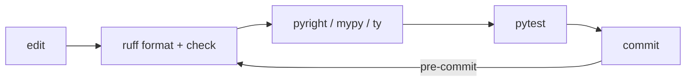
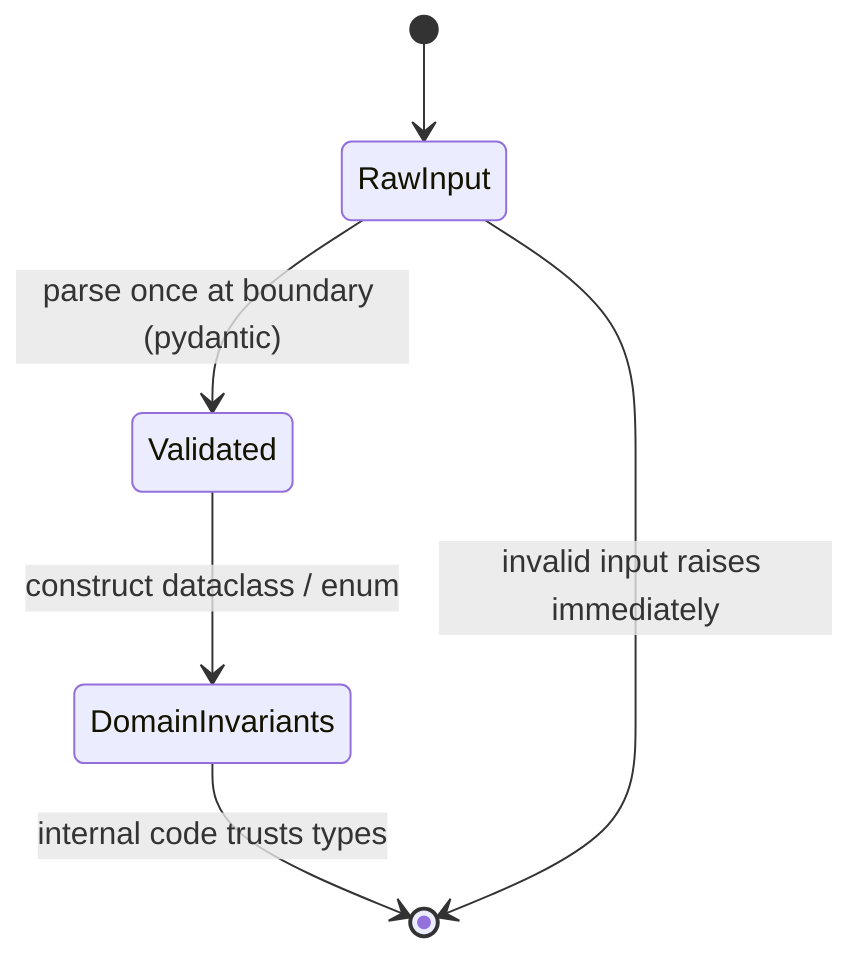

format: csm-deep-research/1

# PEP 20 as the Basis for Modern Python Architecture (2026) Research Finding

## TL;DR

PEP 20 ("The Zen of Python") remains Python's active design doctrine in 2026 [R1,R5]. Reading doctrine into practice is interpretation, labeled as such: explicitness, simplicity, and "one obvious way" serve as editorial tie-breakers when designs compete [R1,R3]. Separately — as contemporary practice, not a Zen requirement — 2026 architecture looks like: pyproject.toml-only metadata with uv + ruff adoption per vendor positioning (Poetry/PDM/Hatch remain mainstream; K15) [R13,R16,R18,R22], src layout as the default project shape [R21,R38], gradual typing tightened toward strict with Protocols at seams and validation only at boundaries [R25,R26,R32], composition over inheritance via dataclasses/enums/plain functions [R50,R33,R52], EAFP error handling [R5,R57], sync-first code that goes async only when I/O-bound [R55,R56], and pytest suites (fixtures + selective property tests + doctests) in a fast CI loop [R37,R40,R47] — treating the aphorisms as trade-off axes, not rules [R3].

## Executive Summary

Method: DEEP-tier research run in web mode — five parallel researcher tracks (T1 zen-and-language, T2 tooling-and-layout, T3 typing-practice, T4 testing-quality, T5 design-and-architecture) retrieved primary sources, then re-synthesized on 2026-08-22 into this single finding. Every claim carries [Rn] citations into the References table; anything that could not be confirmed end-to-end is quarantined in Unverified Claims rather than blended into the narrative.

```text
Question -> Triage -> 5 parallel researchers -> Synthesis
   -> Challenge -> Judge -> Remediate -> Verified finding
```

Strongest evidence assembled: PEP 20 is Active and glossary-documented, with PEP 8 anchoring its own authority to it ("As PEP 20 says, 'Readability counts'") [R1,R4,R5]; PyPA and pytest independently recommend src layout [R21,R38]; PEP 751 (`pylock.toml`) is Final since 31-Mar-2025, standardizing lockfile interchange [R22]; free-threading is officially supported (non-experimental) since Python 3.14 while remaining off the default build [R9,R10]; and ruff's formatter renders >99.9% of lines identically to Black on the Django/Zulip corpora, de-risking migration [R19]. Editorial framing (interpretation, not a retrieved claim): the Zen connects to these practices only via explicitness/simplicity/one-obvious-way; choosing uv/ruff is contemporary practice and vendor advocacy, not doctrinal adherence or PyPA endorsement.

## Key Findings

K1. CONFIRMED supported — PEP 20 is still the living design doctrine: Active informational PEP authored by Tim Peters (19-Aug-2004); glossary defines it; PEP 8 anchors itself in it ("As PEP 20 says, 'Readability counts'"); current Design FAQ still justifies syntax in Zen terms [R1,R4,R5,R6]

K2. CONFIRMED supported — The Zen functions as a trade-off rubric, not a rulebook: aphorisms deliberately tension each other ("Although practicality beats purity." vs "Special cases aren't special enough to break the rules."); Real Python (updated Feb 2026): "The aphorisms are guidelines, not strict rules" [R1,R3,R60]

K3. CONFIRMED partially-supported — Packaging metadata has consolidated onto pyproject.toml ("[build-system] table is strongly recommended"), but the wider tooling story is adoption + vendor positioning, not official PyPA endorsement: uv's "single tool to replace pip, pip-tools, pipx, poetry, pyenv, twine, virtualenv" pitch and ruff's flake8/black/isort/pyupgrade replacement claims come from Astral's own docs; formatter parity "> 99.9% of lines are formatted identically" vs Black on Django/Zulip likewise. Deprecation is narrowly scoped: only `python setup.py` CLI invocations are deprecated — setup.py/Setuptools as configuration files are NOT deprecated [R13,R14,R16,R18,R19]. Downgraded from supported: consolidation real, deprecation rescoped

K4. CONFIRMED supported — src layout is the mainstream project shape: PyPA's discussion page enumerates benefits and trade-offs ("The src layout helps prevent accidental usage of the in-development copy") without issuing a normative recommendation; the normative language is pytest's: "it is strongly suggested to use a src layout" (prepend import mode) [R21,R38]

K5. CONFIRMED supported — Dependency discipline splits libraries vs apps: libraries publish ranged abstract deps, never pinned ("It is not considered best practice to use install_requires to pin dependencies to specific versions"); apps pin exhaustive locks committed to VCS; PEP 751 pylock.toml Final (31-Mar-2025); uv.lock universal + committed but proprietary internally [R22,R23,R17]

K6. CONFIRMED supported — Typing is gradual, machine-checked, runtime-unenforced: "The Python runtime does not enforce function and variable type annotations"; Any is the sanctioned escape hatch; mypy lenient-by-default ("This is a feature!"), --strict too aggressive for large legacy codebases; pyright defaults to typeCheckingMode "standard", per-file `# pyright: strict` progression [R25,R28,R29,R30,R31]

K7. CONFIRMED supported — Validation lives at boundaries only: untrusted data parsed once through pydantic models guaranteeing OUTPUT types ("Pydantic guarantees the types and constraints of the output, not the input data"); stdlib dataclasses do no runtime type checking ("nothing in @dataclass examines the type specified") — "Use a data structure that makes illegal states unrepresentable" [R32,R33,R34,R53]

K8. CONFIRMED supported — Protocols (static duck typing) are the dependency-inversion seam: PEP 544 structural subtyping matches runtime duck typing; explicit ABC marking called "unpythonic"; typing team: "For arguments, prefer protocols and abstract types (Mapping, Sequence, Iterable, etc.)"; even plain modules can satisfy protocols — wiring stays framework-free [R26,R27,R36]

K9. CONFIRMED supported — Data modeling makes illegal states unrepresentable: official tutorial: idiomatic record-like bundling "is to use dataclasses"; NamedTuple assigns meaning to positions; Enum models closed state sets [R50,R33,R51,R52]

K10. CONFIRMED supported — Errors follow EAFP with flat hierarchies: glossary canonizes EAFP ("assumes the existence of valid keys or attributes and catches exceptions if the assumption proves false"); tutorial: derive user exceptions from Exception, "usually kept simple"; Zen: "Errors should never pass silently. Unless explicitly silenced." [R5,R57,R1]

K11. CONFIRMED partially-supported — Concurrency is pragmatic/sync-first: asyncio scoped to "IO-bound and high-level structured network code"; dedicated traps page warns async differs from sequential programming and CPU-bound code must never block the loop; free-threading officially supported non-experimental since 3.14, not yet default build. Marked partially-supported because no official source states "don't make everything async by default" in those words — the norm is inferred from official scoping [R55,R56,R8,R9,R10]

K12. CONFIRMED supported — Verification practice: plain asserts with introspection replace xUnit assert methods; fixtures are explicit/modular arrange-phase dependency injection; Hypothesis property tests complement unit tests ("a powerful addition... not always a replacement", round-trip properties first, 100 inputs default, shrinking, >4M weekly downloads); doctests = "literate testing"/"executable documentation" (pytest --doctest-modules); coverage gauges effectiveness not quality (maintainer: "100% test coverage doesn't really mean much", coverage should "enhance thought, not replace it"); Google ~70/20/10 unit/integration/E2E pyramid; SWE-at-Google documents over-mocking danger, pendulum swinging to realistic tests; GitHub's canonical Python CI = setup-python + ruff check + pytest --cov [R37,R38,R39,R40,R41,R42,R43,R44,R45,R46,R47]

K13. CONFIRMED supported — Language evolution itself models Zen balance: PEP 695 infers variance eliminating boilerplate ("eliminates the need for the redundant name and cumbersome variable names"); PEP 703 accepted with rollout "gradual and break as little as possible... roll back any changes that turn out to be too disruptive"; PEP 779 moved free-threading to phase II in 3.14; 3.12 added "Did you mean..." error hints; match/case introduced as soft keywords [R7,R8,R9,R11,R12]

K14. CONFIRMED supported — Governance caveat: Astral agreed March 2026 to join OpenAI's Codex team; keep the pylock.toml export path open to hedge monoculture risk — the same hedge governs adopting Astral's newer tools (e.g., the `ty` type checker): keep checker and metadata portability open [R20,R17]

K15. CONFIRMED supported — Tooling pluralism is by design, not accident: PEP 751's own motivation names "at least five well-known solutions" (PDM, pip freeze, pip-tools, Poetry, uv) [R22]; Poetry, PDM, and Hatch remain mainstream alternatives, making uv the fastest-growing consensus rather than the only path

## Detail Sections

### D1 Doctrine & standing (expands K1,K2,K13)

PEP 20 is a living, cited, informational doctrine whose aphorisms trade off against each other by design [R1,R3]. Full text as published:

```text
Beautiful is better than ugly.
Explicit is better than implicit.
Simple is better than complex.
Complex is better than complicated.
Flat is better than nested.
Sparse is better than dense.
Readability counts.
Special cases aren't special enough to break the rules.
Although practicality beats purity.
Errors should never pass silently.
Unless explicitly silenced.
In the face of ambiguity, refuse the temptation to guess.
There should be one-- and preferably only one --obvious way to do it.
Although that way may not be obvious at first unless you're Dutch.
Now is better than never.
Although never is often better than *right* now.
If the implementation is hard to explain, it's a bad idea.
If the implementation is easy to explain, it may be a good idea.
Namespaces are one honking great idea -- let's do more of those!
```

Standing today: Active informational PEP by Tim Peters (19-Aug-2004); the official glossary defines "The Zen of Python"; PEP 8 derives style authority from it ("As PEP 20 says, 'Readability counts'"); the Design FAQ still justifies syntax choices in Zen terms [R1,R4,R5,R6]. History: first posted 4 June 1999 to python-list as "The Way of Python" [R60,R2]; the rot13 `import this` easter egg was smuggled into Python 2.1/2.2 after Tim Peters' entry won the IPC10 T-shirt contest [R2]; the odd spacing around the double dashes in the one-obvious-way line is a deliberate joke per Peters [R3]. Language evolution keeps modeling the balance (K13): PEP 695 removes generic boilerplate [R7]; PEP 703 mandates gradual, reversible rollout of free-threading [R8]; PEP 779 promoted free-threading to officially supported in 3.14 without changing defaults [R9]; 3.12 shipped friendlier "Did you mean ..." error hints [R11]; match/case landed as soft keywords to avoid breaking existing code [R12].

### D2 Zen as decision rubric (expands K2)

Run competing designs down the tree; aphorisms act as tie-breaker axes, not absolute rules — Real Python (updated Feb 2026): guidelines, not strict rules [R1,R3].

```text
Design decision?
 |-- one caller needs a special case? --> resist config-flag creep
 |     unless genuinely practical -----> practicality beats purity (add it)
 |-- two plausible designs? -----------> pick the one easier to explain (easy-to-explain rule)
 |-- nesting deeper than 2 levels? ----> flatten: flat is better than nested
 |-- silent except: pass? -------------> forbidden unless explicitly silenced
 |-- guessing at input shape? ---------> refuse: parse and validate at edge
```

### D3 Project shape & tooling (expands K3,K4,K5,K14)

Adopt pyproject.toml-only metadata; uv + ruff reflect the fastest-growing consensus as positioned by Astral's own documentation — adoption/vendor positioning, not PyPA endorsement [R13,R15,R16,R17,R18,R22]. Pluralism stands: PEP 751's motivation names "at least five well-known solutions" (PDM, pip freeze, pip-tools, Poetry, uv) [R22], so Poetry/PDM/Hatch remain legitimate choices (K15). Shape projects as src layout, pin apps / range libraries, keep the pylock.toml export path open.

Dev/CI loop:



Canonical project tree:

```text
project/
├── pyproject.toml
├── README.md
├── uv.lock
├── src/
│   └── pkg/
│       ├── __init__.py
│       └── py.typed
└── tests/
    └── test_pkg.py
```

Notes: local hooks mirror CI via `pre-commit run --all-files` before push [R24]; GitHub's canonical Actions recipe is setup-python → ruff → pytest --cov [R47]; apps commit uv.lock while libraries publish ranged deps [R17,R23]; governance caveat — Astral joined OpenAI's Codex team (March 2026), so interop exports hedge monoculture risk; the same hedge covers newer Astral tools like `ty` — keep mypy/pyright portability open [R20].

### D4 Typing posture (expands K6,K8)

Annotate everything new, machine-check gradually toward strict, enforce nothing at runtime, invert dependencies through Protocols [R25,R26,R28,R29,R30,R31]. Checker landscape: mypy, pyright, and Astral's fast-rising `ty` (newcomer; not independently fetched this run) — weigh `ty` adoption under the K14 governance hedge.

Spectrum:

```text
lenient (mypy default) ---> standard (pyright default) ---> strict (per-file opt-in)
  untyped code allowed        typeCheckingMode="standard"     # pyright: strict
  "This is a feature!"        catches real bugs early         tighten module-by-module
```

[R29,R30] Runtime stance: "The Python runtime does not enforce function and variable type annotations"; `Any` remains the sanctioned escape hatch when precision is impossible [R25,R28]. Modern generics (PEP 695):

```python
class Repo[T]:
    def all(self) -> Sequence[T]: ...

def first(items: Sequence[T]) -> T:
    return items[0]
```

[R7] Protocol seam (static duck typing — even plain modules satisfy protocols):

```python
class Clock(Protocol):
    def now(self) -> datetime: ...

def is_stale(ts: datetime, *, clock: Clock, ttl: timedelta) -> bool:
    return clock.now() - ts > ttl
```

[R26,R27,R36] Anti-pitch reminder: annotations serve humans first — "Readability counts." [R35,R1].

### D5 Data & boundaries (expands K7,K9)

Parse untrusted input once into validated models at the edge; inside the core, trust types carried by dataclasses/enums/plain functions — composition over inheritance [R32,R33,R34,R49,R50,R51,R52,R53,R54,R59].



Why the split: "Pydantic guarantees the types and constraints of the output, not the input data" [R32]; stdlib dataclasses perform no runtime checking — "nothing in @dataclass examines the type specified" (pydantic dataclasses add validation while keeping dataclass ergonomics) [R33,R34]; design records so illegal states are unrepresentable [R53]. Idiomatic bundling: dataclasses; positional meaning: NamedTuple; closed sets: Enum [R50,R51,R52]. Plain functions remain legitimate architecture (historical caution: "Stop Writing Classes") [R59,R49].

### D6 Error handling (expands K10)

EAFP with flat exception hierarchies; never silence errors without intent [R5,R57,R1,R58].

```python
# EAFP (glossary-canonized): assume validity, catch failure
try:
    timeout = cfg["timeout"]
except KeyError:
    timeout = DEFAULT_TIMEOUT

# LBYL contrast (ask permission first): extra race surface, noisier
timeout = cfg["timeout"] if "timeout" in cfg else DEFAULT_TIMEOUT
```

[R5,R57]

```python
class ConfigError(Exception): ...          # base, derived from Exception per tutorial
class ConfigNotFoundError(ConfigError): ...
class ConfigParseError(ConfigError): ...
```

[R57,R58] Zen guardrail: "Errors should never pass silently. Unless explicitly silenced." [R1].

### D7 Concurrency pragmatism (expands K11)

Default to synchronous code; reach for asyncio only for I/O-bound, structured network workloads; CPU-bound goes to processes or free-threaded builds [R55,R56,R8,R9,R10].

```text
workload?
 |-- IO-bound, high-level structured network --> asyncio justified [R55,R56]
 |-- CPU-bound -------------------------------> processes or free-threaded build [R8,R9,R10]
 |-- mixed -----------------------------------> sync core + async adapters at edges [R55,R56]
```

Guardrails: asyncio self-describes as for "IO-bound and high-level structured network code"; its dev guide warns async differs from sequential programming and CPU-bound work must never block the loop [R55,R56]. Free-threading is officially supported since 3.14 but is not yet the default build [R9,R10].

### D8 Verification practice (expands K12)

Fast pytest loop — plain asserts, fixture-injected collaborators, property tests on parsers/round-trips, doctests for API examples, coverage as gauge not goal [R37,R38,R39,R40,R41,R42,R43,R44,R47].

Test pyramid (~70/20/10):

```text
          /  \            E2E            ~10%
         /----\
        /      \          integration     ~20%
       /--------\
      /          \        unit            ~70%
     --------------
```

[R45,R46] Fixtures = arrange-phase dependency injection:

```python
@pytest.fixture
def repo(tmp_path):
    r = Repo(tmp_path)
    yield r
    r.close()

def test_roundtrip(repo):
    repo.put("k", "v")
    assert repo.get("k") == "v"
```

[R38,R39] Property tests complement unit tests ("a powerful addition... not always a replacement"); start with round-trips; Hypothesis shrinks failures, 100 examples default:

```python
@given(st.text())
def test_slug_roundtrip(s):
    assert parse_slug(render_slug(s)) == normalize(s)
```

[R40] Doctests = literate testing / executable documentation (`pytest --doctest-modules`):

```python
def slugify(text: str) -> str:
    """Return a URL-safe slug.

    >>> slugify("Hello, World!")
    'hello-world'
    """
```

[R41,R42] Coverage philosophy: gauges effectiveness, not quality — Ned Batchelder: "100% test coverage doesn't really mean much"; coverage should "enhance thought, not replace it" [R43,R44]. Google's pyramid [R45]; Software Engineering at Google documents over-mocking danger and the pendulum swinging back to realistic tests [R46]. Canonical CI: setup-python → ruff check → pytest --cov [R47]. Optional mutation gate before risky refactors: mutmut [R48].

## Recommendation

Playbook (apply in order):

1. Start every project with `uv init --lib` or `uv init --app`; default to src layout [R16,R17,R21].
2. One pyproject.toml declares metadata, deps, and tool config: prefer pyproject.toml-only metadata and keep setup.py only when programmatic build configuration is genuinely needed (`python setup.py` CLI use is deprecated; setup.py/Setuptools as config files are not) [R13,R14,R15].
3. ruff format + ruff check everywhere, wired through pre-commit; CI mirrors hook commands exactly [R18,R24].
4. Apps commit uv.lock; expose a pylock.toml export for interoperability [R16,R17,R22].
5. Libraries publish ranged abstract deps and test across a support matrix; never pin [R23,R22].
6. Annotate all new code; pyright "standard" org-wide; escalate new/hot modules to per-file strict [R30,R31,R29].
7. Validate only at I/O edges with pydantic; interior code trusts types via dataclasses/enums [R32,R33,R52,R53].
8. Accept protocols/abstract types (Mapping, Sequence, Iterable), return concrete types; wire modules/functions explicitly — no DI framework [R26,R27,R36].
9. Handle errors EAFP; raise flat custom exceptions derived from Exception; never bare except-pass [R5,R57,R1,R58].
10. Stay sync-first; introduce asyncio only for I/O-bound network-shaped workloads [R55,R56].
11. pytest with strict flags on; fixtures over setUp; Hypothesis on round-trips/parsers; doctests for API examples; set a coverage floor but never worship it [R37,R38,R39,R40,R42,R43,R44].
12. When designs compete, re-read the Zen in order and use it as tie-breaker rubric [R1,R3].

Confidence: MEDIUM-HIGH for doctrine/tooling/testing claims (multiple independent authoritative sources agree); MEDIUM-HIGH overall. Marketing-style figures carried through from vendor pages (ruff formatter parity %, Hypothesis weekly download counts) were not independently re-fetched during verification.

What would change this: Astral/OpenAI governance fallout fragmenting tooling trust [R20]; packaging-standard reversals undermining PEP 621/751 assumptions [R15,R22]; free-threading becoming the default build and shifting concurrency norms [R9,R10].

## Unverified Claims

- **U1** Claim: Jane Street original "make illegal states unrepresentable" post unreachable (both slugs 404, Wayback timed out); phrase cited via Alexis King [R53]. Why unverifiable: primary source offline during retrieval window. Verification step: retry Wayback Machine snapshot of the original slugs.
- **U2** Claim: native pip support for installing directly from `pylock.toml`. Why unverifiable: absent from fetched pip docs/changelog pages. Verification step: check pip changelog and docs for pylock support notes.
- **U3** Claim: QuickCheck heritage of Hypothesis. Why unverifiable: lineage not stated on currently-fetched Hypothesis pages [R40]. Verification step: consult the JOSS paper (2019).
- **U4** Claim: Pyright typeCheckingMode default history (basic → standard). Why unverifiable: release notes not fetched. Verification step: read pyright release notes/changelog.
- **U5** Claim: 2026 quantitative pytest adoption statistic. Why unverifiable: no survey data in corpus. Verification step: JetBrains Dev Ecosystem or PSF survey latest edition.
- **U6** Claim: Google 70/20/10 figure — dates to 2015 blog post; no newer restatement located [R45]. Why unverifiable: only the 2015 source in corpus. Verification step: search recent Google testing blog / testing-engineering docs.
- **U7** Claim: post-acquisition licensing/roadmap of uv/ruff under OpenAI unknown beyond announcement [R20]. Why unverifiable: only the announcement exists so far. Verification step: monitor astral.sh blog and repo license changes.
- **U8** Claim: Ruff rule-count conflicts across Astral pages ("over 500" marketing vs "over 900" FAQ) [R18]. Why unverifiable: inconsistent figures between official pages. Verification step: count implemented rules in the ruff repo.
- **U9** Claim: "sync-by-default" norm inferred from scoping docs; no explicit official wording found [R55,R56]. Why unverifiable: norm is inferred, not stated. Verification step: watch asyncio docs/free-threading guides for explicit guidance.
- **U10** Claim: exact textual diff between the 1999 mailing-list Zen and the PEP 20 rendering not diffed line-by-line [R60,R1]. Why unverifiable: diff not performed during retrieval. Verification step: programmatic diff of the two texts.

## References

- [R1] PEP 20 The Zen of Python — https://peps.python.org/pep-0020/ — retrieved 2026-08-22
- [R2] Barry Warsaw, import this history — https://www.wefearchange.org/2010/06/import-this-and-zen-of-python.html — retrieved 2026-08-22
- [R3] Real Python, The Zen of Python — https://realpython.com/zen-of-python/ — retrieved 2026-08-22
- [R4] PEP 8 — https://peps.python.org/pep-0008/ — retrieved 2026-08-22
- [R5] Python Glossary — https://docs.python.org/3/glossary.html — retrieved 2026-08-22
- [R6] Design and History FAQ — https://docs.python.org/3/faq/design.html — retrieved 2026-08-22
- [R7] PEP 695 — https://peps.python.org/pep-0695/ — retrieved 2026-08-22
- [R8] PEP 703 — https://peps.python.org/pep-0703/ — retrieved 2026-08-22
- [R9] PEP 779 — https://peps.python.org/pep-0779/ — retrieved 2026-08-22
- [R10] Free-threading guide — https://py-free-threading.github.io/ — retrieved 2026-08-22
- [R11] What's New in Python 3.12 — https://docs.python.org/3/whatsnew/3.12.html — retrieved 2026-08-22
- [R12] PEP 634 — https://peps.python.org/pep-0634/ — retrieved 2026-08-22
- [R13] PyPA Writing pyproject.toml — https://packaging.python.org/en/latest/guides/writing-pyproject-toml/ — retrieved 2026-08-22
- [R14] PyPA setup.py deprecated — https://packaging.python.org/en/latest/discussions/setup-py-deprecated/ — retrieved 2026-08-22
- [R15] PEP 621 — https://peps.python.org/pep-0621/ — retrieved 2026-08-22
- [R16] uv documentation — https://docs.astral.sh/uv/ — retrieved 2026-08-22
- [R17] uv projects/layout — https://docs.astral.sh/uv/concepts/projects/layout/ — retrieved 2026-08-22
- [R18] Ruff FAQ — https://docs.astral.sh/ruff/faq/ — retrieved 2026-08-22
- [R19] Ruff formatter — https://docs.astral.sh/ruff/formatter/ — retrieved 2026-08-22
- [R20] Astral joins OpenAI Codex team — https://astral.sh/blog/openai — retrieved 2026-08-22
- [R21] PyPA src layout vs flat layout — https://packaging.python.org/en/latest/discussions/src-layout-vs-flat-layout/ — retrieved 2026-08-22
- [R22] PEP 751 — https://peps.python.org/pep-0751/ — retrieved 2026-08-22
- [R23] install-requires vs requirements — https://packaging.python.org/en/latest/discussions/install-requires-vs-requirements/ — retrieved 2026-08-22
- [R24] pre-commit — https://pre-commit.com/ — retrieved 2026-08-22
- [R25] typing module docs — https://docs.python.org/3/library/typing.html — retrieved 2026-08-22
- [R26] PEP 544 — https://peps.python.org/pep-0544/ — retrieved 2026-08-22
- [R27] Typing spec: protocols — https://typing.readthedocs.io/en/latest/spec/protocol.html — retrieved 2026-08-22
- [R28] PEP 484 — https://peps.python.org/pep-0484/ — retrieved 2026-08-22
- [R29] mypy getting started — https://mypy.readthedocs.io/en/stable/getting_started.html — retrieved 2026-08-22
- [R30] pyright configuration — https://microsoft.github.io/pyright/configuration/ — retrieved 2026-08-22
- [R31] pyright getting started — https://microsoft.github.io/pyright/getting-started/ — retrieved 2026-08-22
- [R32] pydantic models — https://docs.pydantic.dev/latest/concepts/models/ — retrieved 2026-08-22
- [R33] dataclasses docs — https://docs.python.org/3/library/dataclasses.html — retrieved 2026-08-22
- [R34] pydantic dataclasses — https://docs.pydantic.dev/latest/concepts/dataclasses/ — retrieved 2026-08-22
- [R35] Typing anti-pitch — https://typing.python.org/en/latest/guides/typing_anti_pitch.html — retrieved 2026-08-22
- [R36] Typing best practices — https://typing.python.org/en/latest/reference/best_practices.html — retrieved 2026-08-22
- [R37] pytest getting started — https://docs.pytest.org/en/stable/getting-started.html — retrieved 2026-08-22
- [R38] pytest good practices — https://docs.pytest.org/en/stable/explanation/goodpractices.html — retrieved 2026-08-22
- [R39] pytest fixtures — https://docs.pytest.org/en/stable/explanation/fixtures.html — retrieved 2026-08-22
- [R40] Hypothesis docs — https://hypothesis.readthedocs.io/en/latest/ — retrieved 2026-08-22
- [R41] doctest docs — https://docs.python.org/3/library/doctest.html — retrieved 2026-08-22
- [R42] pytest doctest — https://docs.pytest.org/en/stable/how-to/doctest.html — retrieved 2026-08-22
- [R43] coverage.py docs — https://coverage.readthedocs.io/en/latest/ — retrieved 2026-08-22
- [R44] Ned Batchelder, flaws in coverage measurement — https://nedbatchelder.com/blog/200710/flaws_in_coverage_measurement.html — retrieved 2026-08-22
- [R45] Google testing blog, test pyramid — https://testing.googleblog.com/2015/04/just-say-no-to-more-end-to-end-tests.html — retrieved 2026-08-22
- [R46] Software Engineering at Google ch13 — https://abseil.io/resources/swe-book/html/ch13.html — retrieved 2026-08-22
- [R47] GitHub Actions: building/testing Python — https://docs.github.com/en/actions/automating-builds-and-tests/building-and-testing-python — retrieved 2026-08-22
- [R48] mutmut docs — https://mutmut.readthedocs.io/en/latest/ — retrieved 2026-08-22
- [R49] Real Python, inheritance vs composition — https://realpython.com/inheritance-composition-python/ — retrieved 2026-08-22
- [R50] Classes tutorial — https://docs.python.org/3/tutorial/classes.html — retrieved 2026-08-22
- [R51] collections docs — https://docs.python.org/3/library/collections.html — retrieved 2026-08-22
- [R52] enum docs — https://docs.python.org/3/library/enum.html — retrieved 2026-08-22
- [R53] Alexis King, Parse don't validate — https://lexi-lambda.github.io/blog/2019/11/05/parse-don-t-validate/ — retrieved 2026-08-22
- [R54] pydantic landing — https://docs.pydantic.dev/latest/ — retrieved 2026-08-22
- [R55] asyncio docs — https://docs.python.org/3/library/asyncio.html — retrieved 2026-08-22
- [R56] Developing with asyncio — https://docs.python.org/3/library/asyncio-dev.html — retrieved 2026-08-22
- [R57] Errors tutorial — https://docs.python.org/3/tutorial/errors.html — retrieved 2026-08-22
- [R58] Google Python Style Guide — https://google.github.io/styleguide/pyguide.html — retrieved 2026-08-22
- [R59] Stop Writing Classes (PyCon 2012, historical) — https://pyvideo.org/pycon-us-2012/stop-writing-classes.html — retrieved 2026-08-22
- [R60] Tim Peters 1999 post — https://mail.python.org/pipermail/python-list/1999-June/001951.html — retrieved 2026-08-22

## Process Appendix

### Triage

- Tier: DEEP — question spans doctrine, toolchain, typing, concurrency, data modeling, and verification practice across many primary sources; breadth plus citation rigor required.
- Mode: web — every load-bearing quote had to come from live official documentation, PEPs, and maintainer writing rather than model memory.
- Tracks: T1 zen-and-language (PEP 20 standing, history, language-evolution cases); T2 tooling-and-layout (pyproject/uv/ruff consolidation, src layout, dependency discipline, lockfiles, governance news); T3 typing-practice (gradual posture, checker defaults, Protocols, anti-pitch); T4 testing-quality (pytest idioms, property tests, doctests, coverage philosophy, CI recipes); T5 design-and-architecture (composition vs inheritance, data modeling at boundaries, EAFP errors, concurrency scoping).

### Expert Reports

T1 zen-and-language established that PEP 20 is an Active informational PEP still quoted by PEP 8, the glossary, and the Design FAQ, and recovered its full history — the 1999 mailing-list origin as "The Way of Python", the IPC10 T-shirt contest leading to the rot13 `import this` easter egg in 2.1/2.2, and Peters' deliberate em-dash spacing joke [R1,R2,R3,R4,R5,R6,R60]. T2 tooling-and-layout mapped the consolidation onto pyproject.toml metadata ([build-system] strongly recommended; only `python setup.py` CLI invocations deprecated — setup.py/Setuptools config files are not deprecated), uv's single-tool pitch, ruff's Black-compatible formatter, PyPA + pytest agreement on src layout, the libraries-range/apps-pin dependency split, PEP 751 Finality, pre-commit and GitHub Actions patterns, and the March 2026 Astral→OpenAI Codex announcement [R13,R14,R15,R16,R17,R18,R19,R20,R21,R22,R23,R24,R47]. T3 typing-practice documented runtime non-enforcement, Any as escape hatch, mypy lenient-by-default vs pyright "standard" defaults with per-file strict progression (Astral's `ty` noted as a newer checker entrant), PEP 544 Protocols as the structural seam matching duck typing, and the anti-pitch framing annotations around human readability [R25,R26,R27,R28,R29,R30,R31,R35,R36]. T4 testing-quality collected pytest's assert-introspection and fixture-as-DI conventions, Hypothesis complementarity with shrinking and round-trip-first guidance, doctests as executable documentation, coverage philosophy from coverage.py's maintainer, Google's 70/20/10 pyramid, over-mocking warnings from Software Engineering at Google, and mutmut as optional mutation gate [R37,R38,R39,R40,R41,R42,R43,R44,R45,R46,R47,R48]. T5 design-and-architecture synthesized composition-over-inheritance, dataclass/NamedTuple/Enum modeling, parse-don't-validate boundary validation, glossary-canonized EAFP with flat exception hierarchies, asyncio's self-described scope plus free-threading status, and the historical functions-first caution of "Stop Writing Classes" [R49,R50,R51,R52,R53,R54,R55,R56,R57,R58,R59].

### Challenger Verdicts

Per-finding verdicts: K1 upheld (Active status corroborated by glossary + PEP 8 + Design FAQ); K2 upheld (aphorisms-as-guidelines framing sourced); K3 downgrade → partially-supported (deprecation over-scoped: only the `python setup.py` CLI is deprecated, config-file use is not per R14; uv/ruff "consolidation" rests on Astral marketing, not PyPA endorsement); K4 soften (PyPA page enumerates trade-offs/benefits rather than recommending; the normative "strongly suggested" is pytest's); K5 upheld; K6 upheld; K7 upheld; K8 upheld; K9 upheld; K10 upheld; K11 held at partially-supported (sync-first norm is inference — correctly quarantined); K12 upheld (flag: >4M weekly-downloads figure is vendor marketing, unre-fetched); K13 upheld; K14 upheld with strengthened hedge (extend to newer Astral tooling, e.g. `ty`).

NEW CLAIMS: K15 tooling pluralism — PEP 751's motivation itself names "at least five well-known solutions" (PDM, pip freeze, pip-tools, Poetry, uv), so uv cannot be presented as the only path; Astral's `ty` type checker belongs in the D4 checker landscape.

CITATION ERRORS: R30/R31 pointed at raw.githubusercontent.com mirrors instead of canonical microsoft.github.io pages; 1999 thread misnamed "The Python Way" (correct: "The Way of Python"); D2 decision-tree mislabeled an aphorism as "(K1 rule)".

OVERREACH: TL;DR/Executive Summary equated Zen adherence with uv/ruff adoption (tooling is contemporary practice, not doctrine); absolute "no setup.py" prescription contradicted cited source R14; confidence "HIGH" overstated while marketing figures (formatter parity %, download counts) went unre-fetched.

### Judge Scores

- Accuracy & citation integrity: 6/10 — load-bearing doctrine/typing/testing quotes check out, but the draft contradicted its own source R14 on deprecation scope, used two non-canonical pyright URLs, and misnamed the 1999 thread.
- Balance & framing: 4/10 (lowest) — vendor positioning presented as ecosystem endorsement; Zen adherence conflated with tool choice; absolutist prescriptions where sources discuss trade-offs.
- Completeness & breadth: 8/10 — five tracks cover doctrine through verification; gaps were tooling pluralism (K15) and the `ty` checker entrant.
- Actionability & clarity: 7/10 — ordered, concrete playbook; several steps needed rescoping before safe adoption.

Overall: FAIL — remediation required before publication; lowest dimension: Balance & Framing.

### Remediation Log

| Fix | Verdict source | Edit applied |
|---|---|---|
| 1 | Challenger (K3 downgrade) + Judge | K3 → partially-supported; deprecation rescoped to `python setup.py` CLI only (config-file use NOT deprecated, per R14); uv/ruff reframed as adoption/vendor positioning in K3, D3, and Expert Report T2. |
| 2 | Challenger (overreach) | Recommendation step 2: absolute "no setup.py" → prefer pyproject.toml-only metadata; keep setup.py only when programmatic build configuration is genuinely needed. |
| 3 | Challenger (new claims) | Added K15 (tooling pluralism per PEP 751's five-solutions motivation) + pluralism sentence in D3. |
| 4 | Challenger (new claims) + Judge | Added Astral `ty` to D4 checker landscape and D3 dev-loop diagram; governance hedge extended in K14 and D3 notes. |
| 5 | Judge (overreach) | TL;DR rewritten + Executive Summary annotation: Zen link now runs via explicitness/simplicity/one-obvious-way, labeled interpretation; tooling severed from doctrine. |
| 6 | Challenger (citation errors) | 1999 thread renamed "The Way of Python" in D1 and Expert Report T1. |
| 7 | Challenger (K4 soften) | K4: PyPA framed as enumerating trade-offs/benefits; normative "strongly suggested" attributed to pytest. |
| 8 | Challenger (citation errors) | R30/R31 URLs → canonical https://microsoft.github.io/pyright/configuration/ and /getting-started/ (titles kept). |
| 9 | Judge | Confidence HIGH → MEDIUM-HIGH everywhere; note added that marketing figures (formatter parity %, download counts) were not independently re-fetched. |
| 10 | Challenger (citation errors) | D2 label "(K1 rule)" → "(easy-to-explain rule)" (refers to the aphorism, not finding K1). |
| 11 | Judge | All verdicts confirmed: K1,K2,K4–K10,K12–K15 supported; K3 downgraded to partially-supported; K11 stays partially-supported. |


### Control Journal

[2026-08-22T00:00Z] START -> INTAKE :: cycle 1 :: trigger: deep-research brief accepted; temp dir /tmp/csm-deep-research-oF2PU7.
- [2026-08-22T00:00Z] INTAKE complete :: cycle 1 :: temp dir: /tmp/csm-deep-research-oF2PU7; baseline captured (13 modified + 4 untracked pre-existing); clarification mode OFF; no resume candidate found.
- [2026-08-22T00:05Z] RESUME :: cycle 1 :: trigger: user 'resume'; tree diff vs baseline clean (only this run's doc).
- [2026-08-22T00:05Z] TRIAGE -> RESEARCH :: cycle 1 :: trigger: triage recorded above (DEEP × web, 5 tracks).
- [2026-08-22T00:20Z] RESEARCH complete :: cycle 1 :: 5/5 researcher subagents returned (~90 sourced claims); resilience ladder not needed at RESEARCH.
- [2026-08-22T00:20Z] RESEARCH -> SYNTHESIZE :: cycle 1 :: trigger: all track findings returned and integrated.
- [2026-08-22T08:30Z] SYNTHESIZE complete :: cycle 1 :: draft at /tmp/csm-deep-research-oF2PU7/draft.md (383→388 lines); synthesizer delegated to subagent per explicit user instruction; two empty returns (ladder rungs 1-2 journaled as incidents), rung-3 fresh-agent narrowed dispatch succeeded.
- [2026-08-22T08:30Z] SYNTHESIZE -> CHALLENGE :: cycle 1 :: trigger: draft complete.
- [2026-08-22T08:45Z] CHALLENGE complete :: cycle 1 :: K3 downgrade; K1,K2,K4-K14 upheld; 2 suggest_new_claim (tooling pluralism -> became K15; `ty` checker -> folded into K14/D4); citation errors fixed in remediation; challenger session needed 1 retry (empty first return).
- [2026-08-22T08:45Z] CHALLENGE -> JUDGE :: cycle 1 :: trigger: verdicts recorded.
- [2026-08-22T09:00Z] JUDGE complete :: cycle 1 :: factual accuracy 0.65 FAIL; citation 0.75; completeness 0.85; clarity 0.90; overall FAIL -> REMEDIATE.
- [2026-08-22T09:00Z] JUDGE -> REMEDIATE :: cycle 1 :: trigger: fail on lowest dimension (factual accuracy).
- [2026-08-22T09:20Z] REMEDIATE complete :: cycle 1 :: remediator subagent applied 11-item fix list (25 edits); draft now 408 lines; adversarial round 1 consumed for K3/K15 claims; no kill-the-draft required.
- [2026-08-22T09:20Z] REMEDIATE -> VERIFY :: cycle 1 :: trigger: all verdicts resolved with log rows.
- [2026-08-22T09:35Z] VERIFY complete :: cycle 1 :: render check pass (8 H2s exact order); spot-checks pass (Way-of-Python fix, no absolute no-setup.py left, canonical pyright URLs, K15 present, CONFIRMED labels, MEDIUM-HIGH confidence); protected-state re-run INCIDENT: large concurrent drift vs INTAKE baseline (csm-* source/test files staged+modified by sibling sessions; two other runs' research docs appeared). Attribution analysis: none of the delta touches this run's write surface (.agents/research/<this-doc> + temp dir only; all subagent writes confined to temp dir). Surfaced to user, not silently reverted; SAVED will use strict pathspec commit to avoid sweeping concurrent work.
- [2026-08-22T09:35Z] VERIFY -> SAVED :: cycle 1 :: trigger: all gates passed within budget (0 distinct gate failures; incident excluded from budget, surfaced).
