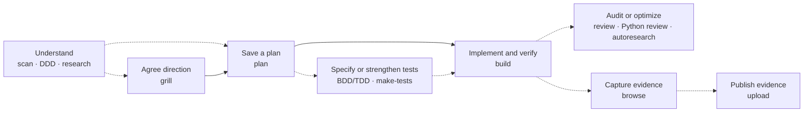

# opencode-skills

Turn a rough idea into a verified change, with the decisions, tests, and evidence saved along the way.

These **14 agent-agnostic skills** help your coding agent understand a codebase, challenge an approach, plan the work, build it, and show what actually passed. They use **CSM — cyclic state machine — workflows**: investigate, act, verify, and revisit a step when the evidence calls for it.

Start with `csm-orchestrate` in your agent session. It routes your request to the skill that owns the work. Use one capability for a focused task, or coordinate an agreed approach when you need several stages.

[Get started](#quickstart) · [Explore all 14 skills](#skill-guide) · [Install](#install) · [Runtime integration](#advanced-use)

## Table of contents

- [Quickstart](#quickstart)
- [Install](#install)
- [Skill guide](#skill-guide)
- [How the workflow fits together](#how-the-workflow-fits-together)
- [Advanced use](#advanced-use)
- [Composition matrix](#composition-matrix)
- [Development & testing](#development--testing)
- [Troubleshooting](#troubleshooting)
- [License](#license)

## Quickstart

After [installation](#install), give your agent a concrete request. These are **agent prompts**, not shell commands.

To get your bearings in an unfamiliar repository:

> Use csm-orchestrate to scan this repository. Show me its architecture, conventions, testing setup, and evidence gaps, and save the norms for later planning.

To turn a change into work you can review:

> Use csm-orchestrate to plan adding CSV export to the reports page. Include runnable acceptance checks, task dependencies, and recovery notes. Save the plan.

When you are ready to execute, make a separate request using the exact saved **JSON** plan path:

> Use csm-orchestrate to execute the saved plan at &lt;plan.json&gt; through csm-build. Verify each acceptance criterion and record the evidence.

Planning finishes with a saved plan. Building starts from that plan when requested. The [command-line runner](#advanced-use) additionally needs a configured host or agent-session executor; installing the skills alone does not provide one.

## Install

For OpenCode, clone into its skill discovery directory. You will need Git, Node `>=22 <25`, pnpm `10.34.5`, and make.

Run from a shell with those tools available:

```bash
skills_dest="$HOME/.config/opencode/skills"
test ! -e "$skills_dest" || { printf '%s\n' "Already exists: $skills_dest — inspect and update that checkout instead." >&2; exit 1; }
git clone https://github.com/jamiemills/opencode-skills.git "$skills_dest"
cd "$skills_dest" && make install
make test-browse
```

Restart or reload your agent runtime and check that `csm-orchestrate` is discoverable. `make install` installs the repository tooling and browser dependencies using frozen lockfiles; `make test-browse` is a sanity check that does not require Docker.

<details>
<summary>Other runtimes and optional prerequisites</summary>

The skills are plain `SKILL.md` instructions with supporting schemas, libraries, and Node CLIs. OpenCode, Claude Code, and other Agent Skills-compatible runtimes use their own discovery locations. Keep the repository's shared directories alongside the skills: copying a single `SKILL.md` omits its supporting files.

Most workflows are instruction-led and use the tools available in your agent session. Additional requirements depend on the task:

| Capability | Additional setup |
| --- | --- |
| Static repository analysis | Git and ripgrep (`rg`); no target dependency install or build |
| Browser evidence | Docker and the `chromium-vnc` setup managed by the browser helper; ffmpeg for stitched captures and video |
| Publishing evidence | Authenticated `gh` CLI and a public GitHub Pages-enabled destination repository |
| Generated-code optimization | Explicit generated-mode authorization and a verified sandbox provider |
| Live optimization models | Configured adapter, credentials, egress policy, and budgets |
| Command-line orchestration | Supported Node version, durable storage, capability metadata, approvals, and a host/executor for the selected route |

The signed universal bootstrap is experimental and its public package/envelope are not yet released. Use the clone installation above; contributors can inspect the [bootstrap protocol](bootstrap/protocol.md), [publication runbook](bootstrap/publication-runbook.md), and [release checklist](bootstrap/release-checklist.md).

</details>

## Skill guide

Choose the outcome you need. `csm-orchestrate` is the common entry point; the specialist listed below owns that stage's work and output.

| I want to… | Owning skill | What I get |
| --- | --- | --- |
| Coordinate an agreed approach or route a request | [csm-orchestrate](csm-orchestrate/SKILL.md) | Routed work, evidence gates, progress, and a run receipt |
| Understand an unfamiliar codebase | [csm-scan](csm-scan/SKILL.md) | Repository norms across 17 dimensions, including cross-repository relationships |
| Find domain boundaries and refactoring seams | [csm-ddd](csm-ddd/SKILL.md) | Capabilities, context hypotheses, candidate slices, and an evidence graph |
| Answer a technical question with sources | [csm-deep-research](csm-deep-research/SKILL.md) | A cited, challenged finding with explicit uncertainty |
| Stress-test an idea before choosing a direction | [csm-grill](csm-grill/SKILL.md) | An agreed approach, decisions, and phase briefs |
| Turn a brief into an executable plan | [csm-plan](csm-plan/SKILL.md) | Tasks, dependencies, acceptance signals, and recovery state |
| Specify behavior before implementation | [csm-bdd-tdd](csm-bdd-tdd/SKILL.md) | Scenarios, unit test designs, and a traceable BDD/TDD plan |
| Strengthen tests around existing behavior | [csm-make-tests](csm-make-tests/SKILL.md) | Executable tests, approved goldens, benchmarks, and verification records |
| Implement a saved plan | [csm-build](csm-build/SKILL.md) | Verified code changes, checkpoints, and acceptance evidence |
| Audit a repository or change surface | [csm-review](csm-review/SKILL.md) | Adversarial findings across 18 review dimensions |
| Review Python idioms and design | [csm-review-python](csm-review-python/SKILL.md) | Evidence-backed findings and a fix guide grounded in 140 rules |
| Improve a measurable target | [csm-autoresearch](csm-autoresearch/SKILL.md) | Evaluated candidates, a trial ledger, and an approval-ready result |
| Demonstrate a browser flow | [csm-browse](csm-browse/SKILL.md) | Screenshots, video, DOM, console, network, and performance evidence |
| Share captured evidence | [csm-upload](csm-upload/SKILL.md) | A dated GitHub Pages demo and a publication receipt |

Expand a skill for its capabilities, outputs, and operating boundaries.

### Understand and decide

<details>
<summary>csm-scan — map the repository before you change it</summary>

Inspect one or more repositories using committed declarations and bounded, read-only Git/ripgrep queries.

- Covers structure, technology stack, configuration, testing, code conventions, Git practices, architecture, documentation, security, and operations.
- Adds API surface, data architecture, deployment topology, maintainability, governance and ownership, assurance and supply chain, and development practices.
- Maps cross-repository architecture and related observations across dimensions. Reports declared layers, import relationships, coupling, cycles, and architecture indicators with their evidence basis.
- Provides first-class analysis for Python, JavaScript, TypeScript, Shell, and Rust. Other ecosystems receive generic artifact evidence; declarative plugins can extend detection.
- Separates observed facts, inferences, unsupported cases, and incomplete searches. Applies privacy filtering, parser limits, and deterministic output ordering.

**Output:** an authoritative JSON norms artifact under `.agents/norms/`. `NORMS.md` is a human-readable projection or legacy history. The scanner does not execute the target's code, tests, builds, or deployment commands.

[Full reference and CLI](csm-scan/SKILL.md)

</details>

<details>
<summary>csm-ddd — explore domain boundaries and safer refactoring steps</summary>

Analyze a pinned repository through a domain-driven design lens.

- Inventories business capabilities, terminology conflicts, workflows, invariants, ownership, and coupling.
- Proposes bounded-context hypotheses with evidence, confidence, alternatives, and open questions.
- Identifies seams through observable behavior, side effects, redirectable slices, and rollback options; suggests an order for candidate refactoring slices.
- Uses bounded static inspection and Git history, with interactive clarification or non-interactive gap reporting.
- Publishes the report and graph as a validated pair; interrupted publication preserves the last complete generation.

**Output:** paired JSON report and graph under `.agents/ddd/`. Contexts and slices are hypotheses to investigate; the analyzer does not implement refactors or execute target code.

[Full reference](csm-ddd/SKILL.md)

</details>

<details>
<summary>csm-deep-research — get a finding you can trace back to its sources</summary>

Research a focused question or a consequential technical decision.

- Scales to QUICK, STANDARD, or DEEP, using local, web, or hybrid sources.
- STANDARD and DEEP use independent research, adversarial challenge, and judgment; QUICK uses a compact primary-led pass with the independence limitation recorded.
- Tracks claims by scope, date, evidence status, source posture, and confidence. Distinguishes documented capabilities from measured outcomes and recommendations.
- Supports declared companion artifacts, such as schemas, and read-only browser retrieval for JavaScript-rendered sources.
- Saves a Control journal for supported recovery and renders the finding in layers: summary, key findings, detail, recommendation, uncertainty, references, and process evidence.

**Output:** a run-specific JSON finding under `.agents/research/`, with declared companion files under `.agents/research/artifacts/`. The finding can inform a grill or plan; the research run ends after saving it.

[Full reference](csm-deep-research/SKILL.md)

</details>

<details>
<summary>csm-grill — turn a rough idea into an agreed direction</summary>

Work through the decisions that could change the approach.

- Interviews you one question at a time, in dependency order, with a recommended answer.
- Uses scouts and deeper research to uncover assumptions, alternatives, and missing decisions.
- Cycles between questions, evidence, and synthesis until you agree to the approach.
- Produces a decision log, research synthesis, dependency diagrams, and phase briefs containing goals, scope, constraints, deliverables, and acceptance hints.
- Can dispatch deep research when an important external fact needs a cited finding.

**Output:** one agreed JSON approach under `.agents/approaches/`. Phase briefs are inputs to later planning. The interview is not resumable before its terminal `SAVED` state.

[Full reference](csm-grill/SKILL.md)

</details>

### Plan, test, and build

<details>
<summary>csm-plan — make the work executable and recoverable</summary>

Turn a brief or approach phase into a plan another session can execute.

- Discovers the current state and consumes relevant registered norms, review, research, and DDD evidence.
- Uses research, disposable experiments where appropriate, critique, remediation, and a final verification gate.
- Defines atomic tasks with dependencies, owned scope, risk, actions, runnable acceptance signals, and recovery notes.
- Shows the execution graph, critical path, and safe parallel groups.
- Scales depth to the size and uncertainty of the request, preserving decisions already prescribed by the user.

**Output:** a verified JSON plan under `.agents/plans/`, including durable Control and journal state. Planning stops at `SAVED`, with implementation tasks pending; use the exact returned JSON path for later execution.

[Full reference](csm-plan/SKILL.md)

</details>

<details>
<summary>csm-bdd-tdd — connect requirements to scenarios and tests</summary>

Apply behavior-driven development and test-driven development to an existing JSON plan.

- Defines the objective, scope, glossary, constraints, and acceptance criteria.
- Designs concrete, observable scenarios with negative cases and stable identifiers.
- Creates harness stubs and checks that scenarios fail for the intended reason; tests their strength where the available tooling allows it.
- Maps intent → scenarios → tasks → unit test designs, with red → green → refactor ordering encoded in the build actions.
- Preserves the source JSON plan and records a typed supersession pointer in the new plan.

**Output:** `specs/<goal-slug>/package.json`, typed scenario and test-design records, and a new JSON BDD/TDD plan. Gherkin and Markdown are reader views. Production implementation belongs to the later build; unavailable scenario execution is disclosed.

[Full reference](csm-bdd-tdd/SKILL.md)

</details>

<details>
<summary>csm-make-tests — protect the behavior a refactor could break</summary>

Audit the existing test surface, then generate tests for the gaps.

- Captures characterization tests and goldens, classifying intended behavior, known defects, and noise. Golden changes require human review.
- Generates unit, intent, property-based, schema/consumer contract, integration, and focused end-to-end tests where the repository supports them.
- Checks generated tests against unchanged production code and uses scoped mutation testing to see whether assertions detect faults.
- Supports assertion amplification and control/candidate differential checks during a refactor.
- Profiles hot paths, adds smoke-load or CLI timing checks, records runner-specific baselines, and builds appropriate performance gates.
- Maintains an append-only ledger, re-approval queue, and explicit passing, failing, pre-existing-failure, or not-run results.

**Output:** executable tests, fixtures/goldens, and benchmarks in the target repository, plus JSONL ledger, JSON verification, and test-package artifacts under `.agents/tests/`. Production code remains outside this skill's write scope.

[Full reference and stack playbooks](csm-make-tests/SKILL.md)

</details>

<details>
<summary>csm-build — execute the saved plan until the evidence supports completion</summary>

Recover the plan's state, select ready tasks, integrate changes, and verify the result.

- Dispatches independent tasks with separate ownership; keeps shared or conflicting files under the primary agent.
- Consumes the saved plan's acceptance signals, optional BDD/TDD package, test package, norms, and cited DDD evidence.
- Repeats integration, verification, review, repair, and checkpoint cycles.
- Carries architecture and clean-code obligations from the plan into implementation and review when applicable.
- Records task evidence and the next transition so a fresh session can resume; checkpoints on quota exhaustion and records actionable blockers.

**Output:** verified implementation and JSON delivery/checkpoint/completion descriptors, with the plan's Control and journal updated. Commits require explicit authorization; pushing, deployment, browser capture, and publication are separately authorized actions.

[Full reference](csm-build/SKILL.md)

</details>

### Review and improve

<details>
<summary>csm-review — challenge findings before accepting them</summary>

Audit a pinned repository or scoped surface with independent finders and challengers.

- Covers correctness, technical debt and architecture, smells, anti-patterns, security weaknesses and controls, secrets, concurrency, memory/resources, resilience, and trust boundaries.
- Examines test presence, quality, and type adequacy; dependency vulnerabilities; toolchain currency; observability; and CI/build/docs/licensing — 18 dimensions in total.
- Starts with static inspection; approved higher execution postures can provision tools and run checks in a sandbox with explicit egress limits.
- Separates severity from confidence, verifies citations, deduplicates findings, and retains retractions and dissent.
- Records coverage and anti-coverage: what was reviewed, what was not, and the risk of those gaps.
- Supports progressive Markdown/HTML reports: summary and findings first, with detail, review evidence, and provenance available below.

**Output:** authoritative JSON findings under `.agents/reviews/`, with optional reader projections. Review does not fix the repository; incomplete or unavailable verification stays visible in the result.

[Full reference](csm-review/SKILL.md)

</details>

<details>
<summary>csm-review-python — review the Python that linters alone cannot explain</summary>

Combine a bundled 140-rule corpus with PEP 20 and idiomatic-Python judgment.

- Covers correctness, gotchas, idioms, modernization, style/docstrings, testing, and complexity/design.
- Reviews packaging, dependency discipline, validation boundaries, narrow interfaces, error handling, composition, and concurrency choices.
- Combines available Ruff, mypy, and pyright evidence with semantic and architectural analysis; keeps tool noise separate from findings.
- Produces stable finding IDs, severity, confidence, explanations, recommendations, and verification hints.
- Supports static-only analysis when tools are unavailable; any new tool installation requires consent and isolation.

**Output:** one JSON doctrine report under `.agents/doctrine/`, with a findings-and-fix-guide view. It does not modify source, configuration, dependencies, or locks, and has no durable mid-run resume cursor.

[Full reference](csm-review-python/SKILL.md)

</details>

<details>
<summary>csm-autoresearch — keep improvements that survive independent measurement</summary>

Run bounded generate → evaluate → select experiments on a declared function, prompt, benchmark, or code region.

- Requires a target, metric, mutation allowlist, evaluator policy, validation partition, and budget.
- Supports registered callables, approved local snapshots, and generated candidates; generated source requires a verified sandbox.
- Measures the baseline, screens proposals, applies hard correctness gates, repeats measurements, and validates on held-out data.
- Supports target attainment and hill climbing, with policy-gated population search after stagnation or a declared diversity need.
- Supports gated LLM proposals and advisory judges. The separate evaluator owns execution and scoring; an LLM verdict cannot override a hard failure.
- Records every trial, retry, exclusion, timeout, quarantine, and decision with provenance and rollback identity.

**Output:** bounded JSONL evaluator exchanges, an append-only ledger, and an atomic report under `.agents/autoresearch/`. Protected promotion is a separate human decision.

[Full reference](csm-autoresearch/SKILL.md) · [LLM adapters](csm-autoresearch/docs/llm-adapters.md) · [Sandbox testing](csm-autoresearch/docs/security-testing.md)

</details>

### Capture, share, and coordinate

<details>
<summary>csm-browse — demonstrate what happened in the browser</summary>

Drive a headful Chromium session inside Docker through the Chrome DevTools Protocol.

- Navigates, waits for selectors, clicks, types, presses keys, and handles login flows.
- Captures viewport/full-page screenshots and WebM screencasts with quality and speed controls.
- Inspects DOM, console, network events, cookies, and live performance metrics; sensitive extraction and JavaScript evaluation have explicit gates.
- Gives each session its own browser profile, token-protected CDP endpoint, and event stream. Session work uses dedicated ports starting at 9224.
- Supports a loopback VNC live view, session status, explicit close, and stale-session cleanup.

**Output:** validated session/event/evidence descriptors and referenced screenshots or videos. Save the evidence you need before session cleanup. Publishing it is a separate step; session work never targets the shared browser on port 9222.

[Full reference and verb list](csm-browse/SKILL.md)

</details>

<details>
<summary>csm-upload — make a shareable demo from captured evidence</summary>

Publish reviewed evidence to a configured GitHub Pages repository.

- Validates evidence/publication descriptors and referenced files, then builds a dated demo directory with an image/video index.
- Supports labels, descriptions, and explicit destination configuration.
- Checks bounded file snapshots and scans recognizable text for sensitive or active content; binary files require an explicit acknowledgment because they receive no OCR or metadata inspection.
- Requires permanent-publication confirmation before commit/push and checks that the effective Git destination matches the configured repository.
- Records push, deployment, and URL-verification status separately.

**Output:** a JSON publication receipt under `.agents/upload/` and a dated Pages projection. A successful push or an expected URL alone does not prove the page is live.

[Full reference and configuration](csm-upload/SKILL.md)

</details>

<details>
<summary>csm-orchestrate — coordinate stages while each skill keeps ownership</summary>

Use the common entry point to route requests and coordinate an agreed approach.

- Accepts agreed approaches, saved plans, and typed requests, routing by artifact type and explicit request kind.
- Compiles an approach into bounded phases and declared conditional routes.
- Binds dispatch to capability metadata, an executor, scoped approvals, typed child results, and evidence.
- Applies technical, functional, adversarial, and final review gates, with bounded remediation, retry, and recovery.
- Keeps durable cursors, parent/child lineage, receipts, telemetry, and aggregate progress.
- Hands an execute-plan request to a `csm-build` agent session. It preserves the saved plan instead of turning it into a new approach graph.

**Output:** a typed run receipt plus child evidence and recovery state. Runtime execution depends on the configured route: the CLI's agent-session path currently supports `csm-build`; other request routes report `agent-session-required`. See [advanced use](#advanced-use) before wiring automated dispatch.

[Skill reference](csm-orchestrate/SKILL.md) · [Runner](scripts/run-orchestrator.mjs) · [Request routes](csm-orchestrate/lib/request-router.mjs)

</details>

## How the workflow fits together

A typical feature moves through three decisions: agree the direction, save an executable plan, then build it. Supporting skills enter where they answer a specific question or provide needed evidence.



The arrows show possible handoffs; dashed arrows are optional. `csm-orchestrate` coordinates declared routes only within an authorized run. Outside that run, stages are separately invoked. The documented internal exceptions are grill/plan → deep research, and deep research → browse for read-only source retrieval.

For a refactor, scan the repository, investigate domain seams if boundaries are changing, establish regression tests, then plan and build. For optimization, establish a working implementation and a trustworthy evaluator before starting autoresearch; review the retained changes afterward.

<details>
<summary>Durable artifacts, progress, and fresh-session recovery</summary>

**JSON is the machine interface.** Use validated, registered JSON artifacts for cross-skill inputs. Markdown, HTML, Gherkin, and legacy reports are reader projections or history where the owning contract says so; a Markdown plan must be explicitly reconstructed/migrated before machine execution.

Most process artifacts live under `.agents/`, indexed in [`.agents/README.md`](.agents/README.md). Filenames and resume rules are skill-specific: use the exact path emitted by the producer, retain its identity and lineage, and avoid guessing the most recent file.

A fresh build session reads the saved plan's Control, journal, and task evidence, then verifies them against the repository. Planning, supported research/review runs, and test maintenance have their own recovery contracts. Grill before `SAVED`, Python review before its final report, scan, and DDD do not provide the same durable mid-run cursor.

Skills declare weighted milestones and track progress by default. `--quiet-progress` hides tracker text while preserving JSON state, required evidence, and blockers. Failed, skipped, unknown, or incomplete work is not counted as completed. The orchestrator also maintains aggregate progress and durable run receipts; a progress percentage is not acceptance evidence.

</details>

<details>
<summary>When architecture and clean-code gates apply</summary>

A small isolated change can record a lightweight bypass rationale. Boundary changes, public contracts, ownership, persistence, invariants, external effects, migrations, security authority, or explicit refactoring intent require closer analysis; file count alone does not determine risk.

For applicable work, plans carry evidence about contracts, ownership, invariants, observable behavior, seams, parity, rollback/recovery, and unresolved risks. Builds consume those obligations and verify them. DDD analysis supplies hypotheses; configured lint/type/test checks and focused review supply implementation evidence.

</details>

## Advanced use

<details>
<summary>Run the analyzer CLIs directly</summary>

The analyzer CLIs are available for focused terminal use. From this checkout, inspect their options:

```bash
node csm-scan/scripts/scan.mjs --help
node csm-ddd/scripts/ddd.mjs --help
```

For example, scan two repositories into a JSON norms report:

```bash
node csm-scan/scripts/scan.mjs --repos /path/to/api /path/to/web --out /path/to/norms.json
```

See each skill's reference for output locations, caps, diagnostics, and focused validation commands.

</details>

<details>
<summary>Configure skills and integrate the orchestrator</summary>

The shared [configuration loader](lib/config/index.mjs) provides versioned, per-skill namespaces. The project file is `.csm-skills.json`; the user file is `$XDG_CONFIG_HOME/csm/skills.json` (default `~/.config/csm/skills.json`). Use the [suite schema](schemas/csm-skills-config.schema.json) and the selected skill's `schemas/config.schema.json` for supported settings. Configuration does not grant execution or publication authority.

The runner accepts three input types:

| Input | Command-line flag | Execution path |
| --- | --- | --- |
| Agreed approach | `--approach` | Supplied host dispatches declared stages |
| Saved plan | `--plan` | Approved `csm-build` agent session |
| Typed request | `--request` | Classifier selects the owning skill; CLI execution currently supports the build route |

The corresponding JSON schema markers are:

```text
--approach  csm-approach/1
--plan      csm-plan/1
--request   csm-orchestrate-request/1
```

A synthetic fixture exercises the local wiring:

```bash
node scripts/run-orchestrator.mjs --fixture
```

A real approach run needs a host module implementing skill dispatch and the relevant approval/review providers. This is a command template; replace the paths with your integration:

```bash
node scripts/run-orchestrator.mjs --approach path/to/approach.json \
  --host path/to/host.mjs --approvals path/to/approvals.mjs \
  --final-review path/to/reviewer.mjs
```

Plan execution additionally requires `CSM_AGENT_SESSION_EXEC=1`, a configured `CSM_AGENT_SESSION_AGENT_CLI`, an isolated worktree supplied through `CSM_AGENT_SESSION_WORKTREE_ROOT` or created by the executor, and an approval provider. The runner's `CSM_AGENT_SESSION_APPROVED` shortcut is a test hook; real runs use the approval module. See the [agent-session executor](scripts/lib/agent-session-executor.mjs) for its contract.

Real approach runs write `cursor.db`, `telemetry.jsonl`, `receipt.json`, Markdown/HTML receipt views, `progress.json`/`progress.txt`, and skill progress records under `.agents/evidence/orchestrator/<runId>/`. Reusing a run ID requires `--resume`; a fresh run needs a new identity. Missing independent final review leaves the run `REQUIRES_REVIEW`.

The local autonomy policy auto-approves only `csm-scan`, `csm-ddd`, and `csm-review-python`; the other skills remain gated. Set explicit step and resource limits for autonomous runs. A passing fixture proves local wiring, not production readiness.

[Autonomy guide](docs/autonomy-guide.md) · [Deployment requirements](docs/autonomy-deployment.md) · [Promotion runbook](docs/autonomy-promotion-runbook.md) · [Rollout policy](docs/rollout-policy.md)

</details>

<details>
<summary>Machine-level composition reference</summary>

The generated table below records the registered standalone interfaces. The runner's broader request intake and current executor availability are described above.

<!-- csm-matrix:start -->
## Composition matrix

How each skill composes — standalone entry conditions, what it consumes and produces, and how work hands off. Generated from `scripts/lib/contracts.mjs`; regenerate with `node scripts/gen-readme-matrix.mjs --write`.

| Skill | Standalone entry | Consumes | Produces | Hands off |
|---|---|---|---|---|
| `csm-orchestrate` | canonical agreed approach artifact, explicit orchestration request | canonical JSON approach, capability manifest, host invocation adapter, scoped approvals | typed parent receipt | typed child receipts and evidence to the operator or future csm-build handoff |
| `csm-grill` | idea shared, explicit request to be grilled, interviewed, or stress-tested | rough idea, repository and research evidence, optional registered csm-deep-research JSON findings when dispatched | validated JSON approach at .agents/approaches/<date>-<idea-slug>-<run-id>-approach.json (csm-grill/schemas/csm-approach.schema.json) | phase briefs from the JSON approach to a separately invoked csm-plan; Markdown is projection/history only |
| `csm-plan` | brief or phase brief, explicit planning request | idea or phase brief, registered JSON repository norms, registered JSON review findings, optional registered JSON csm-deep-research findings when dispatched, optional registered JSON csm-ddd artifacts when explicitly referenced | validated JSON CSM plan at .agents/plans/<date>-<goal-slug>-<run-id>-csm.json (csm-plan/schemas/csm-plan.schema.json) | saved JSON plan to csm-bdd-tdd or csm-build; Markdown is projection/history only |
| `csm-bdd-tdd` | saved CSM plan, explicit BDD/TDD mutation request | validated JSON plan, registered JSON repository norms | specs/<goal-slug>/package.json validated by csm-bdd-tdd/schemas/package.schema.json, typed scenario and test-design records, mutated JSON CSM plan | mutated JSON plan/package to csm-build; Gherkin and Markdown are projections only |
| `csm-build` | saved CSM plan, explicit implementation request | validated JSON plan, optional registered JSON norms, BDD/TDD package when present, optional registered JSON csm-ddd artifacts when the plan cites them | verified implementation, typed JSON delivery and completion descriptors; commit only with explicit authorization | delivery evidence to a separately invoked csm-browse |
| `csm-review` | repository target, explicit review, audit, or assessment request | repository at a pinned commit, optional registered JSON norms | authoritative JSON findings at .agents/reviews/<date>-<repo-slug>-<run-id>-review.json | review findings to a subsequent csm-plan run, separate human-mediated dispatch to csm-review-python |
| `csm-scan` | repository target, scan or conventions-analysis request | committed repository declarations | authoritative JSON norms at .agents/norms/<date>-<repo-slug>-<run-id>-norms.json | optional registered JSON norms input to csm-plan, csm-bdd-tdd, csm-build, or csm-review; NORMS.md is projection/history only |
| `csm-browse` | need to drive a headful Chromium browser | browser session, CDP verbs, delivery target | validated JSON session/event/evidence descriptors plus referenced binary evidence | JSON evidence descriptors to a separately invoked csm-upload |
| `csm-upload` | evidence files ready, configured GitHub Pages destination | validated JSON evidence/publication descriptors and referenced binary evidence, GitHub configuration | authoritative JSON publication receipt at .agents/upload/<date>-<run-id>-publication.json and external Pages projection | expected evidence URL to the user; verify Pages deployment separately |
| `csm-deep-research` | research question or topic, explicit deep-research request, dispatch from csm-grill or csm-plan | research question, retrievable sources (web, docs, repositories), browser-rendered retrieval via csm-browse fallback (JS-only pages) | run-ID-suffixed JSON research finding at .agents/research/<date>-<slug>-<run-id>-research.json, optional declared run artifacts under .agents/research/artifacts/ | research document and any declared run artifacts to the user or a dispatching csm-grill or csm-plan; parent records and verifies the handoff without writing artifacts |
| `csm-make-tests` | repository checkout at a pinned commit, optional change-surface scope | repository working tree, optional registered JSON norms, cited research findings under .agents/research/ | executable test files and goldens in the target repository, .agents/tests/<date>-<repo-slug>-<run-id>-tests-ledger.jsonl, .agents/tests/<date>-<repo-slug>-<run-id>-verification.json, .agents/tests/<date>-<repo-slug>-<run-id>-test-package.json | verified suite, ledger, and verification report to the user or a later explicit csm-build run |
| `csm-review-python` | target python repository checkout at a pinned commit, optional change-surface scope, explicit user consent for any tool installation | repository working tree (read-only), optional registered JSON norms, bundled artifacts artifact/python-idiomatic-reviewer-rules.json and artifact/pep20-idiomatic-python-consolidated-research.md | .agents/doctrine/<date>-<repo-slug>-<run-id>-python-doctrine-review.json | single doctrine report (findings + fix guide) to the user or a dispatching csm-review; terminal otherwise |
| `csm-ddd` | repository at a pinned commit, explicit DDD analysis request, CLI run of the bundled pipeline | repository at a pinned commit, optional registered JSON norms, optional approved question file | .agents/ddd/<date>-<repo-slug>-<run-id>-ddd-report.json, .agents/ddd/<date>-<repo-slug>-<run-id>-ddd-graph.json | report and graph to the user; downstream csm-grill or csm-plan use stays human-mediated |
| `csm-autoresearch` | explicit autoresearch or evaluator-optimization request, declared target and metric | versioned run contract, declared mutation boundary, immutable evaluator policy, bounded datasets | bounded JSONL evaluator exchanges, append-only trial ledger, atomic report artifact | artifact set to the user for separate approval or later explicit skill invocation |
<!-- csm-matrix:end -->

</details>

## Development & testing

Run checks from the repository root using the supported Node version. See `make help` and the [Makefile](Makefile) for the complete target list.

```bash
make install
make check
make lint
make fmt-check
```

`make check` validates skill contracts, artifacts and indexes, README links/contents, generated composition, payload synchronization, and lint. `make test` runs the primary test suites; real browser and external-adapter gates have additional prerequisites.

<details>
<summary>Focused checks and generated files</summary>

| Changed area | Focused check |
| --- | --- |
| README composition | `node scripts/gen-readme-matrix.mjs --check` |
| Shared skill boilerplate | `node scripts/sync-skill-boilerplate.mjs --check` |
| Orchestrator | `make test-orchestrate` |
| Repository analyzers | `make test-scan`, `make test-ddd` |
| Browser | `make test-browse`, `make test-browse-unit` |
| Publishing | `make test-upload` |
| Review rendering | `make test-review-render` |
| Autoresearch | `make test-autoresearch` |
| Suite tooling and worktrees | `make test-suite-tooling` |
| Bootstrap and payload contracts | `make test-bootstrap` |
| Dependency audit | `make audit` |

The scanner's authoritative suite runs serially. `make test-e2e` may skip without Docker/browser setup; `make test-e2e-required` makes unavailable browser capability fail. Approved real integrations use `make test-adapter-integrations-required`; generated candidate containment has `make test-generated-sandbox-required`.

Regenerate the composition region with `node scripts/gen-readme-matrix.mjs --write` after changing its contracts. `node scripts/pack-bootstrap.mjs` rewrites the packaged payload and index: use a clean disposable checkout for packaging experiments and inspect the diff. `make fmt` formats the repository; it is a write operation.

The [Node helper](scripts/with-node22.mjs) can locate an already-installed compatible version: `node scripts/with-node22.mjs --exec make check`.

</details>

<details>
<summary>Repository layout, sessions, and contribution workflow</summary>

```text
.
├── csm-orchestrate/   # entry point, routing, approvals, gates, and recovery
├── csm-plan/         # one of 13 specialist directories; see the skill guide
├── lib/              # shared JSON, config, rendering, progress, and storage
├── schemas/          # shared contracts and compatibility registry
├── scripts/          # validation, generators, runners, and worktree tooling
├── tests/            # cross-skill and repository tooling tests
├── docs/             # autonomy, deployment, evaluation, and rollout guides
├── bootstrap/        # packaged payload and experimental signed bootstrap
└── .agents/          # indexed plans, findings, progress, and run evidence
```

- **Tmux sessions:** `csm-plan`, `csm-build`, `csm-bdd-tdd`, `csm-make-tests`, `csm-scan`, `csm-review`, `csm-deep-research`, and `csm-review-python` name or create a tmux session for agent-driven invocations. Say **"no tmux"** to opt out. Grill stays interactive.
- **Parallel work:** keep one goal per worktree. From the main checkout, run `node scripts/wt-session.mjs create <goal-slug>`; work there, then `merge <goal-slug>` and `nuke <goal-slug>`. Creation sets up tooling/hooks unless `--no-setup` is chosen. Merge serially and rerun `make check`.
- **Merge conflicts:** keep both artifact-index entries in their correct sections. Skill-source work can conflict on generated payloads or capabilities; rebase in the worktree, regenerate, then retry the merge.
- **Foreign worktrees:** inspect `git worktree list`; the helper's `prune` command handles detached or unmanaged registrations while preserving the main checkout and managed `wt/<slug>` worktrees. Follow [AGENTS.md](AGENTS.md).
- **Hooks:** `node scripts/install-hooks.mjs` installs the pre-commit gate and changes Git hook configuration. The hook requires a fully staged tree; keep unrelated work isolated and use concise, imperative commit messages.
- **Artifact indexes:** add new entries at the end of the matching section in `.agents/README.md`, never simply at the physical end of the file.

</details>

<details>
<summary>Dependency policy</summary>

Dependency updates are manual. Review root and browser manifests/lockfiles quarterly and before Node or pnpm major upgrades; audit `bootstrap/package.json` separately. Frozen lockfiles are authoritative, and an isolated clean install is the release check. Do not add Dependabot or Renovate automation.

Use exact pins for root gate tooling and review compatible ranges for ordinary browser libraries deliberately. Track the `ws` major because it is both a direct development dependency and a transitive dependency of `chrome-remote-interface`; assess API and Node compatibility before upgrading.

</details>

## Troubleshooting

<details>
<summary>A skill is missing, or the command-line route says agent-session-required</summary>

Check the runtime's discovery directory and reload it after installation. Repository dependencies and skill discovery are separate setup steps.

`agent-session-required` means a route needs an agent running the skill's lifecycle. The CLI currently provides that execution path for `csm-build` when its environment gate, agent CLI, worktree, and approvals are configured. Other classified request routes remain blocked at this CLI boundary. See [advanced use](#advanced-use).

</details>

<details>
<summary>A saved plan or report is rejected, or a run will not resume</summary>

Use the exact registered JSON artifact from the producing skill. Markdown history and projections are not machine inputs; `migration-required` calls for explicit reconstruction, not renaming a file to `.json`.

Resume only the matching run's nonterminal artifact or cursor. Completed outputs are retained as history; a new run needs a new identity. Run `make check` for artifact-shape or index failures, and read the skill's recovery contract before changing saved state.

</details>

<details>
<summary>The browser, recording, or publication step fails</summary>

Check Docker and rerun the browser helper for your session:

```bash
node csm-browse/scripts/ensure-browser.mjs --session my-demo
```

Use the session's authenticated endpoint rather than the shared browser on port 9222. Missing ffmpeg limits capture to viewport screenshots and disables video. See the [browser troubleshooting guide](csm-browse/SKILL.md#troubleshooting).

For publication, check `gh auth status`, the configured Pages destination, and the required permanent-publication/binary acknowledgments. Verify deployment separately after push; the receipt records which stages have evidence.

</details>

<details>
<summary>A tmux session or local check is hard to find</summary>

Use `tmux ls` and `tmux attach-session -t <name>`; the skill prints its session name. Add "no tmux" to future invocations to stay in your current session.

For local gates, check Node `>=22 <25`, pnpm `10.34.5`, and a frozen `make install`. The pre-commit unstaged guard expects a fully staged tree; use an isolated worktree when unrelated edits are present.

</details>

## License

MIT — see [LICENSE](LICENSE).
