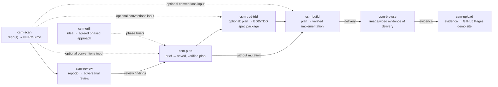

# opencode-skills

A collection of [OpenCode](https://opencode.ai) agent skills built around the **CSM (cyclic state machine)** workflow: relentless idea grilling (`csm-grill`), rigorous, evidence-based planning (`csm-plan`), optional BDD/TDD spec mutation (`csm-bdd-tdd`), resumable plan execution (`csm-build`), and adversarial repository review (`csm-review`) — supported by repository analysis (`csm-scan`), Dockerized browser automation (`csm-browse`), and evidence publishing (`csm-upload`).

> **Progressive disclosure:** this README is the index. Each skill's commands, flags, examples, and full reference live in its `SKILL.md`, linked from the [Skills](#skills) table below.

## Table of contents

- [The CSM workflow](#the-csm-workflow)
- [Skills](#skills)
- [Requirements](#requirements)
- [Installation](#installation)
- [Quickstart](#quickstart)
- [Usage](#usage)
- [Repository layout](#repository-layout)
- [Development & testing](#development--testing)
- [Troubleshooting](#troubleshooting)
- [License](#license)

## The CSM workflow



> **Edge semantics:** dashed edges are optional, human-invoked inputs (for example feeding the `NORMS.md` conventions from `csm-scan` into `csm-plan`, `csm-bdd-tdd`, `csm-build`, or `csm-review` — csm-review consumes `NORMS.md` via its `## NORMS.md` section, optionally like the others). `review --> plan` is a **human-in-the-loop** feed of review findings into a subsequent plan run — not an automatic edge; a review never writes a plan by itself.

The core loop: **grill** an idea into an agreed phased approach, **scan** a repository for its conventions, **review** it adversarially for defects and security risks, **plan** the work as a numbered, resumable state machine, optionally **mutate** the plan into strict BDD/TDD form, then **build** it with parallel subagents, checkpoints, and review cycles. After delivery, **browse** captures image/video evidence of the build and **upload** makes it available to the user.

Each stage is a separate, explicitly invoked skill — planning never silently becomes implementation, and execution always starts from a saved plan on disk.

## Skills

| Skill | Purpose | Reference |
|---|---|---|
| `csm-grill` | Grill an idea into an agreed, phased approach — a relentless one-question-at-a-time interview backed by research subagents, cycling until you agree; each phase is a ready-made brief for a future csm-plan run. Never plans or implements. | [csm-grill/SKILL.md](csm-grill/SKILL.md) |
| `csm-plan` | Turn a brief into an evidence-based, executable, resumable implementation plan — research, critique, verify, save, stop. Unless already inside tmux or told otherwise, it first starts its orchestrating agent in a detached tmux session (named `csm-plan-<goal-slug>`) and tells you how to attach. Never implements. | [csm-plan/SKILL.md](csm-plan/SKILL.md) |
| `csm-bdd-tdd` | Mutate a saved plan into a strict BDD+TDD package: formal spec, executable Gherkin scenarios, unit test designs, and a traceable mutated plan. Unless already inside tmux or told otherwise, it first starts its orchestrating agent in a detached tmux session (named `csm-bdd-tdd-<goal-slug>`) and tells you how to attach. | [csm-bdd-tdd/SKILL.md](csm-bdd-tdd/SKILL.md) |
| `csm-build` | Execute a saved CSM plan with parallel subagents, durable checkpoints, and review/repair cycles until verified complete. Unless already inside tmux or told otherwise, it first starts its orchestrating agent in a detached tmux session (named `csm-build-<goal-slug>`) and tells you how to attach. | [csm-build/SKILL.md](csm-build/SKILL.md) |
| `csm-scan` | Read-only multi-repo analysis producing a single `NORMS.md`: 17 evidence dimensions (structure, stack, conventions, architecture, security, data, deployment, and more) with Mermaid C4 diagrams. Unless already inside tmux or told otherwise, it first starts its orchestrating agent in a detached tmux session (named `csm-scan-<goal-slug>`) and tells you how to attach. | [csm-scan/SKILL.md](csm-scan/SKILL.md) |
| `csm-review` | Adversarial repository review — a multi-agent defensive sweep that gathers evidence across a review-dimension spine (correctness, technical debt, security, secrets, dependencies, and more), challenges each finding, and saves a review report. Unless already inside tmux or told otherwise, it first starts its orchestrating agent in a detached tmux session (named `csm-review-<goal-slug>`) and tells you how to attach. Never fixes. | [csm-review/SKILL.md](csm-review/SKILL.md) |
| `csm-browse` | Drive an isolated Chromium inside the `chromium-vnc` Docker container via CDP: navigate, click, type, log in, screenshot, inspect DOM, capture console/network/performance, record video. | [csm-browse/SKILL.md](csm-browse/SKILL.md) |
| `csm-upload` | Upload screenshots, videos, and evidence files to a GitHub Pages demo site under a unique dated page name. | [csm-upload/SKILL.md](csm-upload/SKILL.md) |

## Requirements

- **[OpenCode](https://opencode.ai)** — these are OpenCode skills.
- **Node.js >= 22** — for `csm-browse` (see `csm-browse/package.json`) and for running the `csm-scan` test suite (`node:test`). `csm-scan` itself is zero-dependency Node built-ins only.
- **Docker** with the `chromium-vnc` container — `csm-browse` only.
- **`gh` CLI**, authenticated, plus a GitHub Pages-enabled repository — `csm-upload` only.
- **tmux** — optional. When available and not already running under tmux (and not opted out of), the `csm-plan`, `csm-build`, `csm-bdd-tdd`, `csm-scan`, and `csm-review` skills start their orchestrating agent in a detached tmux session so long-running work survives a dropped terminal; each prints its session name and how to attach; without tmux they proceed in the current session.
- **ffmpeg** — optional, but required by `csm-browse` for full-page screenshots (image stitching) and video screencasts; capture degrades to viewport-only shots and no recording when it is missing.
- **curl** — optional, but used by `csm-browse`'s `ensure-browser.mjs` to probe the CDP endpoint readiness.

## Installation

Clone this repository into your OpenCode skills directory (or copy the eight skill folders into an existing one):

```bash
git clone git@github.com:jamiemills/opencode-skills.git $HOME/.config/opencode/skills
```

Restart OpenCode so it picks up the skills. `csm-plan`, `csm-build`, `csm-bdd-tdd`, `csm-grill`, `csm-scan`, `csm-review`, and `csm-upload` need no further setup.

`csm-browse` has runtime dependencies — install and verify:

```bash
cd $HOME/.config/opencode/skills/csm-browse
npm install --no-audit --no-fund
node -e "require('chrome-remote-interface'); console.log('ok')"
node scripts/check-skill.mjs
```

Optionally activate the local pre-commit gate (fast conformance + boilerplate-drift + syntax checks; bypass with `--no-verify`):

```bash
node scripts/install-hooks.mjs
```

Dependency inventory: `csm-browse/package-lock.json` (integrity-hashed) is authoritative; regenerate a CycloneDX SBOM opportunistically with `npx cyclonedx-npm --output-file sbom.json` — no SBOM tooling is installed by this repo.

## Quickstart

The core loop is **grill → plan → build**:

1. **Grill** an idea — invoke `csm-grill` to be interviewed one question at a time until the phased approach is agreed and each phase is a ready-made brief for the next step.
2. **Plan** — invoke `csm-plan` with a brief; it researches, critiques, verifies, and saves a numbered, resumable plan.
3. **Build** — invoke `csm-build` with the saved plan; it executes with parallel subagents, durable checkpoints, and review/repair cycles until verified complete.

Optional: `node scripts/install-hooks.mjs` enables the fast pre-commit gate.

The plan and build steps start in a detached tmux session unless you're already inside tmux or declined — say **"no tmux"** to keep the run in-session.

Optional gates around the loop: **`csm-scan`** to capture repository conventions into `NORMS.md` before planning, and **`csm-review`** to adversarially audit a repository (or a completed build) for defects and security risks before delivery.

See [Usage](#usage) for the full sequence.

## Usage

The five orchestration skills (`csm-grill`, `csm-plan`, `csm-bdd-tdd`, `csm-build`, `csm-review`) are invoked by name in an OpenCode session — e.g. *"use csm-plan to make a plan for adding OAuth login"*. The three tooling skills (`csm-scan`, `csm-browse`, `csm-upload`) also expose a CLI under their `scripts/` directories. **Commands, flags, examples, and full reference for each skill live in its `SKILL.md`** (see the [Skills](#skills) table); for `csm-scan`, the CLI flags are documented in [csm-scan/SKILL.md](csm-scan/SKILL.md) (`## CLI`).

`csm-scan` is **orchestration-shaped tooling**: it runs the same tmux session bootstrap as the orchestration skills (a scan starts in a detached `csm-scan-<goal-slug>` session unless you're already inside one or declined) but is at heart a CLI tool — so it still counts among the three tooling skills below.

Typical sequence:

1. **Grill** an idea into agreed phases — `csm-grill` (each phase becomes a brief for the next step).
2. **Scan** a repo for conventions (optional) — `csm-scan` → `NORMS.md`; when run as a skill it starts in a detached tmux session (`csm-scan-<goal-slug>`) unless you're already inside one or declined.
3. **Review** the repo adversarially (optional) — `csm-review` → `.agents/reviews/<date>-<repo>-review.md`.
4. **Plan** the work — `csm-plan` → `.agents/plans/<date>-<goal>-csm.md`. Unless you're already in tmux or asked not to use it, this starts a detached tmux session (`csm-plan-<goal-slug>`) that prints its name and runs the planning there; attach with `tmux attach-session -t <name>` or say "no tmux" to keep it in-session.
5. **Mutate** to BDD/TDD (optional) — `csm-bdd-tdd`; starts in a detached tmux session (`csm-bdd-tdd-<goal-slug>`) unless you're already inside one or declined.
6. **Build** it — `csm-build`, preferring any BDD/TDD-mutated plan; starts in a detached tmux session (`csm-build-<goal-slug>`) unless you're already inside one or declined.
7. **Capture** image/video evidence of the delivery and **publish** it — `csm-browse` → `csm-upload`.

Planning never silently becomes implementation, and execution always starts from a saved plan on disk.

## Repository layout

```
.
├── csm-grill/         # SKILL.md — the idea-grilling interview
├── csm-plan/          # SKILL.md — the planning state machine
├── csm-build/         # SKILL.md — the plan execution engine
├── csm-bdd-tdd/       # SKILL.md — BDD/TDD plan mutation
├── csm-scan/          # repository analyzer → NORMS.md
│   ├── lib/scan/      # pipeline, dimension registry, scanners, providers, renderers
│   ├── scripts/       # scan.mjs CLI
│   └── test/          # node:test suite + fixtures
├── csm-review/        # SKILL.md — the adversarial repository reviewer
├── csm-browse/        # CDP browser automation
│   ├── lib/           # CDP client, docker, session, recorder, verb implementations
│   ├── scripts/       # browse.mjs, ensure-browser.mjs, session-daemon.mjs, check-skill.mjs
│   └── tests/         # e2e + fixtures (requires Docker)
├── csm-upload/        # evidence upload to GitHub Pages
│   └── scripts/       # upload.mjs
├── scripts/           # check-suite.mjs — repo-wide conformance gate
└── .agents/           # process artifacts: plans/, docs/, reviews/ (indexed in .agents/README.md)
```

## Development & testing

- `node scripts/check-suite.mjs`   # repo-wide conformance gate (frontmatter, sections, state lines, README integrity)
- **csm-scan** — zero-dependency `node:test` suite, run from the skill directory:

  ```bash
  cd csm-scan
  node --test --test-concurrency=1
  ```

  Serial mode (`--test-concurrency=1`) is authoritative; default parallel mode can race the filesystem-heavy fixture tests. See [csm-scan/SKILL.md](csm-scan/SKILL.md) for focused gate commands (determinism, privacy, constraints, golden, and more).

- **csm-browse** — lightweight self-check, then the Docker-dependent end-to-end suite:

  ```bash
  cd csm-browse
  node scripts/check-skill.mjs   # fast sanity check, no Docker needed
  node tests/e2e.mjs             # full e2e; requires the chromium-vnc container
  ```

- The orchestration skills (`csm-grill`, `csm-plan`, `csm-build`, `csm-bdd-tdd`, `csm-review`) are single-file skills with no test suite; validate by invoking them.
- **Commit style** — short imperative messages, frequently skill-prefixed (e.g. `csm-browse: ...`, `add csm-scan skill: ...`).

## Troubleshooting

- **Lost tmux session** — a skill started a detached session but you lost track of it. List sessions with `tmux ls`, then reattach with `tmux attach-session -t <name>` (the name was printed when the session started, e.g. `csm-plan-<goal-slug>`).
- **`chromium-vnc` container not starting** — `csm-browse` needs the container present and running. Check `docker ps -a` for the container, start it (`docker start <name>`), and rerun `node $HOME/.config/opencode/skills/csm-browse/scripts/ensure-browser.mjs --session <sid>`. If it is absent, create it per `csm-browse`'s SKILL.md before using the skill.
- **`gh` not authenticated** — `csm-upload` reports authentication failures. Run `gh auth login` (and verify with `gh auth status`), then retry.
- **ffmpeg missing** — full-page screenshots and screencasts fail without it. Install it with your package manager (e.g. `sudo apt install ffmpeg` or `brew install ffmpeg`). Until then `csm-browse` degrades to viewport-only screenshots and no video.

## License

MIT — see [LICENSE](LICENSE).
