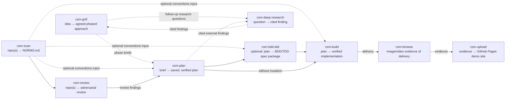

# opencode-skills

A collection of **eleven agent-agnostic AI skills** built around the **CSM (cyclic state machine)** workflow — a disciplined way for an AI agent to research, plan, and build software with receipts at every step.

## Quick install

This repository contains eleven AI skills — deep research, idea grilling, planning, BDD/TDD spec mutation, plan execution, comprehensive test generation, adversarial review, Python doctrine review, repo scanning, browser automation, and evidence publishing — that install into OpenCode, Claude Code, or any Agent Skills runtime.

```bash
git clone https://github.com/jamiemills/opencode-skills.git ~/.config/opencode/skills
cd ~/.config/opencode/skills/csm-browse && pnpm install && node scripts/check-skill.mjs
```

Restart your agent runtime and the eleven skills are live (`csm-browse` is the only one with extra setup; everything else works immediately). Full details: [Install](#install).

## Table of contents

- [What this is](#what-this-is)
- [Install](#install)
- [The eleven skills at a glance](#the-eleven-skills-at-a-glance)
- [Composition matrix](#composition-matrix)
- [Quickstart](#quickstart)
- [Skill deep dives](#skill-deep-dives)
- [How the pieces fit together](#how-the-pieces-fit-together)
- [Repository layout](#repository-layout)
- [Development & testing](#development--testing)
- [Troubleshooting](#troubleshooting)
- [License](#license)

## What this is

**The problem it solves:** AI agents are great at starting things and bad at finishing them. Work lives in chat history, plans are implicit, "done" is a vibe. This library replaces that with explicit, machine-validated state machines: every stage is a separately invoked skill that reads its inputs from disk, writes a dated artifact to disk, and stops. A fresh session can resume any stage from its artifact alone — never from chat history.

**The design rules, shared by every skill:**

- **Explicit over implicit** — each skill runs a documented state machine (`INTAKE -> … -> SAVED`); every transition is journaled inside the artifact it produces.
- **Terminal stages, human-mediated handoffs** — a skill that finishes stops. The next stage is a fresh, explicit invocation by you; planning never silently becomes implementation, and a reviewer never silently starts fixing.
- **Write discipline** — orchestration skills write only their own allowlisted artifact (plus a disposable temp dir); they never mutate the repository they are researching, planning, or reviewing.
- **Evidence over assertion** — findings are challenged before they are reported, plans carry runnable acceptance signals before they are executed, and builds finish only when every acceptance signal has recorded proof.
- **Agent-agnostic** — the skills are plain `SKILL.md` instructions plus (where needed) zero-or-low-dependency Node CLIs. They run in OpenCode, Claude Code, or any Agent Skills runtime.

**The core loop** is **research → grill → plan → build**, wrapped by repository analysis (`csm-scan`), adversarial review (`csm-review`), browser evidence capture (`csm-browse`), and evidence publishing (`csm-upload`).

## Install

### Requirements

Eleven skills, three roles:

| Role                                             | Skills                                                                                 |
| ------------------------------------------------ | -------------------------------------------------------------------------------------- |
| **Orchestration** (invoked by name in a session) | `csm-deep-research`, `csm-grill`, `csm-plan`, `csm-bdd-tdd`, `csm-make-tests`, `csm-build`, `csm-review`, `csm-python-doctrine-review` |
| **Tooling** (also expose a CLI)                  | `csm-scan`, `csm-browse`, `csm-upload`                                                 |

The core loop — **research → grill → plan → build** — with the supporting cast:



> **Edge semantics:** dashed edges are optional, human-invoked inputs. Research runs **first — or in parallel with the grill** — when the idea rests on external facts, specs, or standards that must be verifiable by citation: `csm-deep-research` answers them, the cited findings feed the grill (which may dispatch follow-up questions) and the plan, and the finding lands in `.agents/research/`. `csm-scan` feeds `NORMS.md` conventions into `csm-plan`, `csm-bdd-tdd`, `csm-build`, or `csm-review`. `review --> plan` is a **human-in-the-loop** feed of review findings into a subsequent plan run — never an automatic edge.

Each stage is a separate, explicitly invoked skill — planning never silently becomes implementation, and execution always starts from a saved plan on disk. Every stage is terminal: it writes its artifact and stops; handoff to the next stage is a fresh, explicit invocation.

**The artifact ledger** — every run leaves a dated, machine-validated artifact under `.agents/` (indexed in [`.agents/README.md`](.agents/README.md)):

| Skill               | Artifact                                                                                                                   |
| ------------------- | -------------------------------------------------------------------------------------------------------------------------- |
| `csm-grill`         | `.agents/approaches/<date>-<idea-slug>-approach.md`                                                                        |
| `csm-plan`          | `.agents/plans/<date>-<goal-slug>-csm.md`                                                                                  |
| `csm-bdd-tdd`       | mutated plan `<date>-<goal>-bdd-csm.md` + spec/scenario/test designs                                                       |
| `csm-build`         | plan journal + delivery evidence (in-repo)                                                                                 |
| `csm-review`        | `.agents/reviews/<date>-<repo-slug>-review.md`                                                                             |
| `csm-python-doctrine-review` | `.agents/doctrine/<date>-<repo-slug>-python-doctrine-review.md`                                                       |
| `csm-scan`          | `NORMS.md` at the scanned repo root                                                                                        |
| `csm-deep-research` | `.agents/research/<date>-<slug>-research.md` + optional run artifacts in `.agents/research/artifacts/` (e.g. JSON schemas) |
| `csm-browse`        | screenshots / videos / DOM·console·network evidence                                                                        |
| `csm-upload`        | dated GitHub Pages demo page                                                                                               |

## The eleven skills at a glance

| Skill               | In one sentence                                                                                                                                      | Reference                                                |
| ------------------- | ---------------------------------------------------------------------------------------------------------------------------------------------------- | -------------------------------------------------------- |
| `csm-deep-research` | Answers a research/R&D question with one dated, exhaustively cited finding — triage → parallel researchers → adversarial challenge → judge → verify. | [csm-deep-research/SKILL.md](csm-deep-research/SKILL.md) |
| `csm-grill`         | Interviews you one question at a time, backed by research, until an idea becomes an agreed, phased approach.                                         | [csm-grill/SKILL.md](csm-grill/SKILL.md)                 |
| `csm-plan`          | Turns a brief into an evidence-based, executable, resumable implementation plan — then stops.                                                        | [csm-plan/SKILL.md](csm-plan/SKILL.md)                   |
| `csm-bdd-tdd`       | Mutates a saved plan into a strict BDD+TDD package: formal spec, Gherkin scenarios, unit test designs, traceable plan.                               | [csm-bdd-tdd/SKILL.md](csm-bdd-tdd/SKILL.md)             |
| `csm-make-tests`     | Generates a comprehensive executable test suite: audits existing tests/coverage, captures goldens, generates intent/contract/perf tests, mutation-validates. | [csm-make-tests/SKILL.md](csm-make-tests/SKILL.md)       |
| `csm-build`         | Executes a saved plan with parallel subagents, durable checkpoints, and review/repair cycles until verified complete.                                | [csm-build/SKILL.md](csm-build/SKILL.md)                 |
| `csm-review`        | Adversarially audits a repository across an 18-dimension spine and saves a challenged findings report. Never fixes.                                  | [csm-review/SKILL.md](csm-review/SKILL.md)               |
| `csm-python-doctrine-review` | Reviews Python repositories against PEP 20 and idiomatic-Python doctrine, producing one evidence-grounded findings and fix-guide report. | [csm-python-doctrine-review/SKILL.md](csm-python-doctrine-review/SKILL.md) |
| `csm-scan`          | Read-only multi-repo analyzer producing a single `NORMS.md` across 17 evidence dimensions.                                                           | [csm-scan/SKILL.md](csm-scan/SKILL.md)                   |
| `csm-browse`        | Drives an isolated Chromium in Docker via CDP: navigate, click, type, log in, screenshot, record video, inspect DOM/network/console.                 | [csm-browse/SKILL.md](csm-browse/SKILL.md)               |
| `csm-upload`        | Publishes evidence files to a GitHub Pages demo site under a unique dated page name.                                                                 | [csm-upload/SKILL.md](csm-upload/SKILL.md)               |

**How they compose** — the core loop with the supporting cast:


> **Edge semantics:** dashed edges are optional, human-invoked inputs. Research runs **first — or in parallel with the grill** — when the idea rests on external facts, specs, or standards that must be verifiable by citation: `csm-deep-research` answers them, the cited findings feed the grill (which may dispatch follow-up questions) and the plan, and the finding lands in `.agents/research/`. `csm-scan` feeds `NORMS.md` conventions into `csm-plan`, `csm-bdd-tdd`, `csm-build`, or `csm-review`. `review --> plan` is a **human-in-the-loop** feed of review findings into a subsequent plan run — never an automatic edge.

**The artifact ledger** — every run leaves a dated, machine-validated artifact under `.agents/` (indexed in [`.agents/README.md`](.agents/README.md)):

| Skill               | Artifact                                                                                                                   |
| ------------------- | -------------------------------------------------------------------------------------------------------------------------- |
| `csm-grill`         | `.agents/approaches/<date>-<idea-slug>-approach.md`                                                                        |
| `csm-plan`          | `.agents/plans/<date>-<goal-slug>-csm.md`                                                                                  |
| `csm-bdd-tdd`       | mutated plan `<date>-<goal>-bdd-csm.md` + spec/scenario/test designs                                                       |
| `csm-build`         | plan journal + delivery evidence (in-repo)                                                                                 |
| `csm-review`        | `.agents/reviews/<date>-<repo-slug>-review.md`                                                                             |
| `csm-scan`          | `NORMS.md` at the scanned repo root                                                                                        |
| `csm-deep-research` | `.agents/research/<date>-<slug>-research.md` + optional run artifacts in `.agents/research/artifacts/` (e.g. JSON schemas) |
| `csm-browse`        | screenshots / videos / DOM·console·network evidence                                                                        |
| `csm-upload`        | dated GitHub Pages demo page                                                                                               |

<!-- csm-matrix:start -->
## Composition matrix

How each skill composes — standalone entry conditions, what it consumes and produces, and how work hands off. Generated from `scripts/lib/contracts.mjs`; regenerate with `node scripts/gen-readme-matrix.mjs --write`.

| Skill | Standalone entry | Consumes | Produces | Hands off |
|---|---|---|---|---|
| `csm-grill` | idea shared, explicit request to be grilled, interviewed, or stress-tested | rough idea, repository and research evidence, optional csm-deep-research findings when dispatched | agreed phased approach document | phase briefs to a separately invoked csm-plan |
| `csm-plan` | brief or phase brief, explicit planning request | idea or phase brief, repository conventions, review findings, optional csm-deep-research findings when dispatched | saved, verified CSM plan | saved plan to csm-bdd-tdd or csm-build |
| `csm-bdd-tdd` | saved CSM plan, explicit BDD/TDD mutation request | saved plan, repository conventions | formal spec, Gherkin scenarios, unit test designs, mutated CSM plan | mutated plan to csm-build |
| `csm-build` | saved CSM plan, explicit implementation request | saved plan, optional NORMS.md, BDD/TDD package when present | verified implementation, delivery evidence | delivery to csm-browse |
| `csm-review` | repository target, explicit review, audit, or assessment request | repository at a pinned commit, optional NORMS.md | dated findings report | review findings to a subsequent csm-plan run, separate human-mediated dispatch to csm-python-doctrine-review |
| `csm-scan` | repository target, scan or conventions-analysis request | committed repository declarations | NORMS.md | optional conventions input to csm-plan, csm-bdd-tdd, csm-build, or csm-review |
| `csm-browse` | need to drive a headful Chromium browser | browser session, CDP verbs, delivery target | screenshots, videos, DOM, console, network, or performance evidence | evidence files to csm-upload |
| `csm-upload` | evidence files ready, configured GitHub Pages destination | screenshots, videos, or evidence files, GitHub configuration | dated GitHub Pages demo page | published evidence URL to the user |
| `csm-deep-research` | research question or topic, explicit deep-research request, dispatch from csm-grill or csm-plan | research question, retrievable sources (web, docs, repositories), browser-rendered retrieval via csm-browse fallback (JS-only pages) | dated research document at .agents/research/<yyyy-mm-dd>-<slug>-research.md, optional declared run artifacts at .agents/research/artifacts/<yyyy-mm-dd>-<slug>-<name>.<ext> (e.g. a JSON schema) | research document and any declared run artifacts to the user or a dispatching csm-grill or csm-plan |
| `csm-make-tests` | repository checkout at a pinned commit, optional change-surface scope | repository working tree, optional NORMS.md conventions, cited research findings under .agents/research/ | executable test files and goldens in the target repository, .agents/tests/<yyyy-mm-dd>-<repo-slug>-tests-ledger.md, .agents/tests/<yyyy-mm-dd>-<repo-slug>-verification.md | verified suite, ledger, and verification report to the user or a later explicit csm-build run |
| `csm-python-doctrine-review` | target python repository checkout at a pinned commit, optional change-surface scope, explicit user consent for any tool installation | repository working tree (read-only), optional NORMS.md conventions, bundled rules artifact artifact/python-idiomatic-reviewer-rules.json, doctrine playbook from .agents/research/2026-08-22-pep20-idiomatic-python-consolidated-research.md | .agents/doctrine/<yyyy-mm-dd>-<repo-slug>-python-doctrine-review.md | single doctrine report (findings + fix guide) to the user or a dispatching csm-review; terminal otherwise |
<!-- csm-matrix:end -->

## Quickstart

The core loop is **research → grill → plan → build**:

0. **Research** — when the idea hinges on external facts, specs, or standards, invoke `csm-deep-research` first (or run it in parallel with the grill): it returns an exhaustively cited finding (plus any requested run artifacts) that the grill and the plan can rely on.
1. **Grill** an idea — invoke `csm-grill` to be interviewed one question at a time until the phased approach is agreed and each phase is a ready-made brief for the next step.
2. **Plan** — invoke `csm-plan` with a brief; it researches, critiques, verifies, and saves a numbered, resumable plan.
3. **Build** — invoke `csm-build` with the saved plan; it executes with parallel subagents, durable checkpoints, and review/repair cycles until verified complete.

Optional: `make install` installs the root devDependencies (and `csm-browse`'s), and `node scripts/install-hooks.mjs` enables the fast lefthook pre-commit gate.

The plan and build steps start in a detached tmux session unless you're already inside tmux or declined — say **"no tmux"** to keep the run in-session.

Optional gates around the loop: **`csm-scan`** to capture repository conventions into `NORMS.md` before planning, and **`csm-review`** to adversarially audit a repository (or a completed build) for defects and security risks before delivery.

## Skill deep dives

Deep detail lives in each `SKILL.md` (linked per skill); what follows is the orientation layer — what each skill is for, how it works inside, and what it hands you.

### csm-deep-research — cited answers to hard questions

Use when a claim, spec, or standard must be verifiable by citation: "which algorithm should we use", "what does the original spec say", "is X still true in 2026". Invoke it by name with the question; it may also be dispatched by `csm-grill`/`csm-plan` for follow-ups.

- **Pipeline:** `INTAKE -> TRIAGE -> RESEARCH -> SYNTHESIZE -> CHALLENGE -> JUDGE -> REMEDIATE -> VERIFY -> SAVED`. Triage matches machinery to stakes: **QUICK** (single source, primary-led), **STANDARD** (2–4 parallel researchers + real challenger + judge), **DEEP** (4+ experts, kill-the-draft power).
- **Guarantees:** every claim carries a citation; an anti-anchored challenger attacks the draft; a rubric-scored judge gates it; remediation forward-fixes rather than patches; a tier-scaled verification gate personally checks the result before saving.
- **Outputs:** one dated finding at `.agents/research/<date>-<slug>-research.md` (fixed eight-section shape under format marker `csm-deep-research`, version 1) plus optional declared run artifacts (e.g. a JSON schema) under `.agents/research/artifacts/`.
- **Boundaries:** never writes outside the research document and its declared artifacts. During a run it may dispatch `csm-browse` for browser-rendered retrieval of JS-only pages.
- _Full reference: [csm-deep-research/SKILL.md](csm-deep-research/SKILL.md)._

### csm-grill — the idea stress-tester

Use when an idea is still soft. Invoke it with the rough idea; it interviews you **one question at a time**, each with a recommended answer, cycling until you explicitly agree.

- **Method:** every answer is backed by evidence — repository facts, your answers, and cited research (it may dispatch `csm-deep-research` for external claims). Assumptions are surfaced and killed early, when they are cheap.
- **Output:** a phased approach document at `.agents/approaches/<date>-<idea-slug>-approach.md` whose phases are ready-made briefs for `csm-plan`.
- **Boundaries:** never plans, never implements; interactive by design (never detaches into tmux).
- _Full reference: [csm-grill/SKILL.md](csm-grill/SKILL.md) — Grilling State Machine._

### csm-plan — from brief to executable plan

Invoke with a brief (or a phase brief from the grill). Planning only — it researches, critiques, verifies, saves, and stops.

- **Pipeline:** `INTAKE -> DISCOVER -> RESEARCH -> DRAFT -> CRITIQUE -> REMEDIATE -> VERIFY -> SAVED`, with parallel research tracks, an uncertainty scout, and an independent critique cycle that must be remediated before saving.
- **The plan document** (format marker `csm-plan`, version 1) is the durable control artifact: numbered tasks each with a runnable acceptance signal, risk classification, owned scope, anti-scope, and repair budget; plus Control (resume state), an execution graph of safe parallel groups, verification strategy ordered cheapest-first, and a progress journal — enough for a fresh session to resume after any interruption.
- **Output:** `.agents/plans/<date>-<goal-slug>-csm.md`, committed by default.
- **Boundaries:** never implements; execution requires a separate explicit `csm-build` invocation.
- _Full reference: [csm-plan/SKILL.md](csm-plan/SKILL.md) — Planning State Machine, Required Plan Document._

### csm-bdd-tdd — optional spec-first mutation

Invoke with a saved plan when you want behavior specified before it is built. It mutates the plan into a strict BDD+TDD package: a formal spec, executable Gherkin scenarios, per-task unit test designs, and a traceability-mutated plan (`<date>-<goal>-bdd-csm.md`). `csm-build` then follows the mutated plan and its mandated red-green-refactor order — failing unit tests first, minimal implementation, refactor, then scenario pass end-to-end. _Full reference: [csm-bdd-tdd/SKILL.md](csm-bdd-tdd/SKILL.md) — Pipeline._

### csm-build — the execution engine

Invoke with a saved plan (base or BDD/TDD-mutated). This is where work happens — and where the discipline pays off.

- **Pipeline:** `RECOVER -> VALIDATE -> SELECT -> DISPATCH -> INTEGRATE -> VERIFY -> REVIEW -> REPAIR -> CHECKPOINT`, cycling back to SELECT until every acceptance criterion carries recorded evidence (`COMPLETE`), stopping only on a genuine user decision or unsafe action (`BLOCKED`), pausing cleanly on quota exhaustion (`PAUSED`) with the checkpoint as the resume point.
- **Mechanics:** maximal useful parallel subagents with non-overlapping write ownership; the primary agent integrates, verifies cheapest-first, and owns all commits; durable checkpoints mean an interrupted run resumes from the plan journal, not chat history; independent review is mandatory for security/privacy/data/destructive/public-interface work; after two failed repair attempts on a task it stops patching and re-diagnoses with fresh eyes.
- **Output:** verified implementation + commits + the updated plan (journal, Completion Review).
- _Full reference: [csm-build/SKILL.md](csm-build/SKILL.md) — Execution State Machine, Completion Gate._

### csm-review — the adversarial auditor

Invoke with a repository (or point it at a completed build) when you want to know what is wrong before your users do. It never fixes anything.

- **Method:** multi-agent defensive review — parallel finder agents sweep non-overlapping chunks across an 18-dimension spine (correctness & defects, technical debt & architecture, code smells, anti-patterns, security weaknesses, security control verification, secrets & data exposure, concurrency & races, memory & resource safety, error handling & resilience, input validation & trust boundaries, test presence, test quality, test-type adequacy, dependency vulnerabilities, toolchain currency, observability & operability, CI/build/docs/licensing); every medium-and-above finding is independently challenged by an agent that did not author it; severity and confidence are kept strictly apart; findings cite pinned-commit locations with reproducible evidence.
- **Posture:** read-only static inspection by default (R0), scaling to sandboxed installs/collection/execution (R1–R3) with egress blocking and environment scrubbing when you accept the rungs.
- **Output:** one dated findings report at `.agents/reviews/<date>-<repo-slug>-review.md` — executive summary, methodology disclosure, coverage matrix, honest anti-coverage, adjudicated findings with challenges/dissents, adjudication log, reproducibility.
- _Full reference: [csm-review/SKILL.md](csm-review/SKILL.md) — Review State Machine._

### csm-scan — the conventions extractor

Invoke against one or more repositories before planning or reviewing, so later stages speak the repo's language. Read-only: all runtime/build/test/deployment findings come from committed static declarations — target commands are never executed.

- **Coverage:** 17 per-repository dimensions (Repository Structure, Technology Stack, Configuration, Testing, Code Conventions, Git Practices, Architecture, Documentation, Security, Operations, API Surface, Data Architecture, Deployment Topology, Maintainability, Governance & Ownership, Assurance & Supply Chain, Development Practices) plus a global Cross-repository Architecture section with Mermaid diagrams when multiple repos are scanned.
- **CLI:** zero-dependency Node — `node scripts/scan.mjs [--repos <path>...] [--out <path>] [--verbose]` (defaults: scan the current directory, write `NORMS.md` there); `--verbose` writes a gitignored unredacted local diagnostic trace next to the output — never stdout, never the report. Reports are privacy-redacted (absolute paths, identities, secrets).
- **Output:** a single `NORMS.md` at the target root; later skills load it as untrusted-hint conventions and re-verify anything they rely on.
- _Full reference: [csm-scan/SKILL.md](csm-scan/SKILL.md) — `## Dimensions`, `## CLI`._

### csm-browse — the evidence camera

Use whenever delivery proof or browser-driven evidence is needed: screenshots (viewport or stitched full-page), VP9 screencasts, DOM/console/network/performance capture, login flows.

- **Isolation model:** each session runs Chromium inside the `chromium-vnc` Docker container with its own profile, a port pair from a small dedicated pool, and a token-gated loopback CDP funnel — the raw debug port is never published, and VNC binds loopback-only with a per-session password.
- **Session workflow:** `ensure-browser.mjs --session <sid>` starts or adopts the container, launches Chromium, sets up the CDP forward, spawns the session daemon, and writes `state.json`; `browse.mjs <verb> --session <sid>` drives it; `close` tears everything down.
- **Verbs:** `open`, `wait`, `wait-selector`, `click`, `type`, `press`, `text`, `html`, `eval`, `screenshot` (`--small|--medium|--full|--viewport`), `console`, `network`, `performance`, `cookies` (values masked by default), `status`, `screencast-start/stop`, `close`.
- **Needs:** Docker + `chromium-vnc`, Node >= 22, one-time `pnpm install`; ffmpeg optional (full-page stitching + video); curl optional (readiness probes).
- _Full reference: [csm-browse/SKILL.md](csm-browse/SKILL.md) — Verb reference._

### csm-upload — the publishing step

Terminal evidence publisher: `node $HOME/.config/opencode/skills/csm-upload/scripts/upload.mjs --label <name> [--desc <text>] [--github <user>] [--repo <name>] <file...>` copies evidence into a dated directory of your GitHub Pages repo (default `csm-browse-pages`; configurable via `~/.agents/csm-upload.json` or flags), commits, pushes, and prints the public URL. Requires an authenticated `gh` CLI and a Pages-enabled repo; never pushes anywhere else. _Full reference: [csm-upload/SKILL.md](csm-upload/SKILL.md) — Usage._

## How the pieces fit together

### The lifecycle, step by step

1. **Research** — when the idea rests on external facts, specs, or standards that must be verifiable by citation, `csm-deep-research` answers them first (or in parallel with the grill): triage → parallel researchers → adversarial challenge → judge → verify, saving an exhaustively cited finding (and any requested run artifacts) to `.agents/research/`. _Full reference: [csm-deep-research/SKILL.md](csm-deep-research/SKILL.md) — Research State Machine._
2. **Grill** — `csm-grill` interviews you one question at a time (each with a recommended answer), backs every answer with research — dispatching `csm-deep-research` for follow-up questions that need cited evidence — and cycles until you explicitly agree. Output: a phased approach document whose phases are ready-made briefs. _Full reference: [csm-grill/SKILL.md](csm-grill/SKILL.md) — Grilling State Machine._
3. **Scan** (optional) — `csm-scan` extracts a repository's conventions into `NORMS.md` (17 dimensions, static declarations only — target commands are never executed) so later stages speak the repo's language. _Full reference: [csm-scan/SKILL.md](csm-scan/SKILL.md) — `## Dimensions`, `## CLI`._
4. **Review** (optional) — `csm-review` adversarially audits a repository (or a completed build) across a finding spine, challenges every finding, and writes a dated report. Never fixes. _Full reference: [csm-review/SKILL.md](csm-review/SKILL.md) — Review State Machine._
5. **Plan** — `csm-plan` researches, critiques, verifies, and saves a numbered, resumable plan (with acceptance signals, risks, anti-scope). _Full reference: [csm-plan/SKILL.md](csm-plan/SKILL.md) — Planning State Machine, Required Plan Document._
6. **Mutate** (optional) — `csm-bdd-tdd` turns the plan into a formal spec + Gherkin scenarios + unit test designs + a mutated plan. _Full reference: [csm-bdd-tdd/SKILL.md](csm-bdd-tdd/SKILL.md) — Pipeline._
7. **Build** — `csm-build` executes the saved plan with parallel subagents, durable checkpoints, and review/repair cycles until every acceptance signal has evidence. _Full reference: [csm-build/SKILL.md](csm-build/SKILL.md) — Execution State Machine, Completion Gate._
8. **Evidence** — `csm-browse` drives an isolated Chromium container to capture screenshots/videos/DOM·network evidence of the delivery; `csm-upload` publishes it as a dated GitHub Pages demo page. _Full reference: [csm-browse/SKILL.md](csm-browse/SKILL.md) — Verb reference; [csm-upload/SKILL.md](csm-upload/SKILL.md) — Usage._

### Orchestration conventions shared by the six orchestration skills

- **tmux bootstrap** — `csm-plan`, `csm-build`, `csm-bdd-tdd`, `csm-make-tests`, `csm-scan`, `csm-review`, `csm-deep-research`, and `csm-python-doctrine-review` start their orchestrating agent in a detached session named `<skill>-<goal-slug>` when tmux is available and you are not already inside one; say **"no tmux"** to stay in-session. `csm-grill` is interactive by design and never detaches.
- **Machine-validated artifacts** — every artifact carries a `format: <skill>/<n>` marker as its first line, and the repo-wide gate validates corpus shape (required sections in order, control journals, transition formats) so a fresh session can resume from the artifact alone, never from chat history.- **Write discipline** — orchestration skills write only their own allowlisted artifact (+ a disposable temp dir); they never mutate the researched/planned/executed repository except the intentional artifact write.
- **Standalone, terminal, never-invoking** — a skill that finishes stops; the sanctioned cross-skill dispatch edges in the suite are `csm-grill`/`csm-plan` → `csm-deep-research` and `csm-deep-research` → `csm-browse` (browser-rendered retrieval of JS-only pages during a research run) (enforced by the invoke matrix in `scripts/lib/contracts.mjs`).

### The deep-research pipeline

`csm-deep-research` runs `INTAKE -> TRIAGE -> RESEARCH -> SYNTHESIZE -> CHALLENGE -> JUDGE -> REMEDIATE -> VERIFY -> SAVED`: parallel read-only researchers per track, primary synthesis, an anti-anchored adversarial challenger, a rubric-scored judge, forward-fixing remediation, a tier-scaled primary verification gate, and a single dated finding (format-marker version `1`, 1 H1 + 8 fixed H2 sections). Triage matches machinery to stakes: **QUICK** (single source, primary-led), **STANDARD** (2-4 parallel researchers + real challenger + judge), **DEEP** (4+ experts, kill-the-draft). Runs may declare **run artifacts** — machine-readable deliverables such as JSON schemas — written to `.agents/research/artifacts/` and referenced from the finding. _Full reference: [csm-deep-research/SKILL.md](csm-deep-research/SKILL.md)._

### The plan-execution state machine

`csm-build` runs `RECOVER -> VALIDATE -> SELECT -> DISPATCH -> INTEGRATE -> VERIFY -> REVIEW -> REPAIR -> CHECKPOINT`, cycling back to `SELECT` until all acceptance criteria carry evidence (`COMPLETE`), stopping on a user decision or unsafe action (`BLOCKED`), and checkpointing durably so an interrupted run resumes from the plan journal. _Full reference: [csm-build/SKILL.md](csm-build/SKILL.md)._

### The universal agent bootstrap

Beyond running in-place, the collection can be installed by any capable agent from a single URL — no clone — via a signed canonical envelope (schema `csm-bootstrap`, version `2`; digest-bound policy + guidance-only `steps_markdown`) that materializes only hash-verified payload files. The flow needs exactly three capabilities (read an HTTPS URL, write files, invoke exact `npx`); trust is user-approved (fixed package `@jamiemills/csm-skills-bootstrap@0.1.0` + bin + signing key); the protocol (`DISCOVER -> TRUST -> PLAN_DESTINATION -> CONFIRM_IF_NEEDED -> MATERIALIZE -> VERIFY -> REPORT`) and refusal codes are specified in [bootstrap/protocol.md](bootstrap/protocol.md). Envelope hosting and npm publication are credential-gated release steps ([bootstrap/release-checklist.md](bootstrap/release-checklist.md)); until then the committed fixture and `node scripts/pack-bootstrap.mjs` (deterministic tarball + digest) validate the flow.

## Repository layout

```
.
├── bootstrap/         # universal agent bootstrap: signed envelope, payload package, protocol, steps, keyring
├── csm-grill/         # SKILL.md — the idea-grilling interview
├── csm-plan/          # SKILL.md — the planning state machine
├── csm-build/         # SKILL.md — the plan execution engine
├── csm-bdd-tdd/       # SKILL.md — BDD/TDD plan mutation
├── csm-scan/          # repository analyzer → NORMS.md
│   ├── lib/scan/      # pipeline, dimension registry, scanners, providers, renderers
│   ├── scripts/       # scan.mjs CLI
│   └── test/          # node:test suite + fixtures
├── csm-review/        # SKILL.md — the adversarial repository reviewer
├── csm-python-doctrine-review/ # SKILL.md — the Python doctrine reviewer
├── csm-deep-research/ # SKILL.md — the deep-research state machine
├── csm-browse/        # CDP browser automation
│   ├── lib/           # CDP client, docker, session, recorder, verb implementations
│   ├── scripts/       # browse.mjs, ensure-browser.mjs, session-daemon.mjs, cdp-gate.mjs, check-skill.mjs
│   └── tests/         # e2e + fixtures (requires Docker)
├── csm-upload/        # evidence upload to GitHub Pages
│   └── scripts/       # upload.mjs
├── tests/             # suite conformance: trust, package audit, protocol, offline, integration, resume semantics, cache health, token efficiency, worktree sessions, check-suite
├── scripts/           # suite tooling
│   ├── check-suite.mjs            # repo-wide conformance gate (frontmatter, sections, interfaces, corpora, README integrity, payload drift, lint)
│   ├── check-plan-signals.mjs     # plan acceptance-signal lint
│   ├── sync-skill-boilerplate.mjs # regenerate/verify shared SKILL.md sections
│   ├── gen-readme-matrix.mjs      # regenerate the composition matrix from contracts
│   ├── install-hooks.mjs          # one-time pre-commit hook installer
│   ├── pack-bootstrap.mjs         # deterministic npm pack of the bootstrap package
│   ├── close-plan.mjs             # plan closure automation (Control rewrite + Closure block + journal + index)
│   ├── record-gate-baseline.mjs   # gate-baseline recorder (evidence for journal numbers)
│   ├── cache-health.mjs           # per-session/per-day cache hit ratios and cost (automatic prefix caching)
│   ├── wt-session.mjs             # parallel-worktree session helper (one goal per worktree)
│   ├── with-node22.mjs            # Node 22 toolchain helper for gate runs
│   ├── hooks/                     # tracked git hooks (core.hooksPath target)
│   │   └── pre-commit             # lefthook shim — pre-commit gate
│   └── lib/                       # shared data + templates
│       ├── contracts.mjs          # MANIFEST, CONTRACTS, INTERFACES, NEVER_INVOKE, FORMAT_VERSIONS, NORMS_PHRASES
│       ├── boilerplate.mjs        # canonical tmux-bootstrap + resilience templates
│       ├── plan-validation.mjs    # plan corpus validation rules
│       └── token-efficiency.mjs   # cache/token-efficiency toggle parsing (OFF by default)
├── .agents/           # process artifacts: plans/, approaches/, reviews/, research/ (+ artifacts/), docs/ (indexed in .agents/README.md)
├── .lefthook.yml      # pre-commit gate definition (unstaged guard, gate baseline, check-suite, syntax, staged oxlint, browse check)
├── package.json       # root tooling manifest: lefthook + oxfmt + oxlint devDeps, packageManager pnpm@10.34.5
├── pnpm-lock.yaml     # hook-tooling dependency lockfile
└── .node-version      # 22 — the gate toolchain version
```

## Development & testing

All gates and test suites run through **`make`** — it is the interface (see the [Makefile](Makefile)); `pnpm` is only the underlying package installer and is normally reached via `make install`.

- `make install` # install root devDeps (lefthook + oxfmt + oxlint) and csm-browse's deps
- `make lint` # repo-wide oxlint with the committed quality bar (`.oxlintrc.json`: correctness + suspicious categories, warnings-as-errors); `.agents/**` is exempt (research findings, plans, and run artifacts)
- `make check` # the repo-wide conformance gate: `node scripts/check-suite.mjs` (frontmatter, sections, state lines, README integrity, corpora, interfaces, boilerplate drift, matrix drift, payload drift, lint)
- `make analyze` # lint + check
- `make test-hooks` # hook test suite (lefthook shim + `.lefthook.yml` validation + staged-only oxlint)
- `make test-bootstrap` # trust, package audit, protocol, offline, integration suites
- `make test-scan` # csm-scan authoritative suite (serial)
- `make test-browse` # csm-browse fast sanity (no Docker)
- `make test` # test-hooks + test-bootstrap + test-browse + test-scan
- `make fmt` # format repo-wide with oxfmt
- `make fmt-check` # verify formatting, no writes (CI gate)
- `make fmt-staged` # format + re-stage staged files (pre-commit hook parity)
- `make test-e2e` # csm-browse e2e (requires chromium-vnc container)

Direct commands (what the targets invoke):

- `node scripts/sync-skill-boilerplate.mjs --check` # boilerplate drift (also gated); `--write` regenerates
- `node scripts/gen-readme-matrix.mjs --check` # composition-matrix drift (also gated); `--write` regenerates
- `node scripts/close-plan.mjs <plan> <replacement> [--dry-run]` # plan closure automation
- `node scripts/cache-health.mjs [--days N]` # per-session/per-day cache hit ratios and cost for the active model
- `pnpm exec lefthook install --force` # (re)enable the local lefthook pre-commit gate after `make install` (bypass: `git commit --no-verify`)
- **Universal bootstrap suites** — envelope trust, package audit, protocol conformance, offline boundary, resume semantics, and the cross-task integration flow; `node scripts/pack-bootstrap.mjs` prints the deterministic tarball digest:

  ```bash
  node --test tests/bootstrap-trust.test.mjs
  node --test tests/package-audit.test.mjs
  node --test tests/protocol/*.test.mjs
  node --test tests/offline/*.test.mjs
  node --test tests/integration/*.test.mjs
  node --test tests/resume-semantics.test.mjs
  node scripts/pack-bootstrap.mjs
  ```

- **Suite-tooling tests** — `node --test tests/check-suite.test.mjs tests/token-efficiency.test.mjs tests/cache-health.test.mjs tests/wt-session.test.mjs`
- **csm-scan** — zero-dependency `node:test` suite, run from the skill directory:

  ```bash
  cd csm-scan
  node --test --test-concurrency=1              # authoritative full suite
  node test/scripts/run-tier.mjs s             # S tier (parallel concurrency)
  node test/scripts/run-tier.mjs m             # M tier (serial)
  node test/scripts/run-tier.mjs l             # L tier (serial)
  node test/scripts/run-tier.mjs all           # whole suite (serial)
  ```

  Serial mode (`--test-concurrency=1`) is authoritative; default parallel mode can race the filesystem-heavy fixture tests. The tier runner (`test/scripts/run-tier.mjs`) and its manifest (`test/scripts/tiers.mjs`) are inert under `node --test` discovery via the `NODE_TEST_CONTEXT` guard; the manifest is a complete, non-overlapping partition of every `test/*.test.mjs` file, frozen from the POST-T002 file set — until then every `run-tier` invocation fails loudly instead of running nothing. See [csm-scan/SKILL.md](csm-scan/SKILL.md) for focused gate commands (determinism, privacy, constraints, golden, and more).

- **csm-browse** — lightweight self-check, then the Docker-dependent end-to-end suite:

  ```bash
  cd csm-browse
  node scripts/check-skill.mjs   # fast sanity check, no Docker needed
  node tests/e2e.mjs             # full e2e; requires the chromium-vnc container
  ```

- The orchestration skills (`csm-grill`, `csm-plan`, `csm-build`, `csm-bdd-tdd`, `csm-review`, `csm-deep-research`) are single-file skills with no test suite; validate by invoking them.
- **Parallel sessions (worktrees)** — one goal per worktree: from the main checkout run `node scripts/wt-session.mjs create <goal-slug>`, run the session inside the worktree, then `merge` (rebase + ff-only to main) and `nuke` when done. Each worktree has its own index and staging area — sibling sessions cannot sweep each other's files into commits, the gate runs against the worktree's own corpus, and hook races disappear. The main checkout stays on `main` (it is the live skills dir); merge worktree branches serially and re-run the gate after merging. The only expected merge conflict is the `.agents/README.md` index line — resolve by keeping both lines.
- **Commit style** — short imperative messages, frequently skill-prefixed (e.g. `csm-browse: ...`, `add csm-scan skill: ...`). The pre-commit hook demands a fully staged tree (unstaged-guard) — use pathspec commits for partial work or `--no-verify` to bypass.
- **Cache & token hygiene** — the suite's sessions rely on model-provider automatic prefix caching. `AGENTS.md` at the repo root holds the working rules (stable-prefix discipline, fresh-session resume, compaction recall-first, append-only history); the full reference is `.agents/docs/cache-token-efficiency-2026-08-20.md`; measure real hit ratios and cost with `node scripts/cache-health.mjs [--days N]`. The layer is **OFF by default everywhere** — only an explicit `.agents/token-efficiency.json` `{"enabled": true}` turns the rules on for a repo or directory.

## Troubleshooting

- **Lost tmux session** — a skill started a detached session but you lost track of it. List sessions with `tmux ls`, then reattach with `tmux attach-session -t <name>` (the name was printed when the session started, e.g. `csm-plan-<goal-slug>`).
- **`chromium-vnc` container not starting** — `csm-browse` needs the container present and running. Check `docker ps -a` for the container, start it (`docker start <name>`), and rerun `node $HOME/.config/opencode/skills/csm-browse/scripts/ensure-browser.mjs --session <sid>`. If it is absent, create it per `csm-browse`'s SKILL.md before using the skill.
- **`gh` not authenticated** — `csm-upload` reports authentication failures. Run `gh auth login` (and verify with `gh auth status`), then retry.
- **ffmpeg missing** — full-page screenshots and screencasts fail without it. Install it with your package manager (e.g. `sudo apt install ffmpeg` or `brew install ffmpeg`). Until then `csm-browse` degrades to viewport-only screenshots and no video.
- **Pre-commit hook rejects a partial commit** — the unstaged-guard requires a fully staged tree. Stage the intended files and commit with pathspecs, or bypass deliberately with `git commit --no-verify`.
- **Corpus check failures after a manual artifact edit** — `.agents/` artifacts are machine-validated (format markers, required sections, journals). Edit them through the skill that owns them, or run `node scripts/check-suite.mjs` to see exactly which shape rule broke.

## License

MIT — see [LICENSE](LICENSE).
