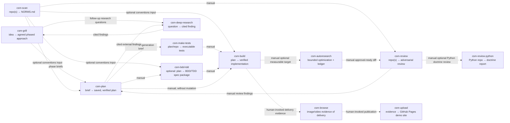

# opencode-skills

A collection of **fourteen agent-agnostic AI skills** built around the **CSM (cyclic state machine)** workflow — a disciplined way for an AI agent to research, plan, and build software with receipts at every step.

## Quick install

This repository contains fourteen practical AI skills for research, planning, implementation, testing, review, browser evidence, optimization, orchestration, and publishing. The skill directories are runtime-agnostic, but installation locations are runtime-specific. The command below installs them for OpenCode at `~/.config/opencode/skills`; Claude Code and other Agent Skills runtimes use their documented per-user or project skill directories. If the destination already exists, use that checkout instead of cloning over it, or choose another empty destination.

```bash
dest="$HOME/.config/opencode/skills"
test ! -e "$dest" || { printf '%s\n' "Refusing to overwrite existing $dest; inspect and update it instead." >&2; exit 1; }
git clone https://github.com/jamiemills/opencode-skills.git "$dest"
cd "$dest" && make install
cd csm-browse && node scripts/check-skill.mjs
```

`make install` requires Node `>=22 <25`, pnpm, and make. It installs dependencies for this repository and `csm-browse`; runtime-specific skill discovery paths are separate from these repository dependencies.

Restart or reload your agent runtime and verify that a skill such as `csm-plan` is discoverable. Most skills are instruction-led; `csm-browse` needs Docker and its browser container, and `csm-autoresearch` includes a dependency-free evaluator runtime with optional gated providers. Full details: [Install](#install).

## Table of contents

- [What this is](#what-this-is)
- [Install](#install)
- [The fourteen skills at a glance](#the-fourteen-skills-at-a-glance)
- [Composition matrix](#composition-matrix)
- [Quickstart](#quickstart)
- [Skill deep dives](#skill-deep-dives)
- [How the pieces fit together](#how-the-pieces-fit-together)
- [Repository layout](#repository-layout)
- [Development & testing](#development--testing)
- [Troubleshooting](#troubleshooting)
- [License](#license)

## What this is

**The problem it solves:** useful work is easy to lose between prompts. Decisions stay in chat, plans go stale, and test or review work often happens too late. This library gives those activities a durable shape: each stage has a documented lifecycle, writes its documented output, and stops at a clear handoff. Resume behavior is skill-specific: `csm-plan` and `csm-build` use their documented plan/checkpoint artifacts, while `csm-grill` is not mid-session resumable and `csm-review-python` keeps transition notes only in temporary storage.

**The design rules:**

- **Explicit over implicit** — lifecycle skills document their state transitions; tooling and evidence skills expose documented terminal CLI workflows and interfaces.
- **Terminal stages, human-mediated handoffs** — a skill that finishes stops. The next stage is a fresh, explicit invocation by you; planning never silently becomes implementation, and a reviewer never silently starts fixing.
- **Skill-specific write boundaries** — read the selected skill's `Interface` and `Write Discipline` sections. Review/analyzer skills are read-only except for documented artifacts; delegated research artifacts are written only by `csm-deep-research`; `csm-build`, `csm-make-tests`, and `csm-scan` intentionally write their documented outputs; `csm-browse` writes session evidence; `csm-upload` publishes to a configured external Pages repository only after explicit confirmation.
- **Evidence over assertion** — findings are challenged before they are reported, plans carry runnable acceptance signals before they are executed, and builds finish only when every acceptance signal has recorded proof.
- **Agent-agnostic** — the skills are plain `SKILL.md` instructions plus (where needed) zero-or-low-dependency Node CLIs. They run in OpenCode, Claude Code, or any Agent Skills runtime.

**The core loop** is **research → grill → plan → build**, with optional test generation before the build and `csm-autoresearch` after a measurable implementation exists. Python-specific review, repository analysis, adversarial review, browser evidence, and publishing remain separate optional stages.

### What you can do with it

- Have a difficult technical question researched into one cited finding before you choose an approach.
- Turn a rough idea into a phased brief, then into a plan with acceptance tests and recovery notes.
- Ask `csm-scan` to map an unfamiliar repository before asking another skill to change it.
- Generate characterization, contract, performance, or mutation tests before touching production code.
- Optimize a measurable function or declared code region after a working implementation exists, keeping only evaluator-proven improvements.
- Review a completed change for security, dependency, testing, and maintainability risks.
- Capture a browser flow as screenshots, console/network evidence, or a short recording and publish the result.

Start with the smallest useful action: research one question, scan one repository, or ask for a plan for one change.

### Which skill should I use?

- Need repository conventions: `csm-scan`
- Need domain boundaries or refactoring seams: `csm-ddd`
- Need a research finding: `csm-deep-research`
- Need an approach for a rough idea: `csm-grill`
- Need an implementation plan: `csm-plan`
- Need a formal spec and test design before implementation: `csm-bdd-tdd`
- Need generated characterization, contract, performance, or mutation tests: `csm-make-tests`
- Need implementation from a saved plan: `csm-build`
- Need a general adversarial repository audit: `csm-review`
- Need Python-specific idiomatic review: `csm-review-python`
- Need browser evidence: `csm-browse`
- Need to publish evidence: `csm-upload`
- Need metric-driven optimization after a working implementation: `csm-autoresearch`

## Install

### Requirements

Fourteen skills, three roles:

Core prerequisites are Git, Node `>=22 <25`, pnpm, make, and an Agent Skills-compatible runtime. `csm-browse` additionally needs Docker, a prepared `chromium-vnc` container, and its one-time dependencies; ffmpeg is optional for stitching and video. `csm-upload` additionally needs an authenticated `gh` CLI and a Pages-enabled destination repository. The OpenCode destination is `~/.config/opencode/skills`; Claude Code and other Agent Skills runtimes use their documented per-user or project skill directories. If an installation directory already exists, inspect and update that checkout rather than overwriting it, or select an empty destination.

| Role                                             | Skills                                                                                                                                            |
| ------------------------------------------------ | ------------------------------------------------------------------------------------------------------------------------------------------------- |
| **Orchestration** (invoked by name in a session) | `csm-orchestrate`, `csm-deep-research`, `csm-grill`, `csm-plan`, `csm-bdd-tdd`, `csm-make-tests`, `csm-build`, `csm-review`, `csm-review-python`, `csm-autoresearch` |
| **Tooling** (repository analyzers with a CLI)    | `csm-scan`, `csm-ddd`                                                                                                                             |
| **Evidence** (capture & publish)                 | `csm-browse`, `csm-upload`                                                                                                                        |

The core loop — **research → grill → plan → build** — with the supporting cast:



> **Edge semantics:** every arrow is a documented handoff, not an automatic dispatch, except when an explicit `csm-orchestrate` outer-loop run is authorized and its host/capability/approval contracts pass. Dashed edges are optional inputs; outside csm-orchestrate they remain separate explicit invocations. Research runs **first — or in parallel with the grill** — when the idea rests on external facts, specs, or standards that must be verifiable by citation: `csm-deep-research` answers them, the cited findings feed the grill (which may dispatch follow-up questions) and the plan, and the finding lands in `.agents/research/`. `csm-scan` feeds `NORMS.md` conventions into `csm-plan`, `csm-bdd-tdd`, `csm-build`, or `csm-review`. `csm-autoresearch` is an optional post-build optimization edge that requires a declared numeric evaluator and never replaces correctness tests or review. `review -.-> plan` remains a **manual human-in-the-loop** feed outside an authorized orchestrator route. `csm-build` does not independently invoke `csm-browse`, and `csm-browse` does not independently invoke `csm-upload`; csm-orchestrate may coordinate those edges only with their declared approvals and receipts. A csm-ddd analysis (report + graph under `.agents/ddd/`) can likewise be referenced by a planning brief or cited by a saved plan as an optional evidence input.

Each stage is a separate, explicitly invoked skill — planning never silently becomes implementation, and execution starts from a saved plan on disk. Every stage is terminal: it writes its artifact and stops; handoff to the next stage is a fresh, explicit invocation.

**Primary outputs** — each skill documents its own output location (indexed in [`.agents/README.md`](.agents/README.md)). Most orchestration reports live under `.agents/`; analyzers, browser sessions, implementations, and publishers use the locations shown below:

| Skill               | Primary output                                                                                                            |
| ------------------- | -------------------------------------------------------------------------------------------------------------------------- |
| `csm-grill`         | `.agents/approaches/<date>-<idea-slug>-approach.md`                                                                        |
| `csm-orchestrate`   | typed parent receipt and child receipts/evidence from an authorized outer-loop run                                      |
| `csm-plan`          | `.agents/plans/<date>-<goal-slug>-csm.md`                                                                                  |
| `csm-bdd-tdd`       | mutated plan `<date>-<goal>-bdd-csm.md` + spec/scenario/test designs                                                       |
| `csm-make-tests`    | `.agents/tests/<date>-<repo-slug>-<run-id>-tests-ledger.jsonl` + `-verification.json` + `-test-package.json`          |
| `csm-build`         | verified implementation, commits, and plan journal in the target repository                                               |
| `csm-review`        | `.agents/reviews/<date>-<repo-slug>-review.md`                                                                             |
| `csm-review-python` | `.agents/doctrine/<date>-<repo-slug>-python-doctrine-review.md`                                                            |
| `csm-scan`          | `NORMS.md` at the scanned repo root                                                                                        |
| `csm-deep-research` | `.agents/research/<date>-<slug>-research.md` + optional run artifacts in `.agents/research/artifacts/` (e.g. JSON schemas) |
| `csm-browse`        | per-session screenshots / videos / DOM·console·network evidence                                                           |
| `csm-upload`        | dated page committed to the configured GitHub Pages repository                                                            |
| `csm-ddd`           | `.agents/ddd/<date>-<repo-slug>-ddd-report.md` + `.agents/ddd/<date>-<repo-slug>-ddd-graph.json`                           |
| `csm-autoresearch`  | `.agents/autoresearch/<date>-<run-id>-ledger.jsonl` + atomic report/manifest                                               |

## The fourteen skills at a glance

| Skill               | In one sentence                                                                                                                                                                             | Reference                                                |
| ------------------- | ------------------------------------------------------------------------------------------------------------------------------------------------------------------------------------------- | -------------------------------------------------------- |
| `csm-deep-research` | Answers a research/R&D question with one dated, traceably cited finding — triage → parallel researchers → adversarial challenge → judge → verify.                                        | [csm-deep-research/SKILL.md](csm-deep-research/SKILL.md) |
| `csm-grill`         | Interviews you one question at a time, backed by research, until an idea becomes an agreed, phased approach.                                                                                | [csm-grill/SKILL.md](csm-grill/SKILL.md)                 |
| `csm-plan`          | Turns a brief into an evidence-based, executable implementation plan with plan-specific resume state — then stops.                                                                            | [csm-plan/SKILL.md](csm-plan/SKILL.md)                   |
| `csm-bdd-tdd`       | Mutates a saved plan into a strict BDD+TDD package: formal spec, Gherkin scenarios, unit test designs, traceable plan.                                                                      | [csm-bdd-tdd/SKILL.md](csm-bdd-tdd/SKILL.md)             |
| `csm-make-tests`    | Generates a comprehensive executable test suite: audits existing tests/coverage, captures goldens, generates intent/contract/perf tests, mutation-validates.                                | [csm-make-tests/SKILL.md](csm-make-tests/SKILL.md)       |
| `csm-build`         | Executes a saved plan with parallel subagents, durable checkpoints, and review/repair cycles until verified complete.                                                                       | [csm-build/SKILL.md](csm-build/SKILL.md)                 |
| `csm-review`        | Adversarially audits a repository across an 18-dimension spine and saves a challenged findings report. Never fixes.                                                                         | [csm-review/SKILL.md](csm-review/SKILL.md)               |
| `csm-review-python` | Reviews Python repositories against PEP 20 and idiomatic-Python doctrine, producing one evidence-grounded findings and fix-guide report.                                                    | [csm-review-python/SKILL.md](csm-review-python/SKILL.md) |
| `csm-scan`          | Read-only multi-repo analyzer producing a single `NORMS.md` across 17 evidence dimensions.                                                                                                  | [csm-scan/SKILL.md](csm-scan/SKILL.md)                   |
| `csm-ddd`           | Read-only DDD repository analyzer: authoritative JSON report and graph with Markdown projections of capabilities, context hypotheses, seams, and candidate refactoring slices — hypotheses, never proofs. | [csm-ddd/SKILL.md](csm-ddd/SKILL.md)                     |
| `csm-browse`        | Drives an isolated Chromium in Docker via CDP: navigate, click, type, log in, screenshot, record video, inspect DOM/network/console.                                                        | [csm-browse/SKILL.md](csm-browse/SKILL.md)               |
| `csm-upload`        | Publishes evidence files to a GitHub Pages demo site under a unique dated page name.                                                                                                        | [csm-upload/SKILL.md](csm-upload/SKILL.md)               |
| `csm-autoresearch`  | Runs bounded evaluator-owned hill climbing over declared functions or evolution regions, with gated LLM proposals and durable trial provenance.                                             | [csm-autoresearch/SKILL.md](csm-autoresearch/SKILL.md)   |
| `csm-orchestrate`   | Coordinates an agreed approach through conditional routes, typed evidence, gates, review, approvals, remediation, and recovery; it does not replace sibling lifecycles. | [csm-orchestrate/SKILL.md](csm-orchestrate/SKILL.md) |

**How they compose** — see the [core-loop diagram and edge semantics in the Install section](#install); the artifact ledger there is the canonical one (all fourteen skills), indexed in [`.agents/README.md`](.agents/README.md).

<!-- csm-matrix:start -->
## Composition matrix

How each skill composes — standalone entry conditions, what it consumes and produces, and how work hands off. Generated from `scripts/lib/contracts.mjs`; regenerate with `node scripts/gen-readme-matrix.mjs --write`.

| Skill | Standalone entry | Consumes | Produces | Hands off |
|---|---|---|---|---|
| `csm-orchestrate` | canonical agreed approach artifact, explicit orchestration request | canonical JSON approach, capability manifest, host invocation adapter, scoped approvals | typed parent receipt | typed child receipts and evidence to the operator or future csm-build handoff |
| `csm-grill` | idea shared, explicit request to be grilled, interviewed, or stress-tested | rough idea, repository and research evidence, optional registered csm-deep-research JSON findings when dispatched | validated JSON approach at .agents/approaches/<date>-<idea-slug>-<run-id>-approach.json (csm-grill/schemas/csm-approach.schema.json) | phase briefs from the JSON approach to a separately invoked csm-plan; Markdown is projection/history only |
| `csm-plan` | brief or phase brief, explicit planning request | idea or phase brief, registered JSON repository norms, registered JSON review findings, optional registered JSON csm-deep-research findings when dispatched, optional registered JSON csm-ddd artifacts when explicitly referenced | validated JSON CSM plan at .agents/plans/<date>-<goal-slug>-<run-id>-csm.json (csm-plan/schemas/csm-plan.schema.json) | saved JSON plan to csm-bdd-tdd or csm-build; Markdown is projection/history only |
| `csm-bdd-tdd` | saved CSM plan, explicit BDD/TDD mutation request | validated JSON plan, registered JSON repository norms | specs/<goal-slug>/package.json validated by csm-bdd-tdd/schemas/package.schema.json, typed scenario and test-design records, mutated JSON CSM plan | mutated JSON plan/package to csm-build; Gherkin and Markdown are projections only |
| `csm-build` | saved CSM plan, explicit implementation request | validated JSON plan, optional registered JSON norms, BDD/TDD package when present, optional registered JSON csm-ddd artifacts when the plan cites them | verified implementation, typed JSON delivery and completion descriptors; commit only with explicit authorization | delivery evidence to a separately invoked csm-browse |
| `csm-review` | repository target, explicit review, audit, or assessment request | repository at a pinned commit, optional registered JSON norms | authoritative JSON findings at .agents/reviews/<date>-<repo-slug>-<run-id>-review.json | review findings to a subsequent csm-plan run, separate human-mediated dispatch to csm-review-python |
| `csm-scan` | repository target, scan or conventions-analysis request | committed repository declarations | authoritative JSON norms at .agents/norms/<date>-<repo-slug>-<run-id>-norms.json | optional registered JSON norms input to csm-plan, csm-bdd-tdd, csm-build, or csm-review; NORMS.md is projection/history only |
| `csm-browse` | need to drive a headful Chromium browser | browser session, CDP verbs, delivery target | validated JSON session/event/evidence descriptors plus referenced binary evidence | JSON evidence descriptors to a separately invoked csm-upload |
| `csm-upload` | evidence files ready, configured GitHub Pages destination | validated JSON evidence/publication descriptors and referenced binary evidence, GitHub configuration | authoritative JSON publication receipt at .agents/upload/<date>-<run-id>-publication.json and external Pages projection | expected evidence URL to the user; verify Pages deployment separately |
| `csm-deep-research` | research question or topic, explicit deep-research request, dispatch from csm-grill or csm-plan | research question, retrievable sources (web, docs, repositories), browser-rendered retrieval via csm-browse fallback (JS-only pages) | run-ID-suffixed JSON research finding at .agents/research/<date>-<slug>-<run-id>-research.json, optional declared run artifacts under .agents/research/artifacts/ | research document and any declared run artifacts to the user or a dispatching csm-grill or csm-plan; parent records and verifies the handoff without writing artifacts |
| `csm-make-tests` | repository checkout at a pinned commit, optional change-surface scope | repository working tree, optional registered JSON norms, cited research findings under .agents/research/ | executable test files and goldens in the target repository, .agents/tests/<date>-<repo-slug>-<run-id>-tests-ledger.jsonl, .agents/tests/<date>-<repo-slug>-<run-id>-verification.json, .agents/tests/<date>-<repo-slug>-<run-id>-test-package.json | verified suite, ledger, and verification report to the user or a later explicit csm-build run |
| `csm-review-python` | target python repository checkout at a pinned commit, optional change-surface scope, explicit user consent for any tool installation | repository working tree (read-only), optional registered JSON norms, bundled artifacts artifact/python-idiomatic-reviewer-rules.json and artifact/pep20-idiomatic-python-consolidated-research.md | .agents/doctrine/<date>-<repo-slug>-<run-id>-python-doctrine-review.json | single doctrine report (findings + fix guide) to the user or a dispatching csm-review; terminal otherwise |
| `csm-ddd` | repository at a pinned commit, explicit DDD analysis request, CLI run of the bundled pipeline | repository at a pinned commit, optional registered JSON norms, optional approved question file | .agents/ddd/<date>-<repo-slug>-<run-id>-ddd-report.json, .agents/ddd/<date>-<repo-slug>-<run-id>-ddd-graph.json | report and graph to the user; downstream csm-grill or csm-plan use stays human-mediated |
| `csm-autoresearch` | explicit autoresearch or evaluator-optimization request, declared target and metric | versioned run contract, declared mutation boundary, immutable evaluator policy, bounded datasets | bounded JSONL evaluator exchanges, append-only trial ledger, atomic report artifact | artifact set to the user for separate approval or later explicit skill invocation |
<!-- csm-matrix:end -->

### Skill Contract Matrix

The composition matrix describes handoffs. This matrix records the per-skill contract; a blank publication cell means the skill stops locally and does not publish externally.

| Skill | Lifecycle | Writes | Commit | Resume | Primary artifact | Prerequisites | Publication |
|---|---|---|---|---|---|---|---|
| `csm-grill` | `INTAKE -> ... -> SAVED -> STOP` | JSON approach; temp notes are disposable | explicit authorization only | not resumable before `SAVED` | `.agents/approaches/<date>-<slug>-<run-id>-approach.json` | rough idea, repository evidence, retrievable research | handoff to a separately invoked `csm-plan` |
| `csm-plan` | `INTAKE -> ... -> SAVED -> STOP` | validated JSON inputs | explicit authorization only | JSON control/journal resumes planning | `.agents/plans/<date>-<slug>-<run-id>-csm.json` | brief, JSON norms/research/DDD artifacts | handoff to a separately invoked `csm-build` or `csm-bdd-tdd` |
| `csm-bdd-tdd` | `INTAKE -> ... -> SAVED -> STOP` | JSON plan and typed package records | explicit authorization only | JSON control resumes mutation | `specs/<slug>/package.json` and JSON plan | saved JSON plan and optional JSON norms | handoff to a separately invoked `csm-build` |
| `csm-make-tests` | `INTAKE -> ... -> OUTPUT` | approved tests, fixtures, benchmarks, JSON ledger, receipt, package | never unless explicitly authorized | JSON cursor resumes maintenance | `.agents/tests/*-tests-ledger.jsonl`, `*-verification.json`, `*-test-package.json` | pinned checkout, optional JSON norms/research | suite and JSON artifacts return to user or later build |
| `csm-build` | `RECOVER -> ... -> CHECKPOINT` | owned implementation, JSON plan/control, checkpoints | explicit authorization only | JSON plan Control/journal resumes build | verified implementation and JSON delivery descriptors | saved JSON plan, optional JSON norms/BDD/DDD artifacts | delivery returns to human; browse is separate |
| `csm-review` | `INTAKE -> ... -> SAVED -> STOP` | one JSON findings report; sandbox is disposable | never by default; explicit report commit only | report is terminal, not a work cursor | `.agents/reviews/<date>-<repo>-<run-id>-review.json` | pinned target and optional JSON norms | findings feed a later explicit plan |
| `csm-review-python` | `INTAKE -> ... -> REPORT -> STOP` | one JSON doctrine report; temporary notes only | no implicit commit | not resumable before `REPORT` | `.agents/doctrine/<date>-<repo>-<run-id>-python-doctrine-review.json` | pinned Python checkout and doctrine artifacts | report returns to user or dispatching review |
| `csm-scan` | `INTAKE -> ... -> SAVED -> STOP` | committed repository declarations | no implicit commit | no durable mid-run cursor | `.agents/norms/<date>-<repo>-<run-id>-norms.json` | repository path(s) and static declarations | JSON norms handoff to later skills; NORMS.md is projection/history |
| `csm-ddd` | `INTAKE -> ... -> RENDER -> STOP` | report and graph only; atomic pair publication | no implicit commit | no durable mid-run cursor | `.agents/ddd/*-ddd-report.json` and `*-ddd-graph.json` | pinned repository, optional JSON norms/questions | report and graph return to user |
| `csm-deep-research` | `INTAKE -> ... -> SAVED -> STOP` | one JSON finding plus declared artifacts; temp notes disposable | explicit authorization only | JSON finding Control journal resumes supported runs | `.agents/research/<date>-<slug>-<run-id>-research.json` | research question and retrievable sources | finding returns to user or dispatching skill |
| `csm-autoresearch` | `INTAKE -> ... -> STOPPED` | JSONL exchanges, append-only ledger, atomic report | no promotion commit; approval is separate | ledger/report provide trial state, not chat state | `.agents/autoresearch/*-ledger.jsonl` and `*-report.json` | run contract, target, evaluator, budget, validation partition | human approval required for promotion |
| `csm-browse` | session ensure/use/close | per-session evidence; browser state is session-scoped | no repository commit | session state supports the active session only | screenshots, video, DOM/console/network evidence | Docker, prepared `chromium-vnc`, Node `>=22 <25`, dependencies | upload is a separate explicit action |
| `csm-upload` | validate -> stage -> confirm -> publish -> report | isolated Pages clone/config and dated page | commits/pushes only after explicit permanent confirmation | terminal; verify deployment separately | dated Pages directory and status report | authenticated `gh`, Pages-enabled repository, reviewed evidence | external GitHub Pages publication; URL is not proof of live deployment |

No row authorizes automatic cross-skill dispatch, production publication, key rotation, or registry replay. Read the selected skill's `Interface` and `Write Discipline` sections before relying on a row.

## Quickstart

The core loop is **research → grill → plan → build**:

0. **Research** — when the idea hinges on external facts, specs, or standards, invoke `csm-deep-research` first (or run it in parallel with the grill): it returns a traceably cited finding (plus any requested run artifacts) that the grill and the plan can rely on.
1. **Grill** an idea — invoke `csm-grill` to be interviewed one question at a time until the phased approach is agreed and each phase is a ready-made brief for the next step.
2. **Plan** — invoke `csm-plan` with a brief; it researches, critiques, verifies, and saves a numbered plan with its documented plan-specific resume state.
3. **Build** — invoke `csm-build` with the saved plan; it executes with parallel subagents, durable checkpoints, and review/repair cycles until verified complete.

Optional between planning and building: invoke `csm-make-tests` when the change needs a systematic test-generation pass. It audits the current test surface, captures approved characterization/golden behavior, may write approved executable tests and goldens into the target repository, creates intent/contract/performance tests, and returns a ledger and verification report for the build. Review and approve generated artifacts; it is not a replacement for the repository's existing test runner.

### Conditional DDD and clean-code path

Keep lightweight work lightweight. A simple script or isolated, low-risk change can record a cheap bypass rationale and use the normal plan/build acceptance flow; it does not need DDD artifacts or heavyweight design ceremony.

For meaningful work, classify risk before size. Boundary changes, public contracts, ownership or persistence, invariants, external side effects, migrations or rollback, cross-boundary coordination, security authority, and explicit architecture/refactor intent are signals. File count and lines of code are not sufficient signals. The usual composition is `csm-scan` for repository conventions and, when boundary structure matters, `csm-ddd` for hypotheses; feed those results to `csm-grill` and `csm-plan`, then pass the saved obligations to `csm-build`.

Boundary work carries explicit obligations: cite relevant DDD evidence, contract and ownership decisions, invariants, observable behavior, seam and parity expectations, rollback or recovery, and unresolved risks. DDD reports and graphs remain hypotheses, not proof. Clean-code checks should be reviewable evidence, such as configured lint/type/test or diff diagnostics plus rationale for responsibility, dependencies, side effects, and abstractions, rather than a universal style score.

Use `csm-make-tests` when stronger behavioral coverage or characterization is needed; it generates and verifies tests but does not fix production code. Use `csm-review` for an adversarial, read-only audit before delivery; its findings return to a later human-mediated plan rather than silently changing the build.

Optional: `make install` installs the root and `csm-browse` dependencies; `node scripts/install-hooks.mjs` installs root hook dependencies, configures the repository's Git hook path, and enables the fast Lefthook pre-commit gate.

### Dependency policy

Dependency updates are manual: review the root and `csm-browse` manifests/lockfiles quarterly, and before a Node or pnpm major upgrade. Audit `bootstrap/package.json` separately as the release-package manifest. The lockfiles are authoritative and `make install` always uses frozen lockfiles; an isolated clean install with redirected `HOME`, `XDG_CONFIG_HOME`, and `TMPDIR` is the release check. Do not add Dependabot or Renovate configuration.

Exact pins are used for root gate tooling where changing the executable can change repository results. `csm-browse` uses compatible ranges for ordinary library dependencies; the lockfile still records the exact resolved versions. Review range updates deliberately rather than treating them as automatic upgrades.

Track the `ws` major explicitly because it is both a direct development dependency and a transitive dependency of `chrome-remote-interface`; assess API and Node support before moving beyond the current major. `F7-02` is ignored local install state, not a tracked dependency change.

The plan and build steps start in a detached tmux session unless you're already inside tmux or declined — say **"no tmux"** to keep the run in-session.

Optional gates around the loop: **`csm-scan`** to capture repository conventions into `NORMS.md` before planning, and **`csm-review`** to adversarially audit a repository (or a completed build) for defects and security risks before delivery.

## Skill deep dives

Deep detail lives in each `SKILL.md` (linked per skill); what follows is the orientation layer — what each skill is for, how it works inside, and what it hands you.

### csm-deep-research — cited answers to hard questions

Use when a claim, spec, or standard must be verifiable by citation: "which algorithm should we use", "what does the original spec say", "is X still true in 2026". Invoke it by name with the question; it may also be dispatched by `csm-grill`/`csm-plan` for follow-ups.

- **Pipeline:** `INTAKE -> TRIAGE -> RESEARCH -> SYNTHESIZE -> CHALLENGE -> JUDGE -> REMEDIATE -> VERIFY -> SAVED`. Triage matches machinery to stakes: **QUICK** (single source, primary-led), **STANDARD** (2–4 parallel researchers + real challenger + judge), **DEEP** (4+ experts, kill-the-draft power).
- **Guarantees:** every claim carries a citation; an anti-anchored challenger attacks the draft; a rubric-scored judge gates it; remediation forward-fixes rather than patches; a tier-scaled verification gate personally checks the result before saving.
- **Outputs:** one immutable run-ID-suffixed JSON finding at `.agents/research/<date>-<slug>-<run-id>-research.json` (validated by `csm-deep-research/schemas/csm-research.schema.json`) plus optional declared run artifacts under `.agents/research/artifacts/`; Markdown is a projection or legacy history.
- **Boundaries:** never writes outside the research document and its declared artifacts. During a run it may dispatch `csm-browse` for browser-rendered retrieval of JS-only pages.
- _Full reference: [csm-deep-research/SKILL.md](csm-deep-research/SKILL.md)._

### csm-grill — the idea stress-tester

Use when an idea is still soft. Invoke it with the rough idea; it interviews you **one question at a time**, each with a recommended answer, cycling until you explicitly agree.

- **Method:** every answer is backed by evidence — repository facts, your answers, and cited research (it may dispatch `csm-deep-research` for external claims). Assumptions are surfaced and killed early, when they are cheap.
- **Output:** a validated JSON approach at `.agents/approaches/<date>-<idea-slug>-<run-id>-approach.json` whose phases are ready-made briefs for `csm-plan`; Markdown is a projection or legacy history.
- **Boundaries:** never plans, never implements; interactive by design (never detaches into tmux).
- _Full reference: [csm-grill/SKILL.md](csm-grill/SKILL.md) — Grilling State Machine._

### csm-plan — from brief to executable plan

Invoke with a brief (or a phase brief from the grill). Planning only — it researches, critiques, verifies, saves, and stops.

- **Pipeline:** `INTAKE -> DISCOVER -> RESEARCH -> DRAFT -> CRITIQUE -> REMEDIATE -> VERIFY -> SAVED`, with parallel research tracks, an uncertainty scout, and an independent critique cycle that must be remediated before saving.
- **The plan document** (format marker `csm-plan`, version 1) is the durable control artifact: numbered tasks each with a runnable acceptance signal, risk classification, owned scope, anti-scope, and repair budget; plus Control (plan resume state), an execution graph of safe parallel groups, verification strategy ordered cheapest-first, and a progress journal — enough for a fresh `csm-plan` or `csm-build` session to resume where that skill supports it. `csm-grill` is not mid-session resumable, and `csm-review-python` keeps transition notes only in temporary storage.
- **Output:** `.agents/plans/<date>-<goal-slug>-<run-id>-csm.json`; Markdown is a generated human projection. A commit is explicit-authorization-only; without authorization the result is intentionally uncommitted. When authorized, use a path-scoped commit and inspect the staged diff so unrelated work is not included.
- **Boundaries:** never implements; execution requires a separate explicit `csm-build` invocation.
- _Full reference: [csm-plan/SKILL.md](csm-plan/SKILL.md) — Planning State Machine, Required Plan Document._

### csm-bdd-tdd — optional spec-first mutation

Invoke with a saved plan when you want behavior specified before it is built. It mutates the plan into a strict BDD+TDD package: a formal spec, executable Gherkin scenarios, per-task unit test designs, and a traceability-mutated plan (`<date>-<goal>-bdd-csm.md`). `csm-build` then follows the mutated plan and its mandated red-green-refactor order — failing unit tests first, minimal implementation, refactor, then scenario pass end-to-end. _Full reference: [csm-bdd-tdd/SKILL.md](csm-bdd-tdd/SKILL.md) — Pipeline._

### csm-make-tests — the test-generation engine

Invoke with a pinned repository checkout and an optional change-surface scope when existing tests are incomplete or a change needs stronger behavioral evidence. It is a test-generation skill, not a test runner replacement and not permission to change production code.

- **Pipeline:** `AUDIT -> SCAN -> CAPTURE -> TRIAGE -> APPROVE -> VERIFY -> AMPLIFY -> DIFFERENTIAL -> LAYER -> PERF -> OUTPUT`.
- **Method:** audit existing tests and coverage first; capture characterization/golden behavior without silently accepting diffs; generate intent, contract, integration, performance, mutation, and differential tests according to the repository and stack; require explicit approval for generated or accepted artifacts.
- **Outputs:** executable test files and approved goldens in the target repository, plus `.agents/tests/<date>-<repo-slug>-<run-id>-tests-ledger.jsonl`, `*-verification.json`, and `*-test-package.json`.
- **Boundaries:** never fixes production code, never auto-accepts golden updates, and keeps temporary capture data outside the repository. Cited research and `NORMS.md` are optional inputs.
- **Handoff:** the verification report and test ledger can feed a later explicit `csm-build` run.
- _Full reference: [csm-make-tests/SKILL.md](csm-make-tests/SKILL.md) — Test Generation State Machine and Required Test Package._

### csm-autoresearch — metric-gated iterative optimization

Invoke after `csm-build` has produced a working implementation and you can name a numeric, unattended evaluator. It is not a replacement for planning or ordinary feature implementation: it repeatedly proposes bounded changes, measures them externally, and retains only candidates that satisfy the evaluator-owned gates.

- **Best use:** optimize latency, throughput, memory, test pass rate, benchmark quality, static-analysis metrics, prompt accuracy, or another measurable function where a fixed baseline and held-out validation set exist.
- **Lifecycle:** `INTAKE -> BASELINE -> PROPOSE -> SCREEN -> EVALUATE -> VALIDATE -> DECIDE -> LEDGER -> STOPPED`, repeating until the target is met, the incumbent stops improving, the budget is exhausted, or a safety/policy blocker stops the run; approval and rollback routes remain explicit.
- **Trust modes:** registered functions are the safest starting point; trusted-local source is explicitly constrained; generated source remains disabled unless a host-owned sandbox provider proves network, mount, resource, credential, evaluator-asset, and process-cleanup boundaries.
- **LLM role:** the LLM proposes up to a configurable maximum of 50 hypotheses and may provide advisory qualitative judging. Deterministic hard failures always win; judge disagreement routes to review; live providers are opt-in and require the `DEF-EVAL` decision.
- **Persistence:** each attempt, rejection, retry, quarantine, metric sample, judge result, provenance hash, promotion, and rollback is recorded under `.agents/autoresearch/`.
- **Do not use it for:** vague “make it better” requests, subjective goals without a calibrated rubric, evaluator changes, unrestricted repository rewrites, or untrusted code when no verified sandbox exists.
- **Full reference:** [csm-autoresearch/SKILL.md](csm-autoresearch/SKILL.md) — contract, trust boundaries, evaluator protocol, and autoresearch state machine.

### csm-build — the execution engine

Invoke with a saved plan (base or BDD/TDD-mutated). This is where work happens — and where the discipline pays off.

- **Pipeline:** `RECOVER -> VALIDATE -> SELECT -> DISPATCH -> INTEGRATE -> VERIFY -> REVIEW -> REPAIR -> CHECKPOINT`, cycling back to SELECT until every acceptance criterion carries recorded evidence (`COMPLETE`), stopping only on a genuine user decision or unsafe action (`BLOCKED`), pausing cleanly on quota exhaustion (`PAUSED`) with the checkpoint as the resume point.
- **Mechanics:** maximal useful parallel subagents with non-overlapping write ownership; the primary agent integrates, verifies cheapest-first, and owns all commits; durable checkpoints mean an interrupted run resumes from the plan journal, not chat history; independent review is mandatory for security/privacy/data/destructive/public-interface work; after two failed repair attempts on a task it stops patching and re-diagnoses with fresh eyes.
- **Output:** verified implementation + delivery evidence + the updated plan (journal, Completion Review); commits are created only with explicit authorization and otherwise the result is intentionally uncommitted.
- _Full reference: [csm-build/SKILL.md](csm-build/SKILL.md) — Execution State Machine, Completion Gate._

### csm-review — the adversarial auditor

Invoke with a repository (or point it at a completed build) when you want to know what is wrong before your users do. It never fixes anything.

- **Method:** multi-agent defensive review — parallel finder agents sweep non-overlapping chunks across an 18-dimension spine (correctness & defects, technical debt & architecture, code smells, anti-patterns, security weaknesses, security control verification, secrets & data exposure, concurrency & races, memory & resource safety, error handling & resilience, input validation & trust boundaries, test presence, test quality, test-type adequacy, dependency vulnerabilities, toolchain currency, observability & operability, CI/build/docs/licensing); every medium-and-above finding is independently challenged by an agent that did not author it; severity and confidence are kept strictly apart; findings cite pinned-commit locations with reproducible evidence.
- **Posture:** read-only static inspection by default (R0), scaling to sandboxed installs/collection/execution (R1–R3) with egress blocking and environment scrubbing when you accept the rungs.
- **Output:** one authoritative JSON findings report at `.agents/reviews/<date>-<repo-slug>-<run-id>-review.json`; Markdown/HTML are projections or legacy history.
- _Full reference: [csm-review/SKILL.md](csm-review/SKILL.md) — Review State Machine._

### csm-review-python — Python doctrine review

Invoke for a Python repository when the review needs a focused PEP 20 and idiomatic-Python assessment in addition to general repository review. It is read-only and requires explicit consent before installing any optional tooling.

- **Method:** inspect the pinned checkout against the bundled Python doctrine and research artifacts; distinguish findings from fix guidance; preserve evidence and confidence separately.
- **Output:** `.agents/doctrine/<date>-<repo-slug>-<run-id>-python-doctrine-review.json`, containing one evidence-grounded findings report and its remediation guide; Markdown is a projection or legacy history.
- **Handoff:** the doctrine report can be consumed by a later explicit `csm-review` or `csm-plan` run; the skill is terminal, keeps transition notes temporary, and never fixes code.
- _Full reference: [csm-review-python/SKILL.md](csm-review-python/SKILL.md)._

### csm-ddd — the domain-structure analyzer

Invoke against one repository when you want to know where the domain boundaries _might_ be before planning a refactor. Read-only: static declarations plus bounded Git history — target code is never executed and nothing outside `.agents/ddd/` is written.

- **Pipeline:** extract (inventory + bounded co-change/authorship evidence, privacy-redacted) -> synthesize (capability map, terminology conflicts, context hypotheses, seams, candidate slices with recommended ordering) -> clarify (questions only where ambiguity changes the analysis) -> render.
- **CLI:** zero-dependency Node — `node csm-ddd/scripts/ddd.mjs --repo <path> [--out-report] [--out-graph] [--question-file] [--non-interactive] [--max-files] [--max-bytes]`; defaults write both artifacts under `<repo>/.agents/ddd/`.
- **Output:** one authoritative JSON report plus one canonical JSON graph, schema-valid and cross-linked by a shared run ID; Markdown is an explicit projection. Every bounded context is a hypothesis with basis + confidence — never a proof.
- _Full reference: [csm-ddd/SKILL.md](csm-ddd/SKILL.md) — `## Analysis State Machine`, `## Required Report And Graph`._

### csm-scan — the conventions extractor

Invoke against one or more repositories before planning or reviewing, so later stages speak the repo's language. Read-only: all runtime/build/test/deployment findings come from committed static declarations — target commands are never executed.

- **Coverage:** 17 per-repository dimensions (Repository Structure, Technology Stack, Configuration, Testing, Code Conventions, Git Practices, Architecture, Documentation, Security, Operations, API Surface, Data Architecture, Deployment Topology, Maintainability, Governance & Ownership, Assurance & Supply Chain, Development Practices) plus a global Cross-repository Architecture section with Mermaid diagrams when multiple repos are scanned.
- **CLI:** zero-dependency Node — `node scripts/scan.mjs [--repos <path>...] [--out <path>] [--verbose]` (defaults: scan the current directory, write `NORMS.md` there); `--verbose` writes a gitignored unredacted local diagnostic trace next to the output — never stdout, never the report. Reports are privacy-redacted (absolute paths, identities, secrets).
- **Output:** one authoritative JSON norms artifact under `.agents/norms/`; `NORMS.md` is an untrusted human projection or legacy history, never a machine input.
- _Full reference: [csm-scan/SKILL.md](csm-scan/SKILL.md) — `## Dimensions`, `## CLI`._

### csm-browse — the evidence camera

Use whenever delivery proof or browser-driven evidence is needed: screenshots (viewport or stitched full-page), VP9 screencasts, DOM/console/network/performance capture, login flows.

- **Isolation model:** each session runs Chromium inside the `chromium-vnc` Docker container with its own profile, a port pair from a small dedicated pool, and a token-gated loopback CDP funnel — the raw debug port is never published. VNC binds loopback-only and uses a generated password for the shared container; CDP sessions use separate per-session tokens.
- **Session workflow:** `ensure-browser.mjs --session <sid>` starts or adopts the container, launches Chromium, sets up the CDP forward, spawns the session daemon, and writes `state.json`; `browse.mjs <verb> --session <sid>` drives it; `close` tears everything down.
- **Verbs:** `open`, `wait`, `wait-selector`, `click`, `type`, `press`, `text`, `html`, `eval`, `screenshot` (`--small|--medium|--full|--viewport`), `console`, `network`, `performance`, `cookies` (values masked by default), `status`, `screencast-start/stop`, `close`.
- **Needs:** Docker + a prepared `chromium-vnc` container, Node `>=22 <25`, and `make install` (or the equivalent safeguarded dependency install); ffmpeg optional (full-page stitching + video); curl optional (readiness probes).
- _Full reference: [csm-browse/SKILL.md](csm-browse/SKILL.md) — Verb reference._

### csm-upload — the publishing step

Terminal evidence publisher: `node $HOME/.config/opencode/skills/csm-upload/scripts/upload.mjs --label <name> [--desc <text>] [--github <user>] [--repo <name>] [--confirm-permanent] [--ack-unscanned-binary] <file...>` stages evidence in an isolated Pages clone, scans recognizable text, requires explicit confirmation and binary acknowledgment where applicable, verifies effective fetch/push destinations, then commits and pushes and prints an expected URL. The commit and push are not proof that the effective remote, Pages deployment, or public URL is live: verify those separately. Requires an authenticated `gh` CLI and a Pages-enabled repo. Review artifacts for credentials, personal data, private URLs, and sensitive DOM/network metadata before publication. _Full reference: [csm-upload/SKILL.md](csm-upload/SKILL.md) — Usage._

## How the pieces fit together

### The lifecycle, step by step

1. **Research** — when the idea rests on external facts, specs, or standards that must be verifiable by citation, `csm-deep-research` answers them first (or in parallel with the grill): triage → parallel researchers → adversarial challenge → judge → verify, saving a traceably cited finding (and any requested run artifacts) to `.agents/research/`. _Full reference: [csm-deep-research/SKILL.md](csm-deep-research/SKILL.md) — Research State Machine._
2. **Grill** — `csm-grill` interviews you one question at a time (each with a recommended answer), backs every answer with research — dispatching `csm-deep-research` for follow-up questions that need cited evidence — and cycles until you explicitly agree. Output: a validated JSON phased approach whose phases are ready-made briefs. _Full reference: [csm-grill/SKILL.md](csm-grill/SKILL.md) — Grilling State Machine._
3. **Scan** (optional) — `csm-scan` extracts a repository's conventions into `NORMS.md` (17 dimensions, static declarations only — target commands are never executed) so later stages speak the repo's language. _Full reference: [csm-scan/SKILL.md](csm-scan/SKILL.md) — `## Dimensions`, `## CLI`._
4. **Review** (optional) — `csm-review` adversarially audits a repository (or a completed build) across a finding spine, challenges every finding, and writes a dated report. Never fixes. _Full reference: [csm-review/SKILL.md](csm-review/SKILL.md) — Review State Machine._
5. **Plan** — `csm-plan` researches, critiques, verifies, and saves a numbered plan with skill-specific resume state (acceptance signals, risks, anti-scope). It commits only after explicit authorization; prefer a path-scoped commit. _Full reference: [csm-plan/SKILL.md](csm-plan/SKILL.md) — Planning State Machine, Required Plan Document._
6. **Mutate** (optional) — `csm-bdd-tdd` turns the plan into a formal spec + Gherkin scenarios + unit test designs + a mutated plan. _Full reference: [csm-bdd-tdd/SKILL.md](csm-bdd-tdd/SKILL.md) — Pipeline._
7. **Generate tests** (optional) — `csm-make-tests` audits the test surface and creates approved executable tests, goldens, and a verification ledger before implementation. _Full reference: [csm-make-tests/SKILL.md](csm-make-tests/SKILL.md)._
8. **Build** — `csm-build` executes the saved plan with parallel subagents, durable checkpoints, and review/repair cycles until every acceptance signal has evidence. _Full reference: [csm-build/SKILL.md](csm-build/SKILL.md) — Execution State Machine, Completion Gate._
9. **Optimize** (optional) — after the build is green, `csm-autoresearch` runs bounded evaluator-owned experiments over a declared function or code region. It complements `csm-build`: build establishes correctness and structure; autoresearch explores measurable improvements without changing the evaluator or unrelated files. _Full reference: [csm-autoresearch/SKILL.md](csm-autoresearch/SKILL.md)._
10. **Evidence** — after a separate explicit user invocation, `csm-browse` drives an isolated Chromium container to capture screenshots/videos/DOM·network evidence of the delivery; after another separate invocation with permanent-publication confirmation, `csm-upload` commits and pushes it as a dated GitHub Pages demo page. Verify the effective remote and Pages deployment rather than treating the expected URL as verified public deployment. _Full reference: [csm-browse/SKILL.md](csm-browse/SKILL.md) — Verb reference; [csm-upload/SKILL.md](csm-upload/SKILL.md) — Usage._

### Where autoresearch fits

Use `csm-autoresearch` as a controlled optimization loop around work that already has a trustworthy evaluator. The most useful combinations are:

```text
csm-deep-research -> csm-grill -> csm-plan -> csm-build
                                              |
                                              v
                                  csm-autoresearch
                                              |
                                              v
                                   csm-review -.->|manual| csm-browse
```

- **Optimize code built by `csm-build`:** have `csm-build` establish the behavior, tests, and declared extension point first. Then invoke `csm-autoresearch` with one callable/evolution region, a metric, a target or improvement margin, a validation partition, and a trial budget. Do not ask autoresearch to repair an untested feature or redesign the whole repository.
- **Use `csm-make-tests` before optimization:** generate and verify regression, property, mutation, and performance tests first when the evaluator is weak. Autoresearch should consume those tests as hard gates and held-out validation, not invent its own authority.
- **Use `csm-review` after optimization:** review the kept diff and the experiment ledger for regressions, evaluator gaming, complexity growth, dependency changes, and suspicious gains. A higher metric does not replace review.
- **Use `csm-scan` before planning:** capture repository conventions before `csm-plan` when the target repository is unfamiliar. `csm-autoresearch` then respects the declared mutation surface and repository tooling.
- **Use `csm-ddd` before optimization of a refactor:** identify bounded seams and candidate evolution regions before selecting a function. Treat the DDD graph as hypotheses and use its rollback/observable-behavior constraints in the plan.
- **Use `csm-deep-research` for evaluator design:** research a metric, benchmark, statistical method, or sandbox standard before committing to the evaluator. The finding should feed `csm-grill` or `csm-plan`; autoresearch itself does not replace that research step.
- **Keep human approval at promotion:** isolated trials may run unattended, but repository-visible or production promotion requires approval, exact rollback identity, and evidence that the evaluator was not changed.

### Conventions shared by the eight tmux-bootstrapping skills

- **tmux bootstrap** — `csm-plan`, `csm-build`, `csm-bdd-tdd`, `csm-make-tests`, `csm-scan`, `csm-review`, `csm-deep-research`, and `csm-review-python` derive a relevant `<skill>-<goal-slug>` session name from each invocation, rename the active tmux session when already inside one, or start a detached session when outside; say **"no tmux"** to disable this behavior. `csm-grill` is interactive by design and never detaches.
- **Machine-validated artifacts** — lifecycle artifacts carry their documented format marker when applicable, and the repo-wide gate validates corpus shape (required sections in order, control journals, transition formats). Resume from artifacts only where the selected skill documents that behavior; `csm-review-python` transition notes are temporary.
- **Write discipline** — write boundaries are skill-specific; read the selected skill's `Interface` and `Write Discipline` sections before running it.
- **Standalone, terminal, never-invoking by default** — a skill that finishes stops. The only sanctioned skill-owned runtime dispatches are `csm-grill`/`csm-plan` → `csm-deep-research` and `csm-deep-research` → `csm-browse` (browser-rendered retrieval of JS-only pages during a research run). `csm-orchestrate` is the explicit outer-loop exception: it may coordinate declared sibling edges only through host invocation, capability, approval, receipt, and recovery contracts. Without that authorized outer-loop run, all other edges remain manual, separately invoked handoffs. (Enforced by the invoke matrix in `scripts/lib/contracts.mjs`.)

### The deep-research pipeline

`csm-deep-research` runs `INTAKE -> TRIAGE -> RESEARCH -> SYNTHESIZE -> CHALLENGE -> JUDGE -> REMEDIATE -> VERIFY -> SAVED`: parallel read-only researchers per track, primary synthesis, an anti-anchored adversarial challenger, a rubric-scored judge, forward-fixing remediation, a tier-scaled primary verification gate, and a single dated finding (format-marker version `1`, 1 H1 + 8 fixed H2 sections). Triage matches machinery to stakes: **QUICK** (single source, primary-led), **STANDARD** (2-4 parallel researchers + real challenger + judge), **DEEP** (4+ experts, kill-the-draft). Runs may declare **run artifacts** — machine-readable deliverables such as JSON schemas — written to `.agents/research/artifacts/` and referenced from the finding. _Full reference: [csm-deep-research/SKILL.md](csm-deep-research/SKILL.md)._

### The plan-execution state machine

`csm-build` runs `RECOVER -> VALIDATE -> SELECT -> DISPATCH -> INTEGRATE -> VERIFY -> REVIEW -> REPAIR -> CHECKPOINT`, using `REVIEW -> CHECKPOINT` when clean and `REVIEW -> REPAIR` only when findings exist; it cycles back to `SELECT` until all acceptance criteria carry evidence (`COMPLETE`), stopping on a user decision or unsafe action (`BLOCKED`), and checkpointing durably so an interrupted build resumes from the plan journal. It does not invoke `csm-browse`. _Full reference: [csm-build/SKILL.md](csm-build/SKILL.md)._

### Experimental universal agent bootstrap

The signed URL bootstrap protocol is specified and locally testable, but its public npm package and hosted envelope are not yet released. Until publication, use the Git clone installation above or run `node scripts/pack-bootstrap.mjs` in a clean disposable clone; that command rewrites generated payload files and the payload index, so inspect `git diff` afterward. The protocol reports seven capability fields; exact-version `npx` and file writing are hard requirements, while destination, staging, locking, rollback, and reload capabilities are reported. Trust and signed publication remain gated by user confirmation and the release checklist. The protocol (`DISCOVER -> TRUST -> PLAN_DESTINATION -> CONFIRM_IF_NEEDED -> MATERIALIZE -> VERIFY -> REPORT`) and refusal codes are specified in [bootstrap/protocol.md](bootstrap/protocol.md).

## Repository layout

```
.
├── bootstrap/         # universal agent bootstrap: signed envelope, payload package, protocol, steps, keyring
├── csm-grill/         # SKILL.md — the idea-grilling interview
├── csm-plan/          # SKILL.md — the planning state machine
├── csm-build/         # SKILL.md — the plan execution engine
├── csm-bdd-tdd/       # SKILL.md — BDD/TDD plan mutation
├── csm-make-tests/    # SKILL.md + references — executable test generation
├── csm-scan/          # repository analyzer → NORMS.md
│   ├── lib/scan/      # pipeline, dimension registry, scanners, providers, renderers
│   ├── scripts/       # scan.mjs CLI
│   └── test/          # node:test suite + fixtures
├── csm-ddd/           # DDD repository analyzer
│   ├── lib/ddd/       # pipeline modules (contracts, validate)
│   ├── schemas/       # report/graph JSON Schemas + validator
│   └── test/          # node:test suite + contract fixtures
├── csm-autoresearch/  # evaluator-owned autoresearch optimizer
│   ├── lib/           # protocol, runtime, providers, optimizer, ledger, LLM, population
│   ├── schemas/       # run, evaluator, policy, ledger, report, and adapter schemas
│   └── test/           # node:test unit and integration fixtures
├── csm-review/        # SKILL.md — the adversarial repository reviewer
├── csm-review-python/ # SKILL.md — the Python doctrine reviewer
├── csm-deep-research/ # SKILL.md — the deep-research state machine
├── csm-browse/        # CDP browser automation
│   ├── lib/           # CDP client, docker, session, recorder, verb implementations
│   ├── scripts/       # browse.mjs, ensure-browser.mjs, session-daemon.mjs, cdp-gate.mjs, check-skill.mjs
│   └── tests/         # e2e + fixtures (requires Docker)
├── csm-upload/        # evidence upload to GitHub Pages
│   └── scripts/       # upload.mjs
├── tests/             # suite conformance: trust, package audit, protocol, offline, integration, resume semantics, cache health, worktree sessions, check-suite
├── scripts/           # suite tooling
│   ├── check-suite.mjs            # repo-wide conformance gate (frontmatter, sections, interfaces, corpora, README integrity, payload drift, lint)
│   ├── check-plan-signals.mjs     # plan acceptance-signal lint
│   ├── sync-skill-boilerplate.mjs # regenerate/verify shared SKILL.md sections
│   ├── gen-readme-matrix.mjs      # regenerate the composition matrix from contracts
│   ├── install-hooks.mjs          # one-time pre-commit hook installer
│   ├── pack-bootstrap.mjs         # deterministic npm pack of the bootstrap package
│   ├── close-plan.mjs             # plan closure automation (Control rewrite + Closure block + journal + index)
│   ├── record-gate-baseline.mjs   # gate-baseline recorder (evidence for journal numbers)
│   ├── cache-health.mjs           # per-session/per-day cache hit ratios and cost (automatic prefix caching)
│   ├── wt-session.mjs             # parallel-worktree session helper (one goal per worktree)
│   ├── with-node22.mjs            # Node 22 toolchain helper for gate runs
│   ├── hooks/                     # tracked git hooks (core.hooksPath target)
│   │   └── pre-commit             # lefthook shim — pre-commit gate
│   └── lib/                       # shared data + templates
│       ├── contracts.mjs          # MANIFEST, CONTRACTS, INTERFACES, NEVER_INVOKE, FORMAT_VERSIONS, NORMS_PHRASES
│       ├── boilerplate.mjs        # canonical tmux-bootstrap + resilience templates
│       ├── plan-validation.mjs    # plan corpus validation rules
├── .agents/           # process artifacts: plans/, approaches/, reviews/, research/ (+ artifacts/), docs/ (indexed in .agents/README.md)
├── .lefthook.yml      # pre-commit gate definition (unstaged guard, gate baseline, check-suite, syntax, staged oxlint, browse check)
├── package.json       # root tooling manifest: lefthook + oxfmt + oxlint devDeps, packageManager pnpm@10.34.5
├── pnpm-lock.yaml     # hook-tooling dependency lockfile
└── .node-version      # 22 — the gate toolchain version
```

## Development & testing

Primary gates and suites have `make` targets; direct commands below are supported focused alternatives. See the [Makefile](Makefile). `pnpm` is the underlying package installer and is normally reached via `make install`.

- `make install` # install root devDeps (lefthook + oxfmt + oxlint) and csm-browse's deps
- `make lint` # repo-wide oxlint with the committed quality bar (`.oxlintrc.json`: correctness + suspicious categories, warnings-as-errors); `.agents/**` is exempt (research findings, plans, and run artifacts)
- `make check` # the repo-wide conformance gate: `node scripts/check-suite.mjs` (frontmatter, sections, state lines, README integrity, corpora, journal/control consistency, artifact-index coverage, interfaces, boilerplate drift, matrix drift, payload drift, lint)
- `make analyze` # lint + check
- `make test-hooks` # hook test suite (lefthook shim + `.lefthook.yml` validation + staged-only oxlint)
- `make test-bootstrap` # trust, package audit, protocol, offline, integration, and resume-semantics suites (pinned to node >=22 via `scripts/with-node22.mjs`)
- `make test-scan` # csm-scan authoritative suite (serial)
- `make test-browse` # csm-browse fast sanity (no Docker)
- `make test-browse-unit` # csm-browse unit suite (offline-safe; runs the package's `node --test` unit target, needs `pnpm install` in csm-browse)
- `make test-upload` # csm-upload upload-script tests (offline; stubbed git/gh)
- `make test-review-render` # csm-review human Markdown/HTML projection tests
- `make test-ddd` # csm-ddd unit tests (serial; fixtures + contracts)
- `make test-autoresearch` # csm-autoresearch unit and integration tests (offline; generated mode fails closed without sandbox)
- `make test` # primary suites including test-review-render (fast -> slow; the suite-tooling battery below runs separately)
- `make fmt` # format repo-wide with oxfmt (writes files)
- `make fmt-check` # verify formatting, no writes (CI gate)
- `make fmt-staged` # format + re-stage staged files (pre-commit hook parity)
- `make test-e2e` # csm-browse e2e; skips without Docker/container, or fails when CSM_BROWSE_E2E_REQUIRE=1

Direct commands (what the targets invoke):

- `node scripts/sync-skill-boilerplate.mjs --check` # boilerplate drift (also gated); `--write` regenerates
- `node scripts/gen-readme-matrix.mjs --check` # composition-matrix drift (also gated); `--write` regenerates
- `node scripts/close-plan.mjs <plan> <replacement> [--dry-run]` # plan closure automation
- `node scripts/cache-health.mjs [--days N]` # per-session/per-day cache hit ratios and cost for the active model
- `node scripts/install-hooks.mjs` # install root hook dependencies, change Git core.hooksPath, and enable the Lefthook gate; mutates Git config and hooks (bypass: `git commit --no-verify`, which skips gates)
- **Universal bootstrap suites** — envelope trust, package audit, protocol conformance, offline boundary, resume semantics, and the cross-task integration flow. `node scripts/pack-bootstrap.mjs` rewrites generated payload files and `bootstrap/payload-index.json`; run it from a clean disposable clone and inspect `git diff` afterward:

  ```bash
  node --test tests/bootstrap-trust.test.mjs
  node --test tests/package-audit.test.mjs
  node --test tests/protocol/*.test.mjs
  node --test tests/offline/*.test.mjs
  node --test tests/integration/*.test.mjs
  node --test tests/resume-semantics.test.mjs
  node scripts/pack-bootstrap.mjs
  ```

- **Suite-tooling tests** — `node --test tests/check-suite.test.mjs tests/cache-health.test.mjs tests/wt-session.test.mjs`
- **csm-scan** — zero-dependency `node:test` suite, run from the skill directory:

  ```bash
  cd csm-scan
  node --test --test-concurrency=1              # authoritative full suite
  node test/scripts/run-tier.mjs s             # S tier (parallel concurrency)
  node test/scripts/run-tier.mjs m             # M tier (serial)
  node test/scripts/run-tier.mjs l             # L tier (serial)
  node test/scripts/run-tier.mjs all           # whole suite (serial)
  ```

  Serial mode (`--test-concurrency=1`) is authoritative; default parallel mode can race the filesystem-heavy fixture tests. The tier runner (`test/scripts/run-tier.mjs`) and its manifest (`test/scripts/tiers.mjs`) are inert under `node --test` discovery via the `NODE_TEST_CONTEXT` guard; the manifest is a complete, non-overlapping partition of every `test/*.test.mjs` file, frozen from the POST-T002 file set — until then every `run-tier` invocation fails loudly instead of running nothing. See [csm-scan/SKILL.md](csm-scan/SKILL.md) for focused gate commands (determinism, privacy, constraints, golden, and more).

- **csm-browse** — lightweight self-check, then the Docker-dependent end-to-end suite:

  ```bash
  cd csm-browse
  node scripts/check-skill.mjs   # fast sanity check, no Docker needed
  node tests/e2e.mjs             # full e2e; skips without Docker/container; CSM_BROWSE_E2E_REQUIRE=1 makes a skip fail
  ```

- The instruction/reference orchestration skills (`csm-grill`, `csm-plan`, `csm-bdd-tdd`, `csm-build`, `csm-review`, `csm-review-python`, `csm-deep-research`) have no conventional unit suite; validate them through their documented state-machine gates and representative invocations. `csm-make-tests` additionally has repository-writing behavior and is covered by its documented workflow and shared gates; `csm-autoresearch` has a conventional Node unit/integration suite via `make test-autoresearch`.
- **Parallel sessions (worktrees)** — one goal per worktree: from the main checkout run `node scripts/wt-session.mjs create <goal-slug>`. Creation now installs frozen root tooling, `csm-browse` tooling when present, and the forced custom-path Lefthook hook; use `--no-setup` only for a Git-only worktree. Work inside the created worktree. From the main checkout, finish with `node scripts/wt-session.mjs merge <goal-slug>` and then `node scripts/wt-session.mjs nuke <goal-slug>`. Each worktree has its own index and staging area; merge branches serially and re-run `make check` after each merge. A known possible conflict is the `.agents/README.md` index line; other overlapping-file conflicts are possible.
- **Commit style** — short imperative messages, frequently skill-prefixed (e.g. `csm-browse: ...`, `add csm-scan skill: ...`). The pre-commit hook demands a fully staged tree (unstaged-guard); use pathspec commits to scope a commit, and use `--no-verify` only as a deliberate exception.
### Dependency policy

Dependency updates are manual: review the root and `csm-browse` manifests/lockfiles quarterly, and before a Node or pnpm major upgrade. Audit `bootstrap/package.json` separately as the release-package manifest. The lockfiles are authoritative and `make install` always uses frozen lockfiles; an isolated clean install with redirected `HOME`, `XDG_CONFIG_HOME`, and `TMPDIR` is the release check. Do not add Dependabot or Renovate configuration.

Exact pins are used for root gate tooling where changing the executable can change repository results. `csm-browse` uses compatible ranges for ordinary library dependencies; the lockfile still records the exact resolved versions. Review range updates deliberately rather than treating them as automatic upgrades.

Track the `ws` major explicitly because it is both a direct development dependency and a transitive dependency of `chrome-remote-interface`; assess API and Node compatibility before upgrading it.

## Troubleshooting

- **Lost tmux session** — a skill started a detached session but you lost track of it. List sessions with `tmux ls`, then reattach with `tmux attach-session -t <name>` (the name was printed when the session started, e.g. `csm-plan-<goal-slug>`).
- **`chromium-vnc` container not starting** — `csm-browse` needs the container present and running. Check `docker ps -a` for the container, start it (`docker start <name>`), and rerun `node $HOME/.config/opencode/skills/csm-browse/scripts/ensure-browser.mjs --session <sid>`. If it is absent, create it per `csm-browse`'s SKILL.md before using the skill.
- **`gh` not authenticated** — `csm-upload` reports authentication failures. Run `gh auth login` (and verify with `gh auth status`), then retry.
- **ffmpeg missing** — full-page screenshots and screencasts fail without it. Install it with your package manager (e.g. `brew install ffmpeg` or, only when required by system policy, `sudo apt install ffmpeg`). Prefer a user-managed/package-manager install; `sudo` is exceptional. Until then `csm-browse` degrades to viewport-only screenshots and no video.
- **Pre-commit hook rejects a partial commit** — the unstaged-guard requires a fully staged tree. Stage the intended files and commit with pathspecs, or bypass deliberately with `git commit --no-verify`.
- **Corpus check failures after a manual artifact edit** — `.agents/` artifacts are machine-validated (format markers, required sections, journals). Edit them through the skill that owns them, or run `node scripts/check-suite.mjs` to see exactly which shape rule broke.

## License

MIT — see [LICENSE](LICENSE).
