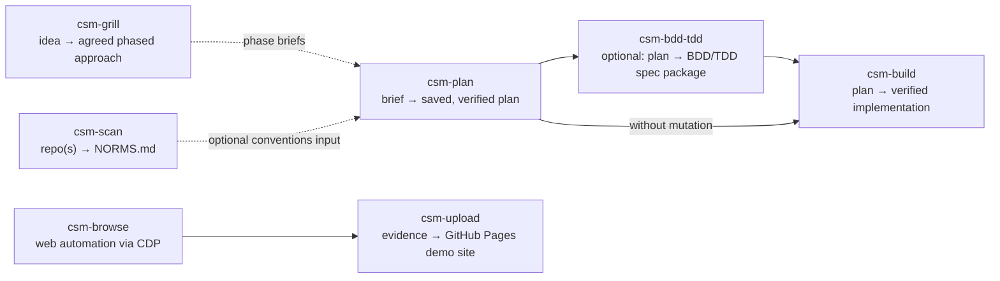

# opencode-skills

A collection of [OpenCode](https://opencode.ai) agent skills built around the **CSM (cyclic state machine)** workflow: relentless idea grilling (`csm-grill`), rigorous, evidence-based planning (`csm-plan`), optional BDD/TDD spec mutation (`csm-bdd-tdd`), and resumable plan execution (`csm-build`) — supported by repository analysis (`csm-scan`), Dockerized browser automation (`csm-browse`), and evidence publishing (`csm-upload`).

## Table of contents

- [The CSM workflow](#the-csm-workflow)
- [Skills](#skills)
- [Requirements](#requirements)
- [Installation](#installation)
- [Usage](#usage)
  - [csm-scan](#csm-scan)
  - [csm-grill](#csm-grill)
  - [csm-plan](#csm-plan)
  - [csm-bdd-tdd](#csm-bdd-tdd)
  - [csm-build](#csm-build)
  - [csm-browse](#csm-browse)
  - [csm-upload](#csm-upload)
- [Repository layout](#repository-layout)
- [Development & testing](#development--testing)
- [License](#license)

## The CSM workflow



The core loop: **grill** an idea into an agreed phased approach, **scan** a repository for its conventions, **plan** the work as a numbered, resumable state machine, optionally **mutate** the plan into strict BDD/TDD form, then **build** it with parallel subagents, checkpoints, and review cycles. Along the way, **browse** the web and **upload** the evidence.

Each stage is a separate, explicitly invoked skill — planning never silently becomes implementation, and execution always starts from a saved plan on disk.

## Skills

| Skill | Purpose | Reference |
|---|---|---|
| `csm-plan` | Turn a brief into an evidence-based, executable, resumable implementation plan — research, critique, verify, save, stop. Never implements. | [csm-plan/SKILL.md](csm-plan/SKILL.md) |
| `csm-build` | Execute a saved CSM plan with parallel subagents, durable checkpoints, and review/repair cycles until verified complete. | [csm-build/SKILL.md](csm-build/SKILL.md) |
| `csm-bdd-tdd` | Mutate a saved plan into a strict BDD+TDD package: formal spec, executable Gherkin scenarios, unit test designs, and a traceable mutated plan. | [csm-bdd-tdd/SKILL.md](csm-bdd-tdd/SKILL.md) |
| `csm-scan` | Read-only multi-repo analysis producing a single `NORMS.md`: 16 evidence dimensions (structure, stack, conventions, architecture, security, data, deployment, and more) with Mermaid C4 diagrams. | [csm-scan/SKILL.md](csm-scan/SKILL.md) |
| `csm-browse` | Drive an isolated Chromium inside the `chromium-vnc` Docker container via CDP: navigate, click, type, log in, screenshot, inspect DOM, capture console/network/performance, record video. | [csm-browse/SKILL.md](csm-browse/SKILL.md) |
| `csm-upload` | Upload screenshots, videos, and evidence files to a GitHub Pages demo site under a unique dated page name. | [csm-upload/SKILL.md](csm-upload/SKILL.md) |
| `csm-grill` | Grill an idea into an agreed, phased approach — a relentless one-question-at-a-time interview backed by research subagents, cycling until you agree; each phase is a ready-made brief for a future csm-plan run. Never plans or implements. | [csm-grill/SKILL.md](csm-grill/SKILL.md) |

## Requirements

- **[OpenCode](https://opencode.ai)** — these are OpenCode skills.
- **Node.js >= 20** — for `csm-browse` (see `csm-browse/package.json`) and for running the `csm-scan` test suite (`node:test`). `csm-scan` itself is zero-dependency Node built-ins only.
- **Docker** with the `chromium-vnc` container — `csm-browse` only.
- **`gh` CLI**, authenticated, plus a GitHub Pages-enabled repository — `csm-upload` only.

## Installation

Clone this repository into your OpenCode skills directory (or copy the seven skill folders into an existing one):

```bash
git clone git@github.com:jamiemills/opencode-skills.git ~/.config/opencode/skills
```

Restart OpenCode so it picks up the skills. `csm-plan`, `csm-build`, `csm-bdd-tdd`, `csm-grill`, `csm-scan`, and `csm-upload` need no further setup.

`csm-browse` has runtime dependencies — install and verify:

```bash
cd ~/.config/opencode/skills/csm-browse
npm install --no-audit --no-fund
node -e "require('chrome-remote-interface'); console.log('ok')"
node scripts/check-skill.mjs
```

## Usage

### csm-scan

Analyze one or more repositories and write a single `NORMS.md`:

```bash
cd ~/.config/opencode/skills/csm-scan
node scripts/scan.mjs --repos /path/to/repo [/path/to/another ...] --out NORMS.md
```

Defaults: `--repos` is the current directory and `--out` is `./NORMS.md`. First-class depth for Python, JavaScript, TypeScript, Shell, and Rust; other ecosystems get generic artifact-only evidence, extendable via declarative JSON plugins. Read-only by design: target commands are never executed, and the only write is the single output file. Feed the result into `csm-plan`, or let `csm-build` pick up repo conventions automatically. Full dimension list, evidence model, and privacy guarantees: [csm-scan/SKILL.md](csm-scan/SKILL.md).

### csm-grill

An OpenCode skill — invoke it by name with an idea, e.g. *"use csm-grill to grill my idea for a plugin system"*. It runs a cyclic, research-backed interview — clarifying context, scouting clarification areas with research subagents, questioning you one at a time with recommended answers, and deep-diving your replies — until you explicitly agree on a phased approach, then saves a single approach document to `.agents/approaches/<yyyy-mm-dd>-<idea-slug>-approach.md` with ASCII and Mermaid phasing diagrams. Each phase in that document is a ready-made brief for a future csm-plan invocation; the skill itself never plans or implements. Details: [csm-grill/SKILL.md](csm-grill/SKILL.md).

### csm-plan

An OpenCode skill — invoke it by name with a brief, e.g. *"use csm-plan to make a plan for adding OAuth login"*. It researches the repository, runs critique and remediation cycles, then saves a numbered plan to `.agents/plans/<yyyy-mm-dd>-<goal-slug>-csm.md` in the target repo and stops. It never starts implementation. Details: [csm-plan/SKILL.md](csm-plan/SKILL.md).

### csm-bdd-tdd

Optional mutation step between planning and building — *"apply csm-bdd-tdd to that plan"*. Produces a specs folder (`specs/<goal-slug>/`: formal spec, Gherkin features, harness stubs, unit test designs, validation reports) and a new `*-bdd-csm.md` plan whose tasks are traceable to approved scenarios and encode red → green → refactor. Still no implementation. Details: [csm-bdd-tdd/SKILL.md](csm-bdd-tdd/SKILL.md).

### csm-build

Executes a saved plan — *"use csm-build to execute `.agents/plans/...`"*. Runs `RECOVER → VALIDATE → SELECT → DISPATCH → INTEGRATE → VERIFY → REVIEW → REPAIR → CHECKPOINT` cycles with parallel subagents, preferring the BDD/TDD-mutated plan when one exists, committing at checkpoints, until the goal is verified complete or genuinely blocked. Details: [csm-build/SKILL.md](csm-build/SKILL.md).

### csm-browse

Session-based browser automation against an isolated Chromium in the `chromium-vnc` container:

```bash
SKILL=~/.config/opencode/skills/csm-browse
node $SKILL/scripts/ensure-browser.mjs --session my-session
node $SKILL/scripts/browse.mjs open --session my-session --url "https://example.com"
node $SKILL/scripts/browse.mjs screenshot --session my-session --medium shot.jpg
node $SKILL/scripts/browse.mjs close --session my-session
```

Verbs cover navigation, clicking, typing, key presses, DOM/text extraction, JS evaluation, screenshots (viewport or auto-stitched full-page), console/network/performance capture, and VP9 screencast recording. A VNC live view is exposed on `localhost:5900`; idle sessions are swept automatically after 10 minutes. Full verb reference and login examples: [csm-browse/SKILL.md](csm-browse/SKILL.md).

### csm-upload

Publish captured evidence to a GitHub Pages demo site:

```bash
node ~/.config/opencode/skills/csm-upload/scripts/upload.mjs --label my-demo --desc "What this shows" shot.jpg demo.webm
```

Creates `demo-YYYY-MM-DD-my-demo/` on your Pages repo with an autogenerated `index.html`, then commits and pushes. Configuration lives in `~/.agents/csm-upload.json` (auto-detected from `gh auth status` on first run); override with `--github` and `--repo`. Details: [csm-upload/SKILL.md](csm-upload/SKILL.md).

## Repository layout

```
.
├── csm-plan/          # SKILL.md — the planning state machine
├── csm-build/         # SKILL.md — the plan execution engine
├── csm-bdd-tdd/       # SKILL.md — BDD/TDD plan mutation
├── csm-grill/         # SKILL.md — the idea-grilling interview
├── csm-scan/          # repository analyzer → NORMS.md
│   ├── lib/scan/      # pipeline, dimension registry, scanners, providers, renderers
│   ├── scripts/       # scan.mjs CLI
│   └── test/          # node:test suite + fixtures
├── csm-browse/        # CDP browser automation
│   ├── lib/           # CDP client, docker, session, recorder, verb implementations
│   ├── scripts/       # browse.mjs, ensure-browser.mjs, session-daemon.mjs, check-skill.mjs
│   └── tests/         # e2e + fixtures (requires Docker)
├── csm-upload/        # evidence upload to GitHub Pages
│   └── scripts/       # upload.mjs
└── .agents/plans/     # saved CSM plans for this repository
```

## Development & testing

- **csm-scan** — zero-dependency `node:test` suite, run from the skill directory:

  ```bash
  cd csm-scan
  node --test --test-concurrency=1
  ```

  Serial mode (`--test-concurrency=1`) is authoritative; default parallel mode can race the filesystem-heavy fixture tests. See [csm-scan/SKILL.md](csm-scan/SKILL.md) for focused gate commands (determinism, privacy, constraints, golden, and more).

- **csm-browse** — lightweight self-check, then the Docker-dependent end-to-end suite:

  ```bash
  cd csm-browse
  node scripts/check-skill.mjs   # fast sanity check, no Docker needed
  node tests/e2e.mjs             # full e2e; requires the chromium-vnc container
  ```

- **Commit style** — short imperative messages, frequently skill-prefixed (e.g. `csm-browse: ...`, `add csm-scan skill: ...`).

## License

No LICENSE file is currently present in this repository.
