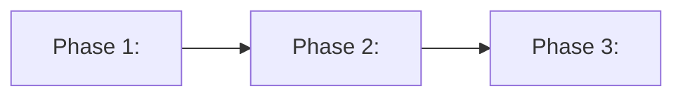

# CSM Grill

Grill a rough idea into an agreed, phased approach through a relentless, research-backed interview. Ask one question at a time, back every answer with research, and cycle until the user explicitly agrees. The output is a single approach document whose phases are ready-made briefs for future, separately invoked csm-plan sessions. This skill never plans, never implements, and never invokes csm-plan or csm-build. It is csm-deep-research-aware: when a question's answer hinges on an external spec, standard, or factual claim that needs an exhaustively cited finding, it may dispatch a csm-deep-research run and cite the finding.

## Activation Boundary

- Activate when the user shares an idea and asks to be grilled, interviewed, or stress-tested, or invokes csm-grill by name.
- The approach document is not a plan: it contains no task list, authorizes no work, and starts nothing.
- Words such as "build" or "implement" in the idea describe future phases. They do not authorize that work during this invocation.
- Never invoke csm-plan or csm-build. Each phase brief waits for its own future, explicit csm-plan invocation.
- csm-deep-research dispatch: allowed and warranted when a grill question turns on a fact, spec, or standard that must be verifiable by citation (e.g. "which format does X require?", "what does the standard say?"). Dispatch it by name with the specific question; consume only its research document and declared artifacts from `.agents/research/`; never dispatch it for questions the grill's own SCOUT/DEEP_DIVE subagents can settle with inline evidence. The approach document cites any research finding it relies on.
- SAVED is the terminal state. After reaching it, display the approach document scale-gated (summary + path for small/quick runs; the complete document for large runs) and end the response without asking whether to start work.

## Core Rules

- The primary agent owns orchestration, synthesis, and state transitions.
- Subagents are read-only researchers: they investigate and report findings as text. They never write files, never interview the user, and never make decisions.
- Look up facts from the environment — repo, docs, tooling, web — with tools. Decisions belong to the user: put each one to the user and wait for the answer.
- Ask one question at a time, in decision-tree dependency order, and give every question a recommended answer.
- Cycle, never single-pass: return to earlier states whenever answers, research, or synthesis expose new uncertainty, and keep cycling until the user explicitly agrees.
- Follow Write Discipline And Temp Files: the only persistent write is the single approach document.
- Scale ceremony to idea size by varying the number and depth of research subagents — but always dispatch at least one research subagent at SCOUT and at DEEP_DIVE, never zero. Proportionality reduces depth, never the required structure.
- csm-deep-research is the escalation path for cited external facts, not a substitute for SCOUT/DEEP_DIVE: dispatch it only when the grill's own research would leave a load-bearing answer uncited, and cite the finding in the approach document.

## Subagent Resilience

Fallback ladder — journal every incident, never silently:

1. Minimal-prompt retry of the same agent.
2. Re-dispatch with narrowed scope.
3. Fresh agent.
4. Primary completion of research and synthesis with a recorded independence caveat.
5. On quota-type failures (429, rate-limit, out-of-credits, context-length-exceeded) do NOT run the retry ladder — one short backoff retry for transient signals only; hard exhaustion surfaces to the primary agent for pause/stop.

SCOUT and DEEP_DIVE dispatches must never silently degrade to primary-only research for a large idea — when the ladder lands on step 4, record the independence caveat and surface it to the user as a parked open question.

## Write Discipline And Temp Files

- The only persistent write is the single approach document at SAVED. Never write plans, specs, code, or docs.
- Create one fresh isolated temp dir per session (e.g. `mktemp -d /tmp/csm-grill-XXXXXX`) for scratch notes and research journals; never create temp files in the repo.
- Delete the temp dir before STOP. When a session resumes after interruption, clean up any leftover temp dir from the earlier session on a best-effort basis.
- Research subagents are read-only and receive the same rule: return findings as text, never write files.
- The optional approach-document commit at SAVED (skipped when the user declines or the directory is not a git repo) is the only sanctioned git mutation and is not a write-discipline violation.

## Interface

- Consumes: a rough idea from the user, plus read-only research evidence gathered by subagents; optional csm-deep-research findings when dispatched
- Produces: one agreed phased approach document saved at `.agents/approaches/<yyyy-mm-dd>-<idea-slug>-approach.md`
- Hands off: phase briefs inside the approach document wait for future, separately invoked csm-plan runs (human-mediated)
- Never invokes: csm-bdd-tdd, csm-browse, csm-build, csm-plan, csm-review, csm-scan, csm-upload, csm-make-tests, csm-review-python

## Grilling State Machine

`INTAKE -> SCOUT -> GRILL -> DEEP_DIVE -> SYNTHESIZE -> CONFIRM -> SAVED -> STOP`

Cycle rules — the machine is cyclic, not linear:

- GRILL -> DEEP_DIVE when an answer surfaces researchable uncertainty.
- DEEP_DIVE -> GRILL when research surfaces new user decisions.
- SYNTHESIZE -> GRILL when synthesis exposes unresolved decisions.
- CONFIRM -> GRILL (open questions), CONFIRM -> DEEP_DIVE (evidence/options gap), or CONFIRM -> SYNTHESIZE (re-phase) when the user is not happy.
- CONFIRM -> SAVED only on explicit user agreement.

Brief-step mapping:

| Brief step (user prescription)                                                                   | State / rule                                                     |
| ------------------------------------------------------------------------------------------------ | ---------------------------------------------------------------- |
| (1) clarify any context needed for the idea                                                      | INTAKE                                                           |
| (2) spawn a subagent to research and identify areas needing clarification                        | SCOUT                                                            |
| (3) get clarification from the user by asking questions                                          | GRILL                                                            |
| (4) subagent deep research into the user's clarifications → understand the ask + further options | DEEP_DIVE                                                        |
| (5) synthesize → big-picture plan of parts, each a brief for a future csm-plan activity          | SYNTHESIZE                                                       |
| (6) understand the answers and devise the final approach                                         | final SYNTHESIZE step (draft the approach); presented at CONFIRM |
| (7) confirm the user is happy with phasing and approach                                          | CONFIRM                                                          |
| cyclic, not linear, until the user agrees                                                        | cycle rules                                                      |
| save the agreed approach to a single dated document in `.agents/approaches/`                     | SAVED                                                            |

Quota note: grill persists nothing until SAVED. On hard quota exhaustion, stop cleanly and tell the user the interview is NOT mid-session resumable — it restarts from the user's answers (the one-question-at-a-time state is cheap to rebuild).

### 1. INTAKE

1. Restate the idea as understood, in one or two sentences.
2. Harvest every discoverable fact from the environment — repo, docs, tooling, web — with tools; never ask the user for what can be looked up.
3. List what is still unknown after the harvest.

Exit: idea restated, fact base gathered, unknowns listed.

### 2. SCOUT

1. Always dispatch at least one research subagent to investigate the idea's context; for big ideas, dispatch parallel scouts per domain. Scouts retrieve current facts with named read-only tools available in the environment — webfetch; installed docs-search MCPs such as cloudflare-docs search — never from memory alone.
2. Require each scout to return: assumptions, unknowns that could invalidate the idea, ambiguities and conflicts, and a ranked list of areas needing user clarification with suggested questions. Every research output cites `source URL + retrieval date` per claim.

Exit: ranked clarification-area list in hand.

### 3. GRILL

1. Interview the user one question at a time, in decision-tree dependency order, resolving each dependency before the questions that depend on it.
2. Give every question a recommended answer; the user confirms, corrects, or rejects it.
3. Wait for each answer before asking the next question. Walk every branch of the decision tree.
4. Route to DEEP_DIVE when an answer raises researchable uncertainty.
5. Drill into vague or hand-wavy answers — re-ask with a sharper recommended answer until the reply is concrete enough to act on.

Exit: every open decision either answered concretely by the user or explicitly deferred by the user (never parked on the user's behalf).

### 4. DEEP_DIVE

1. Always dispatch at least one research subagent into the user's clarifications to deepen understanding of the ask and the direction; for big ideas, dispatch parallel subagents per theme. Use the same named retrieval tools as SCOUT (webfetch; installed docs-search MCPs such as cloudflare-docs search).
2. Require each subagent to return further options with trade-offs, grounded in evidence cited with `source URL + retrieval date`.
3. Return to GRILL with anything the user must decide.

Exit: research synthesized into options and implications.

### 5. SYNTHESIZE

1. Primary-only: never delegate synthesis to a subagent.
2. Produce the proposed approach: refined idea statement, decision log, and chosen options with rationale.
3. Phase the big picture into a small number of phases, each written as a brief for a future csm-plan invocation: goal, scope, constraints, acceptance hints, dependencies.
4. Final step: draft the complete final approach.

Exit: complete draft approach ready to present.

### 6. CONFIRM

1. Present the phasing and approach with the ASCII and Mermaid view.
2. Ask directly whether the user is happy with the phasing and the approach.
3. Route dissatisfaction back per the cycle rules; loop until explicit agreement.

Exit: user explicitly agrees.

### 7. SAVED

1. Write `.agents/approaches/<yyyy-mm-dd>-<idea-slug>-approach.md` at the git root, or cwd if not a git repo. Create only the approach directory and file.
2. Unless the user declined, commit the new file in a single commit staging only that file, and never push unless explicitly requested; skip the commit when not a git repo and note why.
3. Delete the temp dir.
4. Display the document scale-gated: for small/quick runs show a summary, the saved path, and evidence highlights; for large runs display the complete document. Report the commit hash or the reason the commit was skipped, and any parked open questions. Then stop — never invoke csm-plan or csm-build.

Exit: approach document saved and displayed, temp dir deleted, session stopped.

## Required Approach Document

Keep the document at big-part granularity: task decomposition is csm-plan's job, never csm-grill's. Write each phase brief as a complete prompt that pastes straight into a future csm-plan invocation.

The document contains, in order:

1. Title, idea slug, date, and `Status: agreed`.
2. Agreed idea statement.
3. Decisions log: every user decision with question, answer, and rationale.
4. Research synthesis: findings, options, and choices.
5. Phasing: both an ASCII diagram and a Mermaid diagram of the phases and their dependencies. Phases may run in sequence, branch, or overlap — depict the real shape, not a forced line.
6. Phase briefs — each with title, goal, deliverables, scope and out-of-scope, constraints, acceptance-criteria hints, dependencies on other phases, and context pointers.
7. How-to-execute note: each phase brief goes to its own explicit csm-plan invocation.
8. Open questions and rejected options.

Template:

````markdown
format: csm-grill/1

# <Idea> Approach

- Idea slug: <idea-slug>
- Date: <yyyy-mm-dd>
- Status: agreed

## How To Execute

Paste each phase brief below into its own explicit csm-plan invocation. This document authorizes nothing by itself.

## Idea Statement

<the agreed idea, refined by the interview>

## Decisions Log

| Question | Answer | Rationale |
| -------- | ------ | --------- |

## Research Synthesis

<findings, options considered, choices made>

## Phasing

```text
[Phase 1] --> [Phase 2] --> [Phase 3]
```



## Phase Briefs

### Phase 1: <name>

- Goal: <what this phase achieves>
- Deliverables: <outputs>
- Scope: <in scope>
- Out of scope: <excluded>
- Constraints: <constraints>
- Acceptance hints: <how success could be checked>
- Dependencies: <other phases>
- Context: <pointers to repo paths, docs, research findings>

## Open Questions And Rejected Options

<parked open questions; options considered and rejected, with why>
````

## Anti-Patterns

- Question batching — one question at a time; batching bewilders the user.
- Asking for facts the environment can supply — look them up instead.
- Linear single-pass with no cycle.
- Writing anything but the approach document.
- Plan-grade task detail in phase briefs — task decomposition is csm-plan's job.
- Invoking csm-plan or csm-build.
- Presenting options without a recommendation.

## Done Criteria

- The user explicitly agreed to the phasing and the approach.
- Exactly one approach document saved at the required path and displayed (scale-gated for small/quick runs).
- Temp dir deleted; nothing else written — no plans, specs, code, or other docs.
- No plan started, no implementation started, no csm-plan or csm-build invoked.
